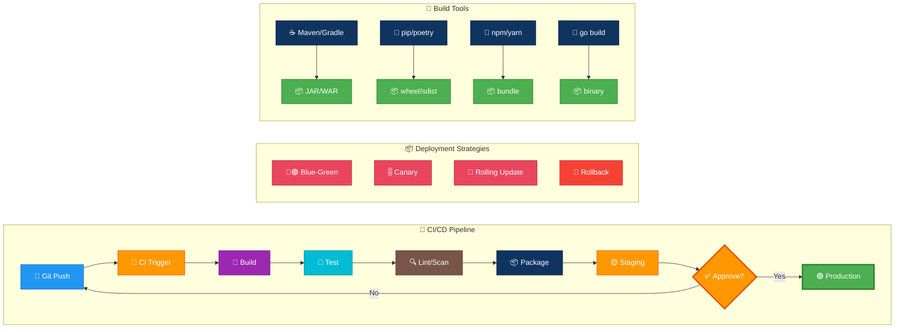
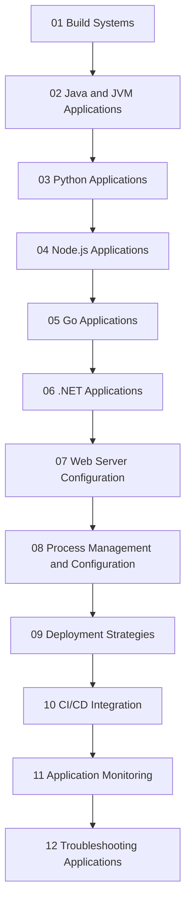

# Build Systems & Application Deployment Guide for Linux

---

## 🎬 Build & Deploy Pipeline — Animated Workflow

---

## Overview

This guide is a production-focused reference for building, packaging, deploying, operating, and troubleshooting applications on Linux.

It is intentionally practical.

It covers:

- Native compiled applications
- JVM applications
- Python services
- Node.js services
- Go binaries
- .NET services
- Web server integration
- Process management
- Deployment strategies
- CI/CD patterns
- Monitoring and troubleshooting
- Configuration and secrets management

It is written for:

- Linux administrators
- DevOps engineers
- Backend developers
- SRE teams
- Platform engineers
- Full-stack developers responsible for deployments

Assumptions:

- Target systems are Linux servers
- Bash is available
- You have sudo access when installing packages
- You are deploying server-side applications or services
- You want reliable, repeatable, and observable deployments

Conventions used in this guide:

- Commands prefixed with `$` are run as a regular user
- Commands prefixed with `#` are run as root or with sudo
- File paths are shown as Linux absolute paths where appropriate
- systemd is treated as the default init and service manager
- Nginx is the primary reverse proxy example

---

## Learning Path

## Table of Contents

- [Build Systems](01-build-systems.md)
- [Java and JVM Applications](02-java-jvm.md)
- [Python Applications](03-python.md)
- [Node.js Applications](04-nodejs.md)
- [Go Applications](05-golang.md)
- [.NET Applications](06-dotnet.md)
- [Web Server Configuration](07-web-server-config.md)
- [Process Management and Configuration](08-process-management.md)
- [Deployment Strategies](09-deployment-strategies.md)
- [CI/CD Integration](10-cicd-integration.md)
- [Application Monitoring](11-monitoring.md)
- [Troubleshooting Applications](12-troubleshooting.md)
