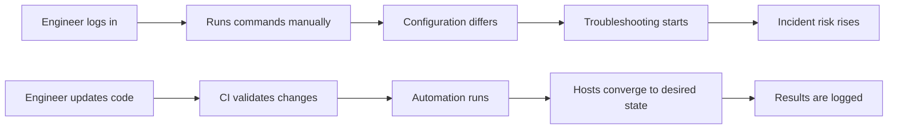

# Automation Fundamentals

[Back to guide index](README.md)

Automation is the disciplined use of repeatable processes, code, and tooling to reduce manual work in system administration and infrastructure operations.

A mature Linux automation strategy improves:

- Reliability
- Repeatability
- Security
- Speed
- Auditability
- Scalability
- Recovery time

## 1.1 Why Automate

Manual administration does not scale well.

When teams manage servers manually, they often face:

- Inconsistent configuration between environments
- Human error during routine changes
- Slow recovery during incidents
- Poor visibility into what changed and why
- Difficulty onboarding new engineers
- Fragile runbooks that depend on tribal knowledge

Automation addresses these problems by turning operational tasks into controlled, versioned workflows.

### Benefits of automation

| Benefit | Description | Example |
|---|---|---|
| Consistency | Same process runs every time | Standard package installation on all web servers |
| Speed | Tasks complete faster than manual execution | Provisioning 50 VMs in minutes |
| Auditability | Changes are stored in Git and CI logs | Reviewing a pull request for firewall updates |
| Safety | Validations and approvals reduce risk | CI tests a Terraform plan before apply |
| Recovery | Rebuild systems quickly after failure | Recreating a compromised node from code |
| Compliance | Security baselines are enforced | Enforcing SSH hardening using Ansible |

## 1.2 Manual vs Automated Operations

A simple comparison:

| Dimension | Manual Workflow | Automated Workflow |
|---|---|---|
| Change execution | Performed by admins | Performed by code and pipelines |
| Repeatability | Low to medium | High |
| Error rate | Higher | Lower |
| Documentation | Often separate from execution | Embedded in code and pipeline logs |
| Scaling | Hard | Easier |
| Rollback | Ad hoc | Planned and scripted |

### Mermaid diagram: Manual vs automated workflow



## 1.3 Idempotency

Idempotency means applying the same automation multiple times produces the same desired result without causing harmful side effects.

This is a core property of configuration management.

### Why idempotency matters

- Safe re-runs after partial failure
- Easier drift correction
- Predictable outcomes in CI/CD
- Fewer conditional hacks in scripts

### Non-idempotent example

```bash
useradd deploy
echo "Password123" | passwd --stdin deploy
```

This may fail on subsequent runs because the user already exists.

### More idempotent shell example

```bash
id deploy >/dev/null 2>&1 || useradd deploy
install -d -m 0750 /opt/app
```

### Better example with Ansible

```yaml
- name: Ensure deploy user exists
  ansible.builtin.user:
    name: deploy
    shell: /bin/bash
    state: present

- name: Ensure application directory exists
  ansible.builtin.file:
    path: /opt/app
    state: directory
    mode: '0750'
```

## 1.4 Declarative vs Imperative Automation

Two broad models exist.

### Declarative

You declare the desired end state.

The tool figures out how to achieve it.

Examples:

- Ansible task modules
- Terraform resources
- Puppet resources
- Salt states

### Imperative

You explicitly define the steps to execute.

Examples:

- Bash scripts
- Remote shell sequences
- Procedural deployment scripts

### Comparison table

| Approach | Focus | Strength | Weakness |
|---|---|---|---|
| Declarative | Desired state | Easier drift correction | Abstract behavior can hide internals |
| Imperative | Exact steps | Full control | Harder to maintain and make idempotent |

## 1.5 Infrastructure as Code

Infrastructure as Code, or IaC, is the practice of managing infrastructure through version-controlled definitions rather than manual console operations.

IaC applies to:

- Servers
- Networks
- Security groups
- DNS
- Load balancers
- Storage
- Kubernetes objects
- Monitoring rules
- User accounts and policies

### IaC principles

1. Store infrastructure definitions in Git.
2. Review changes through pull requests.
3. Validate syntax and policy before apply.
4. Use environments and modules for reuse.
5. Track state where appropriate.
6. Prefer immutable replacements over uncontrolled in-place mutation when risk is high.

## 1.6 Configuration Drift

Configuration drift occurs when systems diverge from their intended baseline.

Common causes:

- Manual SSH changes
- Ad hoc package installs
- Emergency fixes not codified later
- Different package repositories per environment
- Missing automation coverage

### Drift examples

| Resource | Desired State | Drifted State |
|---|---|---|
| SSH config | Root login disabled | Root login enabled manually |
| Nginx | TLS 1.2+ only | Legacy ciphers re-enabled |
| Package set | Standard baseline packages | Extra debug tools installed |
| Firewall | Limited ports allowed | Temporary port left open |

### Drift control methods

- Frequent convergence runs with configuration management
- Golden images built from source templates
- Prohibiting manual production changes
- File integrity monitoring
- Continuous compliance scans
- GitOps pull-based reconciliation

## 1.7 The Automation Lifecycle

A practical lifecycle looks like this:

1. Define requirements.
2. Model desired state in code.
3. Validate syntax and policy.
4. Test in isolated environments.
5. Promote through stages.
6. Deploy changes.
7. Observe results.
8. Correct drift and improve code.

## 1.8 Layers of Automation

Linux automation spans multiple layers.

| Layer | Scope | Typical Tools |
|---|---|---|
| Bootstrap | First-boot setup | Cloud-Init, shell, systemd |
| Configuration | Package and service state | Ansible, Puppet, Chef, Salt |
| Provisioning | Infrastructure resources | Terraform |
| Image building | Machine images | Packer |
| Delivery | Orchestration pipelines | GitHub Actions, GitLab CI, Jenkins |
| Reconciliation | Desired-state enforcement | GitOps controllers, config mgmt agents |
| Remediation | Event-driven recovery | Alertmanager, Rundeck, Salt Reactor |

## 1.9 Choosing the Right Tool

There is no single best tool for all use cases.

Choose based on:

- Team skills
- Environment size
- Cloud/on-prem mix
- Need for agentless or agent-based operation
- Compliance and audit requirements
- Existing ecosystem integration
- State handling requirements

### Quick decision guide

| Need | Good Fit |
|---|---|
| Agentless server configuration | Ansible |
| Declarative infrastructure provisioning | Terraform |
| Strong continuous agent enforcement | Puppet, Chef, Salt |
| First-boot instance customization | Cloud-Init |
| Golden image creation | Packer |
| Pipeline-driven change promotion | Jenkins, GitHub Actions, GitLab CI |

## 1.10 Core Automation Design Principles

### Principle 1: Keep code simple

Prefer readable modules and explicit naming over clever one-liners.

### Principle 2: Make changes reversible

Design with rollback or replacement strategies.

### Principle 3: Fail early

Validate inputs, templates, syntax, and dependencies before production rollout.

### Principle 4: Separate data from logic

Store environment values separately from reusable code.

### Principle 5: Minimize secrets exposure

Use secret management systems and encryption.

### Principle 6: Build observability into automation

Log what changed, where, and why.

## 1.11 Example: From Script Sprawl to Managed Automation

A common maturity path:

### Stage 1: Ad hoc scripts

- One-off Bash files
- No version control discipline
- Stored on jump hosts

### Stage 2: Structured automation

- Scripts in Git
- Code reviews
- Parameterization added

### Stage 3: Configuration management and IaC

- Ansible or Puppet for configuration
- Terraform for infrastructure
- Packer for images

### Stage 4: CI/CD and policy controls

- Pull request validation
- Security scanning
- Environment promotion workflows

### Stage 5: Continuous reconciliation and auto-remediation

- GitOps controllers
- Alert-triggered remediation
- Compliance dashboards

## 1.12 Automation Anti-Patterns

Avoid these common mistakes:

| Anti-pattern | Why It Hurts | Better Alternative |
|---|---|---|
| Using SSH scripts for everything | Hard to maintain and test | Use purpose-built modules |
| Embedding secrets in code | Security risk | Vault, KMS, secret stores |
| Mixing environment data into reusable logic | Poor reuse | Separate vars, pillars, Hiera, tfvars |
| Manual hotfixes left undocumented | Drift and outages | Backport emergency fixes into code |
| No rollback strategy | Increased blast radius | Plan replacements and rollbacks |
| Single massive playbook or manifest | Hard to review | Modular roles and modules |

## 1.13 Automation Maturity Checklist

| Capability | Beginner | Intermediate | Advanced |
|---|---|---|---|
| Version control | Some scripts in Git | Most infra code in Git | Everything managed through GitOps |
| Validation | Manual checks | Linting and syntax tests | Policy, security, integration tests |
| Promotion | Direct to prod | Stage-based | Progressive delivery with approvals |
| Drift control | Manual | Periodic convergence | Continuous reconciliation |
| Secrets | Flat files | Encrypted files | Centralized secret backends |
| Reuse | Copy-paste | Modules and roles | Standardized internal platforms |

## 1.14 Recommended Learning Path

1. Learn Bash scripting fundamentals.
2. Learn Linux services, packages, networking, and permissions.
3. Learn YAML, JSON, and HCL basics.
4. Start with Ansible for configuration.
5. Learn Terraform for provisioning.
6. Add image building with Packer.
7. Introduce CI/CD and policy testing.
8. Learn advanced patterns like GitOps and immutable infrastructure.

---

---

# Appendix D: Glossary

| Term | Definition |
|---|---|
| Idempotent | Safe to run repeatedly with the same end state |
| Drift | Difference between actual and intended configuration |
| IaC | Infrastructure as Code |
| Convergence | Moving a system toward desired state |
| Reconciliation | Continuous correction toward declared state |
| Golden Image | Prebuilt machine image used as a standard baseline |
| Pull Model | Nodes fetch or reconcile desired state themselves |
| Push Model | Controller pushes changes to targets |
| Policy as Code | Executable rules governing infrastructure changes |
| GitOps | Operating model using Git as source of truth |

---
