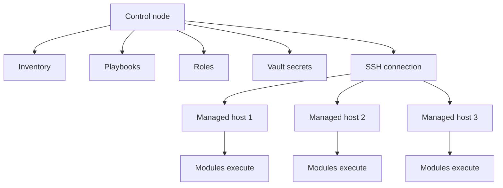

# Ansible

[Back to guide index](README.md)

Ansible is an agentless automation platform commonly used for configuration management, application deployment, orchestration, and operational tasks.

It communicates primarily over SSH for Linux hosts.

## 2.1 Ansible Architecture

Core characteristics:

- Agentless by default
- Uses SSH for transport
- Executes modules remotely
- Can target many hosts from a control node
- Stores host and group data in inventory

### Components

| Component | Description |
|---|---|
| Control node | System where Ansible runs |
| Inventory | List of hosts and groups |
| Playbook | YAML definition of automation tasks |
| Module | Unit of work such as package install |
| Role | Reusable automation structure |
| Handler | Task triggered by change notifications |
| Vault | Secret encryption feature |

### Mermaid diagram: Ansible architecture



## 2.2 Installing Ansible

### On Ubuntu or Debian

```bash
sudo apt update
sudo apt install -y ansible
```

### On RHEL or Rocky Linux

```bash
sudo dnf install -y epel-release
sudo dnf install -y ansible
```

### With pip

```bash
python3 -m pip install --user ansible
```

### Verify installation

```bash
ansible --version
ansible-playbook --version
```

## 2.3 Inventory Basics

Inventory defines target hosts.

### INI-style inventory

```ini
[web]
web1.example.com
web2.example.com

[db]
db1.example.com

[prod:children]
web
db

[all:vars]
ansible_user=automation
ansible_python_interpreter=/usr/bin/python3
```

### YAML inventory

```yaml
all:
  vars:
    ansible_user: automation
    ansible_python_interpreter: /usr/bin/python3
  children:
    web:
      hosts:
        web1.example.com:
        web2.example.com:
    db:
      hosts:
        db1.example.com:
```

### Host variables

```yaml
all:
  children:
    web:
      hosts:
        web1.example.com:
          http_port: 80
        web2.example.com:
          http_port: 8080
```

## 2.4 Inventory Best Practices

- Group hosts by role and environment.
- Keep common variables in group_vars.
- Avoid hardcoding secrets in inventory.
- Prefer YAML for readability in larger inventories.
- Use dynamic inventory for cloud environments.

## 2.5 Ad Hoc Commands

Ad hoc commands are useful for quick operational tasks.

### Ping all hosts

```bash
ansible all -i inventory.ini -m ping
```

### Gather uptime

```bash
ansible all -i inventory.ini -a 'uptime'
```

### Restart a service

```bash
ansible web -i inventory.ini -b -a 'systemctl restart nginx'
```

### Install a package using a module

```bash
ansible web -i inventory.ini -b -m ansible.builtin.package -a 'name=nginx state=present'
```

## 2.6 Playbook Structure

A playbook contains one or more plays.

A play maps hosts to tasks.

### Minimal playbook

```yaml
---
- name: Configure web servers
  hosts: web
  become: true
  tasks:
    - name: Install nginx
      ansible.builtin.package:
        name: nginx
        state: present

    - name: Ensure nginx is running
      ansible.builtin.service:
        name: nginx
        state: started
        enabled: true
```

## 2.7 Playbook Keywords

| Keyword | Purpose |
|---|---|
| hosts | Target group |
| become | Privilege escalation |
| vars | Play-level variables |
| tasks | List of actions |
| handlers | Change-triggered tasks |
| roles | Reusable automation units |
| tags | Selective execution |
| gather_facts | Collect system facts |

## 2.8 Common Modules

| Module | Use Case |
|---|---|
| ansible.builtin.package | Install packages |
| ansible.builtin.service | Manage services |
| ansible.builtin.file | Manage files and directories |
| ansible.builtin.copy | Copy static files |
| ansible.builtin.template | Render Jinja2 templates |
| ansible.builtin.user | Manage users |
| ansible.builtin.group | Manage groups |
| ansible.builtin.lineinfile | Update lines in files |
| ansible.builtin.blockinfile | Insert managed blocks |
| ansible.builtin.command | Run commands |
| ansible.builtin.shell | Run shell commands |
| ansible.posix.firewalld | Manage firewalld rules |
| ansible.builtin.apt | APT package management |
| ansible.builtin.dnf | DNF package management |

## 2.9 Command vs Shell vs Module

Use modules first.

Only use command or shell when no module exists.

| Method | Preferred? | Notes |
|---|---|---|
| Purpose-built module | Yes | Best idempotency and readability |
| command | Sometimes | Safer than shell for direct commands |
| shell | Last resort | Needed for pipes, redirects, shell features |

## 2.10 Variables in Ansible

Variables can be defined in several places.

### Play vars

```yaml
vars:
  app_name: inventory-api
  app_port: 9000
```

### group_vars example

```yaml
# group_vars/web.yml
nginx_worker_processes: auto
app_user: deploy
```

### host_vars example

```yaml
# host_vars/web1.example.com.yml
http_port: 8080
```

### Extra vars

```bash
ansible-playbook site.yml -e env=prod -e release_tag=v1.4.2
```

## 2.11 Variable Precedence

Variable precedence in Ansible can be complex.

A practical rule:

- Role defaults are weakest.
- Inventory and play vars override defaults.
- Extra vars are strongest in most common workflows.

Use precedence carefully to avoid surprising behavior.

## 2.12 Facts

Facts are system information gathered from hosts.

Example facts:

- ansible_os_family
- ansible_distribution
- ansible_default_ipv4
- ansible_memory_mb
- ansible_processor_vcpus

### Example usage

```yaml
- name: Install Apache on Debian family
  ansible.builtin.package:
    name: apache2
    state: present
  when: ansible_os_family == 'Debian'
```

## 2.13 Conditionals

```yaml
- name: Install Nginx on RedHat family
  ansible.builtin.package:
    name: nginx
    state: present
  when: ansible_os_family == 'RedHat'
```

## 2.14 Loops

```yaml
- name: Install common packages
  ansible.builtin.package:
    name: "{{ item }}"
    state: present
  loop:
    - vim
    - curl
    - git
```

## 2.15 Registered Variables

```yaml
- name: Check nginx status
  ansible.builtin.command: systemctl is-active nginx
  register: nginx_status
  changed_when: false
  failed_when: false

- name: Show nginx status
  ansible.builtin.debug:
    var: nginx_status.stdout
```

## 2.16 Handlers

Handlers run when notified by tasks that changed.

```yaml
handlers:
  - name: Restart nginx
    ansible.builtin.service:
      name: nginx
      state: restarted
```

Task notifying a handler:

```yaml
- name: Deploy nginx config
  ansible.builtin.template:
    src: nginx.conf.j2
    dest: /etc/nginx/nginx.conf
    mode: '0644'
  notify: Restart nginx
```

## 2.17 Templates with Jinja2

Jinja2 templates allow dynamic configuration generation.

### Template file example

```jinja2
user {{ nginx_user }};
worker_processes {{ nginx_worker_processes }};

events {
  worker_connections 1024;
}

http {
  server {
    listen {{ http_port }};
    server_name {{ inventory_hostname }};
    root /var/www/html;
  }
}
```

### Task using the template

```yaml
- name: Render nginx config
  ansible.builtin.template:
    src: nginx.conf.j2
    dest: /etc/nginx/nginx.conf
    owner: root
    group: root
    mode: '0644'
  notify: Restart nginx
```

## 2.18 Includes and Imports

| Feature | Description |
|---|---|
| import_tasks | Static include evaluated at parse time |
| include_tasks | Dynamic include evaluated at runtime |
| import_role | Static role import |
| include_role | Dynamic role inclusion |

## 2.19 Roles

Roles are the preferred way to organize reusable Ansible content.

### Standard role layout

```text
roles/
└── nginx/
    ├── defaults/
    │   └── main.yml
    ├── files/
    ├── handlers/
    │   └── main.yml
    ├── meta/
    │   └── main.yml
    ├── tasks/
    │   └── main.yml
    ├── templates/
    │   └── nginx.conf.j2
    ├── vars/
    │   └── main.yml
    └── tests/
```

### Using a role

```yaml
- name: Configure web tier
  hosts: web
  become: true
  roles:
    - role: nginx
```

## 2.20 Role Variable Strategy

A common approach:

- defaults/main.yml for overridable defaults
- vars/main.yml only for values rarely meant to be overridden
- group_vars and host_vars for environment data

## 2.21 Ansible Galaxy

Ansible Galaxy provides reusable community and internal roles or collections.

### Install a collection

```bash
ansible-galaxy collection install community.general
```

### Install a role

```bash
ansible-galaxy role install geerlingguy.nginx
```

### requirements.yml example

```yaml
collections:
  - name: community.general
  - name: ansible.posix

roles:
  - name: geerlingguy.nginx
    version: 3.2.0
```

## 2.22 Tags

Tags allow selective execution.

```yaml
- name: Install packages
  ansible.builtin.package:
    name:
      - nginx
      - git
    state: present
  tags:
    - packages

- name: Deploy app config
  ansible.builtin.template:
    src: app.conf.j2
    dest: /etc/app/app.conf
  tags:
    - config
```

### Running tagged tasks

```bash
ansible-playbook site.yml --tags config
ansible-playbook site.yml --skip-tags updates
```

## 2.23 Vault

Ansible Vault encrypts secrets stored in files or strings.

### Create encrypted vars file

```bash
ansible-vault create group_vars/prod/vault.yml
```

### Edit an encrypted file

```bash
ansible-vault edit group_vars/prod/vault.yml
```

### Example vault content

```yaml
vault_db_password: super-secret-value
vault_api_token: another-secret-value
```

### Use vault vars in playbooks

```yaml
vars:
  db_password: "{{ vault_db_password }}"
```

## 2.24 Become and Privilege Escalation

```yaml
- name: Install packages with sudo
  hosts: all
  become: true
  tasks:
    - name: Ensure rsync exists
      ansible.builtin.package:
        name: rsync
        state: present
```

## 2.25 Managing Files

### Copy a static file

```yaml
- name: Copy MOTD file
  ansible.builtin.copy:
    src: motd
    dest: /etc/motd
    owner: root
    group: root
    mode: '0644'
```

### Create a directory

```yaml
- name: Create app directory
  ansible.builtin.file:
    path: /opt/myapp
    state: directory
    owner: deploy
    group: deploy
    mode: '0755'
```

### Manage a symlink

```yaml
- name: Link current release
  ansible.builtin.file:
    src: /opt/myapp/releases/current
    dest: /opt/myapp/current
    state: link
```

## 2.26 Service Management

```yaml
- name: Enable and start nginx
  ansible.builtin.service:
    name: nginx
    state: started
    enabled: true
```

## 2.27 User and Group Management

```yaml
- name: Ensure admin group exists
  ansible.builtin.group:
    name: adminops
    state: present

- name: Ensure deploy user exists
  ansible.builtin.user:
    name: deploy
    groups: adminops
    append: true
    shell: /bin/bash
    create_home: true
    state: present
```

## 2.28 Managing Authorized Keys

```yaml
- name: Install SSH key for deploy user
  ansible.posix.authorized_key:
    user: deploy
    state: present
    key: "{{ lookup('file', 'files/deploy.pub') }}"
```

## 2.29 Error Handling

### block, rescue, always example

```yaml
- name: Risky operation with cleanup
  hosts: app
  become: true
  tasks:
    - block:
        - name: Stop app service
          ansible.builtin.service:
            name: myapp
            state: stopped

        - name: Perform maintenance command
          ansible.builtin.command: /usr/local/bin/myapp-maintenance
      rescue:
        - name: Start app service after failure
          ansible.builtin.service:
            name: myapp
            state: started
      always:
        - name: Ensure audit marker exists
          ansible.builtin.file:
            path: /var/log/myapp_maintenance_attempted
            state: touch
            mode: '0644'
```

## 2.30 Check Mode and Diff Mode

### Dry run

```bash
ansible-playbook site.yml --check
```

### Show diffs

```bash
ansible-playbook site.yml --check --diff
```

Use check mode in CI for safe validation when supported by tasks.

## 2.31 Strategy and Serial Execution

### Rolling changes

```yaml
- name: Rolling restart of web servers
  hosts: web
  become: true
  serial: 1
  tasks:
    - name: Restart nginx one server at a time
      ansible.builtin.service:
        name: nginx
        state: restarted
```

## 2.32 Delegation

```yaml
- name: Add web node to load balancer pool
  hosts: web
  tasks:
    - name: Run API call from controller
      ansible.builtin.uri:
        url: "https://lb.example.com/api/pool/add?host={{ inventory_hostname }}"
        method: POST
      delegate_to: localhost
```

## 2.33 Dynamic Inventory

Dynamic inventory scripts or plugins allow Ansible to discover cloud hosts automatically.

Popular sources:

- AWS EC2
- Azure
- GCP
- VMware
- OpenStack

### Example inventory plugin file

```yaml
plugin: amazon.aws.aws_ec2
regions:
  - us-east-1
keyed_groups:
  - key: tags.Role
    prefix: role
hostnames:
  - private-ip-address
```

## 2.34 Fact Caching

Fact caching improves performance in larger environments.

Example options:

- jsonfile
- redis
- memory

## 2.35 Ansible Configuration

Example ansible.cfg:

```ini
[defaults]
inventory = ./inventory
roles_path = ./roles
host_key_checking = True
retry_files_enabled = False
gathering = smart
fact_caching = jsonfile
fact_caching_connection = .ansible_facts_cache
stdout_callback = yaml
forks = 20

[privilege_escalation]
become = True
become_method = sudo
become_ask_pass = False
```

## 2.36 Example Playbook: Web Server Setup

```yaml
---
- name: Configure nginx web servers
  hosts: web
  become: true
  vars:
    nginx_packages:
      - nginx
      - curl
    web_root: /var/www/html
  tasks:
    - name: Install web packages
      ansible.builtin.package:
        name: "{{ nginx_packages }}"
        state: present

    - name: Ensure web root exists
      ansible.builtin.file:
        path: "{{ web_root }}"
        state: directory
        owner: root
        group: root
        mode: '0755'

    - name: Deploy index page
      ansible.builtin.copy:
        dest: "{{ web_root }}/index.html"
        content: |
          <html>
          <body>
          <h1>Provisioned by Ansible</h1>
          </body>
          </html>
        mode: '0644'
      notify: Restart nginx

    - name: Enable and start nginx
      ansible.builtin.service:
        name: nginx
        state: started
        enabled: true

  handlers:
    - name: Restart nginx
      ansible.builtin.service:
        name: nginx
        state: restarted
```

## 2.37 Example Playbook: User Management

```yaml
---
- name: Manage Linux users
  hosts: all
  become: true
  vars:
    managed_users:
      - name: deploy
        shell: /bin/bash
        groups:
          - sudo
      - name: appsvc
        shell: /usr/sbin/nologin
        groups:
          - www-data
  tasks:
    - name: Ensure users exist
      ansible.builtin.user:
        name: "{{ item.name }}"
        shell: "{{ item.shell }}"
        groups: "{{ item.groups | join(',') }}"
        append: true
        create_home: true
        state: present
      loop: "{{ managed_users }}"
```

## 2.38 Example Playbook: Security Hardening

```yaml
---
- name: Apply baseline hardening
  hosts: all
  become: true
  tasks:
    - name: Disable root SSH login
      ansible.builtin.lineinfile:
        path: /etc/ssh/sshd_config
        regexp: '^PermitRootLogin'
        line: 'PermitRootLogin no'
        create: false
      notify: Restart ssh

    - name: Disable password authentication
      ansible.builtin.lineinfile:
        path: /etc/ssh/sshd_config
        regexp: '^PasswordAuthentication'
        line: 'PasswordAuthentication no'
        create: false
      notify: Restart ssh

    - name: Ensure unattended upgrades package exists on Debian
      ansible.builtin.package:
        name: unattended-upgrades
        state: present
      when: ansible_os_family == 'Debian'

  handlers:
    - name: Restart ssh
      ansible.builtin.service:
        name: sshd
        state: restarted
```

## 2.39 Example Playbook: Package Updates

```yaml
---
- name: Patch Linux systems
  hosts: all
  become: true
  tasks:
    - name: Update apt cache on Debian
      ansible.builtin.apt:
        update_cache: true
      when: ansible_os_family == 'Debian'

    - name: Upgrade packages on Debian
      ansible.builtin.apt:
        upgrade: dist
      when: ansible_os_family == 'Debian'

    - name: Upgrade packages on RedHat
      ansible.builtin.dnf:
        name: '*'
        state: latest
      when: ansible_os_family == 'RedHat'
```

## 2.40 Example Role: Nginx

### defaults/main.yml

```yaml
nginx_user: nginx
nginx_worker_processes: auto
nginx_listen_port: 80
```

### tasks/main.yml

```yaml
- name: Install nginx
  ansible.builtin.package:
    name: nginx
    state: present

- name: Deploy nginx config
  ansible.builtin.template:
    src: nginx.conf.j2
    dest: /etc/nginx/nginx.conf
    mode: '0644'
  notify: Restart nginx

- name: Ensure nginx is started
  ansible.builtin.service:
    name: nginx
    state: started
    enabled: true
```

### handlers/main.yml

```yaml
- name: Restart nginx
  ansible.builtin.service:
    name: nginx
    state: restarted
```

## 2.41 Ansible Project Layout Example

```text
ansible/
├── ansible.cfg
├── inventory/
│   ├── prod.yml
│   └── stage.yml
├── group_vars/
│   ├── all.yml
│   ├── web.yml
│   └── prod/
│       └── vault.yml
├── host_vars/
├── playbooks/
│   ├── site.yml
│   ├── web.yml
│   ├── users.yml
│   └── patch.yml
├── roles/
│   ├── common/
│   ├── nginx/
│   └── hardening/
└── requirements.yml
```

## 2.42 Best Practices for Ansible

1. Prefer modules over shell commands.
2. Keep playbooks small and role-driven.
3. Use descriptive task names.
4. Encrypt secrets with Vault or external secret backends.
5. Use group_vars and host_vars intentionally.
6. Test with --check and linting in CI.
7. Use serial deployment for critical services.
8. Pin collection versions.
9. Keep inventories environment-specific.
10. Use handlers for restarts instead of unconditional service bounces.

## 2.43 Common Ansible Pitfalls

| Pitfall | Impact | Mitigation |
|---|---|---|
| Overusing shell | Poor idempotency | Use proper modules |
| Too many play-level vars | Hard to trace precedence | Keep data in inventory vars |
| Unclear role boundaries | Low reuse | Separate roles by concern |
| Restarting services on every run | Unnecessary disruption | Notify handlers only on change |
| Storing vault password poorly | Secret exposure | Use secure CI secret injection |

## 2.44 Ansible Testing Approaches

- ansible-playbook --syntax-check
- ansible-lint
- Molecule for role testing
- Container-based test targets
- Staging validation before production

### Syntax check example

```bash
ansible-playbook -i inventory/prod.yml playbooks/site.yml --syntax-check
```

## 2.45 Production Use Cases

- Web server provisioning
- Patch management
- User lifecycle management
- OS baseline hardening
- Service restarts during maintenance
- Certificate deployment
- Log agent rollout
- Database configuration updates

## 2.46 When to Use Ansible

Use Ansible when you want:

- Agentless operations
- Fast operational adoption
- Strong Linux ecosystem support
- Good readability for admins and SREs
- Both orchestration and configuration management in one tool

## 2.47 When Not to Use Only Ansible

Consider combining with Terraform or Packer when you need:

- Cloud resource provisioning
- Strong stateful infrastructure dependency management
- Image pipelines
- Immutable deployment workflows

## 2.48 Example End-to-End Playbook

```yaml
---
- name: Full baseline for app servers
  hosts: app
  become: true
  vars:
    baseline_packages:
      - git
      - curl
      - vim
      - rsync
    app_user: appsvc
  tasks:
    - name: Install baseline packages
      ansible.builtin.package:
        name: "{{ baseline_packages }}"
        state: present

    - name: Ensure app user exists
      ansible.builtin.user:
        name: "{{ app_user }}"
        shell: /usr/sbin/nologin
        create_home: false
        state: present

    - name: Create app directories
      ansible.builtin.file:
        path: "{{ item }}"
        state: directory
        owner: "{{ app_user }}"
        group: "{{ app_user }}"
        mode: '0755'
      loop:
        - /opt/myapp
        - /var/log/myapp

    - name: Deploy environment file
      ansible.builtin.copy:
        dest: /opt/myapp/.env
        content: |
          APP_ENV=production
          APP_PORT=9000
        owner: "{{ app_user }}"
        group: "{{ app_user }}"
        mode: '0640'

    - name: Deploy systemd service file
      ansible.builtin.copy:
        dest: /etc/systemd/system/myapp.service
        content: |
          [Unit]
          Description=MyApp Service
          After=network.target

          [Service]
          User={{ app_user }}
          Group={{ app_user }}
          ExecStart=/usr/local/bin/myapp
          Restart=always

          [Install]
          WantedBy=multi-user.target
        mode: '0644'
      notify:
        - Reload systemd
        - Restart myapp

    - name: Enable and start app
      ansible.builtin.service:
        name: myapp
        state: started
        enabled: true

  handlers:
    - name: Reload systemd
      ansible.builtin.command: systemctl daemon-reload
      changed_when: true

    - name: Restart myapp
      ansible.builtin.service:
        name: myapp
        state: restarted
```

## 2.49 Example Inventory by Environment

```text
inventory/
├── dev/
│   ├── hosts.yml
│   └── group_vars/
│       └── all.yml
├── stage/
│   ├── hosts.yml
│   └── group_vars/
│       └── all.yml
└── prod/
    ├── hosts.yml
    └── group_vars/
        ├── all.yml
        └── vault.yml
```

## 2.50 Ansible Summary

Ansible excels at agentless Linux configuration and operational orchestration.

It is often most effective when paired with:

- Terraform for provisioning
- Packer for golden image creation
- CI/CD systems for governed rollout

---
