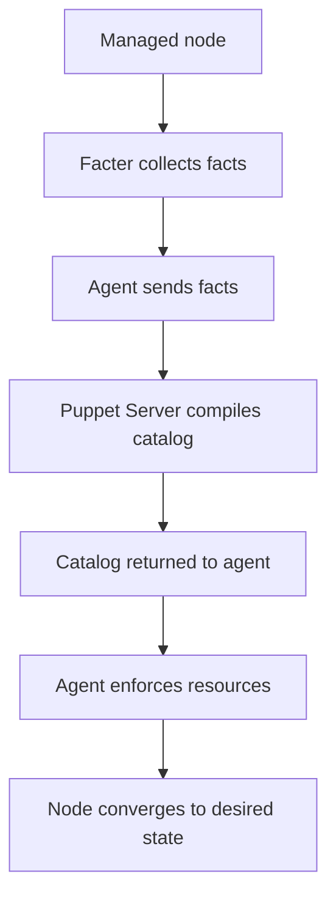

# Puppet

[Back to guide index](README.md)

Puppet is a configuration management platform designed around declarative desired state enforcement.

It commonly uses a master-agent model, though agentless and standalone workflows also exist.

## 4.1 Puppet Architecture

| Component | Purpose |
|---|---|
| Puppet Server | Compiles catalogs |
| Agent | Collects facts and applies catalogs |
| Catalog | Desired resource state for a node |
| Manifest | Puppet code file |
| Module | Reusable package of Puppet content |
| Hiera | Externalized data lookup |
| Facter | System fact collection |

### Mermaid diagram: Puppet master-agent flow



## 4.2 Puppet Workflow

1. Agent gathers facts.
2. Agent sends facts to Puppet Server.
3. Server compiles a node-specific catalog.
4. Agent receives catalog.
5. Agent enforces package, file, service, and other resources.
6. Report is sent back for visibility.

## 4.3 Installation Concepts

Puppet deployments typically include:

- Puppet Server on a central node
- Puppet Agent on managed nodes
- Optional PuppetDB and reporting stack

## 4.4 Basic Manifest Syntax

A manifest uses resources.

```puppet
package { 'nginx':
  ensure => installed,
}

file { '/var/www/html/index.html':
  ensure  => file,
  content => "Managed by Puppet\n",
  mode    => '0644',
  require => Package['nginx'],
}

service { 'nginx':
  ensure => running,
  enable => true,
  require => Package['nginx'],
}
```

## 4.5 Resources

Common resource types:

- package
- file
- service
- user
- group
- cron
- exec
- mount
- notify

## 4.6 Resource Relationships

Relationships help order operations.

### Arrow syntax

```puppet
Package['nginx'] -> File['/etc/nginx/nginx.conf'] ~> Service['nginx']
```

Meaning:

- Package before file
- File change notifies service

## 4.7 Classes

Classes organize manifests.

```puppet
class profile::web {
  package { 'nginx':
    ensure => installed,
  }

  service { 'nginx':
    ensure => running,
    enable => true,
  }
}

include profile::web
```

## 4.8 Modules

Modules package classes, files, templates, facts, and metadata.

### Typical module structure

```text
modules/
└── profile/
    ├── manifests/
    │   └── web.pp
    ├── templates/
    ├── files/
    └── metadata.json
```

## 4.9 Hiera

Hiera separates data from code.

This is one of Puppet's strongest patterns.

### Example Hiera hierarchy

```yaml
version: 5
hierarchy:
  - name: "Per-node data"
    path: "nodes/%{trusted.certname}.yaml"
  - name: "Per-environment data"
    path: "env/%{facts.environment}.yaml"
  - name: "Common data"
    path: "common.yaml"
```

### Example Hiera data

```yaml
profile::web::listen_port: 8080
profile::web::server_name: web1.example.com
```

## 4.10 Facts and Facter

Facts are system data collected by Facter.

Examples:

- operating system
- network interfaces
- memory size
- IP addresses
- virtualization info

### Conditional example

```puppet
if $facts['os']['family'] == 'Debian' {
  package { 'apache2':
    ensure => installed,
  }
}
```

## 4.11 Templates in Puppet

Puppet supports templates for configuration files.

ERB and EPP are common template approaches.

### EPP example

```epp
server {
  listen <%= $listen_port %>;
  server_name <%= $server_name %>;
}
```

### Using the template

```puppet
file { '/etc/nginx/conf.d/site.conf':
  ensure  => file,
  content => epp('profile/site.conf.epp', {
    'listen_port' => 80,
    'server_name' => 'example.com',
  }),
}
```

## 4.12 Exec Resources

Exec should be used carefully.

```puppet
exec { 'reload-systemd':
  command     => '/bin/systemctl daemon-reload',
  refreshonly => true,
}
```

Prefer native resources over exec where possible.

## 4.13 Node Definitions

```puppet
node 'web1.example.com' {
  include role::webserver
}
```

Many teams now prefer classification through external node classifiers or data-driven patterns instead of many explicit node blocks.

## 4.14 Roles and Profiles Pattern

A common design pattern in Puppet:

- Profiles define technology-specific implementation details.
- Roles define what a node should be.

Example:

- role::webserver includes profile::nginx and profile::monitoring
- role::db includes profile::postgresql and profile::backup

## 4.15 Puppet Forge

Puppet Forge is a repository of modules.

Use community modules carefully:

- Review maintenance quality.
- Pin versions.
- Validate compatibility.
- Prefer wrapping them in your own profiles.

## 4.16 Example Class: SSH Hardening

```puppet
class profile::ssh_hardening {
  file_line { 'disable_root_login':
    path  => '/etc/ssh/sshd_config',
    line  => 'PermitRootLogin no',
    match => '^PermitRootLogin',
  }

  file_line { 'disable_password_auth':
    path  => '/etc/ssh/sshd_config',
    line  => 'PasswordAuthentication no',
    match => '^PasswordAuthentication',
  }

  service { 'sshd':
    ensure => running,
    enable => true,
    subscribe => [
      File_line['disable_root_login'],
      File_line['disable_password_auth'],
    ],
  }
}
```

## 4.17 Example Class: User Management

```puppet
class profile::users {
  group { 'adminops':
    ensure => present,
  }

  user { 'deploy':
    ensure     => present,
    managehome => true,
    shell      => '/bin/bash',
    groups     => ['adminops'],
  }
}
```

## 4.18 Package and Service Example

```puppet
class profile::node_exporter {
  package { 'prometheus-node-exporter':
    ensure => installed,
  }

  service { 'prometheus-node-exporter':
    ensure  => running,
    enable  => true,
    require => Package['prometheus-node-exporter'],
  }
}
```

## 4.19 Environments

Puppet environments allow isolated code versions.

Typical examples:

- development
- testing
- production

## 4.20 Reports and Compliance

Puppet's reporting model helps answer:

- Which nodes failed recent runs?
- Which resources changed?
- Which nodes are drifting?
- How often do agents converge?

## 4.21 Best Practices for Puppet

1. Use roles and profiles.
2. Keep data in Hiera.
3. Prefer native resource types over exec.
4. Pin Forge module versions.
5. Test manifests before rollout.
6. Keep modules small and focused.
7. Avoid deep inheritance patterns.

## 4.22 Common Pitfalls

| Pitfall | Impact | Mitigation |
|---|---|---|
| Too much logic in manifests | Hard to understand | Move data to Hiera |
| Direct use of Forge modules everywhere | Upgrade complexity | Wrap them in profiles |
| Overuse of exec | Fragile idempotency | Prefer package/file/service resources |
| Poor environment separation | Risky changes | Use distinct Puppet environments |

## 4.23 When Puppet Fits Well

Puppet is strong when you need:

- Continuous agent-based convergence
- Data-driven classification
- Large fleets with stable policy enforcement
- Strong desired-state management over time

## 4.24 Puppet Summary

Puppet is a mature, declarative configuration management platform suited for continuously managed Linux fleets.

---
