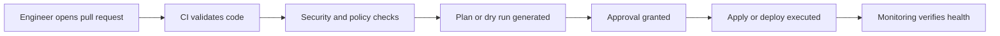

# CI/CD for Infrastructure

[Back to guide index](README.md)

Infrastructure automation should be governed by CI/CD pipelines just like application code.

A strong pipeline provides:

- Syntax validation
- Unit and policy checks
- Plan generation
- Peer review
- Controlled deployment
- Audit history

### Mermaid diagram: CI/CD pipeline for infrastructure



## 9.1 Pipeline Stages for Infrastructure Code

| Stage | Purpose |
|---|---|
| Lint | Formatting and style checks |
| Validate | Syntax and schema validation |
| Security | Static security checks |
| Plan | Proposed change preview |
| Approval | Manual or policy-based gate |
| Apply | Execute infrastructure changes |
| Verify | Post-deployment health checks |

## 9.2 Jenkins for Infrastructure Automation

Jenkins can orchestrate infrastructure workflows with pipeline-as-code.

### Example Jenkinsfile for Terraform

```groovy
pipeline {
  agent any

  environment {
    TF_IN_AUTOMATION = 'true'
  }

  stages {
    stage('Checkout') {
      steps {
        checkout scm
      }
    }

    stage('Fmt') {
      steps {
        sh 'terraform fmt -check -recursive'
      }
    }

    stage('Validate') {
      steps {
        sh 'terraform init -backend=false'
        sh 'terraform validate'
      }
    }

    stage('Plan') {
      steps {
        sh 'terraform init'
        sh 'terraform plan -out=tfplan'
      }
    }

    stage('Approval') {
      steps {
        input message: 'Approve Terraform apply?'
      }
    }

    stage('Apply') {
      steps {
        sh 'terraform apply -auto-approve tfplan'
      }
    }
  }
}
```

## 9.3 GitHub Actions for Infrastructure

GitHub Actions is widely used for repo-native infrastructure workflows.

### Example workflow

```yaml
name: terraform

on:
  pull_request:
  push:
    branches:
      - main

jobs:
  validate:
    runs-on: ubuntu-latest
    steps:
      - uses: actions/checkout@v4

      - uses: hashicorp/setup-terraform@v3

      - name: Terraform format check
        run: terraform fmt -check -recursive

      - name: Terraform init without backend
        run: terraform init -backend=false

      - name: Terraform validate
        run: terraform validate

  plan:
    if: github.event_name == 'pull_request'
    runs-on: ubuntu-latest
    steps:
      - uses: actions/checkout@v4

      - uses: hashicorp/setup-terraform@v3

      - name: Terraform init
        run: terraform init

      - name: Terraform plan
        run: terraform plan -no-color
```

## 9.4 GitLab CI for Infrastructure

GitLab CI provides integrated pipelines, environments, and approvals.

### Example `.gitlab-ci.yml`

```yaml
stages:
  - validate
  - plan
  - apply

validate:
  stage: validate
  image: hashicorp/terraform:1.9
  script:
    - terraform fmt -check -recursive
    - terraform init -backend=false
    - terraform validate

plan:
  stage: plan
  image: hashicorp/terraform:1.9
  script:
    - terraform init
    - terraform plan -out=tfplan
  artifacts:
    paths:
      - tfplan

apply:
  stage: apply
  image: hashicorp/terraform:1.9
  when: manual
  script:
    - terraform init
    - terraform apply -auto-approve tfplan
```

## 9.5 CI for Ansible

Ansible pipelines commonly include:

- YAML validation
- ansible-lint
- syntax checks
- role tests with Molecule
- optional check mode against staging targets

### Example GitHub Actions workflow for Ansible

```yaml
name: ansible

on:
  pull_request:

jobs:
  lint:
    runs-on: ubuntu-latest
    steps:
      - uses: actions/checkout@v4
      - name: Install Ansible
        run: pip install ansible ansible-lint
      - name: Lint playbooks
        run: ansible-lint
      - name: Syntax check
        run: ansible-playbook -i inventory/stage.yml playbooks/site.yml --syntax-check
```

## 9.6 Secret Handling in Pipelines

Do not hardcode credentials in pipeline YAML.

Use:

- GitHub Actions secrets
- GitLab CI variables
- Jenkins credentials store
- Vault or cloud-native secret managers
- OIDC federation to cloud providers

## 9.7 Approval Models

Common patterns:

| Pattern | Use Case |
|---|---|
| Automatic apply to dev | Low risk or ephemeral environments |
| Manual approval to stage | Shared validation environment |
| Manual approval plus change window for prod | High-risk production environments |
| Policy-controlled apply | Regulated systems |

## 9.8 Drift Detection Pipelines

A useful CI pattern is scheduled drift detection.

Examples:

- Nightly Terraform plan against production state
- Weekly Ansible check mode audit
- Scheduled compliance scans with InSpec or OpenSCAP

## 9.9 Artifact Strategy

Pipeline artifacts may include:

- Terraform plans
- Packer manifests
- Validation reports
- Security scan results
- Rendered documentation

## 9.10 Best Practices for Infrastructure CI/CD

1. Require code review for production changes.
2. Separate plan from apply.
3. Store logs and artifacts centrally.
4. Use short-lived credentials.
5. Tag releases and artifacts.
6. Add post-deployment verification.
7. Roll forward by code, not by console clicks.
8. Limit who can trigger production apply.

## 9.11 Common Pitfalls

| Pitfall | Impact | Mitigation |
|---|---|---|
| Apply directly from laptops | Poor auditability | Use CI runners |
| Shared long-lived secrets | Security risk | Use federated or ephemeral auth |
| No verification stage | Silent failure | Add health checks and smoke tests |
| Same credentials for all environments | Blast radius | Use environment-scoped identities |

## 9.12 CI/CD Summary

Infrastructure pipelines turn automation code into governed operational practice.

---
