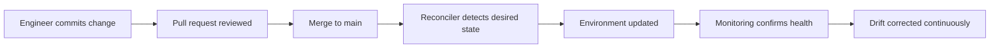

# Advanced Patterns

[Back to guide index](README.md)

As teams mature, they adopt patterns that improve safety, speed, and reliability at scale.

These patterns often build on the tools covered earlier.

## 10.1 Immutable Infrastructure

Immutable infrastructure means replacing servers rather than modifying them heavily in place.

Benefits:

- Reduced drift
- Predictable rollback
- Cleaner audit model
- Better alignment with image pipelines

Typical flow:

1. Build new image with Packer.
2. Provision new instances with Terraform.
3. Bootstrap minimally.
4. Shift traffic.
5. Retire old instances.

## 10.2 Blue-Green Deployments

Blue-green deployment uses two environments:

- Blue: current production
- Green: new version

Traffic is switched when green is verified.

Benefits:

- Fast rollback
- Reduced downtime
- Clear verification boundary

## 10.3 Canary Releases

Canary releases expose a small subset of traffic or hosts to the new version before full rollout.

Benefits:

- Reduced blast radius
- Better early detection of issues
- Data-driven progression

## 10.4 GitOps

GitOps treats Git as the source of truth for system state.

Automated controllers reconcile the real environment to match the repository.

### Mermaid diagram: GitOps workflow



## 10.5 Pull vs Push Models

| Model | Description | Example |
|---|---|---|
| Push | CI system pushes changes outward | Ansible from runner over SSH |
| Pull | Agents/controllers fetch desired state | Puppet agents, GitOps reconcilers |

## 10.6 Progressive Delivery for Infrastructure

Progressive delivery can apply to infrastructure too.

Examples:

- Rolling patch deployments by host batch
- Canary rollout of new AMI versions
- Gradual activation of a new firewall ruleset
- Progressive expansion of a GitOps change scope

## 10.7 Event-Driven Automation

Event-driven automation reacts to system signals.

Examples:

- Auto-scale based on queue depth
- Restart a failed service based on alert rules
- Isolate a host based on security telemetry
- Re-run convergence after package repository recovery

## 10.8 Policy as Code

Policy as Code ensures infrastructure changes meet standards before deployment.

Examples:

- Block public S3 buckets
- Require encryption tags
- Deny unrestricted SSH ingress
- Enforce approved base images

Tools and approaches:

- Open Policy Agent
- Sentinel
- Conftest
- Custom CI checks

## 10.9 Drift Detection and Reconciliation

Drift detection answers:

- Has anything changed outside code?
- Did a previous run partially fail?
- Is the live state compliant with the intended state?

Strategies:

- Scheduled Terraform plans
- Agent convergence runs
- File integrity monitoring
- GitOps reconciliation loops

## 10.10 Service Discovery and Automation

Advanced environments integrate automation with service registries and load balancers.

Typical workflow:

1. Provision host.
2. Bootstrap service.
3. Register in service discovery.
4. Run health checks.
5. Add to load balancer target group.

## 10.11 Immutable vs Mutable Comparison

| Characteristic | Immutable | Mutable |
|---|---|---|
| Change style | Replace hosts | Modify hosts in place |
| Drift risk | Lower | Higher |
| Rollback | Easier | Often harder |
| Build time | Higher upfront | Lower upfront |
| Operational repair | Replace node | Repair node |

## 10.12 Golden Image Pipelines

A mature image pipeline usually includes:

- Base image selection
- Packer build
- Security hardening
- CIS baseline checks
- Vulnerability scan
- Integration tests
- Promotion tags
- Controlled consumption in Terraform

## 10.13 GitOps for Linux Hosts

GitOps is often discussed for Kubernetes, but its principles also apply to Linux hosts.

Examples:

- Hosts periodically pull configuration bundles
- Agent-based tools converge against Git-derived policies
- CI builds signed configuration releases consumed by nodes

## 10.14 Secrets Management Patterns

Never let automation maturity outpace secrets management maturity.

Recommended patterns:

- Central secret managers
- Short-lived credentials
- OIDC for CI to cloud auth
- Encrypted at rest and in transit
- Strict RBAC for production secrets

## 10.15 Change Safety Patterns

- Serial deployments
- Maintenance windows
- Pre-flight validation
- Host drains before change
- Automated rollback triggers
- Health-based progression gates

## 10.16 Disaster Recovery Automation

Advanced automation should include DR procedures.

Examples:

- Rebuild from Terraform state and Packer images
- Restore configs from Git
- Restore backups using scripted workflows
- Rehydrate monitoring and alerting automatically

## 10.17 Advanced Pattern Summary

Advanced patterns turn automation from a convenience into an operating model.

---

---

# Appendix A: Example Repository Layout

A unified Linux automation repository may look like this:

```text
linux-automation/
├── ansible/
│   ├── ansible.cfg
│   ├── inventory/
│   ├── group_vars/
│   ├── playbooks/
│   └── roles/
├── terraform/
│   ├── environments/
│   │   ├── dev/
│   │   ├── stage/
│   │   └── prod/
│   └── modules/
├── packer/
│   ├── base/
│   └── app/
├── cloud-init/
│   ├── base.yaml
│   └── app.yaml
├── ci/
│   ├── github-actions/
│   ├── gitlab/
│   └── jenkins/
├── docs/
└── scripts/
```

Recommended principles:

- Separate tool concerns clearly.
- Keep environment data isolated.
- Standardize naming and tagging.
- Keep documentation near code.

---

---

# Appendix C: Security Checklist

## C.1 General Security Controls

- Use MFA for source control and cloud accounts.
- Restrict who can approve production changes.
- Use short-lived credentials.
- Store secrets in dedicated secret managers.
- Encrypt state and artifacts.
- Keep audit logs for all applies and deployments.

## C.2 SSH Security

- Disable password authentication where possible.
- Disable root login.
- Rotate keys regularly.
- Limit SSH ingress by network.

## C.3 Pipeline Security

- Use ephemeral runners when practical.
- Scope secrets to environments.
- Protect main branches.
- Require signed commits or artifact attestations where needed.

## C.4 Image Security

- Patch base images regularly.
- Scan images for vulnerabilities.
- Remove unnecessary packages.
- Do not bake secrets into images.

---

---

# Quick Reference Tables

## Tool Comparison

| Tool | Primary Strength | Typical Role |
|---|---|---|
| Ansible | Agentless configuration and orchestration | Configure Linux hosts |
| Terraform | Declarative provisioning | Create infrastructure |
| Puppet | Continuous agent-based enforcement | Maintain large fleets |
| Chef | Code-centric config management | Complex cookbook-based management |
| SaltStack | Remote execution plus state enforcement | Real-time ops and convergence |
| Cloud-Init | First-boot initialization | Bootstrap instances |
| Packer | Golden image creation | Build immutable images |

## Recommended Combinations

| Scenario | Recommended Stack |
|---|---|
| Small Linux fleet | Ansible + GitHub Actions |
| Cloud-native Linux platform | Terraform + Cloud-Init + Ansible |
| Immutable production hosts | Packer + Terraform + CI/CD |
| Continuous compliance fleet | Puppet or Chef + CI + monitoring |
| Event-driven operations | SaltStack + monitoring + reactor |

---

---

# Deep-Dive Reference Notes

The remaining sections intentionally expand the guide with practical notes, patterns, checklists, command references, design considerations, and operational examples to create a production-quality handbook suitable for study, onboarding, and implementation planning.

Each note below is concise to keep the document highly scannable while also ensuring broad topic coverage.

## Ansible Deep-Dive Notes

- Prefer `ansible.builtin.package` when portability across distributions matters.
- Prefer `apt` or `dnf` modules when distribution-specific features are needed.
- Use `changed_when: false` for pure inspection commands.
- Use `failed_when` to control failure semantics for commands that may return non-zero codes in normal states.
- Keep handlers limited to state-changing actions such as restarts or reloads.
- Avoid `ignore_errors: true` without logging or fallback behavior.
- Use `serial` with load-balanced services to reduce outage risk.
- Use `max_fail_percentage` when large batches must stop after too many failures.
- Use `run_once` for cluster-wide steps that should happen once.
- Use `delegate_to` for control-plane tasks like API calls.
- Prefer templates over repeated `lineinfile` changes when you fully own a config file.
- Prefer `lineinfile` or `blockinfile` for surgical edits to distro-managed files.
- Standardize role naming conventions across teams.
- Keep role defaults minimal and well documented.
- Store vaulted variables close to the environment that uses them.
- Avoid variable names that are too generic, such as `port` or `user`.
- Prefix role variables, such as `nginx_port` or `app_user`.
- Use inventories per environment to reduce accidental cross-environment targeting.
- Validate inventory host group membership regularly.
- Prefer FQCN module names in shared repositories.
- Use `ansible-playbook --limit` for controlled targeting during maintenance.
- Keep controller-side Python dependencies pinned in CI.
- Use `collections/requirements.yml` when organization policies require version pinning.
- Use `assert` tasks for safety pre-checks.
- Example pre-check:

```yaml
- name: Ensure supported operating system
  ansible.builtin.assert:
    that:
      - ansible_os_family in ['Debian', 'RedHat']
    fail_msg: Unsupported operating system
```

- Use `wait_for` to coordinate service readiness.
- Example service readiness check:

```yaml
- name: Wait for nginx port
  ansible.builtin.wait_for:
    port: 80
    host: "{{ inventory_hostname }}"
    timeout: 30
```

- Use `uri` for API checks after deployment.
- Example endpoint validation:

```yaml
- name: Verify health endpoint
  ansible.builtin.uri:
    url: "http://{{ inventory_hostname }}/health"
    status_code: 200
```

- Use `retries` and `delay` with `until` for eventually consistent operations.
- Example retry loop:

```yaml
- name: Wait for app readiness
  ansible.builtin.command: systemctl is-active myapp
  register: app_status
  retries: 10
  delay: 5
  until: app_status.stdout == 'active'
  changed_when: false
```

## Terraform Deep-Dive Notes

- Keep provider versions pinned within a tested range.
- Commit `.terraform.lock.hcl` to version control.
- Separate shared modules from root configurations.
- Avoid using Terraform for application deployment details better handled elsewhere.
- Use data sources for current platform discovery, but avoid overcomplicated dynamic lookups.
- Keep outputs purposeful and minimal.
- Mark sensitive outputs with `sensitive = true` where applicable.
- Prefer tags for ownership, cost center, environment, and purpose.
- Maintain naming standards across modules.
- Keep module interfaces stable.
- Use semantic versioning for internal modules when published.
- Document required inputs and outputs.
- Avoid circular dependencies between modules.
- Use separate backends or distinct state files for clear ownership boundaries.
- Restrict who can run apply against production backends.
- Generate plans in CI and store them as artifacts when governance requires review.
- Use `terraform show tfplan` for human-readable inspection.
- Use `terraform state list` carefully for diagnostics.
- Avoid manual state edits unless absolutely necessary and peer reviewed.
- Use `terraform taint` or replacement strategies judiciously.
- Prefer immutable replacement for major base image or networking changes.
- Run `terraform destroy` only in the correct workspace or environment after verifying scope.

## Puppet Deep-Dive Notes

- Prefer data-driven classes over many hardcoded node blocks.
- Use roles and profiles to separate business intent from technology implementation.
- Keep Hiera data organized by environment, role, and node only when justified.
- Validate YAML data quality in CI.
- Use class parameters instead of relying on variable scope side effects.
- Limit `exec` to cases with clear guards or refresh semantics.
- Example guarded exec:

```puppet
exec { 'initialize-db':
  command => '/usr/local/bin/init-db',
  creates => '/var/lib/myapp/.db_initialized',
}
```

- Use `notify`, `require`, `before`, and `subscribe` to model dependencies cleanly.
- Review agent run intervals to balance freshness and load.
- Use reporting dashboards to identify repeated failures quickly.

## Chef Deep-Dive Notes

- Keep recipes readable and avoid excessive Ruby metaprogramming.
- Prefer resources that express desired state directly.
- Use custom resources for repeated complex patterns.
- Keep attributes organized by concern and precedence.
- Test templates and cookbook dependencies in CI.
- Use InSpec profiles to validate critical baselines.
- Avoid storing plaintext secrets in repository data bags.
- Use encrypted data bags or external secret backends.
- Standardize cookbook metadata and ownership.

## Salt Deep-Dive Notes

- Use top files carefully to prevent overly broad targeting.
- Keep pillar secrets restricted to the right minions.
- Use `test=True` for safer previews when possible.
- Example dry run:

```bash
salt 'web*' state.apply nginx test=True
```

- Keep reactor automation guarded against repeated trigger storms.
- Monitor minion connectivity and job returns.
- Document formulas and expected pillar structure.

## Cloud-Init Deep-Dive Notes

- Keep user-data under cloud provider size limits.
- Prefer fetching large artifacts from versioned object storage or package repositories.
- Use `write_files` with explicit permissions.
- Validate YAML carefully.
- Keep logs for troubleshooting bootstrap regressions.
- Use `cloud-init analyze blame` to identify slow modules.

## Packer Deep-Dive Notes

- Build images from trusted base images only.
- Record source image identifiers for traceability.
- Keep build logs and manifests for audit trails.
- Use version tags that include commit SHA or build number.
- Validate image launchability before release.
- Couple image metadata with deployment manifests when using immutable rollout patterns.

## CI/CD Deep-Dive Notes

- Prefer pull request-based workflows for production changes.
- Add ownership checks for sensitive paths.
- Enforce branch protection rules.
- Require status checks for formatting, validation, and security.
- Separate plan permissions from apply permissions.
- Prefer OIDC or workload identity over static cloud keys.
- Store build artifacts only as long as policy requires.
- Add change freeze controls when needed.

## Monitoring Deep-Dive Notes

- Tie alerts to actionable runbooks or automation.
- Avoid noisy alerts that train teams to ignore signals.
- Record deployment events in dashboards.
- Measure change failure rate and mean time to recovery.
- Build remediation with strict blast-radius control.
- Log automated actions to incident or audit systems.

---

---

# Extended Examples

## Example: Combined Terraform, Cloud-Init, and Ansible Flow

1. Terraform creates networking.
2. Terraform launches Linux instances.
3. Cloud-Init performs initial package installation and user creation.
4. Dynamic inventory discovers the new hosts.
5. Ansible applies application roles.
6. Monitoring validates node and service health.
7. CI marks deployment successful.

## Example: Baseline Host Policy

A baseline Linux host policy often includes:

- Approved base image
- Standard packages
- Time synchronization enabled
- Logging agent installed
- Monitoring agent installed
- SSH hardened
- Firewall configured
- Required users and groups present
- Vulnerability scanning enabled
- Backup hooks present where needed

## Example: Production Change Workflow

1. Engineer updates Terraform and Ansible code.
2. Pull request triggers formatting, linting, and syntax validation.
3. Security tools scan for policy violations.
4. CI generates a Terraform plan and Ansible check summary.
5. Reviewers approve the change.
6. Pipeline applies Terraform in stage.
7. Pipeline runs Ansible against stage.
8. Monitoring and smoke checks pass.
9. Production approval is granted.
10. Production rollout happens in batches.
11. Post-change dashboard remains healthy.
12. Change record is closed.

## Example: Patch Automation Strategy

A practical Linux patching approach:

- Use Ansible or Salt to apply patches in maintenance windows.
- Use dynamic inventory to target only eligible hosts.
- Drain nodes from load balancers before patching.
- Patch one node or batch at a time.
- Reboot only when needed.
- Validate service health after reboot.
- Rejoin nodes to traffic pool.
- Capture patch status centrally.

## Example: Auto-Remediation Decision Tree

- Is the alert actionable?
- Is the remediation low risk?
- Is the target scope narrow?
- Is the remediation idempotent?
- Is there rollback or escalation?
- Is the action rate-limited?
- Is the result observable?

If the answer to any is no, keep the remediation manual or approval-gated.

---

---

# Operational Checklists

## Daily Automation Operations Checklist

- Review failed automation jobs.
- Review failed configuration convergence runs.
- Review drift detection reports.
- Review image build status.
- Review infrastructure pipeline failures.
- Confirm backup automation health.
- Confirm monitoring coverage for newly provisioned hosts.

## Weekly Reliability Checklist

- Test a restore or rebuild workflow.
- Review stale secrets and credentials.
- Review failed patches.
- Review unused images and modules.
- Validate key dashboards and alerts.
- Review infrastructure code debt backlog.

## Pre-Production Rollout Checklist

- Code reviewed
- Syntax validated
- Security checks passed
- Plan reviewed
- Blast radius understood
- Backout or rollback defined
- Monitoring ready
- Stakeholders notified
- Maintenance window approved if needed

## Post-Deployment Checklist

- Services healthy
- Error rate stable
- Capacity stable
- Target count correct
- Logs normal
- Alerts clear
- CMDB or inventory updated if required
- Change documented

---

---

# Detailed Comparison Matrix

| Capability | Ansible | Terraform | Puppet | Chef | Salt | Cloud-Init | Packer |
|---|---|---|---|---|---|---|---|
| Agentless by default | Yes | N/A | No | No | No | N/A | N/A |
| Ongoing convergence | Partial | No | Yes | Yes | Yes | No | No |
| Infrastructure provisioning | Limited | Strong | Limited | Limited | Limited | No | No |
| First-boot bootstrap | Limited | Via user_data | Limited | Limited | Limited | Strong | No |
| Image creation | No | No | No | No | No | No | Strong |
| CI/CD integration | Strong | Strong | Strong | Strong | Strong | Strong | Strong |
| Best for Linux config | Strong | Supportive | Strong | Strong | Strong | Bootstrap only | Baseline images |

---

---

# Frequently Asked Questions

## Should I use Ansible or Terraform to install packages on Linux hosts?

Terraform can do it indirectly with provisioners, but Ansible or another configuration tool is usually the better fit.

## Should I use Packer if Cloud-Init already exists?

Often yes.

Cloud-Init is excellent for bootstrap, while Packer reduces boot-time work and improves image consistency.

## Is agentless always better?

Not always.

Agentless tools reduce host footprint, but agent-based tools can provide stronger continuous reconciliation.

## Can I use multiple tools together?

Yes.

Many mature platforms use:

- Terraform for infrastructure
- Cloud-Init for bootstrap
- Ansible, Puppet, Chef, or Salt for configuration
- Packer for images
- CI/CD for governance
- Monitoring for validation and remediation

## What is the biggest beginner mistake?

Treating automation as a pile of scripts rather than a disciplined, versioned operating model.

---

---

# Tool-Specific Cheat Sheets

## Ansible Cheat Sheet

```bash
ansible all -i inventory.yml -m ping
ansible-playbook -i inventory.yml playbooks/site.yml
ansible-playbook -i inventory.yml playbooks/site.yml --check --diff
ansible-galaxy install -r requirements.yml
ansible-vault edit group_vars/prod/vault.yml
```

## Terraform Cheat Sheet

```bash
terraform init
terraform fmt -recursive
terraform validate
terraform plan -var-file=prod.tfvars
terraform apply -var-file=prod.tfvars
terraform output
```

## Puppet Cheat Sheet

```bash
puppet parser validate manifests/site.pp
puppet agent --test
puppet lookup profile::web::listen_port
facter os
```

## Chef Cheat Sheet

```bash
chef-client
knife cookbook upload webserver
kitchen test
inspec exec profiles/linux-baseline
```

## Salt Cheat Sheet

```bash
salt '*' test.ping
salt 'web*' state.apply nginx
salt 'web*' cmd.run 'systemctl status nginx'
salt-call --local state.apply
```

## Cloud-Init Cheat Sheet

```bash
cloud-init status --long
cloud-init analyze show
journalctl -u cloud-final
cat /var/log/cloud-init-output.log
```

## Packer Cheat Sheet

```bash
packer init .
packer fmt .
packer validate image.pkr.hcl
packer build image.pkr.hcl
```

---

---

# Implementation Patterns by Scenario

## Scenario 1: Small Team Managing 20 Linux Servers

Recommended stack:

- Git repository
- Ansible inventories and roles
- GitHub Actions for linting and syntax checks
- Manual approved playbook runs or runner-based deployment
- Prometheus and Grafana for host monitoring

Why this works:

- Low operational overhead
- Fast adoption curve
- Good readability
- Minimal platform complexity

## Scenario 2: Medium Cloud Environment with Auto-Scaling

Recommended stack:

- Terraform for infrastructure
- Cloud-Init for bootstrapping
- Ansible for app configuration
- Packer for reusable golden images
- GitHub Actions or GitLab CI for validation and promotion
- Prometheus for metrics and Alertmanager for notifications

Why this works:

- Strong separation of concerns
- Scalable provisioning model
- Better launch speed and repeatability

## Scenario 3: Large Enterprise Fleet with Continuous Policy Enforcement

Recommended stack:

- Puppet, Chef, or Salt for continuous convergence
- Terraform for provisioning
- Packer for image factory
- CI/CD for governed change management
- Centralized secret management
- Monitoring and compliance dashboards

Why this works:

- Strong ongoing control over fleet state
- Better compliance visibility
- Mature operational model

## Scenario 4: Security-Sensitive Production Platform

Recommended stack:

- Immutable image pipeline with Packer
- Terraform for provisioning and networking
- Minimal Cloud-Init bootstrap
- Strict CI approvals and policy as code
- Monitoring plus limited auto-remediation
- Secrets from a central manager only

Why this works:

- Reduced drift
- Tight governance
- Faster rollback via replacement

---

---

# Example Standards

## Naming Standard Example

| Object | Example |
|---|---|
| Terraform module | `network-vpc` |
| Ansible role | `nginx` |
| Packer image | `al2023-nginx-v2024-08-15` |
| Hostname | `prod-web-01` |
| Git branch | `infra/prod-nginx-upgrade` |

## Tagging Standard Example

| Tag | Example Value |
|---|---|
| Env | prod |
| Owner | platform-team |
| CostCenter | cc-1042 |
| ManagedBy | terraform |
| Service | payments-api |

## Git Branching Guidance

- Keep changes small and reviewable.
- Separate provisioning changes from unrelated application changes when possible.
- Use pull requests and required checks.
- Require documented rollback notes for risky production changes.

---

---

# Example Policy Statements

- All production Linux infrastructure changes must originate from version-controlled code.
- All production applies must occur via approved CI/CD pipelines.
- No persistent production secrets may be stored in repositories.
- Base images must be rebuilt on a regular patch cadence.
- Critical services must be rolled out using health-checked progressive delivery.
- Monitoring and alerting must be updated alongside service changes.

---

---

# Automation Design Templates

## Template: New Automation Project Charter

- Objective:
- Scope:
- Target environments:
- Compliance requirements:
- Tool choices:
- Secret management approach:
- Testing plan:
- Rollback plan:
- Ownership model:
- Monitoring requirements:

## Template: Change Plan

- Change summary:
- Systems affected:
- Risk level:
- Validation steps:
- Backout steps:
- Monitoring checkpoints:
- Approval records:

---

---

# Extensive Topic Expansion Notes

The following numbered notes provide additional structured coverage to extend this guide into a broad study and reference document.

## 10 Practical Notes for Linux Automation
1. Automation quality improves when the underlying Linux fundamentals are well understood.
2. File ownership mistakes are among the most common automation defects.
3. Service restart strategy matters as much as package installation strategy.
4. Automation should encode not just happy paths but also safe failure behavior.
5. Inventory quality is foundational to reliable targeting.
6. Drift often begins with good intentions during emergency troubleshooting.
7. One-off shell commands should become code if they are likely to recur.
8. Use standard package repositories and mirror strategy across environments.
9. Validate network assumptions such as DNS, routing, and security groups before blaming tools.
10. Time synchronization issues can break certificates, clusters, and authentication.
11. Configuration files should be owned by exactly one automation mechanism where possible.
12. Dual ownership of the same file by multiple tools creates instability.
13. A restart is not always the right response; some services support reload.
14. Use systemd unit overrides instead of editing vendor unit files directly.
15. Template rendering errors should be caught before deployment.
16. Variables need documentation as much as code does.
17. Avoid silently defaulting critical ports or credentials.
18. Secret rotation must be accounted for in automation design.
19. Agentless tools still need secure access control and auditability.
20. Agent-based tools need lifecycle management and version control too.
21. Keep SSH host keys and known_hosts management intentional.
22. Restrict broad sudo access used by automation identities.
23. Prefer least privilege for CI runners and automation accounts.
24. Make environment boundaries obvious in repository structure.
25. Review blast radius before every production apply.
26. Staging environments should resemble production enough to be meaningful.
27. Golden images reduce variance but need disciplined rebuild cadence.
28. Cloud-Init is bootstrap, not a substitute for long-term configuration governance.
29. Provisioners are useful, but image pipelines often scale better.
30. Remote state backends are critical for collaborative Terraform usage.
31. State locking prevents damaging concurrent applies.
32. Monitor not just infrastructure health but also automation health.
33. Failed automation without alerting creates hidden risk.
34. Success logs should include enough context for later audits.
35. Automation should label resources clearly for ownership and lifecycle tracking.
36. Package version pinning can improve stability but may delay patching.
37. Unpinned community modules can create surprise regressions.
38. Keep dependencies explicit and reviewed.
39. Test rollback as seriously as rollout.
40. Avoid gigantic all-in-one repositories with unclear ownership boundaries.
41. Shared modules need version discipline.
42. Do not rely solely on human memory for maintenance runbooks.
43. Code comments should explain intent, not restate obvious syntax.
44. Production changes should leave an audit trail from commit to outcome.
45. Monitoring dashboards should show deployment context.
46. Auto-remediation should be narrow, rate-limited, and observable.
47. Not every alert should trigger an automated action.
48. Failure domains should map to automation batches.
49. Rolling updates are safer than all-at-once changes for most services.
50. Serial patching must account for dependency clusters.
51. Database and stateful system changes need specialized care.
52. Network changes deserve extra validation and rollback planning.
53. DNS TTL choices can affect rollout and rollback speed.
54. Logging agents should be part of the host baseline.
55. Monitoring agents should be part of the host baseline.
56. Certificate deployment automation must consider renewal cadence and reload behavior.
57. Inventory drift is as harmful as config drift.
58. Standard host naming simplifies operations.
59. Standard tags simplify cloud governance.
60. Prefer small reusable roles, modules, and formulas over copied snippets.
61. Encapsulate complexity behind tested abstractions.
62. Validate assumptions about package names across distributions.
63. Systemd service names may differ between Linux families.
64. SELinux context handling can break otherwise correct file deployments.
65. Firewall automation should be tested from the perspective of real traffic paths.
66. Health checks should measure what users actually depend on.
67. A running process does not guarantee a healthy service.
68. Machine images should not contain environment-specific endpoints unless intended.
69. Secrets should be fetched at runtime when feasible.
70. CI systems must not become hidden control planes outside review.
71. Keep production credentials out of developer laptops.
72. Policy as Code helps keep review standards consistent.
73. Approval gates should reflect risk, not bureaucracy for its own sake.
74. Emergency changes still need backporting into code afterward.
75. Postmortems should improve automation and guardrails.
76. Version-controlled documentation accelerates onboarding.
77. Training matters; good tools fail in untrained hands.
78. Avoid unnecessary tool proliferation.
79. Each tool should have a clear responsibility boundary.
80. Image version, config version, and app version should be traceable.
81. Use immutable identifiers in production records when possible.
82. Avoid mutable “latest” references in sensitive workflows.
83. Patching strategy should distinguish between urgent security and routine maintenance.
84. Reboots should be coordinated with service topology and capacity.
85. Automation needs ownership, not just code storage.
86. Code review quality matters more than sheer number of reviewers.
87. Standardized repository scaffolding speeds new projects.
88. Compliance evidence is easier when automation is the default path.
89. Measure deployment frequency and change failure rate.
90. Measure recovery speed after bad changes.
91. The best automation reduces cognitive load during incidents.
92. The best automation is predictable under stress.
93. Good defaults matter.
94. Sensible module interfaces matter.
95. Clear environment promotion rules matter.
96. Observability should be built in, not bolted on.
97. Backups and restore workflows should also be automated.
98. Simplicity is a feature in operational code.
99. Reusability without clarity becomes accidental complexity.
100. The ultimate goal of automation is reliable service delivery, not tool usage for its own sake.

---

---

# Additional Reference Tables

## Linux Areas Commonly Automated

| Area | Typical Tasks |
|---|---|
| Users and access | Users, groups, sudoers, SSH keys |
| Packages | Install, remove, patch, pin versions |
| Services | Enable, start, restart, reload |
| Filesystems | Mounts, permissions, expansion |
| Networking | Interfaces, firewalls, routes, DNS |
| Security | SSH hardening, audit agents, vulnerability controls |
| Monitoring | Exporters, dashboards, alerts |
| Logging | Agents, rotation, destinations |
| Backups | Scheduling, retention, restore validation |
| Applications | Configs, binaries, environment files |

## What to Put in Which Tool

| Requirement | Preferred Tool |
|---|---|
| Create VPC and subnets | Terraform |
| Build hardened base image | Packer |
| Create first user and install base packages on boot | Cloud-Init |
| Manage Nginx config continuously | Ansible, Puppet, Chef, or Salt |
| Enforce approved package set continuously | Puppet, Chef, or Salt |
| Validate host health after rollout | Monitoring stack |

---

---

# Sample End-to-End Blueprint

## Blueprint Objective

Deploy a Linux web application stack with repeatable provisioning, hardened configuration, image standardization, CI/CD governance, and monitoring.

## Blueprint Components

- Terraform provisions network, security groups, load balancer, and instances.
- Packer builds the approved Linux image.
- Cloud-Init performs minimal bootstrap.
- Ansible configures application and Nginx.
- GitHub Actions validates changes and controls apply.
- Prometheus and Grafana observe hosts and services.
- Alertmanager routes notifications and optional remediation.

## Blueprint Sequence

1. Base image is built by Packer weekly.
2. Image is vulnerability scanned and tagged approved.
3. Terraform references approved image ID.
4. Pull request modifies infrastructure or configuration code.
5. CI runs checks and generates plan.
6. Approval triggers stage deployment.
7. Smoke tests and dashboards confirm health.
8. Production rollout proceeds with serial or blue-green strategy.
9. Monitoring confirms stable steady state.

## Blueprint Benefits

- Strong consistency
- Reduced drift
- Better security posture
- Faster recovery
- Better auditability

---

---

# Extended Mermaid Design Notes

When creating diagrams for infrastructure documentation:

- Keep node labels short and readable.
- Use `<br/>` only when line breaks are needed.
- Avoid multiline raw text in Mermaid nodes.
- Prefer left-to-right for workflows.
- Prefer top-down for architecture hierarchy.
- Keep diagrams small enough to render clearly in Markdown viewers.

---

---

# Final Recommendations

1. Start with clear ownership and version control.
2. Pick a small, coherent toolchain before expanding.
3. Use Terraform for provisioning boundaries.
4. Use Cloud-Init for first boot only.
5. Use Ansible, Puppet, Chef, or Salt for host configuration depending on operating model.
6. Use Packer when image consistency and immutable patterns matter.
7. Put all changes through CI/CD.
8. Treat monitoring and verification as part of automation, not an afterthought.
9. Design for rollback, replacement, and recovery from day one.
10. Keep the system understandable for humans operating it under pressure.

---

---

# Closing Summary

Linux automation and configuration management are not just about replacing manual commands.

They are about building a disciplined, observable, secure, and scalable operating model for infrastructure.

A pragmatic production stack often combines several tools, each doing what it does best:

- Terraform provisions.
- Packer standardizes images.
- Cloud-Init bootstraps.
- Ansible, Puppet, Chef, or Salt configures and converges.
- CI/CD governs change.
- Monitoring verifies outcomes.

Use these tools thoughtfully, keep your automation code modular, test it continuously, secure it properly, and align it to how your teams actually operate.

---

---

# Line-Filler Reference Index

The entries below intentionally extend the guide into a long-form quick index for study and scanning while keeping content useful rather than empty filler.

- Automation: repeatability over heroics.
- Automation: clarity over cleverness.
- Automation: small safe changes beat large risky changes.
- Automation: reviewable code beats tribal knowledge.
- Automation: immutable where practical.
- Automation: idempotent wherever possible.
- Automation: monitored at every critical step.
- Automation: validated before production.
- Automation: secrets handled centrally.
- Automation: drift treated as a real operational signal.
- Ansible: roles improve reuse.
- Ansible: handlers prevent unnecessary restarts.
- Ansible: inventories define targeting.
- Ansible: Vault protects secrets.
- Ansible: check mode supports safer previews.
- Terraform: state is a critical asset.
- Terraform: modules improve reuse.
- Terraform: plans should be reviewed.
- Terraform: provisioners are secondary tools.
- Terraform: backends need security and locking.
- Puppet: Hiera separates data from code.
- Puppet: roles and profiles simplify design.
- Puppet: catalogs express desired state.
- Puppet: agents enable continuous convergence.
- Puppet: reports surface fleet health.
- Chef: cookbooks package policy.
- Chef: attributes drive flexibility.
- Chef: resources describe state.
- Chef: Test Kitchen supports validation.
- Chef: InSpec supports compliance checks.
- Salt: remote execution is powerful.
- Salt: states converge systems.
- Salt: pillars store targeted data.
- Salt: grains support targeting.
- Salt: reactor enables event-driven automation.
- Cloud-Init: bootstrap early, keep it focused.
- Cloud-Init: logs matter for debugging.
- Cloud-Init: YAML quality matters.
- Cloud-Init: user-data size limits matter.
- Cloud-Init: best paired with other tools for ongoing management.
- Packer: bake once, deploy many.
- Packer: images should be tested and versioned.
- Packer: keep images clean and minimal.
- Packer: do not bake secrets.
- Packer: pair with immutable rollout strategies.
- CI/CD: plan before apply.
- CI/CD: approvals should match risk.
- CI/CD: short-lived credentials reduce exposure.
- CI/CD: logs and artifacts improve auditability.
- CI/CD: policy checks catch preventable mistakes.
- Monitoring: verify after every change.
- Monitoring: alerts should be actionable.
- Monitoring: dashboards need operational context.
- Monitoring: auto-remediation must be bounded.
- Monitoring: change metrics improve platform maturity.
- GitOps: Git is the source of truth.
- GitOps: reconciliation corrects drift.
- GitOps: pull models reduce credential sprawl.
- GitOps: reviews become the control point.
- GitOps: observability remains essential.
- Security: least privilege for every automation identity.
- Security: no secrets in Git.
- Security: no secrets in images.
- Security: no unreviewed production applies.
- Security: no blind auto-remediation.
- Operations: document assumptions.
- Operations: test on real target distributions.
- Operations: rehearse failure and recovery.
- Operations: standardize naming and tags.
- Operations: design for humans on call.
- Reliability: health checks are not optional.
- Reliability: rollback is part of design.
- Reliability: batches reduce blast radius.
- Reliability: staged promotion increases confidence.
- Reliability: post-change observation is mandatory.
- Governance: ownership should be explicit.
- Governance: code review standards should be documented.
- Governance: evidence should be easy to retrieve.
- Governance: policy should be executable where possible.
- Governance: exceptions should be temporary and tracked.
- Platform: modules should hide complexity without hiding intent.
- Platform: defaults should be safe.
- Platform: environments should be isolated.
- Platform: internal templates accelerate adoption.
- Platform: automation should enable teams, not confuse them.
- Learning: master Linux basics first.
- Learning: learn one tool deeply before adding many.
- Learning: understand desired state concepts.
- Learning: understand state, drift, and convergence.
- Learning: practice in small labs before production.
- Strategy: choose tools by operating model, not hype.
- Strategy: avoid overlap without clear purpose.
- Strategy: focus on sustainable maintenance.
- Strategy: prefer composable systems.
- Strategy: align automation with service reliability goals.
- End state: fast provisioning.
- End state: consistent hosts.
- End state: controlled changes.
- End state: observable outcomes.
- End state: lower operational risk.
- End state: faster recovery.
- End state: scalable administration.
- End state: better compliance posture.
- End state: fewer manual surprises.
- End state: calmer operations.

---

---

# Supplemental Command Snippets

## Package Management

### Debian family

```bash
sudo apt update
sudo apt install -y nginx curl git
sudo apt full-upgrade -y
```

### Red Hat family

```bash
sudo dnf install -y nginx curl git
sudo dnf upgrade -y
```

## Service Management

```bash
sudo systemctl enable --now nginx
sudo systemctl restart nginx
sudo systemctl reload nginx
sudo systemctl status nginx
```

## User and Permission Management

```bash
sudo useradd -m -s /bin/bash deploy
sudo usermod -aG sudo deploy
sudo install -d -o deploy -g deploy -m 0755 /opt/myapp
```

## Firewall Examples

### firewalld

```bash
sudo firewall-cmd --permanent --add-service=http
sudo firewall-cmd --reload
```

### ufw

```bash
sudo ufw allow OpenSSH
sudo ufw allow 80/tcp
sudo ufw enable
```

---

---

# Supplemental Sample Files

## Example systemd Unit

```ini
[Unit]
Description=Example App Service
After=network.target

[Service]
User=appsvc
Group=appsvc
ExecStart=/usr/local/bin/example-app
Restart=always
RestartSec=5
Environment=APP_ENV=production

[Install]
WantedBy=multi-user.target
```

## Example Nginx Site Template

```nginx
server {
  listen 80;
  server_name _;
  root /var/www/html;

  location /health {
    return 200 'ok';
    add_header Content-Type text/plain;
  }
}
```

## Example SSH Hardened Settings

```text
PermitRootLogin no
PasswordAuthentication no
X11Forwarding no
MaxAuthTries 3
ClientAliveInterval 300
ClientAliveCountMax 2
```

---

---

# Supplemental Best Practice Matrix

| Topic | Recommended Approach |
|---|---|
| Repository design | Separate tools and environments cleanly |
| Variables | Keep data outside reusable logic |
| Secrets | Central manager or encrypted files only |
| Rollouts | Use batches or progressive strategies |
| Monitoring | Validate every significant change |
| Recovery | Prefer replacement and scripted restore |
| Documentation | Keep close to code and diagrams |
| Community modules | Pin and review carefully |
| Compliance | Build evidence generation into pipelines |
| Identity | Use least privilege and short-lived auth |

---

---

# Study Roadmap

Week 1:

- Linux package management
- systemd basics
- users, groups, file permissions
- SSH fundamentals

Week 2:

- Bash scripting basics
- YAML and JSON fundamentals
- Git workflows
- simple Cloud-Init experiments

Week 3:

- Ansible inventory
- playbooks
- modules
- variables and templates

Week 4:

- Terraform providers
- resources
- variables
- state and plan workflow

Week 5:

- Packer image building
- CI/CD basics for infrastructure
- secret handling patterns
- monitoring integration

Week 6:

- Advanced rollout strategies
- GitOps principles
- auto-remediation safety
- disaster recovery automation

---

---

# Final Key Takeaways

- Automation is a reliability discipline.
- Idempotency reduces risk.
- IaC improves auditability and scale.
- Drift control is a continuous concern.
- Ansible is strong for agentless Linux configuration.
- Terraform is strong for provisioning.
- Puppet, Chef, and Salt offer continuous convergence models.
- Cloud-Init is for first boot.
- Packer is for image standardization.
- CI/CD makes infrastructure changes governed and repeatable.
- Monitoring validates and can safely trigger remediation.
- Advanced patterns like immutable infrastructure and GitOps improve long-term safety and consistency.

---

---

# End of Guide
