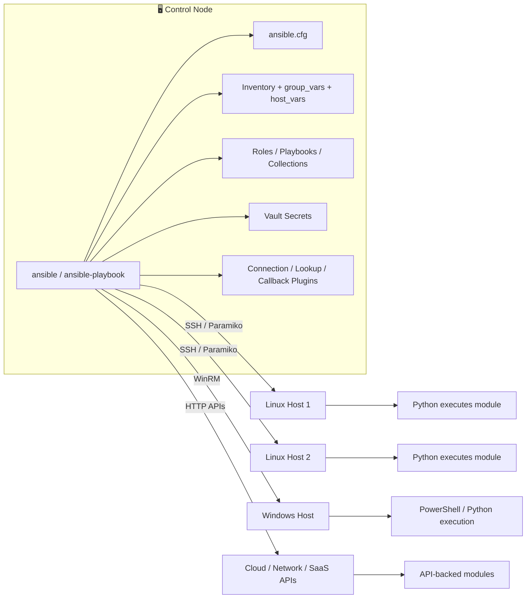
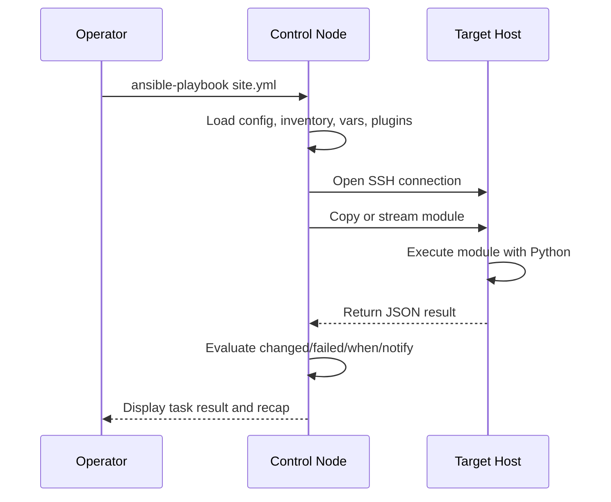
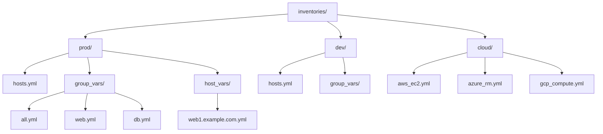
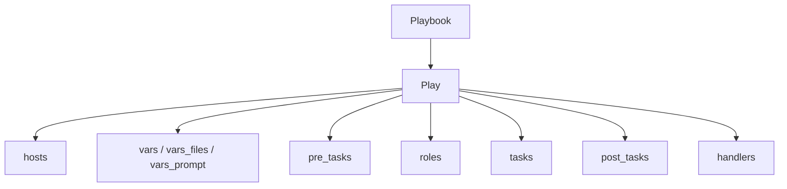
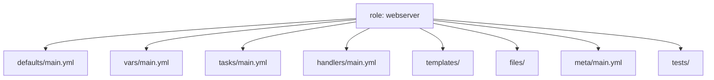
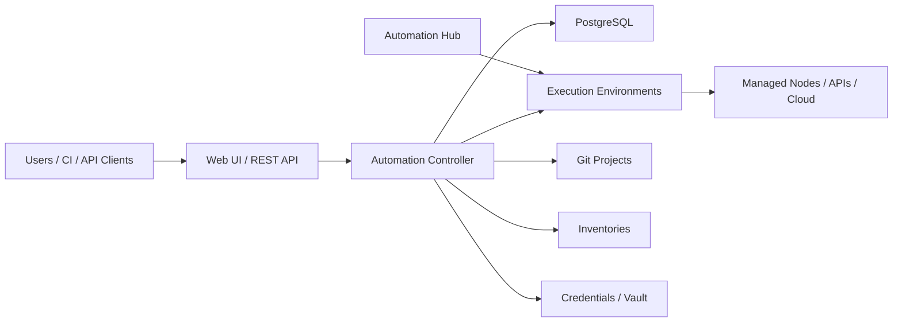
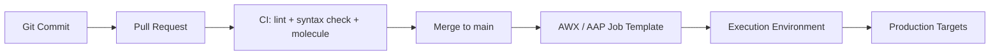
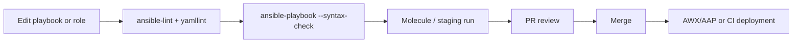

# 🚀 Ansible Deep Dive

[Back to guide index](README.md)

> The most comprehensive Ansible guide in this repository.
> It is designed to stand on its own as a practical reference, a learning path, and a copy-paste-ready operations handbook.

## 🗺️ Guide Map

This guide is organized as a full journey from fundamentals to production automation.

- Ansible fundamentals and architecture
- Inventory design for static and dynamic environments
- Ad-hoc command patterns for day-2 operations
- Playbook design, variables, facts, handlers, loops, and error handling
- Roles, Galaxy, collections, and reusable project layouts
- Vault, secrets management, AWX/Tower/AAP, and advanced plugin development
- Real-world playbooks for provisioning, patching, deployment, security, and monitoring
- Best practices, troubleshooting, and a final cheat sheet

## 📚 Table of Contents

- 1. [Ansible Fundamentals](#-1-ansible-fundamentals)
- 2. [Inventory Management](#-2-inventory-management)
- 3. [Ad-Hoc Commands](#-3-ad-hoc-commands)
- 4. [Playbooks](#-4-playbooks)
- 5. [Roles](#-5-roles)
- 6. [Ansible Vault](#-6-ansible-vault)
- 7. [Ansible Galaxy & Collections](#-7-ansible-galaxy--collections)
- 8. [AWX / Ansible Tower / AAP](#-8-awx--ansible-tower--aap)
- 9. [Advanced Ansible](#-9-advanced-ansible)
- 10. [Real-World Ansible Projects](#-10-real-world-ansible-projects)
- 11. [Ansible Best Practices](#-11-ansible-best-practices)
- 12. [Ansible Cheat Sheet](#-12-ansible-cheat-sheet)
- 13. [Appendices](#-appendices)

## 🧠 1. Ansible Fundamentals

### ✅ What is Ansible?

Ansible is an agentless automation platform used for configuration management, application deployment, orchestration, security hardening, patching, and operational workflows.

It describes desired state in human-readable YAML and relies on reusable modules instead of long shell scripts.

Ansible can automate single-server tasks, entire fleets, network devices, cloud resources, Kubernetes workflows, and multi-step application rollouts.

### 🎯 Why Ansible?

- Readable: YAML playbooks are easier to review than imperative shell loops.
- Agentless by default: SSH and existing credentials are often enough to start.
- Idempotent: well-written modules converge hosts to the desired state safely.
- Incremental adoption: teams can begin with ad-hoc commands before building full roles.
- Cross-domain: the same tool can manage Linux, Windows, cloud, containers, and network devices.
- Ecosystem rich: thousands of built-in and community modules, roles, and collections are available.
- Operationally friendly: inventories, tags, check mode, diff mode, handlers, and serial execution make it suitable for production change windows.

### 🧩 Agentless architecture explained

In the default model, the control node connects to managed nodes over SSH for Linux or WinRM for Windows.

The control node transfers a small Python-based module or raw command, executes it remotely, reads JSON output, and then removes temporary files.

Because there is no long-running agent on each target, operations teams avoid agent lifecycle management, certificate rotation burdens, and background daemon troubleshooting on every node.

Agentless does not mean dependency-free.

Managed Linux nodes still need SSH access and usually Python so Ansible modules can run reliably.

### ⚙️ How Ansible works: SSH + Python execution model

1. The operator invokes `ansible` or `ansible-playbook` from the control node.
1. Ansible loads configuration from `ansible.cfg`, environment variables, CLI flags, and project defaults.
1. The inventory is parsed and target hosts are selected through patterns such as `web:&prod:!drain`.
1. For each task, Ansible loads the module and task parameters, then opens a transport connection to the target host.
1. The module is copied to a temporary directory on the remote node unless pipelining is enabled and supported.
1. Python on the remote node executes the module and returns structured JSON output.
1. Ansible interprets `changed`, `failed`, `stdout`, `stderr`, facts, and return values.
1. Handlers may be notified if a task reports a change.
1. At the end of the run, Ansible prints a per-host recap summarizing `ok`, `changed`, `unreachable`, `failed`, `rescued`, and `ignored` counts.

### 🏗️ Architecture diagram



### 🔄 Task execution lifecycle



### 🆚 Ansible vs Puppet vs Chef vs SaltStack

| Tool | Agent Model | Execution Model | Primary Language | Learning Curve | Typical Strength |
|---|---|---|---|---|---|
| Ansible | Agentless by default | Push | YAML | Low entry barrier | SSH-based configuration, orchestration, deployments |
| Puppet | Agent-based common model | Pull | DSL | Medium | Large fleets with continuous policy enforcement |
| Chef | Agent-based common model | Pull | Ruby DSL | Medium to high | Strong developer-driven infrastructure pipelines |
| SaltStack | Often agent-based, can be agentless | Push and pull | YAML + Jinja | Medium | Fast remote execution and event-driven automation |

Use Ansible when you want quick adoption, readable automation, strong Linux support, and a balance between configuration management and orchestration.

Use Puppet or Chef when strict continuous convergence with agents is a better fit than task-oriented push automation.

Use SaltStack when you need very fast command execution, event-driven reactions, or deep integration with the Salt ecosystem.

### 💽 Installing Ansible

#### RHEL / Rocky / AlmaLinux

```bash
sudo dnf install -y epel-release
sudo dnf install -y ansible-core
ansible --version
```

#### Ubuntu / Debian

```bash
sudo apt update
sudo apt install -y software-properties-common
sudo apt install -y ansible
ansible --version
```

#### Using pip

```bash
python3 -m pip install --user --upgrade pip
python3 -m pip install --user ansible
~/.local/bin/ansible --version
```

#### Recommended package choices

| Package | When to use it | Notes |
|---|---|---|
| `ansible-core` | You want the lean engine and will install collections explicitly | Smaller footprint, ideal for automation runners |
| `ansible` | You want a batteries-included community package | Includes many common collections |
| pip install in virtualenv | You need version pinning per project | Best for CI/CD and reproducible tooling |

### 🛠️ `ansible.cfg` deep dive

Ansible reads configuration in a well-defined order.

| Priority | Location | Typical use |
|---|---|---|
| 1 | `ANSIBLE_CONFIG` environment variable | Explicitly point a run to a specific configuration file |
| 2 | `./ansible.cfg` | Project-local configuration and the most common team choice |
| 3 | `~/.ansible.cfg` | User-specific defaults |
| 4 | `/etc/ansible/ansible.cfg` | System-wide fallback |

```ini
[defaults]
inventory = inventories/prod/hosts.yml
remote_user = automation
gathering = smart
fact_caching = jsonfile
fact_caching_connection = .fact_cache
fact_caching_timeout = 86400
forks = 25
host_key_checking = True
retry_files_enabled = False
stdout_callback = yaml
callbacks_enabled = profile_tasks,timer
interpreter_python = auto_silent
roles_path = roles:vendor/roles
collections_path = collections:~/.ansible/collections
vault_identity_list = dev@~/.ansible/dev.vault.pass,prod@~/.ansible/prod.vault.pass
timeout = 30
pipelining = True

[privilege_escalation]
become = False
become_method = sudo
become_ask_pass = False

[ssh_connection]
ssh_args = -o ControlMaster=auto -o ControlPersist=60s -o PreferredAuthentications=publickey
control_path = %(directory)s/%%h-%%r
pipelining = True
retries = 3
```

| Setting | Purpose | Operational advice |
|---|---|---|
| `inventory` | Default inventory source | Keep this project-relative so CI and local runs behave the same way. |
| `remote_user` | Default SSH user | Prefer inventory vars when environments differ. |
| `forks` | Parallelism level | Tune based on control node CPU, target count, and SSH limits. |
| `host_key_checking` | SSH host key enforcement | Leave enabled in production; manage known_hosts properly. |
| `retry_files_enabled` | Retry file generation | Many teams disable it in Git-tracked repos. |
| `stdout_callback` | Output format | Use `yaml` or a CI-friendly callback for readable output. |
| `callbacks_enabled` | Extra callbacks | Examples include `timer` and `profile_tasks`. |
| `roles_path` | Role search path | Useful when vendoring roles. |
| `collections_path` | Collection search path | Pin collections close to the project when possible. |
| `interpreter_python` | Remote Python discovery | Use `auto` or `auto_silent` on mixed estates. |
| `fact_caching` | Fact cache backend | Speeds up large inventories and templating-heavy runs. |
| `timeout` | Connection timeout | Increase for slower links; avoid values that mask networking issues. |
| `pipelining` | Reduces SSH operations | Improves performance but requires compatible sudo settings. |
| `vault_identity_list` | Named vault password files | Preferred for multi-environment secret isolation. |
| `gathering` | Fact gathering mode | Use `smart` with fact caching to reduce overhead. |

Configuration precedence matters.

CLI flags override configuration values, inventory variables can override connection defaults, and playbook settings can override both for individual runs.

For team projects, prefer a repository-local `ansible.cfg` so automation is reproducible.

## 🗂️ 2. Inventory Management

### 📌 What inventory does

Inventory is the source of truth that tells Ansible which hosts exist, how they are grouped, and which connection variables apply to them.

A good inventory design separates environment targeting from application logic.

### 🧱 Static inventory: INI format

```ini
[web]
web1.example.com ansible_host=10.10.10.11 http_port=80
web2.example.com ansible_host=10.10.10.12 http_port=8080

[db]
db1.example.com ansible_host=10.10.20.21 db_role=primary
db2.example.com ansible_host=10.10.20.22 db_role=replica

[prod:children]
web
db

[prod:vars]
ansible_user=automation
ansible_python_interpreter=/usr/bin/python3
ntp_server=time.example.com
```

### 🧱 Static inventory: YAML format

```yaml
all:
  vars:
    ansible_user: automation
    ansible_python_interpreter: /usr/bin/python3
  children:
    prod:
      children:
        web:
          hosts:
            web1.example.com:
              ansible_host: 10.10.10.11
              http_port: 80
            web2.example.com:
              ansible_host: 10.10.10.12
              http_port: 8080
        db:
          hosts:
            db1.example.com:
              ansible_host: 10.10.20.21
              db_role: primary
            db2.example.com:
              ansible_host: 10.10.20.22
              db_role: replica
```

### 🧬 Inventory variables: `host_vars` and `group_vars`

```text
inventories/
├── prod/
│   ├── hosts.yml
│   ├── group_vars/
│   │   ├── all.yml
│   │   ├── web.yml
│   │   └── db.yml
│   └── host_vars/
│       ├── web1.example.com.yml
│       └── db1.example.com.yml
└── dev/
    ├── hosts.yml
    └── group_vars/
        └── all.yml
```

```yaml
# inventories/prod/group_vars/all.yml
ansible_user: automation
timezone: UTC
monitoring_agent_enabled: true

# inventories/prod/group_vars/web.yml
app_name: inventory-api
app_port: 9000
web_packages:
  - nginx
  - git
  - rsync

# inventories/prod/host_vars/web1.example.com.yml
http_port: 80
enable_canary: true
```

Put shared settings in `group_vars` and only host-specific exceptions in `host_vars`.

Avoid duplicating the same variable on many hosts when a group can express the intent more clearly.

### ☁️ Dynamic inventory

Dynamic inventory lets Ansible discover infrastructure from APIs instead of maintaining long static host lists by hand.

This is essential in cloud environments where instances appear, disappear, or change addresses frequently.

#### AWS EC2 plugin example

```yaml
plugin: amazon.aws.aws_ec2
regions:
  - us-east-1  # replace with your region
filters:
  instance-state-name: running
keyed_groups:
  - key: tags.Role
    prefix: tag_role
  - key: placement.region
    prefix: aws_region
hostnames:
  - private-ip-address
compose:
  ansible_host: private_ip_address
```

#### Azure RM plugin example

```yaml
plugin: azure.azcollection.azure_rm
include_vm_resource_groups:
  - rg-prod-linux
keyed_groups:
  - prefix: azure_location
    key: location
  - prefix: azure_tag_role
    key: tags.role
conditional_groups:
  prod: tags.environment == 'prod'
plain_host_names: true
```

#### GCP Compute plugin example

```yaml
plugin: google.cloud.gcp_compute
projects:
  - my-prod-project
zones:
  - us-central1-a
  - us-central1-b
filters:
  - status = RUNNING
keyed_groups:
  - key: labels.role
    prefix: gcp_role
hostnames:
  - networkInterfaces[0].networkIP
compose:
  ansible_host: networkInterfaces[0].networkIP
```

Dynamic inventory plugins are regular YAML files consumed with `-i inventory.aws_ec2.yml` or via `ansible.cfg`.

### 🎯 Patterns for targeting hosts

| Pattern | Meaning |
|---|---|
| `all` | Every host in the inventory |
| `web` | All hosts in the `web` group |
| `web:db` | Union of `web` and `db` |
| `web:&prod` | Hosts that are both in `web` and `prod` |
| `all:!drain` | All hosts except those in `drain` |
| `web[0]` | First host in group order |
| `web[0:2]` | First three hosts from the group |
| `*.example.com` | Wildcard match |
| `~web[0-9]+` | Regex pattern when using advanced inventory matching |

```bash
ansible 'web:&prod' -i inventories/prod/hosts.yml -m ping
ansible 'all:!drain' -i inventories/prod/hosts.yml -a 'uptime'
ansible 'web[0:2]' -i inventories/prod/hosts.yml -b -m service -a 'name=nginx state=restarted'
```

### 🧩 Multiple inventory sources

Ansible can merge multiple inventory sources.

```bash
ansible-inventory -i inventories/common -i inventories/prod --graph
ansible-playbook -i inventories/common -i inventories/prod site.yml
```

Typical use cases include combining:

- a common base inventory with environment-specific overlays
- a static inventory for legacy servers with a dynamic inventory for cloud instances
- a CMDB export with a local emergency override inventory for maintenance windows

### 🗺️ Inventory structure diagram



### 🔍 Inventory troubleshooting tips

- `ansible-inventory -i inventories/prod/hosts.yml --list` to inspect the resolved inventory as JSON.
- `ansible-inventory -i inventories/prod/hosts.yml --graph` to view group relationships quickly.
- Use `ansible -m debug -a "var=hostvars[inventory_hostname]"` to inspect host-specific variables.
- Use `ansible-config dump --only-changed` to see which configuration settings are currently active.

## ⚡ 3. Ad-Hoc Commands

### 🧰 What ad-hoc commands are for

Ad-hoc commands are single-command operations executed without creating a playbook.

They are ideal for quick inspections, emergency fixes, one-off service actions, and fleet-wide information gathering.

### 📦 Module categories and common modules

| Category | Examples | Typical use |
|---|---|---|
| Package management | `package`, `apt`, `dnf`, `yum`, `pip` | Install, remove, and update software |
| Service control | `service`, `systemd` | Start, stop, restart, enable services |
| File management | `file`, `copy`, `template`, `lineinfile`, `blockinfile` | Manage files, directories, templates, and config edits |
| Users and access | `user`, `group`, `authorized_key` | Create accounts and manage SSH access |
| Commands | `command`, `shell`, `raw`, `script` | Execute commands when no better module exists |
| Facts and debugging | `setup`, `debug`, `assert` | Inspect state and validate assumptions |
| Networking and security | `firewalld`, `ufw`, `seboolean`, `selinux` | Manage security posture |
| Cloud and APIs | `amazon.aws.*`, `azure.azcollection.*`, `google.cloud.*` | Provision and manage cloud resources |

### 🧪 Ad-hoc command anatomy

```bash
ansible <pattern> -i <inventory> [options] -m <module> -a '<module arguments>'
```

Common options include `-b` for become, `-u` for SSH user, `-f` for forks, `-l` for limit, and `-e` for extra vars.

### 🔐 Privilege escalation

```bash
ansible web -i inventories/prod/hosts.yml -b -m package -a 'name=nginx state=present'
ansible db -i inventories/prod/hosts.yml -b --become-user postgres -m shell -a 'psql -c "SELECT version();"'
```

Set `become: true` in playbooks for repeatable privilege escalation and reserve CLI flags for quick operational tasks.

### 🚦 Parallelism and forks

Ad-hoc commands run in parallel based on the `forks` setting or the `-f` flag.

```bash
ansible all -i inventories/prod/hosts.yml -f 50 -m ping
```

More forks improve speed only if the control node, network, and targets can handle the concurrency.

For very large fleets, combine forks with `--limit` or inventory partitions to avoid overwhelming bastion hosts and package repositories.

### 🧾 26 ad-hoc command examples

#### Example 01: Ping all managed nodes

```bash
ansible all -i inventories/prod/hosts.yml -m ping
```

- Why it matters: Connectivity verification and Python availability check.

- Operational tip: verify inventory targeting before destructive actions and add `--limit` for safety during emergency runs.

#### Example 02: Gather uptime from all nodes

```bash
ansible all -i inventories/prod/hosts.yml -a 'uptime'
```

- Why it matters: Fast health check across the fleet.

- Operational tip: verify inventory targeting before destructive actions and add `--limit` for safety during emergency runs.

#### Example 03: Check free disk space

```bash
ansible all -i inventories/prod/hosts.yml -a 'df -h /'
```

- Why it matters: Useful before deployments and patching.

- Operational tip: verify inventory targeting before destructive actions and add `--limit` for safety during emergency runs.

#### Example 04: Gather memory summary

```bash
ansible all -i inventories/prod/hosts.yml -a 'free -m'
```

- Why it matters: Spot memory pressure quickly.

- Operational tip: verify inventory targeting before destructive actions and add `--limit` for safety during emergency runs.

#### Example 05: Collect only hostname facts

```bash
ansible all -i inventories/prod/hosts.yml -m setup -a 'filter=ansible_hostname'
```

- Why it matters: Lighter than full fact gathering.

- Operational tip: verify inventory targeting before destructive actions and add `--limit` for safety during emergency runs.

#### Example 06: Install nginx on web nodes

```bash
ansible web -i inventories/prod/hosts.yml -b -m package -a 'name=nginx state=present'
```

- Why it matters: Prefer module-driven package management.

- Operational tip: verify inventory targeting before destructive actions and add `--limit` for safety during emergency runs.

#### Example 07: Restart nginx service

```bash
ansible web -i inventories/prod/hosts.yml -b -m service -a 'name=nginx state=restarted'
```

- Why it matters: Idempotent service action.

- Operational tip: verify inventory targeting before destructive actions and add `--limit` for safety during emergency runs.

#### Example 08: Enable and start chronyd

```bash
ansible all -i inventories/prod/hosts.yml -b -m systemd -a 'name=chronyd state=started enabled=true'
```

- Why it matters: Good baseline control pattern.

- Operational tip: verify inventory targeting before destructive actions and add `--limit` for safety during emergency runs.

#### Example 09: Create an operations user

```bash
ansible all -i inventories/prod/hosts.yml -b -m user -a 'name=opsadmin shell=/bin/bash groups=wheel append=true state=present'
```

- Why it matters: Safe user management without shell scripting.

- Operational tip: verify inventory targeting before destructive actions and add `--limit` for safety during emergency runs.

#### Example 10: Push an SSH key

```bash
ansible all -i inventories/prod/hosts.yml -b -m authorized_key -a 'user=opsadmin key=https://github.com/example.keys state=present'
```

- Why it matters: Bootstrap fleet access quickly.

- Operational tip: verify inventory targeting before destructive actions and add `--limit` for safety during emergency runs.

#### Example 11: Ensure a directory exists

```bash
ansible all -i inventories/prod/hosts.yml -b -m file -a 'path=/opt/app state=directory owner=root group=root mode=0755'
```

- Why it matters: Common for application layout preparation.

- Operational tip: verify inventory targeting before destructive actions and add `--limit` for safety during emergency runs.

#### Example 12: Remove a stale file

```bash
ansible all -i inventories/prod/hosts.yml -b -m file -a 'path=/opt/support/old-release.tgz state=absent'
```

- Why it matters: Cleanup action across many hosts.

- Operational tip: verify inventory targeting before destructive actions and add `--limit` for safety during emergency runs.

#### Example 13: Copy a static config file

```bash
ansible web -i inventories/prod/hosts.yml -b -m copy -a 'src=files/nginx.conf dest=/etc/nginx/nginx.conf owner=root group=root mode=0644'
```

- Why it matters: Works when templating is not required.

- Operational tip: verify inventory targeting before destructive actions and add `--limit` for safety during emergency runs.

#### Example 14: Patch a single line in a config

```bash
ansible all -i inventories/prod/hosts.yml -b -m lineinfile -a 'path=/etc/ssh/sshd_config regexp=^PermitRootLogin line=PermitRootLogin no'
```

- Why it matters: One-line remediations are a classic `lineinfile` use case.

- Operational tip: verify inventory targeting before destructive actions and add `--limit` for safety during emergency runs.

#### Example 15: Insert a managed config block

```bash
ansible all -i inventories/prod/hosts.yml -b -m blockinfile -a 'path=/etc/motd block=Managed\ by\ Ansible'
```

- Why it matters: Clearly marks automation-managed text.

- Operational tip: verify inventory targeting before destructive actions and add `--limit` for safety during emergency runs.

#### Example 16: Fetch a file from remote hosts

```bash
ansible db -i inventories/prod/hosts.yml -b -m fetch -a 'src=/etc/my.cnf dest=artifacts/ flat=false'
```

- Why it matters: Useful for audits and incident response.

- Operational tip: verify inventory targeting before destructive actions and add `--limit` for safety during emergency runs.

#### Example 17: Run a shell pipeline

```bash
ansible all -i inventories/prod/hosts.yml -b -m shell -a 'journalctl -u nginx --since today | tail -n 20'
```

- Why it matters: Use `shell` only when shell features are actually needed.

- Operational tip: verify inventory targeting before destructive actions and add `--limit` for safety during emergency runs.

#### Example 18: Execute a non-shell command safely

```bash
ansible all -i inventories/prod/hosts.yml -m command -a 'cat /etc/os-release'
```

- Why it matters: Preferred over `shell` for simple commands.

- Operational tip: verify inventory targeting before destructive actions and add `--limit` for safety during emergency runs.

#### Example 19: Use raw to bootstrap Python

```bash
ansible new_hosts -i inventories/bootstrap.ini -m raw -a 'dnf install -y python3'
```

- Why it matters: Helpful on minimal images before normal modules can run.

- Operational tip: verify inventory targeting before destructive actions and add `--limit` for safety during emergency runs.

#### Example 20: Reboot a patch window batch

```bash
ansible app -i inventories/prod/hosts.yml -b -m reboot -a 'reboot_timeout=900 test_command=whoami'
```

- Why it matters: Handles disconnect and reconnection cleanly.

- Operational tip: verify inventory targeting before destructive actions and add `--limit` for safety during emergency runs.

#### Example 21: Mount a filesystem

```bash
ansible storage -i inventories/prod/hosts.yml -b -m mount -a 'path=/data src=/dev/vdb fstype=xfs state=mounted'
```

- Why it matters: Persistent mount management.

- Operational tip: verify inventory targeting before destructive actions and add `--limit` for safety during emergency runs.

#### Example 22: Toggle firewalld service rule

```bash
ansible web -i inventories/prod/hosts.yml -b -m ansible.posix.firewalld -a 'service=http permanent=true state=enabled immediate=true'
```

- Why it matters: Service-oriented firewall management.

- Operational tip: verify inventory targeting before destructive actions and add `--limit` for safety during emergency runs.

#### Example 23: Archive logs on remote hosts

```bash
ansible all -i inventories/prod/hosts.yml -b -m community.general.archive -a 'path=/var/log/nginx dest=/root/nginx-logs.tgz format=gz'
```

- Why it matters: Fast evidence capture.

- Operational tip: verify inventory targeting before destructive actions and add `--limit` for safety during emergency runs.

#### Example 24: Schedule a cron job

```bash
ansible backup -i inventories/prod/hosts.yml -b -m cron -a 'name=db-backup minute=0 hour=2 user=root job=/usr/local/bin/db-backup.sh'
```

- Why it matters: Ad-hoc cron creation when formal playbooks are not yet available.

- Operational tip: verify inventory targeting before destructive actions and add `--limit` for safety during emergency runs.

#### Example 25: Display a variable for a group

```bash
ansible web -i inventories/prod/hosts.yml -m debug -a 'var=hostvars[inventory_hostname].http_port'
```

- Why it matters: Inspect resolved inventory values.

- Operational tip: verify inventory targeting before destructive actions and add `--limit` for safety during emergency runs.

#### Example 26: Run with high parallelism

```bash
ansible all -i inventories/prod/hosts.yml -f 100 -m ping
```

- Why it matters: Stress-test connectivity or accelerate a broad read-only task.

- Operational tip: verify inventory targeting before destructive actions and add `--limit` for safety during emergency runs.

## 📘 4. Playbooks

### 📝 YAML syntax essentials

- YAML is indentation-sensitive. Use spaces, never tabs.
- Lists begin with `-` and mappings use `key: value` syntax.
- Quote strings when they contain special characters, colons, or Jinja expressions that might be ambiguous.
- Boolean values should be written consistently as `true` and `false` in modern playbooks.
- Each playbook should start with `---` for clarity.

```yaml
---
- name: Minimal playbook example
  hosts: web
  become: true
  tasks:
    - name: Ensure nginx is installed
      ansible.builtin.package:
        name: nginx
        state: present
```

### 🏗️ Playbook structure



```yaml
---
- name: Full play skeleton
  hosts: app
  become: true
  gather_facts: true
  vars_files:
    - vars/common.yml
  vars:
    release_path: /opt/myapp
  pre_tasks:
    - name: Validate required variable
      ansible.builtin.assert:
        that:
          - app_version is defined
  roles:
    - role: baseline
  tasks:
    - name: Main task placeholder
      ansible.builtin.debug:
        msg: "Deploying version {{ app_version }}"
  post_tasks:
    - name: Post deployment summary
      ansible.builtin.debug:
        msg: "Deployment complete on {{ inventory_hostname }}"
  handlers:
    - name: Restart app
      ansible.builtin.service:
        name: myapp
        state: restarted
```

### 🧮 Variables

#### Play vars

```yaml
vars:
  app_name: billing-api
  app_port: 8080
  app_user: billing
```

#### vars_files

```yaml
vars_files:
  - vars/common.yml
  - vars/{{ env }}.yml
```

#### vars_prompt

```yaml
vars_prompt:
  - name: release_version
    prompt: "Enter the release version"
    private: false
  - name: db_password
    prompt: "Enter the database password"
    private: true
```

#### Registered variables

```yaml
- name: Check current application version
  ansible.builtin.command: /opt/myapp/bin/version
  register: app_version_cmd
  changed_when: false

- name: Display current version
  ansible.builtin.debug:
    var: app_version_cmd.stdout
```

Registered variables are task outputs, not static inventory values.

They frequently contain `stdout`, `stderr`, `rc`, `changed`, and module-specific keys.

### 🧠 Facts and magic variables

```yaml
- name: Show selected facts
  ansible.builtin.debug:
    msg:
      - "Host: {{ inventory_hostname }}"
      - "OS family: {{ ansible_facts['os_family'] }}"
      - "Default IPv4: {{ ansible_facts['default_ipv4']['address'] | default('n/a') }}"
      - "Group names: {{ group_names | join(', ') }}"
```

| Magic variable | Use |
|---|---|
| `inventory_hostname` | Current host as defined in inventory |
| `ansible_facts` | Dictionary of gathered facts |
| `hostvars` | Cross-host variable access |
| `groups` | All groups and their host members |
| `group_names` | Groups for the current host |
| `play_hosts` | Hosts still active in the current play |
| `ansible_play_batch` | Current serial batch |
| `role_path` | Current role directory |

### 🧪 Conditionals with `when`

```yaml
- name: Install Apache on Debian family systems
  ansible.builtin.apt:
    name: apache2
    state: present
  when: ansible_facts['os_family'] == 'Debian'

- name: Install httpd on Red Hat family systems
  ansible.builtin.dnf:
    name: httpd
    state: present
  when: ansible_facts['os_family'] == 'RedHat'
```

Conditionals can test variables, facts, command results, membership in groups, and Jinja expressions.

### 🔁 Loops: `loop`, `with_items`, and `with_dict`

```yaml
- name: Install baseline packages with loop
  ansible.builtin.package:
    name: "{{ item }}"
    state: present
  loop:
    - vim
    - curl
    - git

- name: Legacy with_items example
  ansible.builtin.user:
    name: "{{ item }}"
    state: present
  with_items:
    - alice
    - bob

- name: Legacy with_dict example
  ansible.builtin.debug:
    msg: "{{ item.key }} -> {{ item.value }}"
  with_dict:
    app_port: 8080
    app_env: prod
```

Modern playbooks should prefer `loop`, but understanding the older `with_*` style is still useful when reading existing automation.

### 🔔 Handlers and notifications

```yaml
- name: Deploy nginx configuration
  ansible.builtin.template:
    src: nginx.conf.j2
    dest: /etc/nginx/nginx.conf
    owner: root
    group: root
    mode: '0644'
  notify:
    - Restart nginx

handlers:
  - name: Restart nginx
    ansible.builtin.service:
      name: nginx
      state: restarted
```

Handlers run once per host at the end of a play unless `meta: flush_handlers` is used.

### 🏷️ Tags

```yaml
- name: Install packages
  ansible.builtin.package:
    name: rsync
    state: present
  tags:
    - packages
    - baseline

- name: Restart application
  ansible.builtin.service:
    name: myapp
    state: restarted
  tags:
    - restart
```

```bash
ansible-playbook site.yml --tags packages
ansible-playbook site.yml --skip-tags restart
```

### 🧯 Error handling

```yaml
- name: Demonstrate block rescue always
  hosts: app
  become: true
  tasks:
    - name: Deployment block
      block:
        - name: Stop service
          ansible.builtin.service:
            name: myapp
            state: stopped

        - name: Unpack release
          ansible.builtin.unarchive:
            src: releases/myapp.tar.gz
            dest: /opt/myapp
            remote_src: false

        - name: Start service
          ansible.builtin.service:
            name: myapp
            state: started
      rescue:
        - name: Restore previous symlink
          ansible.builtin.file:
            src: /opt/releases/previous
            dest: /opt/myapp/current
            state: link
            force: true

        - name: Restart previous version
          ansible.builtin.service:
            name: myapp
            state: restarted
      always:
        - name: Emit deployment status
          ansible.builtin.debug:
            msg: "Deployment workflow finished on {{ inventory_hostname }}"
```

```yaml
- name: Ignore an expected non-critical failure
  ansible.builtin.command: /usr/local/bin/non-critical-check
  register: check_result
  ignore_errors: true
  changed_when: false

- name: Fail only if disk use exceeds threshold
  ansible.builtin.command: /bin/sh -c "df -P / | awk 'NR==2 {print $5}' | tr -d '%'"
  register: disk_pct
  changed_when: false
  failed_when: disk_pct.stdout | int > 90
```

### 🧵 Templates with Jinja2

```jinja2
server {
    listen {{ http_port }};
    server_name {{ server_name }};

    location /health {
        return 200 'ok';
    }

    location / {
        proxy_pass http://127.0.0.1:{{ app_port }};
        proxy_set_header Host $host;
        proxy_set_header X-Real-IP $remote_addr;
        proxy_set_header X-Forwarded-For $proxy_add_x_forwarded_for;
    }
}
```

```yaml
- name: Render site configuration
  ansible.builtin.template:
    src: templates/site.conf.j2
    dest: /etc/nginx/conf.d/site.conf
    owner: root
    group: root
    mode: '0644'
  notify: Restart nginx
```

### 🧩 Include and import

```yaml
- name: Static import
  import_tasks: tasks/packages.yml

- name: Dynamic include based on OS family
  include_tasks: "tasks/{{ ansible_facts['os_family'] | lower }}.yml"
```

`import_*` is parsed statically at playbook load time.

`include_*` is dynamic and can depend on runtime values such as facts and registered variables.

### 📦 12 complete playbook examples

#### Playbook Example 01: Bootstrap Python on minimal hosts

```yaml
---
- name: Bootstrap Python on minimal images
  hosts: bootstrap
  gather_facts: false
  become: true
  tasks:
    - name: Install Python on RHEL-like systems
      ansible.builtin.raw: test -e /usr/bin/python3 || (dnf install -y python3 || yum install -y python3)
      changed_when: false

    - name: Install Python on Debian-like systems
      ansible.builtin.raw: test -e /usr/bin/python3 || (apt-get update && apt-get install -y python3)
      changed_when: false

    - name: Gather facts after Python installation
      ansible.builtin.setup:
```

- Review note: test each example with `--check` when the involved modules support check mode, and use tags when integrating the example into larger site playbooks.

#### Playbook Example 02: Configure baseline packages and timezone

```yaml
---
- name: Configure baseline packages and timezone
  hosts: all
  become: true
  vars:
    baseline_packages:
      - vim
      - curl
      - git
      - rsync
  tasks:
    - name: Install baseline packages
      ansible.builtin.package:
        name: "{{ baseline_packages }}"
        state: present

    - name: Set system timezone
      community.general.timezone:
        name: UTC

    - name: Ensure chronyd is enabled
      ansible.builtin.service:
        name: chronyd
        state: started
        enabled: true
```

- Review note: test each example with `--check` when the involved modules support check mode, and use tags when integrating the example into larger site playbooks.

#### Playbook Example 03: Deploy Nginx with a reverse proxy site

```yaml
---
- name: Deploy nginx reverse proxy
  hosts: web
  become: true
  vars:
    app_port: 9000
    server_name: "{{ inventory_hostname }}"
    http_port: 80
  tasks:
    - name: Install nginx
      ansible.builtin.package:
        name: nginx
        state: present

    - name: Deploy nginx site config
      ansible.builtin.template:
        src: templates/site.conf.j2
        dest: /etc/nginx/conf.d/site.conf
        mode: '0644'
      notify: Restart nginx

    - name: Ensure nginx is running
      ansible.builtin.service:
        name: nginx
        state: started
        enabled: true
  handlers:
    - name: Restart nginx
      ansible.builtin.service:
        name: nginx
        state: restarted
```

- Review note: test each example with `--check` when the involved modules support check mode, and use tags when integrating the example into larger site playbooks.

#### Playbook Example 04: Deploy a systemd application release

```yaml
---
- name: Deploy application release
  hosts: app
  become: true
  vars:
    release_version: "1.4.2"
    release_archive: "files/myapp-{{ release_version }}.tar.gz"
    release_dir: "/opt/releases/{{ release_version }}"
  tasks:
    - name: Create release directory
      ansible.builtin.file:
        path: "{{ release_dir }}"
        state: directory
        owner: root
        group: root
        mode: '0755'

    - name: Extract release archive
      ansible.builtin.unarchive:
        src: "{{ release_archive }}"
        dest: "{{ release_dir }}"
        remote_src: false

    - name: Update current symlink
      ansible.builtin.file:
        src: "{{ release_dir }}"
        dest: /opt/myapp/current
        state: link
        force: true
      notify: Restart myapp

  handlers:
    - name: Restart myapp
      ansible.builtin.service:
        name: myapp
        state: restarted
```

- Review note: test each example with `--check` when the involved modules support check mode, and use tags when integrating the example into larger site playbooks.

#### Playbook Example 05: Create users and manage SSH keys

```yaml
---
- name: Manage users and SSH keys
  hosts: all
  become: true
  vars:
    managed_users:
      - name: alice
        groups: ['wheel']
        key: "ssh-ed25519 AAAA... alice@example"
      - name: bob
        groups: ['developers']
        key: "ssh-ed25519 AAAA... bob@example"
  tasks:
    - name: Ensure groups exist
      ansible.builtin.group:
        name: "{{ item }}"
        state: present
      loop:
        - wheel
        - developers

    - name: Create users
      ansible.builtin.user:
        name: "{{ item.name }}"
        groups: "{{ item.groups | join(',') }}"
        append: true
        shell: /bin/bash
        state: present
      loop: "{{ managed_users }}"

    - name: Install authorized keys
      ansible.builtin.authorized_key:
        user: "{{ item.name }}"
        key: "{{ item.key }}"
        state: present
      loop: "{{ managed_users }}"
```

- Review note: test each example with `--check` when the involved modules support check mode, and use tags when integrating the example into larger site playbooks.

#### Playbook Example 06: Perform rolling patching with serial execution

```yaml
---
- name: Patch application servers in batches
  hosts: app
  become: true
  serial: 2
  tasks:
    - name: Drain node from load balancer
      ansible.builtin.command: /usr/local/bin/lbctl drain {{ inventory_hostname }}
      delegate_to: localhost
      changed_when: true

    - name: Update packages
      ansible.builtin.package:
        name: '*'
        state: latest

    - name: Reboot if needed
      ansible.builtin.reboot:
        reboot_timeout: 1800

    - name: Wait for application health
      ansible.builtin.uri:
        url: "http://{{ ansible_host | default(inventory_hostname) }}:8080/health"
        status_code: 200
      register: health_result
      retries: 20
      delay: 15
      until: health_result.status == 200

    - name: Return node to load balancer
      ansible.builtin.command: /usr/local/bin/lbctl enable {{ inventory_hostname }}
      delegate_to: localhost
      changed_when: true
```

- Review note: test each example with `--check` when the involved modules support check mode, and use tags when integrating the example into larger site playbooks.

#### Playbook Example 07: Manage firewall rules

```yaml
---
- name: Configure firewall rules for web servers
  hosts: web
  become: true
  tasks:
    - name: Open HTTP service
      ansible.posix.firewalld:
        service: http
        permanent: true
        state: enabled
        immediate: true

    - name: Open HTTPS service
      ansible.posix.firewalld:
        service: https
        permanent: true
        state: enabled
        immediate: true

    - name: Ensure firewalld is running
      ansible.builtin.service:
        name: firewalld
        state: started
        enabled: true
```

- Review note: test each example with `--check` when the involved modules support check mode, and use tags when integrating the example into larger site playbooks.

#### Playbook Example 08: Schedule backups with cron

```yaml
---
- name: Configure scheduled backups
  hosts: db
  become: true
  tasks:
    - name: Install backup script
      ansible.builtin.copy:
        src: files/db-backup.sh
        dest: /usr/local/bin/db-backup.sh
        owner: root
        group: root
        mode: '0750'

    - name: Create backup cron job
      ansible.builtin.cron:
        name: mysql-nightly-backup
        minute: '0'
        hour: '2'
        user: root
        job: /usr/local/bin/db-backup.sh
```

- Review note: test each example with `--check` when the involved modules support check mode, and use tags when integrating the example into larger site playbooks.

#### Playbook Example 09: Audit configuration drift

```yaml
---
- name: Audit critical configuration files
  hosts: all
  become: true
  tasks:
    - name: Check sshd config permissions
      ansible.builtin.stat:
        path: /etc/ssh/sshd_config
      register: sshd_stat

    - name: Assert secure permissions
      ansible.builtin.assert:
        that:
          - sshd_stat.stat.exists
          - sshd_stat.stat.pw_name == 'root'
          - sshd_stat.stat.mode == '0600' or sshd_stat.stat.mode == '0644'
        fail_msg: "Unexpected sshd_config ownership or mode"

    - name: Show audit result
      ansible.builtin.debug:
        msg: "sshd_config validated on {{ inventory_hostname }}"
```

- Review note: test each example with `--check` when the involved modules support check mode, and use tags when integrating the example into larger site playbooks.

#### Playbook Example 10: Deploy maintenance page during release

```yaml
---
- name: Toggle maintenance page
  hosts: web
  become: true
  vars:
    maintenance_enabled: true
  tasks:
    - name: Deploy maintenance page when enabled
      ansible.builtin.copy:
        src: files/maintenance.html
        dest: /usr/share/nginx/html/maintenance.html
        mode: '0644'
      when: maintenance_enabled

    - name: Enable maintenance config
      ansible.builtin.file:
        src: /etc/nginx/conf.d/maintenance.conf.enabled
        dest: /etc/nginx/conf.d/maintenance.conf
        state: link
        force: true
      when: maintenance_enabled
      notify: Reload nginx

    - name: Disable maintenance config
      ansible.builtin.file:
        path: /etc/nginx/conf.d/maintenance.conf
        state: absent
      when: not maintenance_enabled
      notify: Reload nginx
  handlers:
    - name: Reload nginx
      ansible.builtin.service:
        name: nginx
        state: reloaded
```

- Review note: test each example with `--check` when the involved modules support check mode, and use tags when integrating the example into larger site playbooks.

#### Playbook Example 11: Deploy container runtime

```yaml
---
- name: Install Podman runtime
  hosts: container_hosts
  become: true
  tasks:
    - name: Install podman packages
      ansible.builtin.package:
        name:
          - podman
          - podman-docker
        state: present

    - name: Enable podman socket
      ansible.builtin.systemd:
        name: podman.socket
        state: started
        enabled: true
```

- Review note: test each example with `--check` when the involved modules support check mode, and use tags when integrating the example into larger site playbooks.

#### Playbook Example 12: Run database backup and fetch artifact metadata

```yaml
---
- name: Run database backup and report artifact
  hosts: db_primary
  become: true
  tasks:
    - name: Execute backup command
      ansible.builtin.command: /usr/local/bin/create-backup.sh
      register: backup_cmd
      changed_when: true

    - name: Parse generated artifact path
      ansible.builtin.set_fact:
        backup_artifact: "{{ backup_cmd.stdout_lines[-1] }}"

    - name: Display backup artifact
      ansible.builtin.debug:
        msg: "Backup created at {{ backup_artifact }}"
```

- Review note: test each example with `--check` when the involved modules support check mode, and use tags when integrating the example into larger site playbooks.

## 🧱 5. Roles

### 📁 Role directory structure

```text
roles/
└── webserver/
    ├── defaults/
    │   └── main.yml
    ├── files/
    │   └── index.html
    ├── handlers/
    │   └── main.yml
    ├── meta/
    │   └── main.yml
    ├── tasks/
    │   └── main.yml
    ├── templates/
    │   └── site.conf.j2
    ├── tests/
    │   ├── inventory
    │   └── test.yml
    └── vars/
        └── main.yml
```



### 🛠️ Creating roles

```bash
ansible-galaxy role init roles/webserver
```

Roles package tasks, defaults, handlers, templates, files, and metadata into a reusable unit.

### 🌌 Galaxy roles

```bash
ansible-galaxy install geerlingguy.nginx -p roles
```

Review external roles before production use, pin versions, and prefer vendored requirements for repeatable builds.

### 🔗 Role dependencies

```yaml
# roles/webserver/meta/main.yml
---
dependencies:
  - role: baseline
  - role: firewalld
    vars:
      firewalld_services:
        - http
        - https
```

### ⚖️ Default variables vs role variables

| Location | Intended use | Precedence profile |
|---|---|---|
| `defaults/main.yml` | Safe, user-overridable defaults | Low precedence |
| `vars/main.yml` | Internal constants that should rarely change | High precedence |

Prefer `defaults` for tunable values such as ports, package lists, and feature flags.

Reserve `vars` for OS mapping tables, immutable role internals, or values that must not be overridden casually.

### 🌐 Complete role example: web server setup

#### Role tree

```text
roles/
└── webserver/
    ├── defaults/
    │   └── main.yml
    ├── handlers/
    │   └── main.yml
    ├── meta/
    │   └── main.yml
    ├── tasks/
    │   └── main.yml
    ├── templates/
    │   └── site.conf.j2
    └── vars/
        └── main.yml
```

#### `defaults/main.yml`

```yaml
---
webserver_package_name: nginx
webserver_service_name: nginx
webserver_document_root: /usr/share/nginx/html
webserver_http_port: 80
webserver_server_name: "{{ inventory_hostname }}"
webserver_index_content: |
  <html>
    <body>
      <h1>Managed by Ansible</h1>
      <p>Host: {{ inventory_hostname }}</p>
    </body>
  </html>
```

#### `vars/main.yml`

```yaml
---
webserver_config_path: /etc/nginx/conf.d/site.conf
```

#### `tasks/main.yml`

```yaml
---
- name: Install web server package
  ansible.builtin.package:
    name: "{{ webserver_package_name }}"
    state: present

- name: Ensure document root exists
  ansible.builtin.file:
    path: "{{ webserver_document_root }}"
    state: directory
    owner: root
    group: root
    mode: '0755'

- name: Deploy index page
  ansible.builtin.copy:
    dest: "{{ webserver_document_root }}/index.html"
    content: "{{ webserver_index_content }}"
    owner: root
    group: root
    mode: '0644'
  notify: Restart web service

- name: Deploy site configuration
  ansible.builtin.template:
    src: site.conf.j2
    dest: "{{ webserver_config_path }}"
    owner: root
    group: root
    mode: '0644'
  notify: Restart web service

- name: Ensure service is enabled and running
  ansible.builtin.service:
    name: "{{ webserver_service_name }}"
    state: started
    enabled: true
```

#### `handlers/main.yml`

```yaml
---
- name: Restart web service
  ansible.builtin.service:
    name: "{{ webserver_service_name }}"
    state: restarted
```

#### `templates/site.conf.j2`

```jinja2
server {
    listen {{ webserver_http_port }};
    server_name {{ webserver_server_name }};
    root {{ webserver_document_root }};

    location / {
        index index.html;
        try_files $uri $uri/ =404;
    }
}
```

#### `meta/main.yml`

```yaml
---
galaxy_info:
  role_name: webserver
  author: platform-team
  description: Configure a simple nginx web server
  license: MIT
  min_ansible_version: '2.14'
  platforms:
    - name: EL
      versions:
        - '8'
        - '9'
    - name: Ubuntu
      versions:
        - jammy
        - noble
dependencies: []
```

#### Using the role from a playbook

```yaml
---
- name: Apply webserver role
  hosts: web
  become: true
  roles:
    - role: webserver
      vars:
        webserver_http_port: 8080
```

## 🔐 6. Ansible Vault

### 🗝️ Encrypting files

```bash
ansible-vault create group_vars/prod/vault.yml
ansible-vault edit group_vars/prod/vault.yml
ansible-vault view group_vars/prod/vault.yml
ansible-vault encrypt existing-secrets.yml
ansible-vault decrypt existing-secrets.yml
ansible-vault rekey group_vars/prod/vault.yml
```

### 🔤 Encrypting strings

```bash
ansible-vault encrypt_string --vault-id prod@~/.ansible/prod.vault.pass 'SuperSecretPassword!' --name 'db_password'
```

### 📥 Using vault in playbooks

```yaml
---
- name: Use encrypted secrets
  hosts: db
  become: true
  vars_files:
    - group_vars/prod/vault.yml
  tasks:
    - name: Render database config with secret
      ansible.builtin.template:
        src: templates/db.conf.j2
        dest: /etc/myapp/db.conf
        owner: root
        group: root
        mode: '0600'
```

### 🪪 Multi-vault passwords

```bash
ansible-playbook site.yml   --vault-id dev@~/.ansible/dev.vault.pass   --vault-id prod@~/.ansible/prod.vault.pass
```

```yaml
# ansible.cfg
[defaults]
vault_identity_list = dev@~/.ansible/dev.vault.pass,prod@~/.ansible/prod.vault.pass
```

### ✅ Best practices for secrets management

- Store only secrets in Vault, not every variable. Keep encrypted files focused and readable.
- Use separate vault identities for dev, staging, and production to reduce blast radius.
- Never commit plaintext secrets, generated certificates, or password files to Git.
- Prefer CI secret stores, environment variables, or vault password files injected securely at runtime.
- Template secrets into files with restrictive permissions such as `0600`.
- Rotate vault passwords and use `ansible-vault rekey` after staff changes or incident response actions.
- Document where each secret originates and which systems consume it.

## 🌌 7. Ansible Galaxy & Collections

### 🧱 Galaxy roles

```yaml
# requirements.yml
roles:
  - name: geerlingguy.nginx
    version: 3.2.0
collections:
  - name: ansible.posix
    version: 1.5.4
  - name: community.general
    version: 9.1.0
```

```bash
ansible-galaxy install -r requirements.yml
ansible-galaxy collection install -r requirements.yml
```

### 📦 Collections concept

Collections are the modern packaging unit for modules, plugins, roles, playbooks, and documentation.

Fully qualified collection names such as `ansible.builtin.copy` or `community.general.timezone` reduce ambiguity and make dependencies explicit.

### ⬇️ Installing and using collections

```bash
ansible-galaxy collection install ansible.posix
ansible-galaxy collection install amazon.aws:==7.6.1
```

```yaml
---
- name: Use collection-backed modules
  hosts: web
  become: true
  collections:
    - ansible.posix
    - community.general
  tasks:
    - name: Open firewall rule
      ansible.posix.firewalld:
        service: http
        permanent: true
        state: enabled
        immediate: true

    - name: Set timezone
      community.general.timezone:
        name: UTC
```

### 🛠️ Creating custom collections

```bash
ansible-galaxy collection init acme.platform
```

```text
ansible_collections/
└── acme/
    └── platform/
        ├── galaxy.yml
        ├── plugins/
        │   ├── modules/
        │   │   └── hello_platform.py
        │   └── lookup/
        │       └── env_prefix.py
        └── roles/
            └── baseline/
```

```yaml
# galaxy.yml
namespace: acme
name: platform
version: 1.0.0
readme: README.md
authors:
  - Platform Team
license:
  - MIT
```

```python
#!/usr/bin/python
from ansible.module_utils.basic import AnsibleModule


def main():
    module = AnsibleModule(
        argument_spec={
            'name': {'type': 'str', 'required': True},
        }
    )
    module.exit_json(changed=False, message=f"hello {module.params['name']}")


if __name__ == '__main__':
    main()
```

Custom collections are the best long-term place for internal modules and plugins because they give you namespacing, packaging, and reusable documentation.

## 🏢 8. AWX / Ansible Tower / AAP

### ❓ What are AWX, Tower, and AAP?

AWX is the upstream open source web UI and API for managing Ansible automation centrally.

Ansible Tower was the commercial enterprise product name historically used by Red Hat.

Ansible Automation Platform (AAP) is the current commercial platform that includes automation controller, automation hub, execution environments, analytics, and enterprise support features.

### 🏗️ AWX / AAP architecture diagram



### 🧭 Installation overview

- AWX is commonly deployed on Kubernetes using the AWX Operator.
- AAP is installed through Red Hat-supported installers or operators depending on platform and version.
- Execution Environments package `ansible-core`, Python dependencies, collections, and tools into a consistent runtime container.
- Production deployments typically require PostgreSQL, ingress, persistent storage, TLS, and external authentication integration.

```bash
# Example high-level AWX operator flow
kubectl create namespace awx
kubectl apply -f https://raw.githubusercontent.com/ansible/awx-operator/devel/deploy/awx-operator.yaml -n awx
kubectl apply -f awx-custom-resource.yml -n awx
```

### 📁 Projects, inventories, and templates

| Object | Purpose | Typical source |
|---|---|---|
| Project | Automation content repository | Git repository |
| Inventory | Hosts and variables | Static file, SCM, or dynamic source |
| Credential | Access to SSH, cloud, vault, registry, SCM | Stored in controller |
| Job Template | Launch definition tying playbook + inventory + credentials together | Controller object |
| Workflow Template | Multi-job orchestration graph | Controller object |

A job template is the normal unit of execution in AWX/Tower/AAP.

It chooses the project revision, inventory, credentials, extra vars, limit, verbosity, and execution environment.

### ⏰ Job scheduling

Schedules let teams run playbooks automatically for recurring patching, audits, certificate renewals, or inventory sync jobs.

```bash
# High-level example using awx CLI if available
awx schedules create   --name nightly-patching   --rrule 'DTSTART:20240101T020000Z RRULE:FREQ=DAILY;INTERVAL=1'   --unified-job-template 42
```

### 👥 RBAC

AWX and AAP provide role-based access control so teams can separate who can view inventory, launch jobs, edit credentials, approve workflows, or administer the platform.

Typical patterns include read-only auditors, project maintainers, job launchers, and platform admins.

### 🔌 API usage

```bash
curl -k -u admin:password https://awx.example.com/api/v2/job_templates/

curl -k -u admin:password   -H 'Content-Type: application/json'   -X POST   -d '{"extra_vars": {"release_version": "2.0.1"}}'   https://awx.example.com/api/v2/job_templates/12/launch/
```

The REST API is useful for service catalogs, ChatOps launch flows, GitHub Actions, Jenkins, and event-driven automation.

### 🔁 Integration with CI/CD



```yaml
# Example GitHub Actions step invoking AWX API
- name: Launch AWX job template
  run: |
    curl -sS -u "$AWX_USER:$AWX_PASS"       -H 'Content-Type: application/json'       -X POST       -d '{"extra_vars": {"git_sha": "${{ github.sha }}"}}'       https://awx.example.com/api/v2/job_templates/12/launch/
```

## 🛠️ 9. Advanced Ansible

### 🧩 Custom modules

Custom modules are appropriate when shell commands become difficult to validate, idempotency is hard to maintain, or an internal API needs a first-class automation interface.

```python
#!/usr/bin/python
from ansible.module_utils.basic import AnsibleModule
import json
import os


def read_state(path):
    if not os.path.exists(path):
        return {}
    with open(path, 'r', encoding='utf-8') as handle:
        return json.load(handle)


def write_state(path, data):
    with open(path, 'w', encoding='utf-8') as handle:
        json.dump(data, handle, indent=2)


def main():
    module = AnsibleModule(
        argument_spec={
            'path': {'type': 'path', 'required': True},
            'key': {'type': 'str', 'required': True},
            'value': {'type': 'str', 'required': True},
        },
        supports_check_mode=True,
    )

    path = module.params['path']
    key = module.params['key']
    value = module.params['value']
    state = read_state(path)
    changed = state.get(key) != value

    if module.check_mode:
        module.exit_json(changed=changed, before=state)

    if changed:
        state[key] = value
        write_state(path, state)

    module.exit_json(changed=changed, path=path, key=key, value=value)


if __name__ == '__main__':
    main()
```

### 🔌 Plugins: callback, connection, and lookup

#### Callback plugin example

```python
from ansible.plugins.callback import CallbackBase


class CallbackModule(CallbackBase):
    CALLBACK_VERSION = 2.0
    CALLBACK_TYPE = 'notification'
    CALLBACK_NAME = 'result_summary'

    def v2_runner_on_ok(self, result):
        host = result._host.get_name()
        task = result.task_name or result._task.get_name()
        changed = result._result.get('changed', False)
        self._display.display(f"OK host={host} task={task} changed={changed}")

    def v2_runner_on_failed(self, result, ignore_errors=False):
        host = result._host.get_name()
        task = result.task_name or result._task.get_name()
        self._display.display(f"FAILED host={host} task={task} ignore={ignore_errors}")
```

#### Lookup plugin example

```python
from ansible.errors import AnsibleError
from ansible.plugins.lookup import LookupBase
import os


class LookupModule(LookupBase):
    def run(self, terms, variables=None, **kwargs):
        prefix = kwargs.get('prefix', '')
        results = []
        for term in terms:
            value = os.getenv(f"{prefix}{term}")
            if value is None:
                raise AnsibleError(f"Environment variable not found for {prefix}{term}")
            results.append(value)
        return results
```

Connection plugins alter how Ansible reaches targets, callback plugins alter reporting, and lookup plugins pull data into playbooks at runtime.

### 📥 Ansible Pull

`ansible-pull` reverses the normal push model.

Instead of the controller connecting outward, each managed node pulls playbooks from Git and applies them locally.

```bash
ansible-pull -U https://github.com/example/platform-automation.git -C main local.yml
```

This is useful for environments behind NAT, disconnected estates, or host-initiated convergence models.

### 🤝 Delegation and local actions

```yaml
- name: Drain node before maintenance
  ansible.builtin.command: /usr/local/bin/lbctl drain {{ inventory_hostname }}
  delegate_to: localhost
  changed_when: true

- name: Build artifact locally
  ansible.builtin.command: ./scripts/build-release.sh
  delegate_to: localhost
  run_once: true
```

### ⏳ Async tasks and polling

```yaml
- name: Start a long-running database migration asynchronously
  ansible.builtin.command: /usr/local/bin/run-migration.sh
  async: 3600
  poll: 0
  register: migration_job

- name: Wait for migration completion
  ansible.builtin.async_status:
    jid: "{{ migration_job.ansible_job_id }}"
  register: migration_status
  until: migration_status.finished
  retries: 120
  delay: 30
```

### 🧠 Strategy plugins: linear, free, and serial

| Strategy | Behavior | When to use it |
|---|---|---|
| `linear` | Default lockstep task order across hosts | Predictable general-purpose automation |
| `free` | Hosts run ahead independently | Large fleets where waiting on slow hosts is wasteful |
| `serial` | Play batches hosts in chunks | Rolling updates and safer production changes |

```yaml
---
- name: Roll through web servers in batches of two
  hosts: web
  serial: 2
  strategy: linear
  tasks:
    - name: Restart web service
      ansible.builtin.service:
        name: nginx
        state: restarted
```

### 🚀 Performance optimization

- Enable SSH multiplexing and pipelining where compatible.
- Increase forks cautiously based on control node capacity and target fleet behavior.
- Gather facts only when required, or use `gather_subset` and fact caching.
- Prefer purpose-built modules over shell commands because they avoid repeated parsing and custom logic.
- Use `serial` and `throttle` to keep production-safe concurrency.
- Consolidate repetitive tasks into roles and collections for maintainability rather than micro-optimizing YAML size.
- Pin Python interpreters on mixed distributions when discovery is expensive or unreliable.
- Use `profile_tasks` callback or AAP analytics to identify slow tasks.

### 🧪 Testing with Molecule

```yaml
# molecule/default/molecule.yml
---
dependency:
  name: galaxy
driver:
  name: docker
platforms:
  - name: instance
    image: quay.io/rockylinux/rockylinux:9
provisioner:
  name: ansible
verifier:
  name: ansible
```

```yaml
# molecule/default/converge.yml
---
- name: Converge
  hosts: all
  become: true
  roles:
    - role: webserver
```

```yaml
# molecule/default/verify.yml
---
- name: Verify
  hosts: all
  gather_facts: false
  tasks:
    - name: Check nginx package presence
      ansible.builtin.command: rpm -q nginx
      changed_when: false
```

```bash
molecule test
```

## 🏭 10. Real-World Ansible Projects

### Project 01: Server provisioning playbook

Provision new Linux servers with baseline packages, time sync, users, SSH hardening, and monitoring agent installation.

#### Project layout

```text
project-server-provisioning/
├── inventories/prod/hosts.yml
├── group_vars/all.yml
└── site.yml
```

#### Inventory

```yaml
# inventories/prod/hosts.yml
all:
  children:
    new_servers:
      hosts:
        node1.example.com:
        node2.example.com:
```

#### Variables

```yaml
# group_vars/all.yml
ansible_user: automation
timezone_name: UTC
baseline_packages:
  - vim
  - curl
  - git
  - rsync
ops_users:
  - alice
  - bob
```

#### Playbook

```yaml
---
- name: Provision new Linux servers
  hosts: new_servers
  become: true
  tasks:
    - name: Install baseline packages
      ansible.builtin.package:
        name: "{{ baseline_packages }}"
        state: present

    - name: Set timezone
      community.general.timezone:
        name: "{{ timezone_name }}"

    - name: Ensure chronyd is enabled
      ansible.builtin.service:
        name: chronyd
        state: started
        enabled: true

    - name: Create operations users
      ansible.builtin.user:
        name: "{{ item }}"
        shell: /bin/bash
        groups: wheel
        append: true
        state: present
      loop: "{{ ops_users }}"

    - name: Harden SSH root login
      ansible.builtin.lineinfile:
        path: /etc/ssh/sshd_config
        regexp: '^PermitRootLogin'
        line: 'PermitRootLogin no'
      notify: Restart sshd

    - name: Install monitoring agent
      ansible.builtin.package:
        name: node_exporter
        state: present

  handlers:
    - name: Restart sshd
      ansible.builtin.service:
        name: sshd
        state: restarted
```

- Delivery note: in production, pair the project with a CI job for `ansible-lint`, `ansible-playbook --syntax-check`, and targeted Molecule or staging runs.

### Project 02: Application deployment playbook

Deploy a versioned application artifact, render environment configuration, and restart the systemd service safely.

#### Project layout

```text
project-app-deployment/
├── files/
│   └── myapp-2.0.1.tar.gz
├── templates/
│   └── app.env.j2
└── deploy.yml
```

#### Playbook

```yaml
---
- name: Deploy application
  hosts: app
  become: true
  vars:
    release_version: 2.0.1
    release_dir: "/opt/releases/{{ release_version }}"
    current_link: /opt/myapp/current
    app_user: myapp
  tasks:
    - name: Create release directory
      ansible.builtin.file:
        path: "{{ release_dir }}"
        state: directory
        owner: "{{ app_user }}"
        group: "{{ app_user }}"
        mode: '0755'

    - name: Unpack release artifact
      ansible.builtin.unarchive:
        src: "files/myapp-{{ release_version }}.tar.gz"
        dest: "{{ release_dir }}"
        owner: "{{ app_user }}"
        group: "{{ app_user }}"

    - name: Render environment file
      ansible.builtin.template:
        src: templates/app.env.j2
        dest: /etc/myapp.env
        owner: root
        group: root
        mode: '0640'
      notify: Restart myapp

    - name: Update current symlink
      ansible.builtin.file:
        src: "{{ release_dir }}"
        dest: "{{ current_link }}"
        state: link
        force: true
      notify: Restart myapp

    - name: Ensure service is enabled
      ansible.builtin.service:
        name: myapp
        enabled: true
        state: started

  handlers:
    - name: Restart myapp
      ansible.builtin.service:
        name: myapp
        state: restarted
```

- Delivery note: in production, pair the project with a CI job for `ansible-lint`, `ansible-playbook --syntax-check`, and targeted Molecule or staging runs.

### Project 03: Patch management playbook

Run rolling OS updates, reboot hosts when needed, and validate health before continuing to the next batch.

#### Project layout

```text
project-patch-management/
└── patch.yml
```

#### Playbook

```yaml
---
- name: Patch Linux estate safely
  hosts: app:db:web
  become: true
  serial: 5
  tasks:
    - name: Capture kernel version before patching
      ansible.builtin.command: uname -r
      register: kernel_before
      changed_when: false

    - name: Update packages to latest
      ansible.builtin.package:
        name: '*'
        state: latest

    - name: Capture reboot requirement on Debian
      ansible.builtin.stat:
        path: /var/run/reboot-required
      register: debian_reboot_required
      when: ansible_facts['os_family'] == 'Debian'

    - name: Reboot host when required
      ansible.builtin.reboot:
        reboot_timeout: 1800
      when: ansible_facts['os_family'] == 'RedHat' or debian_reboot_required.stat.exists | default(false)

    - name: Wait for SSH to return
      ansible.builtin.wait_for_connection:
        delay: 10
        timeout: 600

    - name: Validate application health endpoint when present
      ansible.builtin.uri:
        url: "http://{{ ansible_host | default(inventory_hostname) }}:8080/health"
        status_code: 200
      when: "'app' in group_names"
      register: patch_health
      retries: 20
      delay: 15
      until: patch_health.status == 200
```

- Delivery note: in production, pair the project with a CI job for `ansible-lint`, `ansible-playbook --syntax-check`, and targeted Molecule or staging runs.

### Project 04: User management playbook

Create and remove users from a centralized data structure, manage groups, and install SSH keys consistently.

#### Project layout

```text
project-user-management/
└── users.yml
```

#### Playbook

```yaml
---
- name: Manage users from structured data
  hosts: all
  become: true
  vars:
    desired_users:
      - name: alice
        state: present
        groups: ['wheel']
        shell: /bin/bash
        key: "ssh-ed25519 AAAA... alice@example"
      - name: tempuser
        state: absent
        groups: []
        shell: /sbin/nologin
        key: ''
  tasks:
    - name: Ensure required groups exist
      ansible.builtin.group:
        name: "{{ item }}"
        state: present
      loop: "{{ desired_users | map(attribute='groups') | flatten | unique | list }}"
      when: item | length > 0

    - name: Manage user accounts
      ansible.builtin.user:
        name: "{{ item.name }}"
        groups: "{{ item.groups | join(',') }}"
        append: true
        shell: "{{ item.shell }}"
        state: "{{ item.state }}"
      loop: "{{ desired_users }}"

    - name: Manage authorized keys for present users
      ansible.builtin.authorized_key:
        user: "{{ item.name }}"
        key: "{{ item.key }}"
        state: present
      loop: "{{ desired_users }}"
      when:
        - item.state == 'present'
        - item.key | length > 0
```

- Delivery note: in production, pair the project with a CI job for `ansible-lint`, `ansible-playbook --syntax-check`, and targeted Molecule or staging runs.

### Project 05: Security hardening playbook

Apply password policy, disable root SSH login, enforce package updates, and manage SELinux or firewall settings.

#### Project layout

```text
project-security-hardening/
└── harden.yml
```

#### Playbook

```yaml
---
- name: Apply baseline security hardening
  hosts: all
  become: true
  tasks:
    - name: Disable root SSH login
      ansible.builtin.lineinfile:
        path: /etc/ssh/sshd_config
        regexp: '^PermitRootLogin'
        line: 'PermitRootLogin no'
      notify: Restart sshd

    - name: Disable password SSH authentication
      ansible.builtin.lineinfile:
        path: /etc/ssh/sshd_config
        regexp: '^PasswordAuthentication'
        line: 'PasswordAuthentication no'
      notify: Restart sshd

    - name: Enforce password aging policy
      ansible.builtin.lineinfile:
        path: /etc/login.defs
        regexp: '^PASS_MAX_DAYS'
        line: 'PASS_MAX_DAYS 90'

    - name: Ensure firewalld is running
      ansible.builtin.service:
        name: firewalld
        state: started
        enabled: true
      when: ansible_facts['os_family'] == 'RedHat'

    - name: Keep SELinux enforcing on Red Hat family
      ansible.posix.selinux:
        policy: targeted
        state: enforcing
      when: ansible_facts['os_family'] == 'RedHat'

  handlers:
    - name: Restart sshd
      ansible.builtin.service:
        name: sshd
        state: restarted
```

- Delivery note: in production, pair the project with a CI job for `ansible-lint`, `ansible-playbook --syntax-check`, and targeted Molecule or staging runs.

### Project 06: Monitoring setup playbook

Install node_exporter, open firewall ports, deploy a systemd unit override, and validate service health.

#### Project layout

```text
project-monitoring-setup/
└── monitoring.yml
```

#### Playbook

```yaml
---
- name: Configure monitoring agents
  hosts: monitored
  become: true
  vars:
    node_exporter_port: 9100
  tasks:
    - name: Install node_exporter package
      ansible.builtin.package:
        name: node_exporter
        state: present

    - name: Ensure node_exporter service is enabled
      ansible.builtin.service:
        name: node_exporter
        state: started
        enabled: true

    - name: Open firewall port for node_exporter
      ansible.posix.firewalld:
        port: "{{ node_exporter_port }}/tcp"
        permanent: true
        state: enabled
        immediate: true
      when: ansible_facts['os_family'] == 'RedHat'

    - name: Verify exporter endpoint
      ansible.builtin.uri:
        url: "http://{{ ansible_host | default(inventory_hostname) }}:{{ node_exporter_port }}/metrics"
        status_code: 200
      register: metrics_check
      retries: 10
      delay: 5
      until: metrics_check.status == 200
```

- Delivery note: in production, pair the project with a CI job for `ansible-lint`, `ansible-playbook --syntax-check`, and targeted Molecule or staging runs.

## ✅ 11. Ansible Best Practices

### 📁 Recommended directory layout

```text
ansible-project/
├── ansible.cfg
├── collections/
├── inventories/
│   ├── dev/
│   │   ├── hosts.yml
│   │   └── group_vars/
│   ├── stage/
│   │   ├── hosts.yml
│   │   └── group_vars/
│   └── prod/
│       ├── hosts.yml
│       ├── group_vars/
│       └── host_vars/
├── playbooks/
│   ├── site.yml
│   ├── patch.yml
│   └── deploy.yml
├── roles/
├── templates/
├── files/
├── plugins/
├── requirements.yml
└── molecule/
```

### 🧾 Naming conventions

- Use descriptive play names such as `Deploy billing API` instead of generic names like `Run tasks`.
- Use fully qualified collection names in examples and production code for clarity.
- Name handlers after the action they perform, for example `Restart nginx` or `Reload haproxy`.
- Keep variable names lowercase with underscores and group role defaults under a role prefix such as `webserver_http_port`.
- Keep inventory group names semantic: `web`, `db`, `prod`, `stage`, `canary`, `drain`.

### ♻️ Idempotency

Idempotency means repeated runs converge to the same desired state without causing unnecessary changes or breakage.

- Prefer modules over shell commands.
- Use `creates`, `removes`, `changed_when`, and `failed_when` thoughtfully when command tasks are unavoidable.
- Ensure templates and generated content are deterministic.
- Notify handlers only when configuration truly changes.
- Avoid using `state: latest` indiscriminately in application deployments because it can hide uncontrolled change.

### 🧬 Version control integration

- Track playbooks, roles, inventories, and requirements in Git.
- Never commit vault password files or plaintext secrets.
- Use branches and pull requests for infrastructure changes just as you would for application code.
- Review diffs on templates, defaults, and inventory changes carefully because they directly affect production behavior.

### 🔁 CI/CD with Ansible



```yaml
# Example CI sequence
steps:
  - run: pip install ansible ansible-lint molecule
  - run: ansible-galaxy install -r requirements.yml
  - run: ansible-playbook -i inventories/dev/hosts.yml playbooks/site.yml --syntax-check
  - run: ansible-lint .
  - run: molecule test
```

### 🩺 Troubleshooting tips

| Technique | Flag / command | Benefit |
|---|---|---|
| Increase verbosity | `-v`, `-vv`, `-vvv`, `-vvvv` | More detail on task evaluation, SSH, and module execution |
| Dry run | `--check` | Preview changes when modules support check mode |
| Show diffs | `--diff` | See configuration changes for templates and managed files |
| Limit scope | `--limit host1` | Reduce risk while debugging |
| Start at task | `--start-at-task "Restart nginx"` | Resume long playbooks from a specific task |
| List targets | `--list-hosts` | Verify pattern selection before execution |
| List tasks | `--list-tasks` | Understand playbook structure without running it |

- Use `ansible-config dump --only-changed` to discover effective configuration.
- Use `ansible-inventory --graph` to diagnose unexpected host targeting.
- Use `debug`, `assert`, and `set_fact` sparingly but deliberately while diagnosing variables.
- If privilege escalation behaves oddly with pipelining, review `requiretty` or sudo configuration on target hosts.
- Check remote Python paths when modules fail on minimal or older distributions.

### 📋 Best practices checklist

- [ ] Use repository-local `ansible.cfg` for reproducible runs.
- [ ] Separate inventory by environment.
- [ ] Keep secrets in Vault or external secret stores.
- [ ] Use roles for reusable automation.
- [ ] Prefer modules over shell commands.
- [ ] Name tasks clearly so execution logs are readable.
- [ ] Use handlers for service restarts.
- [ ] Use check mode in reviews and lower environments.
- [ ] Test roles with Molecule or equivalent staging pipelines.
- [ ] Pin external role and collection versions.
- [ ] Review inventory changes as carefully as code changes.
- [ ] Use serial updates for production rollouts.
- [ ] Capture post-change validation with asserts or health checks.
- [ ] Document tags and intended entry points.
- [ ] Keep host_vars minimal and justified.
- [ ] Avoid hiding logic in giant templates when tasks would be clearer.
- [ ] Make rollback or rescue logic explicit for risky workflows.
- [ ] Tune forks and fact gathering for large fleets.
- [ ] Use fully qualified collection names.
- [ ] Treat automation as product code, not throwaway glue.

## 📎 12. Ansible Cheat Sheet

### 📦 Most used modules table

| Module | Primary use |
|---|---|
| `ansible.builtin.package` | Generic package management |
| `ansible.builtin.apt` | APT package operations |
| `ansible.builtin.dnf` | DNF package operations |
| `ansible.builtin.yum` | Legacy YUM package operations |
| `ansible.builtin.pip` | Python package installation |
| `ansible.builtin.service` | Cross-platform service control |
| `ansible.builtin.systemd` | systemd-specific operations |
| `ansible.builtin.file` | Files, directories, links, permissions |
| `ansible.builtin.copy` | Push static files or inline content |
| `ansible.builtin.template` | Render Jinja2 templates |
| `ansible.builtin.lineinfile` | Manage single config lines |
| `ansible.builtin.blockinfile` | Manage config blocks |
| `ansible.builtin.replace` | Regex replacement in files |
| `ansible.builtin.user` | User account management |
| `ansible.builtin.group` | Group management |
| `ansible.builtin.authorized_key` | SSH authorized_keys management |
| `ansible.builtin.cron` | Cron job management |
| `ansible.builtin.mount` | Filesystem mount management |
| `ansible.builtin.unarchive` | Extract archives |
| `ansible.builtin.get_url` | Download remote files |
| `ansible.builtin.uri` | HTTP API requests and health checks |
| `ansible.builtin.reboot` | Managed reboots |
| `ansible.builtin.wait_for` | Wait on sockets or files |
| `ansible.builtin.wait_for_connection` | Wait for host reconnection |
| `ansible.builtin.setup` | Fact gathering |
| `ansible.builtin.debug` | Debug output |
| `ansible.builtin.assert` | Runtime validation |
| `ansible.builtin.set_fact` | Temporary runtime variables |
| `ansible.builtin.command` | Run a direct command |
| `ansible.builtin.shell` | Run shell commands when needed |
| `ansible.builtin.raw` | Run raw commands without Python module transfer |
| `ansible.posix.firewalld` | Firewalld rule management |
| `ansible.posix.selinux` | SELinux state management |
| `community.general.timezone` | Timezone management |
| `community.general.archive` | Archive files on remote hosts |
| `amazon.aws.ec2_instance` | AWS instance management |
| `azure.azcollection.azure_rm_virtualmachine` | Azure VM management |
| `google.cloud.gcp_compute_instance` | GCP instance management |

### 🧠 Common patterns

#### Install packages

```yaml
- name: Install packages
  ansible.builtin.package:
    name: ['vim', 'curl']
    state: present
```

#### Restart on config change

```yaml
- name: Deploy config
  ansible.builtin.template:
    src: app.conf.j2
    dest: /etc/app.conf
  notify: Restart app
```

#### Conditional execution

```yaml
when: ansible_facts['os_family'] == 'RedHat'
```

#### Loop over users

```yaml
loop: '{{ users }}'
```

#### Register command output

```yaml
register: command_result
changed_when: false
```

#### Run as root

```yaml
become: true
```

#### Serial rollout

```yaml
serial: 2
```

#### Async execution

```yaml
async: 3600
poll: 0
```

#### Tag critical tasks

```yaml
tags: ['deploy', 'config']
```

#### Fail with assertion

```yaml
- ansible.builtin.assert:
    that:
      - app_port | int > 0
```

### 🚩 CLI flags quick reference

| Flag | Purpose |
|---|---|
| `-i` | Specify inventory source |
| `-l` / `--limit` | Restrict execution to selected hosts |
| `-u` | Set remote SSH user |
| `-b` / `--become` | Enable privilege escalation |
| `-K` | Ask for become password |
| `-k` | Ask for SSH password |
| `-m` | Choose a module for ad-hoc commands |
| `-a` | Pass module arguments to ad-hoc commands |
| `-f` | Set fork count |
| `-e` | Pass extra variables |
| `-C` / `--check` | Run in check mode |
| `-D` / `--diff` | Show file differences |
| `-t` / `--tags` | Run only tagged tasks |
| `--skip-tags` | Skip selected tags |
| `--list-hosts` | Preview targeted hosts |
| `--list-tasks` | Preview tasks that would run |
| `--start-at-task` | Resume from a specific task |
| `--step` | Confirm each task interactively |
| `-v` to `-vvvv` | Increase verbosity |
| `--syntax-check` | Validate playbook syntax |

## 📚 Appendices

### Appendix A: Variable precedence quick ladder

| Relative order | Source |
|---|---|
| Low | Role defaults |
|   | Inventory group vars |
|   | Inventory host vars |
|   | Play vars |
|   | Play vars_prompt |
|   | Play vars_files |
|   | Registered vars and set_fact |
| High | Extra vars (`-e`) |

The complete precedence model has more detail, but the ladder above is enough for most day-to-day troubleshooting.

### Appendix B: Magic variables reference

| Variable | Meaning |
|---|---|
| `inventory_hostname` | Current host name from inventory |
| `inventory_hostname_short` | Short host name |
| `hostvars` | All variables for all hosts |
| `groups` | Dictionary of groups and host members |
| `group_names` | Groups for the current host |
| `play_hosts` | Hosts still active in the play |
| `ansible_play_batch` | Current serial batch hosts |
| `ansible_check_mode` | Whether check mode is active |
| `ansible_diff_mode` | Whether diff mode is active |
| `role_path` | Current role directory |
| `playbook_dir` | Directory of the current playbook |

### Appendix C: Troubleshooting command cookbook

```bash
ansible --version
```

```bash
ansible-config dump --only-changed
```

```bash
ansible-inventory -i inventories/prod/hosts.yml --graph
```

```bash
ansible-inventory -i inventories/prod/hosts.yml --list
```

```bash
ansible all -i inventories/prod/hosts.yml -m ping
```

```bash
ansible all -i inventories/prod/hosts.yml -m setup -a "filter=ansible_distribution*"
```

```bash
ansible-playbook -i inventories/dev/hosts.yml playbooks/site.yml --syntax-check
```

```bash
ansible-playbook -i inventories/dev/hosts.yml playbooks/site.yml --check --diff
```

```bash
ansible-playbook -i inventories/prod/hosts.yml playbooks/site.yml --list-hosts
```

```bash
ansible-playbook -i inventories/prod/hosts.yml playbooks/site.yml --list-tasks
```

```bash
ansible-playbook -i inventories/prod/hosts.yml playbooks/site.yml -vvv
```

```bash
ansible-doc ansible.builtin.template
```

```bash
ansible-galaxy collection list
```

```bash
ansible-galaxy role list
```

```bash
ansible-vault view group_vars/prod/vault.yml
```

### Appendix D: FAQ

#### When should I use `command` vs `shell`?

Use `command` by default. Use `shell` only when you need shell features such as pipes, redirects, or variable expansion.

#### Why do modules fail with Python errors on some hosts?

Minimal images may not have Python installed or may use a non-standard path. Bootstrap Python with `raw` and set `ansible_python_interpreter` if needed.

#### Why does a task always show changed?

A command task may need `changed_when: false`, or a template may be rendering non-deterministic content such as timestamps.

#### What is the safest way to update production servers?

Use `serial`, health checks, delegation to load balancers, clear validation, and a rollback or rescue strategy.

#### Should I keep secrets in inventory?

Keep non-sensitive variables in inventory, but store secrets in Vault or external secret managers.

#### Do I need full fact gathering everywhere?

No. Disable or reduce it for lightweight operations when facts are not needed.

#### How do I make playbooks reusable?

Use roles, defaults, tags, collections, and environment-specific inventories while avoiding hardcoded values.

#### When is AWX/AAP worth it?

When teams need RBAC, scheduling, API-driven launches, audit trails, execution environments, and central operational control.

### Appendix E: Module mini-catalog

#### `stat`

- Primary use: Inspect file existence, ownership, permissions, and checksums.

- Rule of thumb: if a module exists for the desired system object, prefer it over custom shell logic.

- Review mode support: confirm whether the module supports check mode and diff mode before relying on dry-run results.

#### `slurp`

- Primary use: Read remote file content as base64 when direct access is needed.

- Rule of thumb: if a module exists for the desired system object, prefer it over custom shell logic.

- Review mode support: confirm whether the module supports check mode and diff mode before relying on dry-run results.

#### `fetch`

- Primary use: Copy files from remote hosts back to the control node.

- Rule of thumb: if a module exists for the desired system object, prefer it over custom shell logic.

- Review mode support: confirm whether the module supports check mode and diff mode before relying on dry-run results.

#### `archive`

- Primary use: Bundle remote files before transfer or cleanup.

- Rule of thumb: if a module exists for the desired system object, prefer it over custom shell logic.

- Review mode support: confirm whether the module supports check mode and diff mode before relying on dry-run results.

#### `unarchive`

- Primary use: Extract archives and optionally download them first.

- Rule of thumb: if a module exists for the desired system object, prefer it over custom shell logic.

- Review mode support: confirm whether the module supports check mode and diff mode before relying on dry-run results.

#### `assemble`

- Primary use: Build a file from multiple fragments.

- Rule of thumb: if a module exists for the desired system object, prefer it over custom shell logic.

- Review mode support: confirm whether the module supports check mode and diff mode before relying on dry-run results.

#### `tempfile`

- Primary use: Create temporary files or directories on the target when a workflow requires it.

- Rule of thumb: if a module exists for the desired system object, prefer it over custom shell logic.

- Review mode support: confirm whether the module supports check mode and diff mode before relying on dry-run results.

#### `hostname`

- Primary use: Manage the system hostname cleanly.

- Rule of thumb: if a module exists for the desired system object, prefer it over custom shell logic.

- Review mode support: confirm whether the module supports check mode and diff mode before relying on dry-run results.

#### `sysctl`

- Primary use: Manage kernel parameters persistently.

- Rule of thumb: if a module exists for the desired system object, prefer it over custom shell logic.

- Review mode support: confirm whether the module supports check mode and diff mode before relying on dry-run results.

#### `sefcontext`

- Primary use: Define SELinux file context mappings.

- Rule of thumb: if a module exists for the desired system object, prefer it over custom shell logic.

- Review mode support: confirm whether the module supports check mode and diff mode before relying on dry-run results.

#### `seboolean`

- Primary use: Toggle SELinux booleans safely.

- Rule of thumb: if a module exists for the desired system object, prefer it over custom shell logic.

- Review mode support: confirm whether the module supports check mode and diff mode before relying on dry-run results.

#### `package_facts`

- Primary use: Gather installed package data.

- Rule of thumb: if a module exists for the desired system object, prefer it over custom shell logic.

- Review mode support: confirm whether the module supports check mode and diff mode before relying on dry-run results.

#### `service_facts`

- Primary use: Collect service state information.

- Rule of thumb: if a module exists for the desired system object, prefer it over custom shell logic.

- Review mode support: confirm whether the module supports check mode and diff mode before relying on dry-run results.

#### `uri`

- Primary use: Call REST endpoints for health checks or integrations.

- Rule of thumb: if a module exists for the desired system object, prefer it over custom shell logic.

- Review mode support: confirm whether the module supports check mode and diff mode before relying on dry-run results.

#### `git`

- Primary use: Clone or update repositories directly on target hosts.

- Rule of thumb: if a module exists for the desired system object, prefer it over custom shell logic.

- Review mode support: confirm whether the module supports check mode and diff mode before relying on dry-run results.

#### `synchronize`

- Primary use: Use rsync-style transfers when large file trees are involved.

- Rule of thumb: if a module exists for the desired system object, prefer it over custom shell logic.

- Review mode support: confirm whether the module supports check mode and diff mode before relying on dry-run results.

#### `postgresql_*`

- Primary use: Manage PostgreSQL users, databases, and privileges through purpose-built modules.

- Rule of thumb: if a module exists for the desired system object, prefer it over custom shell logic.

- Review mode support: confirm whether the module supports check mode and diff mode before relying on dry-run results.

#### `mysql_*`

- Primary use: Manage MySQL and MariaDB resources declaratively.

- Rule of thumb: if a module exists for the desired system object, prefer it over custom shell logic.

- Review mode support: confirm whether the module supports check mode and diff mode before relying on dry-run results.

#### `k8s`

- Primary use: Interact with Kubernetes resources from Ansible.

- Rule of thumb: if a module exists for the desired system object, prefer it over custom shell logic.

- Review mode support: confirm whether the module supports check mode and diff mode before relying on dry-run results.

#### `docker_container`

- Primary use: Manage containers directly where Docker remains the runtime.

- Rule of thumb: if a module exists for the desired system object, prefer it over custom shell logic.

- Review mode support: confirm whether the module supports check mode and diff mode before relying on dry-run results.

### Appendix F: Extended command and pattern matrix

#### Matrix item 001: Preview hosts

```bash
ansible-playbook site.yml -i inventories/prod/hosts.yml --list-hosts
```

- Why use it: Confirm targeting before change windows.

- Safety note: combine with explicit inventories, tags, limits, and verbose output during troubleshooting.

#### Matrix item 002: Preview tasks

```bash
ansible-playbook site.yml -i inventories/prod/hosts.yml --list-tasks
```

- Why use it: Understand playbook structure.

- Safety note: combine with explicit inventories, tags, limits, and verbose output during troubleshooting.

#### Matrix item 003: Check mode run

```bash
ansible-playbook site.yml -i inventories/prod/hosts.yml --check
```

- Why use it: Dry run when supported.

- Safety note: combine with explicit inventories, tags, limits, and verbose output during troubleshooting.

#### Matrix item 004: Diff mode run

```bash
ansible-playbook site.yml -i inventories/prod/hosts.yml --check --diff
```

- Why use it: See config deltas safely.

- Safety note: combine with explicit inventories, tags, limits, and verbose output during troubleshooting.

#### Matrix item 005: Tag execution

```bash
ansible-playbook site.yml --tags deploy
```

- Why use it: Run only the deployment slice.

- Safety note: combine with explicit inventories, tags, limits, and verbose output during troubleshooting.

#### Matrix item 006: Skip tags

```bash
ansible-playbook site.yml --skip-tags restart
```

- Why use it: Avoid disruptive tasks temporarily.

- Safety note: combine with explicit inventories, tags, limits, and verbose output during troubleshooting.

#### Matrix item 007: Single host limit

```bash
ansible-playbook site.yml --limit web1.example.com
```

- Why use it: Test changes on one node first.

- Safety note: combine with explicit inventories, tags, limits, and verbose output during troubleshooting.

#### Matrix item 008: Serial rollout

```bash
ansible-playbook deploy.yml -e batch=2
```

- Why use it: Drive safe batched rollout logic.

- Safety note: combine with explicit inventories, tags, limits, and verbose output during troubleshooting.

#### Matrix item 009: Fact query

```bash
ansible all -m setup -a filter=ansible_default_ipv4
```

- Why use it: Gather narrow fact subsets.

- Safety note: combine with explicit inventories, tags, limits, and verbose output during troubleshooting.

#### Matrix item 010: Inventory graph

```bash
ansible-inventory -i inventories/prod/hosts.yml --graph
```

- Why use it: Visualize group relationships.

- Safety note: combine with explicit inventories, tags, limits, and verbose output during troubleshooting.

#### Matrix item 011: Preview hosts

```bash
ansible-playbook site.yml -i inventories/prod/hosts.yml --list-hosts
```

- Why use it: Confirm targeting before change windows.

- Safety note: combine with explicit inventories, tags, limits, and verbose output during troubleshooting.

#### Matrix item 012: Preview tasks

```bash
ansible-playbook site.yml -i inventories/prod/hosts.yml --list-tasks
```

- Why use it: Understand playbook structure.

- Safety note: combine with explicit inventories, tags, limits, and verbose output during troubleshooting.

#### Matrix item 013: Check mode run

```bash
ansible-playbook site.yml -i inventories/prod/hosts.yml --check
```

- Why use it: Dry run when supported.

- Safety note: combine with explicit inventories, tags, limits, and verbose output during troubleshooting.

#### Matrix item 014: Diff mode run

```bash
ansible-playbook site.yml -i inventories/prod/hosts.yml --check --diff
```

- Why use it: See config deltas safely.

- Safety note: combine with explicit inventories, tags, limits, and verbose output during troubleshooting.

#### Matrix item 015: Tag execution

```bash
ansible-playbook site.yml --tags deploy
```

- Why use it: Run only the deployment slice.

- Safety note: combine with explicit inventories, tags, limits, and verbose output during troubleshooting.

#### Matrix item 016: Skip tags

```bash
ansible-playbook site.yml --skip-tags restart
```

- Why use it: Avoid disruptive tasks temporarily.

- Safety note: combine with explicit inventories, tags, limits, and verbose output during troubleshooting.

#### Matrix item 017: Single host limit

```bash
ansible-playbook site.yml --limit web1.example.com
```

- Why use it: Test changes on one node first.

- Safety note: combine with explicit inventories, tags, limits, and verbose output during troubleshooting.

#### Matrix item 018: Serial rollout

```bash
ansible-playbook deploy.yml -e batch=2
```

- Why use it: Drive safe batched rollout logic.

- Safety note: combine with explicit inventories, tags, limits, and verbose output during troubleshooting.

#### Matrix item 019: Fact query

```bash
ansible all -m setup -a filter=ansible_default_ipv4
```

- Why use it: Gather narrow fact subsets.

- Safety note: combine with explicit inventories, tags, limits, and verbose output during troubleshooting.

#### Matrix item 020: Inventory graph

```bash
ansible-inventory -i inventories/prod/hosts.yml --graph
```

- Why use it: Visualize group relationships.

- Safety note: combine with explicit inventories, tags, limits, and verbose output during troubleshooting.

#### Matrix item 021: Preview hosts

```bash
ansible-playbook site.yml -i inventories/prod/hosts.yml --list-hosts
```

- Why use it: Confirm targeting before change windows.

- Safety note: combine with explicit inventories, tags, limits, and verbose output during troubleshooting.

#### Matrix item 022: Preview tasks

```bash
ansible-playbook site.yml -i inventories/prod/hosts.yml --list-tasks
```

- Why use it: Understand playbook structure.

- Safety note: combine with explicit inventories, tags, limits, and verbose output during troubleshooting.

#### Matrix item 023: Check mode run

```bash
ansible-playbook site.yml -i inventories/prod/hosts.yml --check
```

- Why use it: Dry run when supported.

- Safety note: combine with explicit inventories, tags, limits, and verbose output during troubleshooting.

#### Matrix item 024: Diff mode run

```bash
ansible-playbook site.yml -i inventories/prod/hosts.yml --check --diff
```

- Why use it: See config deltas safely.

- Safety note: combine with explicit inventories, tags, limits, and verbose output during troubleshooting.

#### Matrix item 025: Tag execution

```bash
ansible-playbook site.yml --tags deploy
```

- Why use it: Run only the deployment slice.

- Safety note: combine with explicit inventories, tags, limits, and verbose output during troubleshooting.

#### Matrix item 026: Skip tags

```bash
ansible-playbook site.yml --skip-tags restart
```

- Why use it: Avoid disruptive tasks temporarily.

- Safety note: combine with explicit inventories, tags, limits, and verbose output during troubleshooting.

#### Matrix item 027: Single host limit

```bash
ansible-playbook site.yml --limit web1.example.com
```

- Why use it: Test changes on one node first.

- Safety note: combine with explicit inventories, tags, limits, and verbose output during troubleshooting.

#### Matrix item 028: Serial rollout

```bash
ansible-playbook deploy.yml -e batch=2
```

- Why use it: Drive safe batched rollout logic.

- Safety note: combine with explicit inventories, tags, limits, and verbose output during troubleshooting.

#### Matrix item 029: Fact query

```bash
ansible all -m setup -a filter=ansible_default_ipv4
```

- Why use it: Gather narrow fact subsets.

- Safety note: combine with explicit inventories, tags, limits, and verbose output during troubleshooting.

#### Matrix item 030: Inventory graph

```bash
ansible-inventory -i inventories/prod/hosts.yml --graph
```

- Why use it: Visualize group relationships.

- Safety note: combine with explicit inventories, tags, limits, and verbose output during troubleshooting.

#### Matrix item 031: Preview hosts

```bash
ansible-playbook site.yml -i inventories/prod/hosts.yml --list-hosts
```

- Why use it: Confirm targeting before change windows.

- Safety note: combine with explicit inventories, tags, limits, and verbose output during troubleshooting.

#### Matrix item 032: Preview tasks

```bash
ansible-playbook site.yml -i inventories/prod/hosts.yml --list-tasks
```

- Why use it: Understand playbook structure.

- Safety note: combine with explicit inventories, tags, limits, and verbose output during troubleshooting.

#### Matrix item 033: Check mode run

```bash
ansible-playbook site.yml -i inventories/prod/hosts.yml --check
```

- Why use it: Dry run when supported.

- Safety note: combine with explicit inventories, tags, limits, and verbose output during troubleshooting.

#### Matrix item 034: Diff mode run

```bash
ansible-playbook site.yml -i inventories/prod/hosts.yml --check --diff
```

- Why use it: See config deltas safely.

- Safety note: combine with explicit inventories, tags, limits, and verbose output during troubleshooting.

#### Matrix item 035: Tag execution

```bash
ansible-playbook site.yml --tags deploy
```

- Why use it: Run only the deployment slice.

- Safety note: combine with explicit inventories, tags, limits, and verbose output during troubleshooting.

#### Matrix item 036: Skip tags

```bash
ansible-playbook site.yml --skip-tags restart
```

- Why use it: Avoid disruptive tasks temporarily.

- Safety note: combine with explicit inventories, tags, limits, and verbose output during troubleshooting.

#### Matrix item 037: Single host limit

```bash
ansible-playbook site.yml --limit web1.example.com
```

- Why use it: Test changes on one node first.

- Safety note: combine with explicit inventories, tags, limits, and verbose output during troubleshooting.

#### Matrix item 038: Serial rollout

```bash
ansible-playbook deploy.yml -e batch=2
```

- Why use it: Drive safe batched rollout logic.

- Safety note: combine with explicit inventories, tags, limits, and verbose output during troubleshooting.

#### Matrix item 039: Fact query

```bash
ansible all -m setup -a filter=ansible_default_ipv4
```

- Why use it: Gather narrow fact subsets.

- Safety note: combine with explicit inventories, tags, limits, and verbose output during troubleshooting.

#### Matrix item 040: Inventory graph

```bash
ansible-inventory -i inventories/prod/hosts.yml --graph
```

- Why use it: Visualize group relationships.

- Safety note: combine with explicit inventories, tags, limits, and verbose output during troubleshooting.

#### Matrix item 041: Preview hosts

```bash
ansible-playbook site.yml -i inventories/prod/hosts.yml --list-hosts
```

- Why use it: Confirm targeting before change windows.

- Safety note: combine with explicit inventories, tags, limits, and verbose output during troubleshooting.

#### Matrix item 042: Preview tasks

```bash
ansible-playbook site.yml -i inventories/prod/hosts.yml --list-tasks
```

- Why use it: Understand playbook structure.

- Safety note: combine with explicit inventories, tags, limits, and verbose output during troubleshooting.

#### Matrix item 043: Check mode run

```bash
ansible-playbook site.yml -i inventories/prod/hosts.yml --check
```

- Why use it: Dry run when supported.

- Safety note: combine with explicit inventories, tags, limits, and verbose output during troubleshooting.

#### Matrix item 044: Diff mode run

```bash
ansible-playbook site.yml -i inventories/prod/hosts.yml --check --diff
```

- Why use it: See config deltas safely.

- Safety note: combine with explicit inventories, tags, limits, and verbose output during troubleshooting.

#### Matrix item 045: Tag execution

```bash
ansible-playbook site.yml --tags deploy
```

- Why use it: Run only the deployment slice.

- Safety note: combine with explicit inventories, tags, limits, and verbose output during troubleshooting.

#### Matrix item 046: Skip tags

```bash
ansible-playbook site.yml --skip-tags restart
```

- Why use it: Avoid disruptive tasks temporarily.

- Safety note: combine with explicit inventories, tags, limits, and verbose output during troubleshooting.

#### Matrix item 047: Single host limit

```bash
ansible-playbook site.yml --limit web1.example.com
```

- Why use it: Test changes on one node first.

- Safety note: combine with explicit inventories, tags, limits, and verbose output during troubleshooting.

#### Matrix item 048: Serial rollout

```bash
ansible-playbook deploy.yml -e batch=2
```

- Why use it: Drive safe batched rollout logic.

- Safety note: combine with explicit inventories, tags, limits, and verbose output during troubleshooting.

#### Matrix item 049: Fact query

```bash
ansible all -m setup -a filter=ansible_default_ipv4
```

- Why use it: Gather narrow fact subsets.

- Safety note: combine with explicit inventories, tags, limits, and verbose output during troubleshooting.

#### Matrix item 050: Inventory graph

```bash
ansible-inventory -i inventories/prod/hosts.yml --graph
```

- Why use it: Visualize group relationships.

- Safety note: combine with explicit inventories, tags, limits, and verbose output during troubleshooting.

#### Matrix item 051: Preview hosts

```bash
ansible-playbook site.yml -i inventories/prod/hosts.yml --list-hosts
```

- Why use it: Confirm targeting before change windows.

- Safety note: combine with explicit inventories, tags, limits, and verbose output during troubleshooting.

#### Matrix item 052: Preview tasks

```bash
ansible-playbook site.yml -i inventories/prod/hosts.yml --list-tasks
```

- Why use it: Understand playbook structure.

- Safety note: combine with explicit inventories, tags, limits, and verbose output during troubleshooting.

#### Matrix item 053: Check mode run

```bash
ansible-playbook site.yml -i inventories/prod/hosts.yml --check
```

- Why use it: Dry run when supported.

- Safety note: combine with explicit inventories, tags, limits, and verbose output during troubleshooting.

#### Matrix item 054: Diff mode run

```bash
ansible-playbook site.yml -i inventories/prod/hosts.yml --check --diff
```

- Why use it: See config deltas safely.

- Safety note: combine with explicit inventories, tags, limits, and verbose output during troubleshooting.

#### Matrix item 055: Tag execution

```bash
ansible-playbook site.yml --tags deploy
```

- Why use it: Run only the deployment slice.

- Safety note: combine with explicit inventories, tags, limits, and verbose output during troubleshooting.

#### Matrix item 056: Skip tags

```bash
ansible-playbook site.yml --skip-tags restart
```

- Why use it: Avoid disruptive tasks temporarily.

- Safety note: combine with explicit inventories, tags, limits, and verbose output during troubleshooting.

#### Matrix item 057: Single host limit

```bash
ansible-playbook site.yml --limit web1.example.com
```

- Why use it: Test changes on one node first.

- Safety note: combine with explicit inventories, tags, limits, and verbose output during troubleshooting.

#### Matrix item 058: Serial rollout

```bash
ansible-playbook deploy.yml -e batch=2
```

- Why use it: Drive safe batched rollout logic.

- Safety note: combine with explicit inventories, tags, limits, and verbose output during troubleshooting.

#### Matrix item 059: Fact query

```bash
ansible all -m setup -a filter=ansible_default_ipv4
```

- Why use it: Gather narrow fact subsets.

- Safety note: combine with explicit inventories, tags, limits, and verbose output during troubleshooting.

#### Matrix item 060: Inventory graph

```bash
ansible-inventory -i inventories/prod/hosts.yml --graph
```

- Why use it: Visualize group relationships.

- Safety note: combine with explicit inventories, tags, limits, and verbose output during troubleshooting.

#### Matrix item 061: Preview hosts

```bash
ansible-playbook site.yml -i inventories/prod/hosts.yml --list-hosts
```

- Why use it: Confirm targeting before change windows.

- Safety note: combine with explicit inventories, tags, limits, and verbose output during troubleshooting.

#### Matrix item 062: Preview tasks

```bash
ansible-playbook site.yml -i inventories/prod/hosts.yml --list-tasks
```

- Why use it: Understand playbook structure.

- Safety note: combine with explicit inventories, tags, limits, and verbose output during troubleshooting.

#### Matrix item 063: Check mode run

```bash
ansible-playbook site.yml -i inventories/prod/hosts.yml --check
```

- Why use it: Dry run when supported.

- Safety note: combine with explicit inventories, tags, limits, and verbose output during troubleshooting.

#### Matrix item 064: Diff mode run

```bash
ansible-playbook site.yml -i inventories/prod/hosts.yml --check --diff
```

- Why use it: See config deltas safely.

- Safety note: combine with explicit inventories, tags, limits, and verbose output during troubleshooting.

#### Matrix item 065: Tag execution

```bash
ansible-playbook site.yml --tags deploy
```

- Why use it: Run only the deployment slice.

- Safety note: combine with explicit inventories, tags, limits, and verbose output during troubleshooting.

#### Matrix item 066: Skip tags

```bash
ansible-playbook site.yml --skip-tags restart
```

- Why use it: Avoid disruptive tasks temporarily.

- Safety note: combine with explicit inventories, tags, limits, and verbose output during troubleshooting.

#### Matrix item 067: Single host limit

```bash
ansible-playbook site.yml --limit web1.example.com
```

- Why use it: Test changes on one node first.

- Safety note: combine with explicit inventories, tags, limits, and verbose output during troubleshooting.

#### Matrix item 068: Serial rollout

```bash
ansible-playbook deploy.yml -e batch=2
```

- Why use it: Drive safe batched rollout logic.

- Safety note: combine with explicit inventories, tags, limits, and verbose output during troubleshooting.

#### Matrix item 069: Fact query

```bash
ansible all -m setup -a filter=ansible_default_ipv4
```

- Why use it: Gather narrow fact subsets.

- Safety note: combine with explicit inventories, tags, limits, and verbose output during troubleshooting.

#### Matrix item 070: Inventory graph

```bash
ansible-inventory -i inventories/prod/hosts.yml --graph
```

- Why use it: Visualize group relationships.

- Safety note: combine with explicit inventories, tags, limits, and verbose output during troubleshooting.

#### Matrix item 071: Preview hosts

```bash
ansible-playbook site.yml -i inventories/prod/hosts.yml --list-hosts
```

- Why use it: Confirm targeting before change windows.

- Safety note: combine with explicit inventories, tags, limits, and verbose output during troubleshooting.

#### Matrix item 072: Preview tasks

```bash
ansible-playbook site.yml -i inventories/prod/hosts.yml --list-tasks
```

- Why use it: Understand playbook structure.

- Safety note: combine with explicit inventories, tags, limits, and verbose output during troubleshooting.

#### Matrix item 073: Check mode run

```bash
ansible-playbook site.yml -i inventories/prod/hosts.yml --check
```

- Why use it: Dry run when supported.

- Safety note: combine with explicit inventories, tags, limits, and verbose output during troubleshooting.

#### Matrix item 074: Diff mode run

```bash
ansible-playbook site.yml -i inventories/prod/hosts.yml --check --diff
```

- Why use it: See config deltas safely.

- Safety note: combine with explicit inventories, tags, limits, and verbose output during troubleshooting.

#### Matrix item 075: Tag execution

```bash
ansible-playbook site.yml --tags deploy
```

- Why use it: Run only the deployment slice.

- Safety note: combine with explicit inventories, tags, limits, and verbose output during troubleshooting.

#### Matrix item 076: Skip tags

```bash
ansible-playbook site.yml --skip-tags restart
```

- Why use it: Avoid disruptive tasks temporarily.

- Safety note: combine with explicit inventories, tags, limits, and verbose output during troubleshooting.

#### Matrix item 077: Single host limit

```bash
ansible-playbook site.yml --limit web1.example.com
```

- Why use it: Test changes on one node first.

- Safety note: combine with explicit inventories, tags, limits, and verbose output during troubleshooting.

#### Matrix item 078: Serial rollout

```bash
ansible-playbook deploy.yml -e batch=2
```

- Why use it: Drive safe batched rollout logic.

- Safety note: combine with explicit inventories, tags, limits, and verbose output during troubleshooting.

#### Matrix item 079: Fact query

```bash
ansible all -m setup -a filter=ansible_default_ipv4
```

- Why use it: Gather narrow fact subsets.

- Safety note: combine with explicit inventories, tags, limits, and verbose output during troubleshooting.

#### Matrix item 080: Inventory graph

```bash
ansible-inventory -i inventories/prod/hosts.yml --graph
```

- Why use it: Visualize group relationships.

- Safety note: combine with explicit inventories, tags, limits, and verbose output during troubleshooting.

#### Matrix item 081: Preview hosts

```bash
ansible-playbook site.yml -i inventories/prod/hosts.yml --list-hosts
```

- Why use it: Confirm targeting before change windows.

- Safety note: combine with explicit inventories, tags, limits, and verbose output during troubleshooting.

#### Matrix item 082: Preview tasks

```bash
ansible-playbook site.yml -i inventories/prod/hosts.yml --list-tasks
```

- Why use it: Understand playbook structure.

- Safety note: combine with explicit inventories, tags, limits, and verbose output during troubleshooting.

#### Matrix item 083: Check mode run

```bash
ansible-playbook site.yml -i inventories/prod/hosts.yml --check
```

- Why use it: Dry run when supported.

- Safety note: combine with explicit inventories, tags, limits, and verbose output during troubleshooting.

#### Matrix item 084: Diff mode run

```bash
ansible-playbook site.yml -i inventories/prod/hosts.yml --check --diff
```

- Why use it: See config deltas safely.

- Safety note: combine with explicit inventories, tags, limits, and verbose output during troubleshooting.

#### Matrix item 085: Tag execution

```bash
ansible-playbook site.yml --tags deploy
```

- Why use it: Run only the deployment slice.

- Safety note: combine with explicit inventories, tags, limits, and verbose output during troubleshooting.

#### Matrix item 086: Skip tags

```bash
ansible-playbook site.yml --skip-tags restart
```

- Why use it: Avoid disruptive tasks temporarily.

- Safety note: combine with explicit inventories, tags, limits, and verbose output during troubleshooting.

#### Matrix item 087: Single host limit

```bash
ansible-playbook site.yml --limit web1.example.com
```

- Why use it: Test changes on one node first.

- Safety note: combine with explicit inventories, tags, limits, and verbose output during troubleshooting.

#### Matrix item 088: Serial rollout

```bash
ansible-playbook deploy.yml -e batch=2
```

- Why use it: Drive safe batched rollout logic.

- Safety note: combine with explicit inventories, tags, limits, and verbose output during troubleshooting.

#### Matrix item 089: Fact query

```bash
ansible all -m setup -a filter=ansible_default_ipv4
```

- Why use it: Gather narrow fact subsets.

- Safety note: combine with explicit inventories, tags, limits, and verbose output during troubleshooting.

#### Matrix item 090: Inventory graph

```bash
ansible-inventory -i inventories/prod/hosts.yml --graph
```

- Why use it: Visualize group relationships.

- Safety note: combine with explicit inventories, tags, limits, and verbose output during troubleshooting.

#### Matrix item 091: Preview hosts

```bash
ansible-playbook site.yml -i inventories/prod/hosts.yml --list-hosts
```

- Why use it: Confirm targeting before change windows.

- Safety note: combine with explicit inventories, tags, limits, and verbose output during troubleshooting.

#### Matrix item 092: Preview tasks

```bash
ansible-playbook site.yml -i inventories/prod/hosts.yml --list-tasks
```

- Why use it: Understand playbook structure.

- Safety note: combine with explicit inventories, tags, limits, and verbose output during troubleshooting.

#### Matrix item 093: Check mode run

```bash
ansible-playbook site.yml -i inventories/prod/hosts.yml --check
```

- Why use it: Dry run when supported.

- Safety note: combine with explicit inventories, tags, limits, and verbose output during troubleshooting.

#### Matrix item 094: Diff mode run

```bash
ansible-playbook site.yml -i inventories/prod/hosts.yml --check --diff
```

- Why use it: See config deltas safely.

- Safety note: combine with explicit inventories, tags, limits, and verbose output during troubleshooting.

#### Matrix item 095: Tag execution

```bash
ansible-playbook site.yml --tags deploy
```

- Why use it: Run only the deployment slice.

- Safety note: combine with explicit inventories, tags, limits, and verbose output during troubleshooting.

#### Matrix item 096: Skip tags

```bash
ansible-playbook site.yml --skip-tags restart
```

- Why use it: Avoid disruptive tasks temporarily.

- Safety note: combine with explicit inventories, tags, limits, and verbose output during troubleshooting.

#### Matrix item 097: Single host limit

```bash
ansible-playbook site.yml --limit web1.example.com
```

- Why use it: Test changes on one node first.

- Safety note: combine with explicit inventories, tags, limits, and verbose output during troubleshooting.

#### Matrix item 098: Serial rollout

```bash
ansible-playbook deploy.yml -e batch=2
```

- Why use it: Drive safe batched rollout logic.

- Safety note: combine with explicit inventories, tags, limits, and verbose output during troubleshooting.

#### Matrix item 099: Fact query

```bash
ansible all -m setup -a filter=ansible_default_ipv4
```

- Why use it: Gather narrow fact subsets.

- Safety note: combine with explicit inventories, tags, limits, and verbose output during troubleshooting.

#### Matrix item 100: Inventory graph

```bash
ansible-inventory -i inventories/prod/hosts.yml --graph
```

- Why use it: Visualize group relationships.

- Safety note: combine with explicit inventories, tags, limits, and verbose output during troubleshooting.
