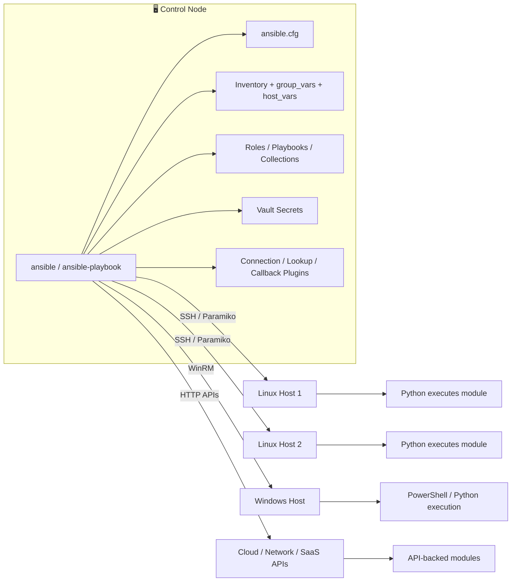
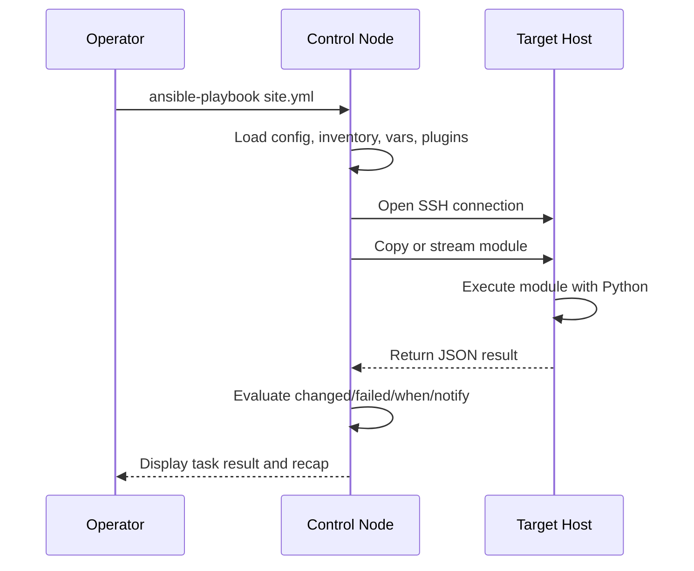
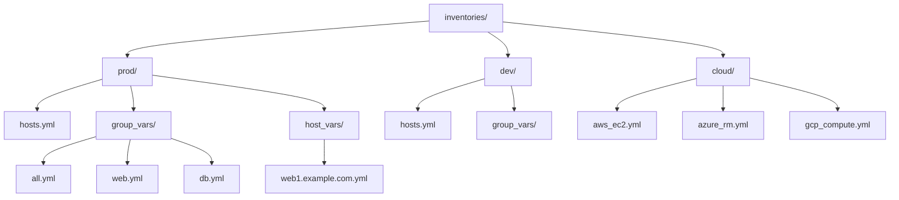

# Ansible Inventory and Variables

← Back to [12-ansible-deep-dive.md](./12-ansible-deep-dive.md)

Core Ansible architecture, inventory layout, targeting, and variable precedence.

---

## 🧠 1. Ansible Fundamentals

### ✅ What is Ansible?

Ansible is an agentless automation platform used for configuration management, application deployment, orchestration, security hardening, patching, and operational workflows.

It describes desired state in human-readable YAML and relies on reusable modules instead of long shell scripts.

Ansible can automate single-server tasks, entire fleets, network devices, cloud resources, Kubernetes workflows, and multi-step application rollouts.

### 🎯 Why Ansible?

- Readable: YAML playbooks are easier to review than imperative shell loops.
- Agentless by default: SSH and existing credentials are often enough to start.
- Idempotent: well-written modules converge hosts to the desired state safely.
- Incremental adoption: teams can begin with ad-hoc commands before building full roles.
- Cross-domain: the same tool can manage Linux, Windows, cloud, containers, and network devices.
- Ecosystem rich: thousands of built-in and community modules, roles, and collections are available.
- Operationally friendly: inventories, tags, check mode, diff mode, handlers, and serial execution make it suitable for production change windows.

### 🧩 Agentless architecture explained

In the default model, the control node connects to managed nodes over SSH for Linux or WinRM for Windows.

The control node transfers a small Python-based module or raw command, executes it remotely, reads JSON output, and then removes temporary files.

Because there is no long-running agent on each target, operations teams avoid agent lifecycle management, certificate rotation burdens, and background daemon troubleshooting on every node.

Agentless does not mean dependency-free.

Managed Linux nodes still need SSH access and usually Python so Ansible modules can run reliably.

### ⚙️ How Ansible works: SSH + Python execution model

1. The operator invokes `ansible` or `ansible-playbook` from the control node.
1. Ansible loads configuration from `ansible.cfg`, environment variables, CLI flags, and project defaults.
1. The inventory is parsed and target hosts are selected through patterns such as `web:&prod:!drain`.
1. For each task, Ansible loads the module and task parameters, then opens a transport connection to the target host.
1. The module is copied to a temporary directory on the remote node unless pipelining is enabled and supported.
1. Python on the remote node executes the module and returns structured JSON output.
1. Ansible interprets `changed`, `failed`, `stdout`, `stderr`, facts, and return values.
1. Handlers may be notified if a task reports a change.
1. At the end of the run, Ansible prints a per-host recap summarizing `ok`, `changed`, `unreachable`, `failed`, `rescued`, and `ignored` counts.

### 🏗️ Architecture diagram



### 🔄 Task execution lifecycle



### 🆚 Ansible vs Puppet vs Chef vs SaltStack

| Tool | Agent Model | Execution Model | Primary Language | Learning Curve | Typical Strength |
|---|---|---|---|---|---|
| Ansible | Agentless by default | Push | YAML | Low entry barrier | SSH-based configuration, orchestration, deployments |
| Puppet | Agent-based common model | Pull | DSL | Medium | Large fleets with continuous policy enforcement |
| Chef | Agent-based common model | Pull | Ruby DSL | Medium to high | Strong developer-driven infrastructure pipelines |
| SaltStack | Often agent-based, can be agentless | Push and pull | YAML + Jinja | Medium | Fast remote execution and event-driven automation |

Use Ansible when you want quick adoption, readable automation, strong Linux support, and a balance between configuration management and orchestration.

Use Puppet or Chef when strict continuous convergence with agents is a better fit than task-oriented push automation.

Use SaltStack when you need very fast command execution, event-driven reactions, or deep integration with the Salt ecosystem.

### 💽 Installing Ansible

#### RHEL / Rocky / AlmaLinux

```bash
sudo dnf install -y epel-release
sudo dnf install -y ansible-core
ansible --version
```

#### Ubuntu / Debian

```bash
sudo apt update
sudo apt install -y software-properties-common
sudo apt install -y ansible
ansible --version
```

#### Using pip

```bash
python3 -m pip install --user --upgrade pip
python3 -m pip install --user ansible
~/.local/bin/ansible --version
```

#### Recommended package choices

| Package | When to use it | Notes |
|---|---|---|
| `ansible-core` | You want the lean engine and will install collections explicitly | Smaller footprint, ideal for automation runners |
| `ansible` | You want a batteries-included community package | Includes many common collections |
| pip install in virtualenv | You need version pinning per project | Best for CI/CD and reproducible tooling |

### 🛠️ `ansible.cfg` deep dive

Ansible reads configuration in a well-defined order.

| Priority | Location | Typical use |
|---|---|---|
| 1 | `ANSIBLE_CONFIG` environment variable | Explicitly point a run to a specific configuration file |
| 2 | `./ansible.cfg` | Project-local configuration and the most common team choice |
| 3 | `~/.ansible.cfg` | User-specific defaults |
| 4 | `/etc/ansible/ansible.cfg` | System-wide fallback |

```ini
[defaults]
inventory = inventories/prod/hosts.yml
remote_user = automation
gathering = smart
fact_caching = jsonfile
fact_caching_connection = .fact_cache
fact_caching_timeout = 86400
forks = 25
host_key_checking = True
retry_files_enabled = False
stdout_callback = yaml
callbacks_enabled = profile_tasks,timer
interpreter_python = auto_silent
roles_path = roles:vendor/roles
collections_path = collections:~/.ansible/collections
vault_identity_list = dev@~/.ansible/dev.vault.pass,prod@~/.ansible/prod.vault.pass
timeout = 30
pipelining = True

[privilege_escalation]
become = False
become_method = sudo
become_ask_pass = False

[ssh_connection]
ssh_args = -o ControlMaster=auto -o ControlPersist=60s -o PreferredAuthentications=publickey
control_path = %(directory)s/%%h-%%r
pipelining = True
retries = 3
```

| Setting | Purpose | Operational advice |
|---|---|---|
| `inventory` | Default inventory source | Keep this project-relative so CI and local runs behave the same way. |
| `remote_user` | Default SSH user | Prefer inventory vars when environments differ. |
| `forks` | Parallelism level | Tune based on control node CPU, target count, and SSH limits. |
| `host_key_checking` | SSH host key enforcement | Leave enabled in production; manage known_hosts properly. |
| `retry_files_enabled` | Retry file generation | Many teams disable it in Git-tracked repos. |
| `stdout_callback` | Output format | Use `yaml` or a CI-friendly callback for readable output. |
| `callbacks_enabled` | Extra callbacks | Examples include `timer` and `profile_tasks`. |
| `roles_path` | Role search path | Useful when vendoring roles. |
| `collections_path` | Collection search path | Pin collections close to the project when possible. |
| `interpreter_python` | Remote Python discovery | Use `auto` or `auto_silent` on mixed estates. |
| `fact_caching` | Fact cache backend | Speeds up large inventories and templating-heavy runs. |
| `timeout` | Connection timeout | Increase for slower links; avoid values that mask networking issues. |
| `pipelining` | Reduces SSH operations | Improves performance but requires compatible sudo settings. |
| `vault_identity_list` | Named vault password files | Preferred for multi-environment secret isolation. |
| `gathering` | Fact gathering mode | Use `smart` with fact caching to reduce overhead. |

Configuration precedence matters.

CLI flags override configuration values, inventory variables can override connection defaults, and playbook settings can override both for individual runs.

For team projects, prefer a repository-local `ansible.cfg` so automation is reproducible.

## 🗂️ 2. Inventory Management

### 📌 What inventory does

Inventory is the source of truth that tells Ansible which hosts exist, how they are grouped, and which connection variables apply to them.

A good inventory design separates environment targeting from application logic.

### 🧱 Static inventory: INI format

```ini
[web]
web1.example.com ansible_host=10.10.10.11 http_port=80
web2.example.com ansible_host=10.10.10.12 http_port=8080

[db]
db1.example.com ansible_host=10.10.20.21 db_role=primary
db2.example.com ansible_host=10.10.20.22 db_role=replica

[prod:children]
web
db

[prod:vars]
ansible_user=automation
ansible_python_interpreter=/usr/bin/python3
ntp_server=time.example.com
```

### 🧱 Static inventory: YAML format

```yaml
all:
  vars:
    ansible_user: automation
    ansible_python_interpreter: /usr/bin/python3
  children:
    prod:
      children:
        web:
          hosts:
            web1.example.com:
              ansible_host: 10.10.10.11
              http_port: 80
            web2.example.com:
              ansible_host: 10.10.10.12
              http_port: 8080
        db:
          hosts:
            db1.example.com:
              ansible_host: 10.10.20.21
              db_role: primary
            db2.example.com:
              ansible_host: 10.10.20.22
              db_role: replica
```

### 🧬 Inventory variables: `host_vars` and `group_vars`

```text
inventories/
├── prod/
│   ├── hosts.yml
│   ├── group_vars/
│   │   ├── all.yml
│   │   ├── web.yml
│   │   └── db.yml
│   └── host_vars/
│       ├── web1.example.com.yml
│       └── db1.example.com.yml
└── dev/
    ├── hosts.yml
    └── group_vars/
        └── all.yml
```

```yaml
# inventories/prod/group_vars/all.yml
ansible_user: automation
timezone: UTC
monitoring_agent_enabled: true

# inventories/prod/group_vars/web.yml
app_name: inventory-api
app_port: 9000
web_packages:
  - nginx
  - git
  - rsync

# inventories/prod/host_vars/web1.example.com.yml
http_port: 80
enable_canary: true
```

Put shared settings in `group_vars` and only host-specific exceptions in `host_vars`.

Avoid duplicating the same variable on many hosts when a group can express the intent more clearly.

### ☁️ Dynamic inventory

Dynamic inventory lets Ansible discover infrastructure from APIs instead of maintaining long static host lists by hand.

This is essential in cloud environments where instances appear, disappear, or change addresses frequently.

#### AWS EC2 plugin example

```yaml
plugin: amazon.aws.aws_ec2
regions:
  - us-east-1  # replace with your region
filters:
  instance-state-name: running
keyed_groups:
  - key: tags.Role
    prefix: tag_role
  - key: placement.region
    prefix: aws_region
hostnames:
  - private-ip-address
compose:
  ansible_host: private_ip_address
```

#### Azure RM plugin example

```yaml
plugin: azure.azcollection.azure_rm
include_vm_resource_groups:
  - rg-prod-linux
keyed_groups:
  - prefix: azure_location
    key: location
  - prefix: azure_tag_role
    key: tags.role
conditional_groups:
  prod: tags.environment == 'prod'
plain_host_names: true
```

#### GCP Compute plugin example

```yaml
plugin: google.cloud.gcp_compute
projects:
  - my-prod-project
zones:
  - us-central1-a
  - us-central1-b
filters:
  - status = RUNNING
keyed_groups:
  - key: labels.role
    prefix: gcp_role
hostnames:
  - networkInterfaces[0].networkIP
compose:
  ansible_host: networkInterfaces[0].networkIP
```

Dynamic inventory plugins are regular YAML files consumed with `-i inventory.aws_ec2.yml` or via `ansible.cfg`.

### 🎯 Patterns for targeting hosts

| Pattern | Meaning |
|---|---|
| `all` | Every host in the inventory |
| `web` | All hosts in the `web` group |
| `web:db` | Union of `web` and `db` |
| `web:&prod` | Hosts that are both in `web` and `prod` |
| `all:!drain` | All hosts except those in `drain` |
| `web[0]` | First host in group order |
| `web[0:2]` | First three hosts from the group |
| `*.example.com` | Wildcard match |
| `~web[0-9]+` | Regex pattern when using advanced inventory matching |

```bash
ansible 'web:&prod' -i inventories/prod/hosts.yml -m ping
ansible 'all:!drain' -i inventories/prod/hosts.yml -a 'uptime'
ansible 'web[0:2]' -i inventories/prod/hosts.yml -b -m service -a 'name=nginx state=restarted'
```

### 🧩 Multiple inventory sources

Ansible can merge multiple inventory sources.

```bash
ansible-inventory -i inventories/common -i inventories/prod --graph
ansible-playbook -i inventories/common -i inventories/prod site.yml
```

Typical use cases include combining:

- a common base inventory with environment-specific overlays
- a static inventory for legacy servers with a dynamic inventory for cloud instances
- a CMDB export with a local emergency override inventory for maintenance windows

### 🗺️ Inventory structure diagram



### 🔍 Inventory troubleshooting tips

- `ansible-inventory -i inventories/prod/hosts.yml --list` to inspect the resolved inventory as JSON.
- `ansible-inventory -i inventories/prod/hosts.yml --graph` to view group relationships quickly.
- Use `ansible -m debug -a "var=hostvars[inventory_hostname]"` to inspect host-specific variables.
- Use `ansible-config dump --only-changed` to see which configuration settings are currently active.

### Appendix A: Variable precedence quick ladder

| Relative order | Source |
|---|---|
| Low | Role defaults |
|   | Inventory group vars |
|   | Inventory host vars |
|   | Play vars |
|   | Play vars_prompt |
|   | Play vars_files |
|   | Registered vars and set_fact |
| High | Extra vars (`-e`) |

The complete precedence model has more detail, but the ladder above is enough for most day-to-day troubleshooting.

### Appendix B: Magic variables reference

| Variable | Meaning |
|---|---|
| `inventory_hostname` | Current host name from inventory |
| `inventory_hostname_short` | Short host name |
| `hostvars` | All variables for all hosts |
| `groups` | Dictionary of groups and host members |
| `group_names` | Groups for the current host |
| `play_hosts` | Hosts still active in the play |
| `ansible_play_batch` | Current serial batch hosts |
| `ansible_check_mode` | Whether check mode is active |
| `ansible_diff_mode` | Whether diff mode is active |
| `role_path` | Current role directory |
| `playbook_dir` | Directory of the current playbook |
