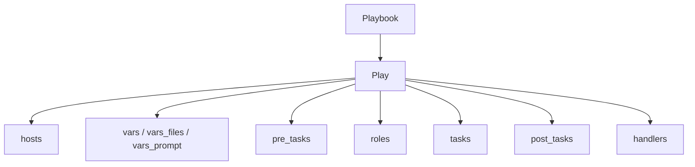
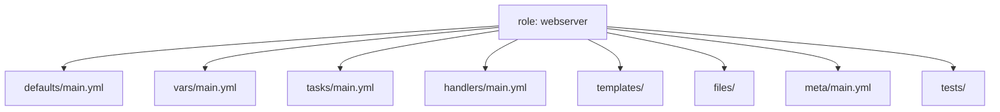

# Ansible Playbooks and Roles

← Back to [12-ansible-deep-dive.md](./12-ansible-deep-dive.md)

Playbook structure, variables, handlers, tags, imports, and reusable role design.

---

## 📘 4. Playbooks

### 📝 YAML syntax essentials

- YAML is indentation-sensitive. Use spaces, never tabs.
- Lists begin with `-` and mappings use `key: value` syntax.
- Quote strings when they contain special characters, colons, or Jinja expressions that might be ambiguous.
- Boolean values should be written consistently as `true` and `false` in modern playbooks.
- Each playbook should start with `---` for clarity.

```yaml
---
- name: Minimal playbook example
  hosts: web
  become: true
  tasks:
    - name: Ensure nginx is installed
      ansible.builtin.package:
        name: nginx
        state: present
```

### 🏗️ Playbook structure



```yaml
---
- name: Full play skeleton
  hosts: app
  become: true
  gather_facts: true
  vars_files:
    - vars/common.yml
  vars:
    release_path: /opt/myapp
  pre_tasks:
    - name: Validate required variable
      ansible.builtin.assert:
        that:
          - app_version is defined
  roles:
    - role: baseline
  tasks:
    - name: Main task placeholder
      ansible.builtin.debug:
        msg: "Deploying version {{ app_version }}"
  post_tasks:
    - name: Post deployment summary
      ansible.builtin.debug:
        msg: "Deployment complete on {{ inventory_hostname }}"
  handlers:
    - name: Restart app
      ansible.builtin.service:
        name: myapp
        state: restarted
```

### 🧮 Variables

#### Play vars

```yaml
vars:
  app_name: billing-api
  app_port: 8080
  app_user: billing
```

#### vars_files

```yaml
vars_files:
  - vars/common.yml
  - vars/{{ env }}.yml
```

#### vars_prompt

```yaml
vars_prompt:
  - name: release_version
    prompt: "Enter the release version"
    private: false
  - name: db_password
    prompt: "Enter the database password"
    private: true
```

#### Registered variables

```yaml
- name: Check current application version
  ansible.builtin.command: /opt/myapp/bin/version
  register: app_version_cmd
  changed_when: false

- name: Display current version
  ansible.builtin.debug:
    var: app_version_cmd.stdout
```

Registered variables are task outputs, not static inventory values.

They frequently contain `stdout`, `stderr`, `rc`, `changed`, and module-specific keys.

### 🧠 Facts and magic variables

```yaml
- name: Show selected facts
  ansible.builtin.debug:
    msg:
      - "Host: {{ inventory_hostname }}"
      - "OS family: {{ ansible_facts['os_family'] }}"
      - "Default IPv4: {{ ansible_facts['default_ipv4']['address'] | default('n/a') }}"
      - "Group names: {{ group_names | join(', ') }}"
```

| Magic variable | Use |
|---|---|
| `inventory_hostname` | Current host as defined in inventory |
| `ansible_facts` | Dictionary of gathered facts |
| `hostvars` | Cross-host variable access |
| `groups` | All groups and their host members |
| `group_names` | Groups for the current host |
| `play_hosts` | Hosts still active in the current play |
| `ansible_play_batch` | Current serial batch |
| `role_path` | Current role directory |

### 🧪 Conditionals with `when`

```yaml
- name: Install Apache on Debian family systems
  ansible.builtin.apt:
    name: apache2
    state: present
  when: ansible_facts['os_family'] == 'Debian'

- name: Install httpd on Red Hat family systems
  ansible.builtin.dnf:
    name: httpd
    state: present
  when: ansible_facts['os_family'] == 'RedHat'
```

Conditionals can test variables, facts, command results, membership in groups, and Jinja expressions.

### 🔁 Loops: `loop`, `with_items`, and `with_dict`

```yaml
- name: Install baseline packages with loop
  ansible.builtin.package:
    name: "{{ item }}"
    state: present
  loop:
    - vim
    - curl
    - git

- name: Legacy with_items example
  ansible.builtin.user:
    name: "{{ item }}"
    state: present
  with_items:
    - alice
    - bob

- name: Legacy with_dict example
  ansible.builtin.debug:
    msg: "{{ item.key }} -> {{ item.value }}"
  with_dict:
    app_port: 8080
    app_env: prod
```

Modern playbooks should prefer `loop`, but understanding the older `with_*` style is still useful when reading existing automation.

### 🔔 Handlers and notifications

```yaml
- name: Deploy nginx configuration
  ansible.builtin.template:
    src: nginx.conf.j2
    dest: /etc/nginx/nginx.conf
    owner: root
    group: root
    mode: '0644'
  notify:
    - Restart nginx

handlers:
  - name: Restart nginx
    ansible.builtin.service:
      name: nginx
      state: restarted
```

Handlers run once per host at the end of a play unless `meta: flush_handlers` is used.

### 🏷️ Tags

```yaml
- name: Install packages
  ansible.builtin.package:
    name: rsync
    state: present
  tags:
    - packages
    - baseline

- name: Restart application
  ansible.builtin.service:
    name: myapp
    state: restarted
  tags:
    - restart
```

```bash
ansible-playbook site.yml --tags packages
ansible-playbook site.yml --skip-tags restart
```

### 🧯 Error handling

```yaml
- name: Demonstrate block rescue always
  hosts: app
  become: true
  tasks:
    - name: Deployment block
      block:
        - name: Stop service
          ansible.builtin.service:
            name: myapp
            state: stopped

        - name: Unpack release
          ansible.builtin.unarchive:
            src: releases/myapp.tar.gz
            dest: /opt/myapp
            remote_src: false

        - name: Start service
          ansible.builtin.service:
            name: myapp
            state: started
      rescue:
        - name: Restore previous symlink
          ansible.builtin.file:
            src: /opt/releases/previous
            dest: /opt/myapp/current
            state: link
            force: true

        - name: Restart previous version
          ansible.builtin.service:
            name: myapp
            state: restarted
      always:
        - name: Emit deployment status
          ansible.builtin.debug:
            msg: "Deployment workflow finished on {{ inventory_hostname }}"
```

```yaml
- name: Ignore an expected non-critical failure
  ansible.builtin.command: /usr/local/bin/non-critical-check
  register: check_result
  ignore_errors: true
  changed_when: false

- name: Fail only if disk use exceeds threshold
  ansible.builtin.command: /bin/sh -c "df -P / | awk 'NR==2 {print $5}' | tr -d '%'"
  register: disk_pct
  changed_when: false
  failed_when: disk_pct.stdout | int > 90
```

### 🧵 Templates with Jinja2

```jinja2
server {
    listen {{ http_port }};
    server_name {{ server_name }};

    location /health {
        return 200 'ok';
    }

    location / {
        proxy_pass http://127.0.0.1:{{ app_port }};
        proxy_set_header Host $host;
        proxy_set_header X-Real-IP $remote_addr;
        proxy_set_header X-Forwarded-For $proxy_add_x_forwarded_for;
    }
}
```

```yaml
- name: Render site configuration
  ansible.builtin.template:
    src: templates/site.conf.j2
    dest: /etc/nginx/conf.d/site.conf
    owner: root
    group: root
    mode: '0644'
  notify: Restart nginx
```

### 🧩 Include and import

```yaml
- name: Static import
  import_tasks: tasks/packages.yml

- name: Dynamic include based on OS family
  include_tasks: "tasks/{{ ansible_facts['os_family'] | lower }}.yml"
```

`import_*` is parsed statically at playbook load time.

`include_*` is dynamic and can depend on runtime values such as facts and registered variables.

## 🧱 5. Roles

### 📁 Role directory structure

```text
roles/
└── webserver/
    ├── defaults/
    │   └── main.yml
    ├── files/
    │   └── index.html
    ├── handlers/
    │   └── main.yml
    ├── meta/
    │   └── main.yml
    ├── tasks/
    │   └── main.yml
    ├── templates/
    │   └── site.conf.j2
    ├── tests/
    │   ├── inventory
    │   └── test.yml
    └── vars/
        └── main.yml
```



### 🛠️ Creating roles

```bash
ansible-galaxy role init roles/webserver
```

Roles package tasks, defaults, handlers, templates, files, and metadata into a reusable unit.

### 🌌 Galaxy roles

```bash
ansible-galaxy install geerlingguy.nginx -p roles
```

Review external roles before production use, pin versions, and prefer vendored requirements for repeatable builds.

### 🔗 Role dependencies

```yaml
# roles/webserver/meta/main.yml
---
dependencies:
  - role: baseline
  - role: firewalld
    vars:
      firewalld_services:
        - http
        - https
```

### ⚖️ Default variables vs role variables

| Location | Intended use | Precedence profile |
|---|---|---|
| `defaults/main.yml` | Safe, user-overridable defaults | Low precedence |
| `vars/main.yml` | Internal constants that should rarely change | High precedence |

Prefer `defaults` for tunable values such as ports, package lists, and feature flags.

Reserve `vars` for OS mapping tables, immutable role internals, or values that must not be overridden casually.

### 🌐 Complete role example: web server setup

#### Role tree

```text
roles/
└── webserver/
    ├── defaults/
    │   └── main.yml
    ├── handlers/
    │   └── main.yml
    ├── meta/
    │   └── main.yml
    ├── tasks/
    │   └── main.yml
    ├── templates/
    │   └── site.conf.j2
    └── vars/
        └── main.yml
```

#### `defaults/main.yml`

```yaml
---
webserver_package_name: nginx
webserver_service_name: nginx
webserver_document_root: /usr/share/nginx/html
webserver_http_port: 80
webserver_server_name: "{{ inventory_hostname }}"
webserver_index_content: |
  <html>
    <body>
      <h1>Managed by Ansible</h1>
      <p>Host: {{ inventory_hostname }}</p>
    </body>
  </html>
```

#### `vars/main.yml`

```yaml
---
webserver_config_path: /etc/nginx/conf.d/site.conf
```

#### `tasks/main.yml`

```yaml
---
- name: Install web server package
  ansible.builtin.package:
    name: "{{ webserver_package_name }}"
    state: present

- name: Ensure document root exists
  ansible.builtin.file:
    path: "{{ webserver_document_root }}"
    state: directory
    owner: root
    group: root
    mode: '0755'

- name: Deploy index page
  ansible.builtin.copy:
    dest: "{{ webserver_document_root }}/index.html"
    content: "{{ webserver_index_content }}"
    owner: root
    group: root
    mode: '0644'
  notify: Restart web service

- name: Deploy site configuration
  ansible.builtin.template:
    src: site.conf.j2
    dest: "{{ webserver_config_path }}"
    owner: root
    group: root
    mode: '0644'
  notify: Restart web service

- name: Ensure service is enabled and running
  ansible.builtin.service:
    name: "{{ webserver_service_name }}"
    state: started
    enabled: true
```

#### `handlers/main.yml`

```yaml
---
- name: Restart web service
  ansible.builtin.service:
    name: "{{ webserver_service_name }}"
    state: restarted
```

#### `templates/site.conf.j2`

```jinja2
server {
    listen {{ webserver_http_port }};
    server_name {{ webserver_server_name }};
    root {{ webserver_document_root }};

    location / {
        index index.html;
        try_files $uri $uri/ =404;
    }
}
```

#### `meta/main.yml`

```yaml
---
galaxy_info:
  role_name: webserver
  author: platform-team
  description: Configure a simple nginx web server
  license: MIT
  min_ansible_version: '2.14'
  platforms:
    - name: EL
      versions:
        - '8'
        - '9'
    - name: Ubuntu
      versions:
        - jammy
        - noble
dependencies: []
```

#### Using the role from a playbook

```yaml
---
- name: Apply webserver role
  hosts: web
  become: true
  roles:
    - role: webserver
      vars:
        webserver_http_port: 8080
```
