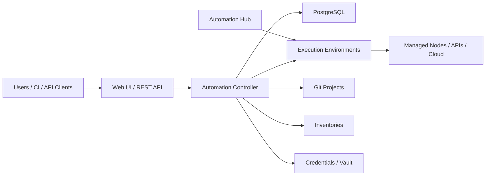
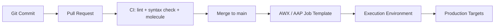

# Ansible Advanced Patterns

← Back to [12-ansible-deep-dive.md](./12-ansible-deep-dive.md)

Vault, AWX/Tower/AAP, pull mode, delegation, async tasks, strategies, and real-world projects.

---

## 🔐 6. Ansible Vault

### 🗝️ Encrypting files

```bash
ansible-vault create group_vars/prod/vault.yml
ansible-vault edit group_vars/prod/vault.yml
ansible-vault view group_vars/prod/vault.yml
ansible-vault encrypt existing-secrets.yml
ansible-vault decrypt existing-secrets.yml
ansible-vault rekey group_vars/prod/vault.yml
```

### 🔤 Encrypting strings

```bash
ansible-vault encrypt_string --vault-id prod@~/.ansible/prod.vault.pass 'SuperSecretPassword!' --name 'db_password'
```

### 📥 Using vault in playbooks

```yaml
---
- name: Use encrypted secrets
  hosts: db
  become: true
  vars_files:
    - group_vars/prod/vault.yml
  tasks:
    - name: Render database config with secret
      ansible.builtin.template:
        src: templates/db.conf.j2
        dest: /etc/myapp/db.conf
        owner: root
        group: root
        mode: '0600'
```

### 🪪 Multi-vault passwords

```bash
ansible-playbook site.yml   --vault-id dev@~/.ansible/dev.vault.pass   --vault-id prod@~/.ansible/prod.vault.pass
```

```yaml
# ansible.cfg
[defaults]
vault_identity_list = dev@~/.ansible/dev.vault.pass,prod@~/.ansible/prod.vault.pass
```

### ✅ Best practices for secrets management

- Store only secrets in Vault, not every variable. Keep encrypted files focused and readable.
- Use separate vault identities for dev, staging, and production to reduce blast radius.
- Never commit plaintext secrets, generated certificates, or password files to Git.
- Prefer CI secret stores, environment variables, or vault password files injected securely at runtime.
- Template secrets into files with restrictive permissions such as `0600`.
- Rotate vault passwords and use `ansible-vault rekey` after staff changes or incident response actions.
- Document where each secret originates and which systems consume it.

## 🏢 8. AWX / Ansible Tower / AAP

### ❓ What are AWX, Tower, and AAP?

AWX is the upstream open source web UI and API for managing Ansible automation centrally.

Ansible Tower was the commercial enterprise product name historically used by Red Hat.

Ansible Automation Platform (AAP) is the current commercial platform that includes automation controller, automation hub, execution environments, analytics, and enterprise support features.

### 🏗️ AWX / AAP architecture diagram



### 🧭 Installation overview

- AWX is commonly deployed on Kubernetes using the AWX Operator.
- AAP is installed through Red Hat-supported installers or operators depending on platform and version.
- Execution Environments package `ansible-core`, Python dependencies, collections, and tools into a consistent runtime container.
- Production deployments typically require PostgreSQL, ingress, persistent storage, TLS, and external authentication integration.

```bash
# Example high-level AWX operator flow
kubectl create namespace awx
kubectl apply -f https://raw.githubusercontent.com/ansible/awx-operator/devel/deploy/awx-operator.yaml -n awx
kubectl apply -f awx-custom-resource.yml -n awx
```

### 📁 Projects, inventories, and templates

| Object | Purpose | Typical source |
|---|---|---|
| Project | Automation content repository | Git repository |
| Inventory | Hosts and variables | Static file, SCM, or dynamic source |
| Credential | Access to SSH, cloud, vault, registry, SCM | Stored in controller |
| Job Template | Launch definition tying playbook + inventory + credentials together | Controller object |
| Workflow Template | Multi-job orchestration graph | Controller object |

A job template is the normal unit of execution in AWX/Tower/AAP.

It chooses the project revision, inventory, credentials, extra vars, limit, verbosity, and execution environment.

### ⏰ Job scheduling

Schedules let teams run playbooks automatically for recurring patching, audits, certificate renewals, or inventory sync jobs.

```bash
# High-level example using awx CLI if available
awx schedules create   --name nightly-patching   --rrule 'DTSTART:20240101T020000Z RRULE:FREQ=DAILY;INTERVAL=1'   --unified-job-template 42
```

### 👥 RBAC

AWX and AAP provide role-based access control so teams can separate who can view inventory, launch jobs, edit credentials, approve workflows, or administer the platform.

Typical patterns include read-only auditors, project maintainers, job launchers, and platform admins.

### 🔌 API usage

```bash
curl -k -u admin:password https://awx.example.com/api/v2/job_templates/

curl -k -u admin:password   -H 'Content-Type: application/json'   -X POST   -d '{"extra_vars": {"release_version": "2.0.1"}}'   https://awx.example.com/api/v2/job_templates/12/launch/
```

The REST API is useful for service catalogs, ChatOps launch flows, GitHub Actions, Jenkins, and event-driven automation.

### 🔁 Integration with CI/CD



```yaml
# Example GitHub Actions step invoking AWX API
- name: Launch AWX job template
  run: |
    curl -sS -u "$AWX_USER:$AWX_PASS"       -H 'Content-Type: application/json'       -X POST       -d '{"extra_vars": {"git_sha": "${{ github.sha }}"}}'       https://awx.example.com/api/v2/job_templates/12/launch/
```

### 🤝 Delegation and local actions

```yaml
- name: Drain node before maintenance
  ansible.builtin.command: /usr/local/bin/lbctl drain {{ inventory_hostname }}
  delegate_to: localhost
  changed_when: true

- name: Build artifact locally
  ansible.builtin.command: ./scripts/build-release.sh
  delegate_to: localhost
  run_once: true
```

### ⏳ Async tasks and polling

```yaml
- name: Start a long-running database migration asynchronously
  ansible.builtin.command: /usr/local/bin/run-migration.sh
  async: 3600
  poll: 0
  register: migration_job

- name: Wait for migration completion
  ansible.builtin.async_status:
    jid: "{{ migration_job.ansible_job_id }}"
  register: migration_status
  until: migration_status.finished
  retries: 120
  delay: 30
```

### 🧠 Strategy plugins: linear, free, and serial

| Strategy | Behavior | When to use it |
|---|---|---|
| `linear` | Default lockstep task order across hosts | Predictable general-purpose automation |
| `free` | Hosts run ahead independently | Large fleets where waiting on slow hosts is wasteful |
| `serial` | Play batches hosts in chunks | Rolling updates and safer production changes |

```yaml
---
- name: Roll through web servers in batches of two
  hosts: web
  serial: 2
  strategy: linear
  tasks:
    - name: Restart web service
      ansible.builtin.service:
        name: nginx
        state: restarted
```

### 🚀 Performance optimization

- Enable SSH multiplexing and pipelining where compatible.
- Increase forks cautiously based on control node capacity and target fleet behavior.
- Gather facts only when required, or use `gather_subset` and fact caching.
- Prefer purpose-built modules over shell commands because they avoid repeated parsing and custom logic.
- Use `serial` and `throttle` to keep production-safe concurrency.
- Consolidate repetitive tasks into roles and collections for maintainability rather than micro-optimizing YAML size.
- Pin Python interpreters on mixed distributions when discovery is expensive or unreliable.
- Use `profile_tasks` callback or AAP analytics to identify slow tasks.

### 🧪 Testing with Molecule

```yaml
# molecule/default/molecule.yml
---
dependency:
  name: galaxy
driver:
  name: docker
platforms:
  - name: instance
    image: quay.io/rockylinux/rockylinux:9
provisioner:
  name: ansible
verifier:
  name: ansible
```

```yaml
# molecule/default/converge.yml
---
- name: Converge
  hosts: all
  become: true
  roles:
    - role: webserver
```

```yaml
# molecule/default/verify.yml
---
- name: Verify
  hosts: all
  gather_facts: false
  tasks:
    - name: Check nginx package presence
      ansible.builtin.command: rpm -q nginx
      changed_when: false
```

```bash
molecule test
```

## 🏭 10. Real-World Ansible Projects

### Project 01: Server provisioning playbook

Provision new Linux servers with baseline packages, time sync, users, SSH hardening, and monitoring agent installation.

#### Project layout

```text
project-server-provisioning/
├── inventories/prod/hosts.yml
├── group_vars/all.yml
└── site.yml
```

#### Inventory

```yaml
# inventories/prod/hosts.yml
all:
  children:
    new_servers:
      hosts:
        node1.example.com:
        node2.example.com:
```

#### Variables

```yaml
# group_vars/all.yml
ansible_user: automation
timezone_name: UTC
baseline_packages:
  - vim
  - curl
  - git
  - rsync
ops_users:
  - alice
  - bob
```

#### Playbook

```yaml
---
- name: Provision new Linux servers
  hosts: new_servers
  become: true
  tasks:
    - name: Install baseline packages
      ansible.builtin.package:
        name: "{{ baseline_packages }}"
        state: present

    - name: Set timezone
      community.general.timezone:
        name: "{{ timezone_name }}"

    - name: Ensure chronyd is enabled
      ansible.builtin.service:
        name: chronyd
        state: started
        enabled: true

    - name: Create operations users
      ansible.builtin.user:
        name: "{{ item }}"
        shell: /bin/bash
        groups: wheel
        append: true
        state: present
      loop: "{{ ops_users }}"

    - name: Harden SSH root login
      ansible.builtin.lineinfile:
        path: /etc/ssh/sshd_config
        regexp: '^PermitRootLogin'
        line: 'PermitRootLogin no'
      notify: Restart sshd

    - name: Install monitoring agent
      ansible.builtin.package:
        name: node_exporter
        state: present

  handlers:
    - name: Restart sshd
      ansible.builtin.service:
        name: sshd
        state: restarted
```

- Delivery note: in production, pair the project with a CI job for `ansible-lint`, `ansible-playbook --syntax-check`, and targeted Molecule or staging runs.

### Project 02: Application deployment playbook

Deploy a versioned application artifact, render environment configuration, and restart the systemd service safely.

#### Project layout

```text
project-app-deployment/
├── files/
│   └── myapp-2.0.1.tar.gz
├── templates/
│   └── app.env.j2
└── deploy.yml
```

#### Playbook

```yaml
---
- name: Deploy application
  hosts: app
  become: true
  vars:
    release_version: 2.0.1
    release_dir: "/opt/releases/{{ release_version }}"
    current_link: /opt/myapp/current
    app_user: myapp
  tasks:
    - name: Create release directory
      ansible.builtin.file:
        path: "{{ release_dir }}"
        state: directory
        owner: "{{ app_user }}"
        group: "{{ app_user }}"
        mode: '0755'

    - name: Unpack release artifact
      ansible.builtin.unarchive:
        src: "files/myapp-{{ release_version }}.tar.gz"
        dest: "{{ release_dir }}"
        owner: "{{ app_user }}"
        group: "{{ app_user }}"

    - name: Render environment file
      ansible.builtin.template:
        src: templates/app.env.j2
        dest: /etc/myapp.env
        owner: root
        group: root
        mode: '0640'
      notify: Restart myapp

    - name: Update current symlink
      ansible.builtin.file:
        src: "{{ release_dir }}"
        dest: "{{ current_link }}"
        state: link
        force: true
      notify: Restart myapp

    - name: Ensure service is enabled
      ansible.builtin.service:
        name: myapp
        enabled: true
        state: started

  handlers:
    - name: Restart myapp
      ansible.builtin.service:
        name: myapp
        state: restarted
```

- Delivery note: in production, pair the project with a CI job for `ansible-lint`, `ansible-playbook --syntax-check`, and targeted Molecule or staging runs.

### Project 03: Patch management playbook

Run rolling OS updates, reboot hosts when needed, and validate health before continuing to the next batch.

#### Project layout

```text
project-patch-management/
└── patch.yml
```

#### Playbook

```yaml
---
- name: Patch Linux estate safely
  hosts: app:db:web
  become: true
  serial: 5
  tasks:
    - name: Capture kernel version before patching
      ansible.builtin.command: uname -r
      register: kernel_before
      changed_when: false

    - name: Update packages to latest
      ansible.builtin.package:
        name: '*'
        state: latest

    - name: Capture reboot requirement on Debian
      ansible.builtin.stat:
        path: /var/run/reboot-required
      register: debian_reboot_required
      when: ansible_facts['os_family'] == 'Debian'

    - name: Reboot host when required
      ansible.builtin.reboot:
        reboot_timeout: 1800
      when: ansible_facts['os_family'] == 'RedHat' or debian_reboot_required.stat.exists | default(false)

    - name: Wait for SSH to return
      ansible.builtin.wait_for_connection:
        delay: 10
        timeout: 600

    - name: Validate application health endpoint when present
      ansible.builtin.uri:
        url: "http://{{ ansible_host | default(inventory_hostname) }}:8080/health"
        status_code: 200
      when: "'app' in group_names"
      register: patch_health
      retries: 20
      delay: 15
      until: patch_health.status == 200
```

- Delivery note: in production, pair the project with a CI job for `ansible-lint`, `ansible-playbook --syntax-check`, and targeted Molecule or staging runs.

### Project 04: User management playbook

Create and remove users from a centralized data structure, manage groups, and install SSH keys consistently.

#### Project layout

```text
project-user-management/
└── users.yml
```

#### Playbook

```yaml
---
- name: Manage users from structured data
  hosts: all
  become: true
  vars:
    desired_users:
      - name: alice
        state: present
        groups: ['wheel']
        shell: /bin/bash
        key: "ssh-ed25519 AAAA... alice@example"
      - name: tempuser
        state: absent
        groups: []
        shell: /sbin/nologin
        key: ''
  tasks:
    - name: Ensure required groups exist
      ansible.builtin.group:
        name: "{{ item }}"
        state: present
      loop: "{{ desired_users | map(attribute='groups') | flatten | unique | list }}"
      when: item | length > 0

    - name: Manage user accounts
      ansible.builtin.user:
        name: "{{ item.name }}"
        groups: "{{ item.groups | join(',') }}"
        append: true
        shell: "{{ item.shell }}"
        state: "{{ item.state }}"
      loop: "{{ desired_users }}"

    - name: Manage authorized keys for present users
      ansible.builtin.authorized_key:
        user: "{{ item.name }}"
        key: "{{ item.key }}"
        state: present
      loop: "{{ desired_users }}"
      when:
        - item.state == 'present'
        - item.key | length > 0
```

- Delivery note: in production, pair the project with a CI job for `ansible-lint`, `ansible-playbook --syntax-check`, and targeted Molecule or staging runs.

### Project 05: Security hardening playbook

Apply password policy, disable root SSH login, enforce package updates, and manage SELinux or firewall settings.

#### Project layout

```text
project-security-hardening/
└── harden.yml
```

#### Playbook

```yaml
---
- name: Apply baseline security hardening
  hosts: all
  become: true
  tasks:
    - name: Disable root SSH login
      ansible.builtin.lineinfile:
        path: /etc/ssh/sshd_config
        regexp: '^PermitRootLogin'
        line: 'PermitRootLogin no'
      notify: Restart sshd

    - name: Disable password SSH authentication
      ansible.builtin.lineinfile:
        path: /etc/ssh/sshd_config
        regexp: '^PasswordAuthentication'
        line: 'PasswordAuthentication no'
      notify: Restart sshd

    - name: Enforce password aging policy
      ansible.builtin.lineinfile:
        path: /etc/login.defs
        regexp: '^PASS_MAX_DAYS'
        line: 'PASS_MAX_DAYS 90'

    - name: Ensure firewalld is running
      ansible.builtin.service:
        name: firewalld
        state: started
        enabled: true
      when: ansible_facts['os_family'] == 'RedHat'

    - name: Keep SELinux enforcing on Red Hat family
      ansible.posix.selinux:
        policy: targeted
        state: enforcing
      when: ansible_facts['os_family'] == 'RedHat'

  handlers:
    - name: Restart sshd
      ansible.builtin.service:
        name: sshd
        state: restarted
```

- Delivery note: in production, pair the project with a CI job for `ansible-lint`, `ansible-playbook --syntax-check`, and targeted Molecule or staging runs.

### Project 06: Monitoring setup playbook

Install node_exporter, open firewall ports, deploy a systemd unit override, and validate service health.

#### Project layout

```text
project-monitoring-setup/
└── monitoring.yml
```

#### Playbook

```yaml
---
- name: Configure monitoring agents
  hosts: monitored
  become: true
  vars:
    node_exporter_port: 9100
  tasks:
    - name: Install node_exporter package
      ansible.builtin.package:
        name: node_exporter
        state: present

    - name: Ensure node_exporter service is enabled
      ansible.builtin.service:
        name: node_exporter
        state: started
        enabled: true

    - name: Open firewall port for node_exporter
      ansible.posix.firewalld:
        port: "{{ node_exporter_port }}/tcp"
        permanent: true
        state: enabled
        immediate: true
      when: ansible_facts['os_family'] == 'RedHat'

    - name: Verify exporter endpoint
      ansible.builtin.uri:
        url: "http://{{ ansible_host | default(inventory_hostname) }}:{{ node_exporter_port }}/metrics"
        status_code: 200
      register: metrics_check
      retries: 10
      delay: 5
      until: metrics_check.status == 200
```

- Delivery note: in production, pair the project with a CI job for `ansible-lint`, `ansible-playbook --syntax-check`, and targeted Molecule or staging runs.
