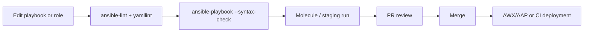

# Ansible Troubleshooting

← Back to [12-ansible-deep-dive.md](./12-ansible-deep-dive.md)

Best practices, troubleshooting commands, FAQ material, and operational checklists.

---

## ✅ 11. Ansible Best Practices

### 📁 Recommended directory layout

```text
ansible-project/
├── ansible.cfg
├── collections/
├── inventories/
│   ├── dev/
│   │   ├── hosts.yml
│   │   └── group_vars/
│   ├── stage/
│   │   ├── hosts.yml
│   │   └── group_vars/
│   └── prod/
│       ├── hosts.yml
│       ├── group_vars/
│       └── host_vars/
├── playbooks/
│   ├── site.yml
│   ├── patch.yml
│   └── deploy.yml
├── roles/
├── templates/
├── files/
├── plugins/
├── requirements.yml
└── molecule/
```

### 🧾 Naming conventions

- Use descriptive play names such as `Deploy billing API` instead of generic names like `Run tasks`.
- Use fully qualified collection names in examples and production code for clarity.
- Name handlers after the action they perform, for example `Restart nginx` or `Reload haproxy`.
- Keep variable names lowercase with underscores and group role defaults under a role prefix such as `webserver_http_port`.
- Keep inventory group names semantic: `web`, `db`, `prod`, `stage`, `canary`, `drain`.

### ♻️ Idempotency

Idempotency means repeated runs converge to the same desired state without causing unnecessary changes or breakage.

- Prefer modules over shell commands.
- Use `creates`, `removes`, `changed_when`, and `failed_when` thoughtfully when command tasks are unavoidable.
- Ensure templates and generated content are deterministic.
- Notify handlers only when configuration truly changes.
- Avoid using `state: latest` indiscriminately in application deployments because it can hide uncontrolled change.

### 🧬 Version control integration

- Track playbooks, roles, inventories, and requirements in Git.
- Never commit vault password files or plaintext secrets.
- Use branches and pull requests for infrastructure changes just as you would for application code.
- Review diffs on templates, defaults, and inventory changes carefully because they directly affect production behavior.

### 🔁 CI/CD with Ansible



```yaml
# Example CI sequence
steps:
  - run: pip install ansible ansible-lint molecule
  - run: ansible-galaxy install -r requirements.yml
  - run: ansible-playbook -i inventories/dev/hosts.yml playbooks/site.yml --syntax-check
  - run: ansible-lint .
  - run: molecule test
```

### 🩺 Troubleshooting tips

| Technique | Flag / command | Benefit |
|---|---|---|
| Increase verbosity | `-v`, `-vv`, `-vvv`, `-vvvv` | More detail on task evaluation, SSH, and module execution |
| Dry run | `--check` | Preview changes when modules support check mode |
| Show diffs | `--diff` | See configuration changes for templates and managed files |
| Limit scope | `--limit host1` | Reduce risk while debugging |
| Start at task | `--start-at-task "Restart nginx"` | Resume long playbooks from a specific task |
| List targets | `--list-hosts` | Verify pattern selection before execution |
| List tasks | `--list-tasks` | Understand playbook structure without running it |

- Use `ansible-config dump --only-changed` to discover effective configuration.
- Use `ansible-inventory --graph` to diagnose unexpected host targeting.
- Use `debug`, `assert`, and `set_fact` sparingly but deliberately while diagnosing variables.
- If privilege escalation behaves oddly with pipelining, review `requiretty` or sudo configuration on target hosts.
- Check remote Python paths when modules fail on minimal or older distributions.

### 📋 Best practices checklist

- [ ] Use repository-local `ansible.cfg` for reproducible runs.
- [ ] Separate inventory by environment.
- [ ] Keep secrets in Vault or external secret stores.
- [ ] Use roles for reusable automation.
- [ ] Prefer modules over shell commands.
- [ ] Name tasks clearly so execution logs are readable.
- [ ] Use handlers for service restarts.
- [ ] Use check mode in reviews and lower environments.
- [ ] Test roles with Molecule or equivalent staging pipelines.
- [ ] Pin external role and collection versions.
- [ ] Review inventory changes as carefully as code changes.
- [ ] Use serial updates for production rollouts.
- [ ] Capture post-change validation with asserts or health checks.
- [ ] Document tags and intended entry points.
- [ ] Keep host_vars minimal and justified.
- [ ] Avoid hiding logic in giant templates when tasks would be clearer.
- [ ] Make rollback or rescue logic explicit for risky workflows.
- [ ] Tune forks and fact gathering for large fleets.
- [ ] Use fully qualified collection names.
- [ ] Treat automation as product code, not throwaway glue.

## 📎 12. Ansible Cheat Sheet

### 📦 Most used modules table

| Module | Primary use |
|---|---|
| `ansible.builtin.package` | Generic package management |
| `ansible.builtin.apt` | APT package operations |
| `ansible.builtin.dnf` | DNF package operations |
| `ansible.builtin.yum` | Legacy YUM package operations |
| `ansible.builtin.pip` | Python package installation |
| `ansible.builtin.service` | Cross-platform service control |
| `ansible.builtin.systemd` | systemd-specific operations |
| `ansible.builtin.file` | Files, directories, links, permissions |
| `ansible.builtin.copy` | Push static files or inline content |
| `ansible.builtin.template` | Render Jinja2 templates |
| `ansible.builtin.lineinfile` | Manage single config lines |
| `ansible.builtin.blockinfile` | Manage config blocks |
| `ansible.builtin.replace` | Regex replacement in files |
| `ansible.builtin.user` | User account management |
| `ansible.builtin.group` | Group management |
| `ansible.builtin.authorized_key` | SSH authorized_keys management |
| `ansible.builtin.cron` | Cron job management |
| `ansible.builtin.mount` | Filesystem mount management |
| `ansible.builtin.unarchive` | Extract archives |
| `ansible.builtin.get_url` | Download remote files |
| `ansible.builtin.uri` | HTTP API requests and health checks |
| `ansible.builtin.reboot` | Managed reboots |
| `ansible.builtin.wait_for` | Wait on sockets or files |
| `ansible.builtin.wait_for_connection` | Wait for host reconnection |
| `ansible.builtin.setup` | Fact gathering |
| `ansible.builtin.debug` | Debug output |
| `ansible.builtin.assert` | Runtime validation |
| `ansible.builtin.set_fact` | Temporary runtime variables |
| `ansible.builtin.command` | Run a direct command |
| `ansible.builtin.shell` | Run shell commands when needed |
| `ansible.builtin.raw` | Run raw commands without Python module transfer |
| `ansible.posix.firewalld` | Firewalld rule management |
| `ansible.posix.selinux` | SELinux state management |
| `community.general.timezone` | Timezone management |
| `community.general.archive` | Archive files on remote hosts |
| `amazon.aws.ec2_instance` | AWS instance management |
| `azure.azcollection.azure_rm_virtualmachine` | Azure VM management |
| `google.cloud.gcp_compute_instance` | GCP instance management |

### 🧠 Common patterns

#### Install packages

```yaml
- name: Install packages
  ansible.builtin.package:
    name: ['vim', 'curl']
    state: present
```

#### Restart on config change

```yaml
- name: Deploy config
  ansible.builtin.template:
    src: app.conf.j2
    dest: /etc/app.conf
  notify: Restart app
```

#### Conditional execution

```yaml
when: ansible_facts['os_family'] == 'RedHat'
```

#### Loop over users

```yaml
loop: '{{ users }}'
```

#### Register command output

```yaml
register: command_result
changed_when: false
```

#### Run as root

```yaml
become: true
```

#### Serial rollout

```yaml
serial: 2
```

#### Async execution

```yaml
async: 3600
poll: 0
```

#### Tag critical tasks

```yaml
tags: ['deploy', 'config']
```

#### Fail with assertion

```yaml
- ansible.builtin.assert:
    that:
      - app_port | int > 0
```

### 🚩 CLI flags quick reference

| Flag | Purpose |
|---|---|
| `-i` | Specify inventory source |
| `-l` / `--limit` | Restrict execution to selected hosts |
| `-u` | Set remote SSH user |
| `-b` / `--become` | Enable privilege escalation |
| `-K` | Ask for become password |
| `-k` | Ask for SSH password |
| `-m` | Choose a module for ad-hoc commands |
| `-a` | Pass module arguments to ad-hoc commands |
| `-f` | Set fork count |
| `-e` | Pass extra variables |
| `-C` / `--check` | Run in check mode |
| `-D` / `--diff` | Show file differences |
| `-t` / `--tags` | Run only tagged tasks |
| `--skip-tags` | Skip selected tags |
| `--list-hosts` | Preview targeted hosts |
| `--list-tasks` | Preview tasks that would run |
| `--start-at-task` | Resume from a specific task |
| `--step` | Confirm each task interactively |
| `-v` to `-vvvv` | Increase verbosity |
| `--syntax-check` | Validate playbook syntax |

## 📚 Appendices

### Appendix A: Variable precedence quick ladder

| Relative order | Source |
|---|---|
| Low | Role defaults |
|   | Inventory group vars |
|   | Inventory host vars |
|   | Play vars |
|   | Play vars_prompt |
|   | Play vars_files |
|   | Registered vars and set_fact |
| High | Extra vars (`-e`) |

The complete precedence model has more detail, but the ladder above is enough for most day-to-day troubleshooting.

### Appendix B: Magic variables reference

| Variable | Meaning |
|---|---|
| `inventory_hostname` | Current host name from inventory |
| `inventory_hostname_short` | Short host name |
| `hostvars` | All variables for all hosts |
| `groups` | Dictionary of groups and host members |
| `group_names` | Groups for the current host |
| `play_hosts` | Hosts still active in the play |
| `ansible_play_batch` | Current serial batch hosts |
| `ansible_check_mode` | Whether check mode is active |
| `ansible_diff_mode` | Whether diff mode is active |
| `role_path` | Current role directory |
| `playbook_dir` | Directory of the current playbook |

### Appendix C: Troubleshooting command cookbook

```bash
ansible --version
```

```bash
ansible-config dump --only-changed
```

```bash
ansible-inventory -i inventories/prod/hosts.yml --graph
```

```bash
ansible-inventory -i inventories/prod/hosts.yml --list
```

```bash
ansible all -i inventories/prod/hosts.yml -m ping
```

```bash
ansible all -i inventories/prod/hosts.yml -m setup -a "filter=ansible_distribution*"
```

```bash
ansible-playbook -i inventories/dev/hosts.yml playbooks/site.yml --syntax-check
```

```bash
ansible-playbook -i inventories/dev/hosts.yml playbooks/site.yml --check --diff
```

```bash
ansible-playbook -i inventories/prod/hosts.yml playbooks/site.yml --list-hosts
```

```bash
ansible-playbook -i inventories/prod/hosts.yml playbooks/site.yml --list-tasks
```

```bash
ansible-playbook -i inventories/prod/hosts.yml playbooks/site.yml -vvv
```

```bash
ansible-doc ansible.builtin.template
```

```bash
ansible-galaxy collection list
```

```bash
ansible-galaxy role list
```

```bash
ansible-vault view group_vars/prod/vault.yml
```

### Appendix D: FAQ

#### When should I use `command` vs `shell`?

Use `command` by default. Use `shell` only when you need shell features such as pipes, redirects, or variable expansion.

#### Why do modules fail with Python errors on some hosts?

Minimal images may not have Python installed or may use a non-standard path. Bootstrap Python with `raw` and set `ansible_python_interpreter` if needed.

#### Why does a task always show changed?

A command task may need `changed_when: false`, or a template may be rendering non-deterministic content such as timestamps.

#### What is the safest way to update production servers?

Use `serial`, health checks, delegation to load balancers, clear validation, and a rollback or rescue strategy.

#### Should I keep secrets in inventory?

Keep non-sensitive variables in inventory, but store secrets in Vault or external secret managers.

#### Do I need full fact gathering everywhere?

No. Disable or reduce it for lightweight operations when facts are not needed.

#### How do I make playbooks reusable?

Use roles, defaults, tags, collections, and environment-specific inventories while avoiding hardcoded values.

#### When is AWX/AAP worth it?

When teams need RBAC, scheduling, API-driven launches, audit trails, execution environments, and central operational control.
