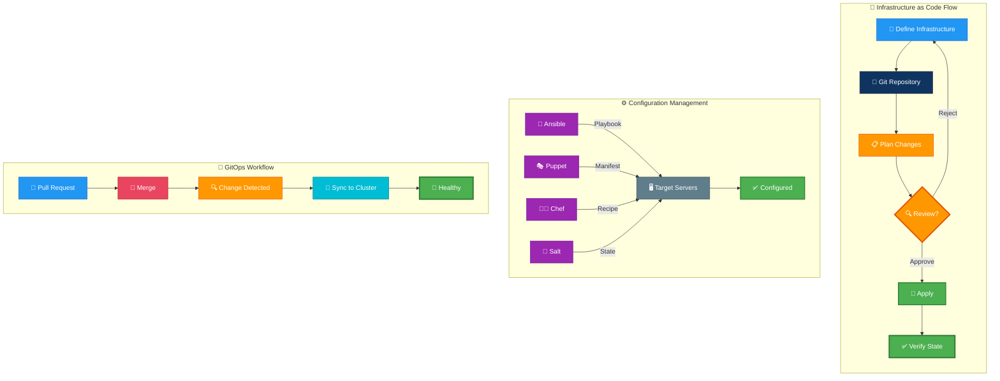

# Linux Automation & Configuration Management Guide

---

## 🎬 Infrastructure Automation — Animated Workflow

---

## Overview

This guide is organized into focused topics covering automation fundamentals, major configuration management and provisioning tools, infrastructure CI/CD, advanced operating patterns, and monitoring-driven remediation on Linux.

## Learning Path

```mermaid
graph LR
    N1["01 Automation Fundamentals"]
    N2["02 Ansible"]
    N3["03 Terraform for Linux"]
    N4["04 Puppet"]
    N5["05 Chef"]
    N6["06 SaltStack"]
    N7["07 Cloud-Init"]
    N8["08 Packer"]
    N9["09 CI/CD for Infrastructure"]
    N10["10 Advanced Patterns"]
    N11["11 Monitoring Automation"]
    N1 --> N2
    N2 --> N3
    N3 --> N4
    N4 --> N5
    N5 --> N6
    N6 --> N7
    N7 --> N8
    N8 --> N9
    N9 --> N10
    N10 --> N11
```

## Table of Contents

- [Automation Fundamentals](01-fundamentals.md)
- [Ansible](02-ansible.md)
- [Ansible Deep Dive](12-ansible-deep-dive.md)
- [Terraform for Linux](03-terraform.md)
- [Puppet](04-puppet.md)
- [Chef](05-chef.md)
- [SaltStack](06-saltstack.md)
- [Cloud-Init](07-cloud-init.md)
- [Packer](08-packer.md)
- [CI/CD for Infrastructure](09-cicd-infrastructure.md)
- [Advanced Patterns](10-advanced-patterns.md)
- [Monitoring Automation](11-monitoring-automation.md)
