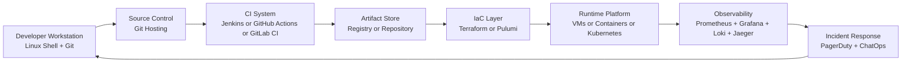

# DevOps and Linux

[Back to guide index](README.md)

### 1.1 Why Linux is the DevOps standard
Linux is the default operating system for modern infrastructure. Most cloud images, containers, Kubernetes nodes, CI runners, load balancers, and observability stacks run on Linux. DevOps engineers use Linux not just as a workstation environment, but as the runtime where services are deployed, logs are collected, networks are inspected, and automation is executed.

Why Linux dominates DevOps:
- Open source ecosystem with strong automation tooling.
- Strong scripting support with Bash, Python, Go, and package managers.
- Predictable remote administration through SSH.
- Native support for containers, cgroups, namespaces, and systemd.
- Rich networking, storage, and process inspection tools.
- Standard platform for cloud VMs and Kubernetes worker nodes.

Linux skills matter because DevOps work happens at the boundary between code and operations. If you can read logs, trace a port, inspect a process tree, tune a unit file, package an application, and automate infrastructure from the shell, you can support delivery at scale.

### 1.2 Linux skill map for DevOps engineers
A practical DevOps Linux skill map includes:

| Skill Area | What You Need | Why It Matters |
|---|---|---|
| Shell | Bash basics, pipes, redirection, variables, loops | Automation and incident response |
| Filesystem | Permissions, ownership, mounts, disk usage | Secure and reliable systems |
| Processes | ps, top, htop, kill, nice, systemd | Service administration |
| Networking | ss, ip, ping, traceroute, curl, dig, tcpdump | Connectivity troubleshooting |
| Packages | apt, dnf, yum, zypper, snap | Installing build/runtime dependencies |
| Logs | journalctl, rsyslog, app logs | Debugging failures |
| Scheduling | cron, systemd timers | Recurring automation |
| Security | sudo, SSH, firewalls, SELinux/AppArmor | Hardening and access control |
| Containers | Docker, Podman, BuildKit | Build and runtime portability |
| Kubernetes | kubeadm, kubectl, Helm | Orchestration and platform ops |
| CI/CD | Jenkins, GitHub Actions, GitLab CI | Automated delivery |
| IaC | Terraform, CloudFormation, Pulumi | Reproducible infrastructure |
| Observability | Prometheus, Grafana, Loki, Jaeger | Monitoring and incident response |

### 1.3 DevOps toolchain on Linux


### 1.4 Core Linux command patterns every DevOps engineer should know
```bash
# find files
find /var/log -type f -name '*.log'

# inspect disk usage
du -sh /var/lib/* | sort -h

# inspect listening ports
ss -tulpn

# inspect recent logs
journalctl -u nginx -n 100 --no-pager

# inspect CPU and memory
ps aux --sort=-%mem | head

# test an HTTP endpoint
curl -I https://example.com

# test DNS resolution
dig api.example.com +short
```

### 1.5 Linux distributions commonly used in DevOps
| Distribution Family | Examples | Common Use Cases |
|---|---|---|
| Debian-based | Ubuntu, Debian | Cloud VMs, CI runners, developer workstations |
| RHEL-based | RHEL, Rocky Linux, AlmaLinux, CentOS Stream | Enterprise servers, regulated environments |
| SUSE-based | SLES, openSUSE | Enterprise workloads, SAP landscapes |
| Minimal container OS | Alpine, Flatcar, Bottlerocket | Containers and Kubernetes nodes |

### 1.6 Package management quick reference
```bash
# Debian/Ubuntu
sudo apt update
sudo apt install -y git curl jq

# RHEL/Rocky/Alma
sudo dnf install -y git curl jq

# Older yum systems
sudo yum install -y git curl jq

# SUSE
sudo zypper install -y git curl jq
```

### 1.7 systemd essentials
Most modern Linux distributions use systemd. For DevOps engineers, systemd is important because it manages services, logs, dependencies, boot targets, timers, resource controls, and failure recovery.

```bash
sudo systemctl status nginx
sudo systemctl start nginx
sudo systemctl enable nginx
sudo systemctl restart nginx
sudo journalctl -u nginx --since '10 minutes ago' --no-pager
```

Example unit file:
```ini
[Unit]
Description=My API Service
After=network.target

[Service]
User=appuser
WorkingDirectory=/opt/myapi
ExecStart=/opt/myapi/bin/server
Restart=always
RestartSec=5
Environment=APP_ENV=production

[Install]
WantedBy=multi-user.target
```

### 1.8 Files, permissions, and ownership
```bash
chmod 640 config.yaml
chown appuser:appgroup config.yaml
umask 027
```

Permission basics:
- Read: `r`
- Write: `w`
- Execute: `x`
- User, group, and others control access boundaries.

### 1.9 SSH for remote operations
```bash
ssh user@server
ssh -i ~/.ssh/id_rsa ubuntu@10.0.0.10
scp app.tar.gz user@server:/opt/app/
rsync -avz ./site/ user@server:/var/www/html/
```

SSH best practices:
- Prefer key-based authentication.
- Disable password auth where possible.
- Rotate keys and remove stale access.
- Use `~/.ssh/config` for maintainable host aliases.
- Consider bastions or VPN access for private hosts.

Example `~/.ssh/config`:
```sshconfig
Host prod-bastion
  HostName bastion.example.com
  User ops
  IdentityFile ~/.ssh/prod_ops

Host prod-app-1
  HostName 10.20.1.11
  User ubuntu
  ProxyJump prod-bastion
  IdentityFile ~/.ssh/prod_ops
```

### 1.10 Bash scripting essentials
```bash
#!/usr/bin/env bash
set -euo pipefail

BACKUP_DIR=/var/backups/app
TIMESTAMP=$(date +%F-%H%M%S)
ARCHIVE="$BACKUP_DIR/app-$TIMESTAMP.tar.gz"

mkdir -p "$BACKUP_DIR"
tar -czf "$ARCHIVE" /opt/myapp/data

echo "Backup created: $ARCHIVE"
```

Bash script rules for production:
- Use `set -euo pipefail`.
- Quote variables.
- Validate inputs.
- Log clearly.
- Prefer idempotent operations.
- Exit with useful status codes.

### 1.11 Linux troubleshooting workflow
1. Confirm symptom.
2. Identify scope.
3. Check recent changes.
4. Inspect service status.
5. Read logs.
6. Validate network path.
7. Validate disk, memory, and CPU.
8. Confirm config files.
9. Roll back or patch safely.
10. Capture findings in a runbook or postmortem.

### 1.12 Daily Linux checklist for DevOps teams
- Check system health dashboards.
- Validate backup jobs.
- Review failed cron jobs and timers.
- Review security updates.
- Confirm CI runners and build agents are healthy.
- Validate monitoring targets are up.
- Review disk growth on key nodes.
- Review certificate expiry.

### 1.13 Linux glossary for DevOps
| Term | Meaning |
|---|---|
| Kernel | Core of the operating system |
| Distro | Linux distribution combining kernel + userland |
| Init | First userspace process, typically systemd |
| Daemon | Background service process |
| TTY | Terminal interface |
| PID | Process identifier |
| Cgroup | Resource isolation/control mechanism |
| Namespace | Isolation primitive used by containers |
| FHS | Filesystem Hierarchy Standard |

### 1.14 Important Linux paths
| Path | Purpose |
|---|---|
| `/etc` | Configuration files |
| `/var/log` | Log files |
| `/var/lib` | Application state |
| `/usr/bin` | Common user commands |
| `/opt` | Optional third-party software |
| `/home` | User home directories |
| `/tmp` | Temporary files |
| `/proc` | Kernel and process information |
| `/sys` | Device and kernel state |

### 1.15 Practical command examples
```bash
# show mounted filesystems
mount | column -t

# show memory usage
free -h

# show uptime and load
uptime

# check who is logged in
who

# inspect a process tree
pstree -p

# compare file contents
diff -u old.conf new.conf
```

### 1.16 What makes Linux central to DevOps success
Linux succeeds in DevOps because it is scriptable, observable, composable, and close to production realities. Learning Linux deeply improves everything else: your Git workflows become faster, your CI runners become easier to maintain, your infrastructure becomes reproducible, and your incidents become easier to diagnose.

---
