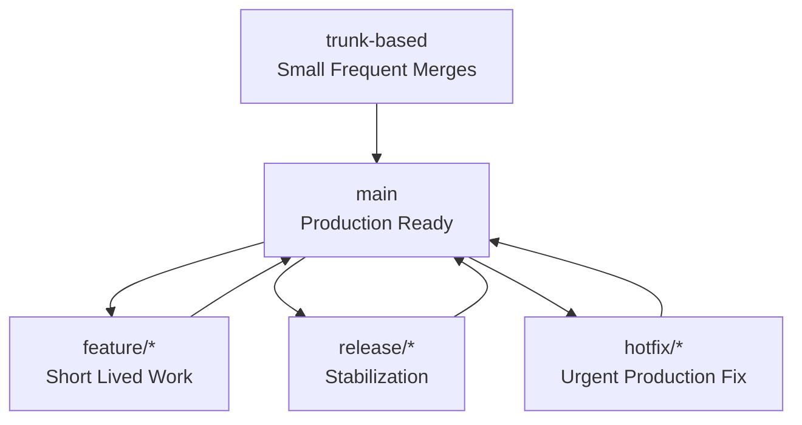

# Git and Version Control

> **📌 Disclaimer**: Any third-party logos, screenshots, or diagrams referenced in this document are used for educational purposes only. All trademarks belong to their respective owners.


[Back to guide index](README.md)

### 2.1 Why Git matters in DevOps
Git is the system of record for application code, infrastructure definitions, CI pipelines, Kubernetes manifests, Helm charts, policies, and documentation. In DevOps, Git is not just source control. It is the trigger point for automation.

### 2.2 Git configuration basics
```bash
git config --global user.name "Your Name"
git config --global user.email "you@example.com"
git config --global init.defaultBranch main
git config --global pull.rebase false
git config --global core.editor vim
```

Example `~/.gitconfig`:
```ini
[user]
    name = Your Name
    email = you@example.com
[init]
    defaultBranch = main
[pull]
    rebase = false
[core]
    editor = vim
[alias]
    st = status -sb
    co = checkout
    br = branch
    lg = log --oneline --graph --decorate --all
[merge]
    ff = only
```

### 2.3 Repository lifecycle basics
```bash
# initialize a repository
git init

# clone a remote repository
git clone git@github.com:org/project.git

# see current status
git status

# stage changes
git add .

# commit changes
git commit -m "Add deployment config"

# see history
git log --oneline --graph --decorate --all
```

### 2.4 Common Git commands for DevOps engineers

| Command | Purpose |
|---|---|
| `git init` | Start a new repository |
| `git clone` | Copy an existing repository |
| `git status` | Show working tree changes |
| `git add` | Stage files |
| `git commit` | Save staged changes |
| `git pull` | Fetch and integrate changes |
| `git fetch` | Download remote refs only |
| `git push` | Publish local changes |
| `git branch` | List or manage branches |
| `git checkout` | Switch branches or restore files |
| `git switch` | Modern branch switch command |
| `git merge` | Merge history |
| `git rebase` | Replay commits onto another base |
| `git cherry-pick` | Apply selected commit(s) |
| `git stash` | Temporarily save local changes |
| `git tag` | Mark versions/releases |

### 2.5 Branching and merging workflow
```bash
# create and switch to a branch
git switch -c feature/add-healthcheck

# push and set upstream
git push -u origin feature/add-healthcheck

# merge main into your branch
git fetch origin
git merge origin/main

# open a pull request after push
```

### 2.6 Rebase workflow
Rebasing keeps history linear, but must be used carefully on shared branches.

```bash
git fetch origin
git rebase origin/main

# if conflicts occur, resolve files then
git add conflicted-file
git rebase --continue
```

Use rebase when:
- You want a clean feature branch history.
- Your team accepts rebased feature branches.
- You have not published the branch widely, or teammates agree on the process.

Avoid rebasing:
- Shared branches with multiple contributors unless coordinated.
- Release branches in tightly controlled environments where audit trail matters.

### 2.7 Cherry-pick workflow
Cherry-pick is useful when hotfixes need to move selectively across branches.

```bash
# apply a commit from another branch
git cherry-pick abc1234

# cherry-pick a range
git cherry-pick startSHA^..endSHA
```

### 2.8 Stashing changes
```bash
git stash push -m "wip debug nginx issue"
git stash list
git stash pop
```

### 2.9 Tags and releases
```bash
git tag -a v1.2.0 -m "Release v1.2.0"
git push origin v1.2.0
```

Tags are often used by CI/CD systems to trigger release pipelines.

### 2.10 Undo operations carefully
```bash
# unstage a file
git restore --staged README.md

# discard local changes in a file
git restore README.md

# revert a commit safely
git revert HEAD

# reset branch to a prior commit locally only
git reset --hard HEAD~1
```

### 2.11 Git branching strategies diagram

### 📸 Git Branching Model

> *Git — Distributed version control system*



### 2.12 GitFlow overview
GitFlow is a branch-heavy workflow with long-lived branches like `main`, `develop`, `release/*`, and `hotfix/*`.

Typical flow:
1. Create feature branch from `develop`.
2. Merge feature into `develop`.
3. Cut release branch from `develop`.
4. Stabilize release branch.
5. Merge release to `main` and back to `develop`.
6. Create hotfix from `main` if needed.

Advantages:
- Clear release staging structure.
- Works well for scheduled release trains.

Trade-offs:
- More merge overhead.
- Slower feedback.
- Less aligned with continuous delivery.

### 2.13 Trunk-based development overview
Trunk-based development uses one main integration branch, short-lived feature branches, and frequent merges.

Advantages:
- Faster integration.
- Fewer merge conflicts.
- Better fit for CI/CD.
- Encourages feature flags and smaller changes.

Trade-offs:
- Requires stronger automated tests.
- Teams must keep branch lifetimes short.

### 2.14 Git hooks
Git hooks automate local or server-side checks.

Common hooks:
- `pre-commit`
- `commit-msg`
- `pre-push`
- `post-merge`

Example `pre-commit` hook:
```bash
#!/usr/bin/env bash
set -euo pipefail

if grep -R "password=" .; then
  echo "Potential secret detected"
  exit 1
fi
```

Store hooks in `.git/hooks` or manage them with tools like Husky, pre-commit, or Lefthook.

### 2.15 Secure Git usage in DevOps
- Never commit secrets.
- Use `.gitignore` aggressively for credentials, `.env`, and artifacts.
- Scan for secrets in CI.
- Sign commits if required by policy.
- Protect main branches with reviews and status checks.

Example `.gitignore`:
```gitignore
.env
*.pem
*.key
node_modules/
.terraform/
*.tfstate
*.tfstate.backup
```

### 2.16 Git remotes
```bash
git remote -v
git remote add origin git@github.com:org/repo.git
git remote set-url origin git@github.com:org/repo.git
```

### 2.17 Working with submodules
```bash
git submodule add git@github.com:org/shared-lib.git vendor/shared-lib
git submodule update --init --recursive
```

Use submodules carefully; they add operational complexity.

### 2.18 Git bisect for incident debugging
```bash
git bisect start
git bisect bad
git bisect good v1.0.0
# test each revision until culprit found
git bisect reset
```

### 2.19 Patch-based collaboration
```bash
git format-patch -1 HEAD
git apply change.patch
```

### 2.20 Git reflog for recovery
```bash
git reflog
git reset --hard HEAD@{2}
```

### 2.21 Pull request best practices
- Keep PRs small.
- Include rollout and rollback notes.
- Link changes to tickets.
- Require CI checks.
- Include screenshots or logs when relevant.
- Explain infrastructure impact clearly.

### 2.22 GitOps connection
In GitOps, Git becomes the desired-state source for infrastructure and deployment configuration. Reconciliation agents compare cluster state to Git state and continuously close drift.

### 2.23 Sample release workflow
```bash
git switch main
git pull --ff-only
git tag -a v2.3.1 -m "Release v2.3.1"
git push origin main --tags
```

### 2.24 Daily Git checklist for DevOps teams
- Validate branch protections.
- Review stale branches.
- Enforce secret scanning.
- Ensure release tags are signed or controlled.
- Keep CI pipeline definitions versioned.

---
