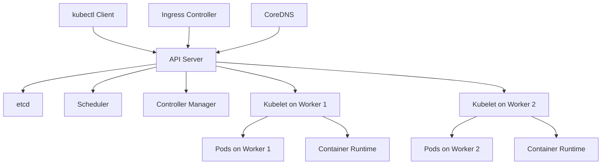

# Kubernetes on Linux

[Back to guide index](README.md)

### 5.1 Why Linux matters for Kubernetes
Kubernetes nodes are primarily Linux systems. Kubernetes relies on Linux primitives such as cgroups, namespaces, iptables/nftables, overlay networks, and container runtimes.

### 5.2 Kubernetes architecture diagram

### 📸 Kubernetes Architecture

> *Source: Wikimedia Commons — Kubernetes cluster architecture*



### 5.3 kubeadm cluster setup overview
kubeadm is a common way to bootstrap a Kubernetes cluster on Linux for labs, learning, or some production models.

High-level steps:
1. Prepare Linux nodes.
2. Install container runtime.
3. Install kubeadm, kubelet, kubectl.
4. Initialize control plane.
5. Join workers.
6. Install CNI plugin.

### 5.4 Linux prerequisites for kubeadm
- Swap disabled.
- Required kernel modules loaded.
- Sysctl settings enabled.
- Container runtime installed.
- Time synchronized.
- Unique hostname and MAC per node.

Example setup:
```bash
sudo swapoff -a
sudo sed -i '/ swap / s/^/#/' /etc/fstab

cat <<EOF | sudo tee /etc/modules-load.d/k8s.conf
overlay
br_netfilter
EOF

sudo modprobe overlay
sudo modprobe br_netfilter

cat <<EOF | sudo tee /etc/sysctl.d/k8s.conf
net.bridge.bridge-nf-call-iptables = 1
net.bridge.bridge-nf-call-ip6tables = 1
net.ipv4.ip_forward = 1
EOF

sudo sysctl --system
```

### 5.5 Installing containerd
```bash
sudo apt update
sudo apt install -y containerd
sudo mkdir -p /etc/containerd
containerd config default | sudo tee /etc/containerd/config.toml
sudo systemctl restart containerd
sudo systemctl enable containerd
```

### 5.6 Installing Kubernetes packages
```bash
sudo apt update
sudo apt install -y apt-transport-https ca-certificates curl gpg
curl -fsSL https://pkgs.k8s.io/core:/stable:/v1.29/deb/Release.key | \
  sudo gpg --dearmor -o /etc/apt/keyrings/kubernetes-apt-keyring.gpg
echo 'deb [signed-by=/etc/apt/keyrings/kubernetes-apt-keyring.gpg] https://pkgs.k8s.io/core:/stable:/v1.29/deb/ /' | \
  sudo tee /etc/apt/sources.list.d/kubernetes.list
sudo apt update
sudo apt install -y kubelet kubeadm kubectl
sudo apt-mark hold kubelet kubeadm kubectl
```

### 5.7 Initialize control plane
```bash
sudo kubeadm init --pod-network-cidr=10.244.0.0/16
```

Then configure kubectl:
```bash
mkdir -p $HOME/.kube
sudo cp -i /etc/kubernetes/admin.conf $HOME/.kube/config
sudo chown $(id -u):$(id -g) $HOME/.kube/config
```

### 5.8 Install a CNI plugin
Example using Flannel:
```bash
kubectl apply -f https://github.com/flannel-io/flannel/releases/latest/download/kube-flannel.yml
```

### 5.9 Join worker nodes
Run the `kubeadm join` command produced by `kubeadm init` on each worker.

### 5.10 kubectl cheat sheet
```bash
kubectl get nodes
kubectl get pods -A
kubectl describe pod mypod
kubectl logs mypod
kubectl logs -f deployment/myapp
kubectl exec -it mypod -- /bin/sh
kubectl get svc,ingress
kubectl get events --sort-by=.lastTimestamp
kubectl top nodes
kubectl top pods -A
```

### 5.11 Pods
Pods are the smallest deployable unit in Kubernetes.

Example pod:
```yaml
apiVersion: v1
kind: Pod
metadata:
  name: nginx
spec:
  containers:
    - name: nginx
      image: nginx:1.25
      ports:
        - containerPort: 80
```

### 5.12 Deployments
Deployments manage desired replica count and rollout strategy.

Example deployment:
```yaml
apiVersion: apps/v1
kind: Deployment
metadata:
  name: web
spec:
  replicas: 3
  selector:
    matchLabels:
      app: web
  template:
    metadata:
      labels:
        app: web
    spec:
      containers:
        - name: nginx
          image: nginx:1.25
          ports:
            - containerPort: 80
```

### 5.13 Services
Service types:
- ClusterIP
- NodePort
- LoadBalancer
- ExternalName

Example service:
```yaml
apiVersion: v1
kind: Service
metadata:
  name: web
spec:
  selector:
    app: web
  ports:
    - port: 80
      targetPort: 80
  type: ClusterIP
```

### 5.14 Ingress
Ingress manages HTTP(S) routing into services.

Example ingress:
```yaml
apiVersion: networking.k8s.io/v1
kind: Ingress
metadata:
  name: web
spec:
  ingressClassName: nginx
  rules:
    - host: web.example.com
      http:
        paths:
          - path: /
            pathType: Prefix
            backend:
              service:
                name: web
                port:
                  number: 80
```

### 5.15 ConfigMaps
ConfigMaps store non-secret configuration.

```bash
kubectl create configmap app-config --from-literal=APP_MODE=prod
```

Example usage:
```yaml
envFrom:
  - configMapRef:
      name: app-config
```

### 5.16 Secrets
Secrets store sensitive values, but need careful handling.

```bash
kubectl create secret generic db-creds \
  --from-literal=username=app \
  --from-literal=password='supersecret'
```

Notes:
- Base64 is encoding, not encryption.
- Enable encryption at rest.
- Prefer external secret managers for high-security environments.

### 5.17 RBAC basics
RBAC controls access to Kubernetes resources.

Example role:
```yaml
apiVersion: rbac.authorization.k8s.io/v1
kind: Role
metadata:
  namespace: default
  name: pod-reader
rules:
  - apiGroups: [""]
    resources: ["pods"]
    verbs: ["get", "list", "watch"]
```

RoleBinding:
```yaml
apiVersion: rbac.authorization.k8s.io/v1
kind: RoleBinding
metadata:
  name: read-pods
  namespace: default
subjects:
  - kind: User
    name: jane@example.com
    apiGroup: rbac.authorization.k8s.io
roleRef:
  kind: Role
  name: pod-reader
  apiGroup: rbac.authorization.k8s.io
```

### 5.18 Helm overview
Helm is the package manager for Kubernetes.

```bash
helm repo add bitnami https://charts.bitnami.com/bitnami
helm repo update
helm install my-nginx bitnami/nginx
helm list -A
helm upgrade my-nginx bitnami/nginx
helm rollback my-nginx 1
```

### 5.19 Helm chart structure
```text
mychart/
├── Chart.yaml
├── values.yaml
├── templates/
└── charts/
```

### 5.20 Namespace strategy
Use namespaces to isolate teams, environments, or applications.

```bash
kubectl create namespace payments
kubectl config set-context --current --namespace=payments
```

### 5.21 Resource requests and limits
```yaml
resources:
  requests:
    cpu: "100m"
    memory: "128Mi"
  limits:
    cpu: "500m"
    memory: "512Mi"
```

### 5.22 Health probes
```yaml
livenessProbe:
  httpGet:
    path: /health
    port: 8080
  initialDelaySeconds: 10
readinessProbe:
  httpGet:
    path: /ready
    port: 8080
  initialDelaySeconds: 5
```

### 5.23 Rolling updates
```bash
kubectl rollout status deployment/web
kubectl rollout history deployment/web
kubectl rollout undo deployment/web
```

### 5.24 Troubleshooting pods on Linux
- Check events.
- Check logs.
- Inspect image pull errors.
- Verify DNS.
- Verify node pressure.
- Inspect CNI plugin health.
- Check kubelet logs.

Useful commands:
```bash
kubectl describe pod web-123
kubectl logs web-123 --previous
journalctl -u kubelet -n 200 --no-pager
crictl ps -a
crictl logs CONTAINER_ID
```

### 5.25 Storage basics
Common storage patterns:
- `emptyDir`
- hostPath
- PersistentVolume
- PersistentVolumeClaim
- StorageClass

### 5.26 Example PVC
```yaml
apiVersion: v1
kind: PersistentVolumeClaim
metadata:
  name: data
spec:
  accessModes:
    - ReadWriteOnce
  resources:
    requests:
      storage: 10Gi
```

### 5.27 Security basics
- Use RBAC.
- Limit service account permissions.
- Use NetworkPolicies.
- Scan images.
- Sign images where possible.
- Enforce Pod Security Standards.

### 5.28 NetworkPolicy example
```yaml
apiVersion: networking.k8s.io/v1
kind: NetworkPolicy
metadata:
  name: allow-ingress-from-ingress-controller
spec:
  podSelector:
    matchLabels:
      app: web
  policyTypes:
    - Ingress
  ingress:
    - from:
        - namespaceSelector:
            matchLabels:
              name: ingress-nginx
```

### 5.29 Common production add-ons
- Ingress controller
- cert-manager
- metrics-server
- Prometheus stack
- external-dns
- external-secrets
- cluster-autoscaler

### 5.30 Kubernetes operational checklist
- Backup etcd or use managed control plane.
- Patch nodes regularly.
- Rotate certificates and tokens.
- Enforce policies.
- Monitor control plane and workloads.
- Test restore procedures.

---
