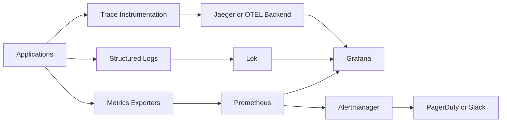

# Monitoring and Observability

[Back to guide index](README.md)

### 6.1 Why observability matters
Observability lets teams detect, understand, and remediate issues using metrics, logs, and traces. Linux is the typical platform for agents, collectors, and backends.

### 6.2 Observability stack diagram


### 6.3 The three pillars
- Metrics: numeric time-series data.
- Logs: event records.
- Traces: distributed request paths.

### 6.4 Prometheus overview
Prometheus scrapes metrics endpoints and stores time-series data locally.

Key concepts:
- Targets
- Exporters
- PromQL
- Alerts
- Service discovery

### 6.5 Prometheus installation on Linux
Binary-based installation outline:
```bash
sudo useradd --no-create-home --shell /usr/sbin/nologin prometheus
curl -LO https://github.com/prometheus/prometheus/releases/latest/download/prometheus-*.linux-amd64.tar.gz
# extract, copy binaries, create config and service
```

### 6.6 Minimal Prometheus config
```yaml
global:
  scrape_interval: 15s

scrape_configs:
  - job_name: prometheus
    static_configs:
      - targets: ['localhost:9090']
  - job_name: node
    static_configs:
      - targets: ['server1:9100', 'server2:9100']
```

### 6.7 node_exporter
node_exporter exposes Linux host metrics.

Common metrics:
- CPU usage
- Memory usage
- Disk utilization
- Filesystem errors
- Network statistics
- Load average

Run example:
```bash
./node_exporter
```

### 6.8 Useful PromQL examples
```promql
up
rate(node_cpu_seconds_total{mode!="idle"}[5m])
node_memory_MemAvailable_bytes / node_memory_MemTotal_bytes * 100
sum(rate(container_cpu_usage_seconds_total[5m])) by (pod)
```

### 6.9 Alertmanager overview
Alertmanager handles routing, grouping, silencing, and deduplication of Prometheus alerts.

Example routing snippet:
```yaml
route:
  receiver: default
  routes:
    - matchers:
        - severity="critical"
      receiver: pagerduty

receivers:
  - name: default
  - name: pagerduty
    pagerduty_configs:
      - routing_key: YOUR_KEY
```

### 6.10 Grafana overview
Grafana provides dashboards and alert visualization across metrics, logs, and traces.

Best practices:
- Standardize dashboard folders.
- Use variables.
- Keep dashboards actionable.
- Version control dashboard JSON or provisioning files.

### 6.11 Loki for logs
Loki stores logs efficiently by indexing labels rather than full text. It integrates tightly with Grafana.

Typical flow:
- promtail or agent ships logs.
- Loki stores them.
- Grafana queries them.

### 6.12 Jaeger for tracing
Jaeger helps follow distributed requests through microservices.

Use cases:
- Latency investigation.
- Service dependency mapping.
- Root cause analysis.

### 6.13 OpenTelemetry in observability stacks
OpenTelemetry standardizes collection of metrics, logs, and traces.

Benefits:
- Vendor-neutral instrumentation.
- Consistent data pipeline.
- Flexible export targets.

### 6.14 Golden signals
The four golden signals:
- Latency
- Traffic
- Errors
- Saturation

### 6.15 RED and USE methods
RED for services:
- Rate
- Errors
- Duration

USE for resources:
- Utilization
- Saturation
- Errors

### 6.16 Host monitoring checklist
- CPU busy and steal time.
- Memory available and swap use.
- Disk usage and inode pressure.
- Network errors and drops.
- Process count.
- Service restarts.

### 6.17 Example node_exporter systemd unit
```ini
[Unit]
Description=Prometheus Node Exporter
After=network.target

[Service]
User=node_exporter
ExecStart=/usr/local/bin/node_exporter
Restart=always

[Install]
WantedBy=multi-user.target
```

### 6.18 Dashboard categories
| Dashboard | Typical Panels |
|---|---|
| Host | CPU, memory, disk, network |
| Kubernetes | cluster, node, pod, namespace |
| Application | request rate, latency, errors |
| CI/CD | pipeline duration, failure rate |
| Database | QPS, latency, locks, replication lag |

### 6.19 Alert design principles
- Alert on symptoms users feel.
- Avoid noisy thresholds.
- Include runbook links.
- Tune severity and routing.
- Use multi-window burn-rate alerts for SLOs.

### 6.20 Example Prometheus alert rule
```yaml
groups:
  - name: host
    rules:
      - alert: HostOutOfDisk
        expr: (node_filesystem_avail_bytes{fstype!="tmpfs"} / node_filesystem_size_bytes{fstype!="tmpfs"}) < 0.1
        for: 10m
        labels:
          severity: warning
        annotations:
          summary: Host disk nearly full
          description: Less than 10 percent disk space available.
```

### 6.21 Log-to-metric patterns
Examples:
- Count HTTP 5xx from logs.
- Detect auth failures.
- Track deployment events.
- Build synthetic error rates from audit logs.

### 6.22 Tracing adoption tips
- Start with ingress and key APIs.
- Propagate trace headers consistently.
- Sample intelligently.
- Correlate traces with logs and metrics.

### 6.23 Linux operations for observability services
- Allocate enough disk for TSDB and logs.
- Tune retention.
- Monitor scrape failures.
- Back up dashboards and alert configs.
- Secure endpoints with auth and network controls.

### 6.24 Blackbox monitoring
Blackbox probes validate endpoints externally.

Example checks:
- HTTP reachability
- TLS expiry
- DNS resolution
- TCP connectivity

### 6.25 Production observability checklist
- Metrics, logs, traces integrated.
- Alert ownership defined.
- Runbooks linked.
- Retention policies set.
- Capacity forecast reviewed.

---
