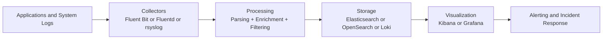

# Log Aggregation

[Back to guide index](README.md)

### 7.1 Why centralized logging matters
Logs scattered across Linux hosts are hard to search during incidents. Centralized logging enables correlation, retention, and investigation.

### 7.2 Log pipeline diagram


### 7.3 ELK and EFK overview
- ELK: Elasticsearch, Logstash, Kibana.
- EFK: Elasticsearch, Fluentd, Kibana.

Typical roles:
- Collector/shipper gathers logs.
- Processor parses and enriches.
- Store indexes and retains.
- UI supports search and dashboards.

### 7.4 Fluentd and Fluent Bit
Fluentd is a powerful log processor. Fluent Bit is lighter weight and ideal for node-level collection.

### 7.5 rsyslog forwarding
rsyslog can forward traditional syslog streams to a remote collector.

Example config:
```conf
*.* action(type="omfwd" target="logs.example.com" port="514" protocol="tcp")
```

### 7.6 Structured logging basics
Prefer JSON logs with fields such as:
- timestamp
- level
- service
- environment
- trace_id
- request_id
- user_id when allowed
- message

Example:
```json
{"timestamp":"2025-01-20T10:15:00Z","level":"error","service":"payments-api","trace_id":"abc123","message":"database timeout"}
```

### 7.7 Common Linux log sources
| Source | Path or Command |
|---|---|
| systemd journal | `journalctl` |
| Syslog | `/var/log/syslog` or `/var/log/messages` |
| Auth logs | `/var/log/auth.log` or `/var/log/secure` |
| Nginx | `/var/log/nginx/` |
| Application logs | `/var/log/app/` or stdout/stderr |
| Kubernetes pod logs | `/var/log/containers/` |

### 7.8 Journal shipping considerations
If applications log to stdout under systemd, the journal becomes the collection point. Use agents that can read journald efficiently.

### 7.9 Example Fluent Bit input and output
```ini
[INPUT]
    Name tail
    Path /var/log/nginx/access.log
    Tag nginx.access

[OUTPUT]
    Name es
    Match nginx.*
    Host elasticsearch.example.com
    Port 9200
    Index nginx-logs
```

### 7.10 Parsing patterns
Common parsing targets:
- Apache/Nginx access logs
- JSON app logs
- Syslog format
- Multiline Java stack traces

### 7.11 Elasticsearch basics for log ops
Key topics:
- Index lifecycle management
- Shards and replicas
- Retention
- Mapping control
- Search performance

### 7.12 Kibana dashboards
Use Kibana or Grafana dashboards to:
- Explore errors by service.
- Track 5xx spikes.
- Investigate deployment windows.
- Inspect auth or security events.

### 7.13 Loki as a simpler log stack
Loki is attractive when:
- You already use Grafana.
- You want lower index cost.
- You rely on labels more than full-text indexing.

### 7.14 Logging anti-patterns
- Logging secrets.
- Unbounded debug logs in production.
- Free-form messages with no structure.
- No correlation IDs.
- No retention policy.

### 7.15 Retention planning
Retention depends on:
- Compliance needs.
- Incident investigation windows.
- Cost constraints.
- Storage performance.

### 7.16 Security logging basics
Collect logs for:
- Authentication failures.
- sudo usage.
- SSH logins.
- IAM/API calls.
- Container runtime events.
- Auditd events where required.

### 7.17 Example rsyslog TCP listener
```conf
module(load="imtcp")
input(type="imtcp" port="514")
```

### 7.18 Example logrotate policy
```conf
/var/log/myapp/*.log {
    daily
    rotate 14
    compress
    missingok
    notifempty
    copytruncate
}
```

### 7.19 Kubernetes logging notes
- Write app logs to stdout/stderr.
- Use DaemonSet collectors.
- Attach pod, namespace, and cluster metadata.
- Control cardinality in labels.

### 7.20 Production logging checklist
- Structured logs enabled.
- Sensitive fields redacted.
- Central retention configured.
- Alert queries tested.
- Correlation IDs propagated.

---
