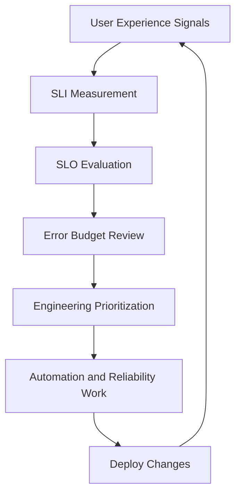

# SRE Practices

[Back to guide index](README.md)

### 10.1 What is ChatOps
ChatOps connects operational workflows to collaboration platforms like Slack or Microsoft Teams. Teams can observe alerts, run approved commands, coordinate incidents, and reference runbooks from chat.

### 10.2 Why ChatOps helps DevOps teams
- Faster collaboration.
- Shared situational awareness.
- Auditable operational actions.
- Easier coordination during incidents.

### 10.3 PagerDuty overview
PagerDuty manages on-call schedules, alert routing, escalation policies, and incident response coordination.

### 10.4 Opsgenie overview
Opsgenie provides alerting, escalation, and on-call management similar to PagerDuty, often integrated with Atlassian ecosystems.

### 10.5 Slack integrations
Common integrations:
- Alertmanager to Slack.
- CI/CD deployment notifications.
- Runbook bots.
- Incident channel automation.

### 10.6 Typical incident flow
1. Alert fires.
2. Alert routed to on-call.
3. Chat channel created.
4. Roles assigned.
5. Runbook followed.
6. Mitigation or rollback applied.
7. Postmortem scheduled.

### 10.7 Runbooks
Runbooks should include:
- Symptom.
- Detection source.
- Immediate checks.
- Commands to run.
- Safe remediation options.
- Escalation path.
- Rollback steps.

### 10.8 Example runbook skeleton
```text
Title: High 5xx rate on payments API
Impact: Checkout failures
Checks:
1. Grafana dashboard link
2. kubectl get pods -n payments
3. kubectl logs deploy/payments-api -n payments --tail=100
4. Check database latency panel
Mitigation:
- Roll back deployment
- Scale up pods
- Fail over to standby DB if applicable
Escalation:
- Database team
- Platform team
```

### 10.9 Incident roles
| Role | Responsibility |
|---|---|
| Incident Commander | Coordinates response |
| Communications Lead | Updates stakeholders |
| Operations Lead | Executes mitigation |
| Subject Matter Expert | Deep technical support |
| Scribe | Notes timeline and actions |

### 10.10 Alert quality principles
- Actionable.
- Routed to owners.
- Includes context.
- Avoids duplicates.
- Tied to service impact where possible.

### 10.11 ChatOps command safety
If bots can trigger ops actions:
- Require RBAC.
- Log all commands.
- Use approvals for destructive actions.
- Restrict production actions.

### 10.12 Deployment notifications
Notify teams about:
- Deployment started.
- Deployment succeeded.
- Deployment failed.
- Rollback executed.
- Change summary.

### 10.13 Incident metrics
Track:
- MTTA
- MTTR
- Alert volume
- False positive rate
- Escalation count
- Repeat incidents

### 10.14 Post-incident review inputs
Collect:
- Alert data.
- Timeline.
- Deployment history.
- Infra changes.
- Logs, metrics, traces.
- Communication history.

### 10.15 ChatOps checklist
- Critical alerts integrated.
- Incident templates ready.
- Runbook links included.
- Escalation policies reviewed.
- Bot permissions controlled.

---

---

## 11. SRE Practices

### 11.1 SRE and DevOps relationship
SRE applies software engineering to operations. DevOps emphasizes collaboration and automation. In practice, strong DevOps organizations adopt many SRE principles.

### 11.2 SLI, SLO, SLA definitions
- SLI: Service Level Indicator, a measured signal.
- SLO: Service Level Objective, a target for the SLI.
- SLA: Service Level Agreement, an external contractual commitment.

Example:
- SLI: successful API requests / total API requests.
- SLO: 99.9 percent success over 30 days.
- SLA: 99.5 percent contractual uptime.

### 11.3 Error budgets
Error budget = acceptable unreliability within an SLO period.

Why it matters:
- Balances delivery speed and reliability.
- Helps decide when to slow feature releases.
- Supports objective reliability decisions.

### 11.4 Toil reduction
Toil is repetitive, manual, automatable work tied to service operation.

Examples:
- Repeated restarts.
- Manual log scraping.
- Hand-driven failovers.
- Repetitive access grants.

Reduce toil with:
- Self-service automation.
- Better monitoring.
- Runbooks turned into scripts.
- Platform abstractions.

### 11.5 Postmortems
Good postmortems are:
- Blameless.
- Specific.
- Focused on system causes.
- Action-oriented.

Typical sections:
- Summary.
- Impact.
- Timeline.
- Root causes.
- Contributing factors.
- What went well.
- What went poorly.
- Action items.

### 11.6 Chaos engineering
Chaos engineering tests system resilience under controlled failure.

Goals:
- Validate assumptions.
- Discover weak points.
- Improve recovery confidence.

### 11.7 Chaos tools
- Litmus
- Chaos Monkey
- Gremlin
- PowerfulSeal

### 11.8 SRE feedback loop diagram


### 11.9 Example SLI formulas
Availability:
```text
successful requests / valid requests
```

Latency:
```text
percentage of requests below threshold
```

### 11.10 Multi-window burn rate alerts
Burn-rate alerts detect when error budget is consumed too quickly using short and long windows.

### 11.11 Capacity planning basics
Watch:
- CPU growth
- Memory pressure
- Storage growth
- QPS trends
- Queue depth
- Replica utilization

### 11.12 Reliability design patterns
- Retries with backoff.
- Circuit breakers.
- Bulkheads.
- Timeouts.
- Idempotency.
- Graceful degradation.

### 11.13 Deployment safety patterns
- Feature flags.
- Canary releases.
- Blue/green deployments.
- Automatic rollback.
- Progressive delivery.

### 11.14 Operational maturity checklist
- Services have owners.
- SLOs defined.
- Alerts tied to symptoms.
- Runbooks exist.
- Postmortems drive improvements.
- Toil is tracked and reduced.

### 11.15 Example postmortem action items
- Add DB latency alert.
- Add canary analysis to deployment.
- Reduce pod startup time.
- Improve secret rotation automation.
- Create dashboard for retry storm detection.

---

---

## 12. Linux Command Reference for DevOps

### 12.1 File and directory operations
```bash
pwd
ls -lah
mkdir -p /opt/myapp/releases
cp -a source/ target/
mv old.conf new.conf
rm -rf old_directory
ln -s /opt/myapp/current /srv/myapp
```

### 12.2 Permissions and ownership
```bash
chmod 755 script.sh
chmod 640 app.conf
chown -R app:app /opt/myapp
chgrp ops /var/log/myapp.log
```

### 12.3 Search and text processing
```bash
grep -R "ERROR" /var/log/myapp
awk '{print $1}' access.log
sed -n '1,20p' file.txt
cut -d: -f1 /etc/passwd
sort data.txt | uniq -c
```

### 12.4 Archives and compression
```bash
tar -czf backup.tar.gz /etc/myapp
unzip archive.zip
gzip app.log
```

### 12.5 Process inspection
```bash
ps aux
ps -ef
pgrep nginx
pidof sshd
kill -15 1234
kill -9 1234
nice -n 10 ./batch-job
```

### 12.6 Service management
```bash
systemctl list-units --type=service
systemctl restart nginx
systemctl is-enabled docker
journalctl -xe --no-pager
```

### 12.7 Networking
```bash
ip addr
ip route
ss -tulpn
ping -c 4 8.8.8.8
traceroute example.com
curl -fsS https://example.com/health
dig example.com +short
```

### 12.8 Storage and memory
```bash
df -h
du -sh /var/lib/* | sort -h
lsblk
mount
free -h
vmstat 1 5
iostat -xz 1 5
```

### 12.9 User and group management
```bash
id
whoami
sudo useradd -m deploy
sudo passwd deploy
sudo usermod -aG sudo deploy
sudo groupadd appgroup
```

### 12.10 SSH and transfer
```bash
ssh user@host
scp file.txt user@host:/tmp/
rsync -avz ./build/ user@host:/opt/app/
```

### 12.11 Scheduling
```bash
crontab -l
crontab -e
systemctl list-timers
```

### 12.12 Container tooling
```bash
docker ps
docker logs container_id
docker exec -it container_id /bin/sh
docker images
ctr containers ls
crictl pods
```

### 12.13 Security inspection
```bash
sudo -l
getenforce
sestatus
ufw status
iptables -L -n
```

### 12.14 JSON and YAML tooling
```bash
jq . response.json
yq '.spec.template.spec.containers[0].image' deploy.yaml
```

### 12.15 Performance troubleshooting starters
```bash
top
htop
sar -u 1 5
sar -n DEV 1 5
strace -p 1234
lsof -i :443
```

---

---

## 13. Practical DevOps Scenarios on Linux

### 13.1 Investigating a failing web service
Checklist:
1. `systemctl status service`
2. `journalctl -u service -n 200 --no-pager`
3. `ss -tulpn`
4. `curl -v localhost:port/health`
5. Check config and recent deployment changes.

### 13.2 Investigating high disk usage
```bash
df -h
du -xhd1 /var | sort -h
find /var/log -type f -size +100M
journalctl --disk-usage
```

### 13.3 Investigating DNS issues
```bash
cat /etc/resolv.conf
dig api.example.com
dig @8.8.8.8 api.example.com
nslookup api.example.com
```

### 13.4 Investigating TLS issues
```bash
openssl s_client -connect example.com:443 -servername example.com
curl -vk https://example.com
```

### 13.5 Investigating Kubernetes pod crashes
```bash
kubectl get pods -A
kubectl describe pod POD -n NS
kubectl logs POD -n NS --previous
kubectl get events -n NS --sort-by=.lastTimestamp
```

### 13.6 Investigating CI runner failures
```bash
systemctl status gitlab-runner
journalctl -u gitlab-runner -n 200 --no-pager
df -h
free -h
```

### 13.7 Rolling out a new app version safely
- Build immutable artifact.
- Scan it.
- Deploy to staging.
- Run smoke tests.
- Use canary or blue/green in production.
- Monitor golden signals.
- Keep rollback ready.

### 13.8 Backing up configuration
```bash
tar -czf etc-backup-$(date +%F).tar.gz /etc
```

### 13.9 Shipping logs to a central platform
- Standardize log paths or stdout usage.
- Deploy collectors.
- Parse and enrich.
- Set retention and alert queries.

### 13.10 Hardening a Linux CI host
- Minimal packages.
- Separate runner user.
- Restricted sudo.
- Automatic updates where allowed.
- Endpoint monitoring.
- Clean workspaces after builds.

---

---

## 14. DevOps Checklists

### 14.1 Linux host baseline checklist
- Time sync enabled.
- SSH hardened.
- sudo access reviewed.
- Monitoring agent installed.
- Log forwarding configured.
- Firewall configured.
- Backups validated.
- Patch policy defined.

### 14.2 Git repository checklist
- Branch protection enabled.
- CODEOWNERS defined.
- Secret scanning enabled.
- CI required on pull requests.
- Release tagging standard documented.

### 14.3 CI/CD checklist
- Pipelines version controlled.
- Secrets externalized.
- Artifacts immutable.
- Rollback path tested.
- Staging environment available.
- Deployment approvals where needed.

### 14.4 Kubernetes checklist
- Resource requests set.
- Liveness/readiness probes set.
- RBAC least privilege.
- Ingress TLS configured.
- Monitoring and logs integrated.
- Backup plan for stateful workloads.

### 14.5 Observability checklist
- Metrics dashboards exist.
- Logs searchable centrally.
- Tracing enabled for critical paths.
- Alerts routed correctly.
- Runbooks linked from alerts.

### 14.6 Incident management checklist
- On-call rotation current.
- Escalations tested.
- Incident templates ready.
- Status communication template ready.
- Postmortem process defined.

### 14.7 SRE checklist
- SLOs defined.
- Error budget reviewed.
- Toil tracked.
- Reliability roadmap maintained.
- Chaos or resilience tests scheduled.

---

---

## 15. Best Practices Summary

### 15.1 Linux best practices
- Automate repeatable work.
- Standardize service management with systemd.
- Prefer package-managed installs or controlled binaries.
- Log consistently.
- Minimize privilege.

### 15.2 Git best practices
- Keep branches short-lived.
- Review everything important.
- Protect mainline branches.
- Tag releases consistently.
- Avoid secret commits.

### 15.3 CI/CD best practices
- Build once, promote many.
- Fail fast.
- Keep pipelines observable.
- Use ephemeral agents when possible.
- Treat pipelines as production systems.

### 15.4 IaC best practices
- Use remote state.
- Review every change.
- Detect drift.
- Standardize modules.
- Embed policy checks.

### 15.5 Kubernetes best practices
- Define requests and limits.
- Use health probes.
- Secure service accounts.
- Prefer declarative deployment.
- Keep add-ons versioned.

### 15.6 Observability best practices
- Alert on user impact.
- Correlate metrics, logs, and traces.
- Avoid noisy dashboards.
- Keep runbooks close to alerts.

### 15.7 Security best practices
- Store secrets centrally.
- Rotate credentials.
- Scan code and images.
- Log access to critical systems.
- Prefer short-lived credentials.

### 15.8 Reliability best practices
- Set SLOs before over-optimizing.
- Automate rollback.
- Practice incidents.
- Write blameless postmortems.
- Reduce toil continuously.

---

---

## 16. Extended Reference Tables

### 16.1 Git command quick table
| Task | Command |
|---|---|
| New repo | `git init` |
| Clone repo | `git clone URL` |
| New branch | `git switch -c feature/x` |
| Rebase main | `git fetch origin && git rebase origin/main` |
| Stash work | `git stash push -m "msg"` |
| Tag release | `git tag -a v1.0.0 -m "Release"` |

### 16.2 kubectl quick table
| Task | Command |
|---|---|
| List pods | `kubectl get pods -A` |
| Describe pod | `kubectl describe pod NAME -n NS` |
| View logs | `kubectl logs NAME -n NS` |
| Exec shell | `kubectl exec -it NAME -n NS -- /bin/sh` |
| Rollout status | `kubectl rollout status deploy/NAME -n NS` |
| Scale deploy | `kubectl scale deploy/NAME --replicas=3 -n NS` |

### 16.3 systemd quick table
| Task | Command |
|---|---|
| Start service | `systemctl start NAME` |
| Stop service | `systemctl stop NAME` |
| Restart service | `systemctl restart NAME` |
| Enable service | `systemctl enable NAME` |
| View logs | `journalctl -u NAME --no-pager` |

### 16.4 Network quick table
| Task | Command |
|---|---|
| Listen ports | `ss -tulpn` |
| Routes | `ip route` |
| DNS lookup | `dig host +short` |
| HTTP test | `curl -I URL` |
| Packet capture | `tcpdump -i eth0 port 443` |

### 16.5 Observability component comparison
| Component | Purpose |
|---|---|
| Prometheus | Metrics collection and alerting |
| Grafana | Visualization |
| Loki | Log aggregation |
| Jaeger | Tracing |
| Alertmanager | Alert routing |

---

---

## 17. Learning Path

### 17.1 Beginner path
- Learn shell basics.
- Learn files, permissions, and processes.
- Learn Git basics.
- Learn systemd and logs.
- Learn basic networking.

### 17.2 Intermediate path
- Build CI pipelines.
- Learn Terraform basics.
- Learn container builds.
- Learn Kubernetes fundamentals.
- Learn metrics and logging.

### 17.3 Advanced path
- Operate self-hosted runners.
- Build reusable IaC modules.
- Tune Prometheus and Grafana.
- Manage secrets and policy as code.
- Define SLOs and error budgets.

### 17.4 Practice routine
Each week:
- Write one Bash script.
- Debug one service failure.
- Review one CI pipeline.
- Deploy one sample app.
- Improve one dashboard or alert.

---

---

## 18. Conclusion

Linux is the operational backbone of DevOps. If you master Linux fundamentals and connect them to Git, CI/CD, infrastructure as code, Kubernetes, observability, secrets, artifacts, ChatOps, and SRE practices, you become effective across the full software delivery lifecycle.

The essential pattern is consistent:
- Define systems declaratively.
- Automate everything repeatable.
- Observe production clearly.
- Secure access and secrets.
- Measure reliability.
- Learn from incidents.

Keep practicing commands, building pipelines, deploying services, and documenting runbooks. Production excellence in DevOps is built through repeated Linux fluency applied to real systems.

---

---

## 19. Appendix A: 100 Practical Linux One-Liners for DevOps

1. `uptime`
2. `free -h`
3. `df -h`
4. `du -sh /var/log/* | sort -h`
5. `ss -tulpn`
6. `ip addr`
7. `ip route`
8. `ping -c 4 1.1.1.1`
9. `dig github.com +short`
10. `curl -I https://example.com`
11. `journalctl -p err -b --no-pager`
12. `journalctl -u nginx -n 100 --no-pager`
13. `systemctl list-units --failed`
14. `ps aux --sort=-%cpu | head`
15. `ps aux --sort=-%mem | head`
16. `top`
17. `lsof -i :443`
18. `find /var/log -type f -mtime -1`
19. `find / -xdev -type f -size +500M 2>/dev/null`
20. `grep -R "ERROR" /var/log/myapp`
21. `awk '{print $9}' access.log | sort | uniq -c`
22. `cut -d' ' -f1 access.log | sort | uniq -c | sort -nr | head`
23. `sed -n '1,50p' /etc/nginx/nginx.conf`
24. `cat /etc/os-release`
25. `hostnamectl`
26. `timedatectl`
27. `who`
28. `last -n 10`
29. `id deploy`
30. `sudo -l`
31. `mount | column -t`
32. `lsblk`
33. `blkid`
34. `vmstat 1 5`
35. `iostat -xz 1 5`
36. `sar -u 1 5`
37. `sar -n DEV 1 5`
38. `tcpdump -i any port 53`
39. `openssl s_client -connect example.com:443 -servername example.com`
40. `curl -vk https://example.com`
41. `kubectl get pods -A`
42. `kubectl get events --sort-by=.lastTimestamp -A`
43. `kubectl top nodes`
44. `kubectl top pods -A`
45. `kubectl rollout status deploy/web -n app`
46. `helm list -A`
47. `docker ps`
48. `docker images`
49. `docker system df`
50. `docker logs CONTAINER_ID`
51. `docker exec -it CONTAINER_ID /bin/sh`
52. `crictl ps -a`
53. `ctr -n k8s.io containers ls`
54. `git status -sb`
55. `git log --oneline --graph --decorate --all | head -n 30`
56. `git branch -vv`
57. `git remote -v`
58. `git reflog | head`
59. `terraform fmt -check`
60. `terraform validate`
61. `terraform plan`
62. `ansible all -m ping`
63. `promtool check config prometheus.yml`
64. `curl -fsS localhost:9100/metrics | head`
65. `curl -fsS localhost:9090/-/ready`
66. `curl -fsS localhost:3000/api/health`
67. `vault status`
68. `sops -d secrets.enc.yaml | head`
69. `rsync -avz ./dist/ user@host:/opt/app/`
70. `scp config.yaml user@host:/etc/myapp/`
71. `tar -czf backup.tar.gz /etc/myapp`
72. `restorecon -Rv /var/www/html`
73. `getenforce`
74. `sestatus`
75. `ufw status verbose`
76. `iptables -S`
77. `nft list ruleset`
78. `sysctl -a | grep ip_forward`
79. `env | sort`
80. `printenv PATH`
81. `jq . response.json`
82. `yq '.metadata.name' manifest.yaml`
83. `watch -n 2 kubectl get pods -A`
84. `watch -n 2 'ss -s'`
85. `xargs -0`
86. `find . -type f -print0 | xargs -0 grep -n "TODO"`
87. `sort file.txt | uniq -d`
88. `paste file1 file2`
89. `comm -3 <(sort a.txt) <(sort b.txt)`
90. `diff -u a.conf b.conf`
91. `sha256sum artifact.tar.gz`
92. `gpg --verify file.sig file`
93. `crontab -l`
94. `systemctl list-timers --all`
95. `loginctl list-sessions`
96. `journalctl --disk-usage`
97. `dmesg | tail`
98. `uname -a`
99. `arch`
100. `which kubectl`

---

---

## 20. Appendix B: Extended Notes and Study Prompts

### 20.1 Study prompt list
- Explain the Linux boot process from firmware to systemd.
- Compare `ss`, `netstat`, and `lsof` for port debugging.
- Explain how cgroups and namespaces support containers.
- Explain why immutable artifacts improve deployment confidence.
- Explain the difference between logs, metrics, and traces using one incident example.
- Explain trunk-based development to a release-management team.
- Explain why Kubernetes secrets are not enough without broader secret strategy.
- Explain how SLOs influence release velocity.

### 20.2 Mini labs
1. Install Nginx on a Linux VM and expose a health endpoint.
2. Create a Git repo and simulate feature branching plus hotfix.
3. Build a Jenkins pipeline that runs `make test`.
4. Write a GitHub Actions workflow using a Linux runner.
5. Provision a bucket using Terraform.
6. Bootstrap a lab Kubernetes cluster with kubeadm.
7. Install Prometheus and node_exporter.
8. Send sample JSON logs into Loki or Elasticsearch.
9. Encrypt a file with SOPS.
10. Define one SLI and one SLO for a sample API.

### 20.3 Interview topics
- How do you debug a service outage on Linux?
- What is the difference between merge and rebase?
- How do you secure self-hosted CI runners?
- How do you manage Terraform state safely?
- How do you troubleshoot CrashLoopBackOff?
- How do you design actionable alerts?
- How do you reduce operational toil?

### 20.4 Final reminder
DevOps is not about memorizing tools. It is about using Linux-centered operational knowledge to build secure, automated, observable, and reliable delivery systems.

---

---

## 21. Line Expansion Reference

The following section intentionally expands the guide with concise production reminders so the document can serve as a long-form study reference and quick handbook.

### 21.1 Reminders
- Prefer reproducible automation over ad hoc commands.
- Record operational assumptions explicitly.
- Treat CI/CD outages as production-impacting platform incidents.
- Keep infrastructure state under version control.
- Standardize labels, tags, and naming.
- Review backup restore paths, not just backup success.
- Use immutable image digests for critical releases.
- Use smoke tests after every deployment.
- Add trace IDs to logs whenever possible.
- Tune alerts after incidents.
- Review on-call load for sustainability.
- Make rollback steps fast and boring.
- Keep build nodes disposable where possible.
- Separate duties for highly privileged systems.
- Audit secret access regularly.
- Prefer short-lived credentials.
- Validate time sync on all nodes.
- Track certificate expiration centrally.
- Use policy checks before apply or deploy.
- Keep documentation near the code.
- Practice failure recovery.
- Use namespaces and labels consistently.
- Control log cardinality.
- Monitor queue depth, not just CPU.
- Build once and promote the same artifact.
- Keep PRs small enough to review well.
- Prefer feature flags to long-lived branches.
- Ensure dashboards answer operational questions.
- Log what changed during incidents.
- Budget time for toil reduction.
- Back up configuration for critical services.
- Keep service ownership clear.
- Test access revocation procedures.
- Use canaries for high-risk changes.
- Watch disk inode usage, not only bytes.
- Watch error rate spikes during deployments.
- Rotate runner registration tokens.
- Prefer standard package repos or vetted binaries.
- Baseline host hardening in code.
- Design for graceful degradation.
- Keep runbooks command-focused.
- Remove manual release steps where possible.
- Validate health endpoints are meaningful.
- Prefer explicit dependencies in pipelines.
- Keep shell scripts idempotent.
- Use shellcheck in projects that already adopt it.
- Avoid mutable `latest` tags in production.
- Keep cluster add-ons versioned.
- Set resource requests realistically.
- Avoid over-privileged service accounts.
- Review emergency manual changes after incidents.
- Measure deploy frequency and change failure rate.
- Monitor storage growth trends.
- Standardize incident severity definitions.
- Link alerts to dashboards.
- Link dashboards to runbooks.
- Keep secret material out of build logs.
- Mask sensitive variables in CI.
- Separate dev, stage, and prod access boundaries.
- Prefer identity federation to static cloud keys.
- Use drift detection for important stacks.
- Control who can override pipeline gates.
- Keep release notes automated where possible.
- Use code reviews for infrastructure changes.
- Track mean time to restore, not just detect.
- Benchmark before and after performance tuning.
- Retire unused dashboards and alerts.
- Ensure DNS is part of troubleshooting checklists.
- Validate upstream dependency availability.
- Cache dependencies wisely but safely.
- Document non-obvious network paths.
- Monitor certificate renewal jobs.
- Harden artifact registries with RBAC.
- Keep audit trails for production actions.
- Use admission policies in Kubernetes where appropriate.
- Prefer declarative over imperative operations.
- Ensure backup credentials are also rotated.
- Test sealed secret recovery paths.
- Keep kubeconfig files protected.
- Ensure staging resembles production enough to matter.
- Track flaky tests and fix them quickly.
- Treat noise as a reliability bug.
- Review platform cost as part of system design.
- Keep ownership tags on cloud resources.
- Prefer standard Linux images with known baselines.
- Reduce one-off snowflake servers.
- Keep base images patched.
- Scan artifacts before promotion.
- Verify registry replication if multi-region.
- Practice node replacement in Kubernetes.
- Practice etcd restore in non-production.
- Prefer managed services when they reduce undifferentiated ops toil.
- Use port-forwarding carefully and temporarily.
- Rotate SSH keys and disable stale accounts.
- Keep cron jobs observable.
- Prefer systemd timers over ad hoc background scripts on modern Linux.
- Always capture post-change validation evidence.
- Make service dependencies visible.
- Control blast radius with progressive rollout.
- Review alert routing quarterly.
- Review service tiers and priorities.
- Keep incident communications simple and factual.
- Treat documentation drift like config drift.
- Review vendor SLAs but design for failure anyway.
- Keep packet capture as a last-resort but valuable skill.
- Learn enough SQL to inspect operational databases safely.
- Build confidence through drills, not only theory.

### 21.2 Additional command ideas
- `find /etc -type f | wc -l`
- `journalctl --since today --no-pager`
- `grep -R "Listen" /etc/nginx`
- `kubectl api-resources`
- `kubectl auth can-i list pods --all-namespaces`
- `helm template myapp ./chart`
- `git show HEAD~1`
- `git diff --stat origin/main...HEAD`
- `terraform output`
- `docker inspect IMAGE_ID`
- `crictl images`
- `ctr -n k8s.io images ls`
- `curl -fsS localhost:10248/healthz`
- `etcdctl endpoint health`
- `promtool check rules alerts.yml`
- `openssl x509 -in cert.pem -noout -dates`
- `nc -vz host 443`
- `route -n`
- `ip neigh`
- `resolvectl status`
- `systemd-analyze blame`
- `journalctl _PID=1234 --no-pager`
- `ls -l /proc/1234/fd`
- `cat /proc/meminfo`
- `cat /proc/cpuinfo | head`
- `ps -eo pid,ppid,cmd,%mem,%cpu --sort=-%cpu | head`
- `awk -F: '{print $1}' /etc/group`
- `find . -type f -name '*.yaml'`
- `grep -R "image:" k8s/`
- `sed -i 's/old/new/' file`
- `sha256sum *.tar.gz`
- `base64 -d secret.b64`
- `timeout 5 curl -fsS URL`
- `watch -n 1 'kubectl get ingress -A'`
- `systemctl cat nginx`
- `loginctl show-user deploy`
- `journalctl -k -n 100 --no-pager`
- `du -sh ~/.cache/* | sort -h | tail`
- `find /var/lib/docker -maxdepth 2 -type d | head`
- `docker system prune`
- `kubectl cordon NODE`
- `kubectl drain NODE --ignore-daemonsets --delete-emptydir-data`
- `kubectl uncordon NODE`
- `kubectl taint nodes NODE dedicated=ci:NoSchedule`
- `kubectl label namespace payments owner=team-payments`
- `helm get values RELEASE -n NS`
- `git clean -fd`
- `git stash branch debug-branch`
- `git cherry -v origin/main`
- `git verify-tag v1.0.0`
- `curl -fsS ifconfig.me`
- `tar -tf backup.tar.gz | head`
- `zgrep ERROR /var/log/*.gz`
- `strings binary | head`

### 21.3 Platform engineering tie-in
Platform engineering extends DevOps by building paved roads:
- Standard CI templates.
- Standard golden paths for services.
- Reusable Helm charts.
- Shared Terraform modules.
- Self-service environments.
- Central observability patterns.
- Secure defaults.

### 21.4 Final study advice
Read this guide section by section, then practice each domain on Linux. The fastest way to become strong in DevOps is to connect command-line confidence to delivery systems, reliability patterns, and production discipline.
