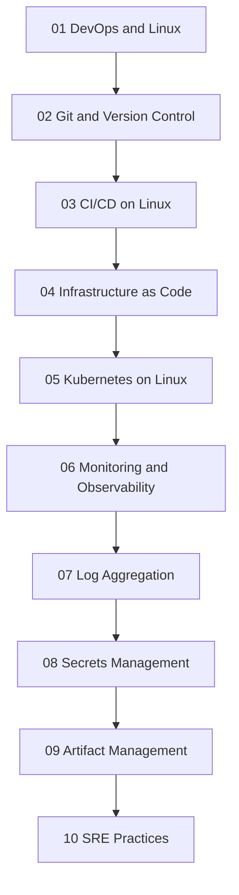

# Linux for DevOps Guide

---

## 🎬 DevOps Lifecycle — Animated Workflow

```mermaid
graph TD
    subgraph DEVOPS["♾️ DevOps Infinity Loop"]
        direction LR
        PLAN["📋 Plan"]:::plan --> CODE_D["💻 Code"]:::code
        CODE_D --> BUILD_D["🔨 Build"]:::build
        BUILD_D --> TEST_D["🧪 Test"]:::test
        TEST_D --> RELEASE["📦 Release"]:::release
        RELEASE --> DEPLOY_D["🚀 Deploy"]:::deploy
        DEPLOY_D --> OPERATE["⚙️ Operate"]:::operate
        OPERATE --> MONITOR["📊 Monitor"]:::monitor
        MONITOR --> PLAN
    end

    subgraph K8S["☸️ Kubernetes Architecture"]
        direction TB
        API["🎛️ API Server"]:::control --> SCHED["📅 Scheduler"]:::control
        API --> ETCD["💾 etcd"]:::control
        API --> CM["🔧 Controller Manager"]:::control
        API --> N1["🖥️ Node 1"]:::node
        API --> N2["🖥️ Node 2"]:::node
        N1 --> P1["🫛 Pod"]:::pod
        N1 --> P2["🫛 Pod"]:::pod
        N2 --> P3["🫛 Pod"]:::pod
    end

    subgraph OBSERVE["📊 Observability Stack"]
        direction LR
        METRICS["📈 Prometheus"]:::metrics --> GRAFANA["📊 Grafana"]:::viz
        LOGS["📋 ELK/Loki"]:::logs_t --> GRAFANA
        TRACES["🔍 Jaeger"]:::traces --> GRAFANA
        GRAFANA --> ALERT["🔔 Alerts"]:::alert
    end

    classDef plan fill:#2196F3,stroke:#1565C0,color:#fff
    classDef code fill:#4CAF50,stroke:#2E7D32,color:#fff
    classDef build fill:#FF9800,stroke:#E65100,color:#fff
    classDef test fill:#00BCD4,stroke:#00838F,color:#fff
    classDef release fill:#9C27B0,stroke:#6A1B9A,color:#fff
    classDef deploy fill:#e94560,stroke:#b71c1c,color:#fff
    classDef operate fill:#607D8B,stroke:#37474F,color:#fff
    classDef monitor fill:#795548,stroke:#4E342E,color:#fff
    classDef control fill:#0f3460,stroke:#e94560,color:#fff,stroke-width:2px
    classDef node fill:#607D8B,stroke:#37474F,color:#fff
    classDef pod fill:#4CAF50,stroke:#2E7D32,color:#fff
    classDef metrics fill:#e94560,stroke:#b71c1c,color:#fff
    classDef viz fill:#FF9800,stroke:#E65100,color:#fff
    classDef logs_t fill:#2196F3,stroke:#1565C0,color:#fff
    classDef traces fill:#9C27B0,stroke:#6A1B9A,color:#fff
    classDef alert fill:#F44336,stroke:#C62828,color:#fff,stroke-width:3px
```

---

## Overview

This split guide covers Linux fundamentals for DevOps, Git workflows, CI/CD, infrastructure as code, Kubernetes, observability, secrets, artifact management, and SRE-oriented operating practices.

## Learning Path

## Table of Contents

- [DevOps and Linux](01-devops-linux.md)
- [Git and Version Control](02-git.md)
- [CI/CD on Linux](03-cicd.md)
- [Infrastructure as Code](04-iac.md)
- [Kubernetes on Linux](05-kubernetes.md)
- [Monitoring and Observability](06-monitoring.md)
- [Log Aggregation](07-log-aggregation.md)
- [Secrets Management](08-secrets-management.md)
- [Artifact Management](09-artifact-management.md)
- [SRE Practices](10-sre-practices.md)
