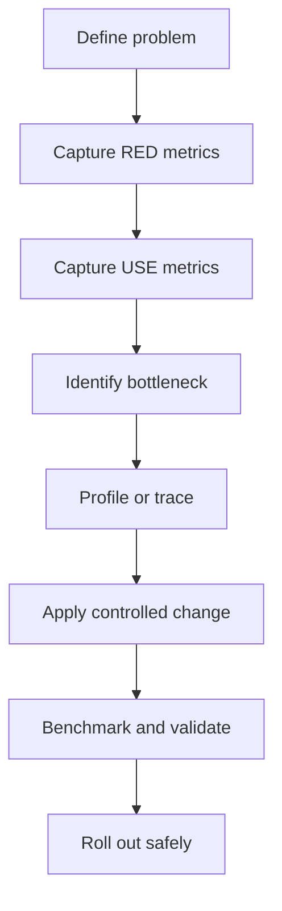

# Performance Methodology

[Back to guide index](README.md)

## Introduction

### 📸 Linux Performance Observability Tools

> *Source: Brendan Gregg — Linux performance observability tools map*

Linux performance tuning is the process of:

- measuring behavior
- finding bottlenecks
- tuning safely
- validating results

The most important rule is simple:

**Do not tune blindly.**

Always start with a question.

Examples:

- Why is p99 latency high?
- Why is throughput low?
- Why did CPU rise after a deploy?
- Why are we seeing packet drops?
- Why are processes being OOM killed?

Then gather evidence.

Then form a hypothesis.

Then change one thing at a time.

Then measure again.

### Performance dimensions

- throughput
- latency
- tail latency
- concurrency
- efficiency
- fairness
- stability
- predictability

### Common resources

- CPU
- memory
- disk
- network
- locks
- kernel paths
- application queues

### Common mistakes

- tuning without a baseline
- reading averages only
- ignoring p95 and p99
- changing many settings at once
- copying random sysctl snippets
- treating load average as CPU usage
- ignoring cgroups and NUMA
- benchmarking with unrealistic workloads

### Golden rules

1. Measure first.
2. Compare to a baseline.
3. Isolate the bottleneck.
4. Tune the bottleneck only.
5. Validate with realistic load.
6. Record the change and rollback plan.

---

Methodology prevents guesswork.

This section covers:

- USE method
- RED method
- Brendan Gregg style workflow
- baselining
- incident triage

## 1.1 USE Method

USE means:

- Utilization
- Saturation
- Errors

Apply USE to every resource.

Examples:

- CPUs
- disks
- NICs
- memory
- filesystems
- locks
- thread pools

### 1.1.1 Utilization

Utilization asks:

- How busy is the resource?
- Is it near full capacity?
- Is it spiky or sustained?

Examples:

- CPU busy percentage
- disk `%util`
- NIC link utilization
- memory bandwidth use

### 1.1.2 Saturation

Saturation asks:

- Is work waiting?
- Is there queue buildup?
- Are tasks blocked?

Examples:

- run queue length
- blocked tasks in D state
- disk queue depth
- socket backlog overflow
- lock wait time

### 1.1.3 Errors

Errors ask:

- Are operations failing?
- Are packets dropped?
- Are requests timing out?
- Are pages failing to allocate?

Examples:

- TCP retransmits
- NIC CRC errors
- I/O errors
- OOM kills
- 5xx responses

### 1.1.4 USE table

| Resource | Utilization | Saturation | Errors |
|---|---|---|---|
| CPU | `%usr`, `%sys` | run queue | throttling, machine checks |
| Memory | used, cache | reclaim pressure, swap | OOM, alloc failures |
| Disk | IOPS, throughput | queue depth, await | media errors |
| Network | bps, pps | backlog, drops | CRC, retransmits |
| App | worker use | queue wait | exceptions, timeouts |

## 1.2 RED Method

RED means:

- Rate
- Errors
- Duration

RED is ideal for services.

### 1.2.1 Rate

Examples:

- requests/sec
- queries/sec
- jobs/sec

### 1.2.2 Errors

Examples:

- HTTP 5xx rate
- timeout rate
- failed DB queries
- message processing failures

### 1.2.3 Duration

Examples:

- p50 latency
- p95 latency
- p99 latency
- max latency

### 1.2.4 USE plus RED

Use RED to see user impact.

Use USE to find resource stress.

Use both together.

Example:

- RED shows p99 API latency spike.
- USE shows disk saturation.
- Profiling shows synchronous fsync in request path.

## 1.3 Brendan Gregg style workflow

A practical flow:

1. define the complaint
2. identify whether it is current or historical
3. check recent changes
4. look at high-level service metrics
5. apply RED
6. apply USE
7. find the dominant bottleneck
8. profile and trace
9. test a hypothesis
10. validate improvement

## 1.4 Performance analysis workflow



## 1.5 Baselining

A baseline should include:

- kernel version
- distro version
- CPU model
- core count
- SMT status
- NUMA layout
- memory size
- storage type
- filesystem type
- NIC model and speed
- virtualization context
- container context
- load profile

### 1.5.1 Baseline metrics

- CPU mode percentages
- load average
- context switches/sec
- interrupts/sec
- memory available
- swap activity
- disk IOPS and latency
- queue depth
- network drops and retransmits
- service RPS
- service error rate
- service latency percentiles

## 1.6 First-response command set

```bash
uname -a
uptime
mpstat -P ALL 1 5
vmstat 1 5
iostat -xz 1 5
free -h
ss -s
ip -s link
cat /proc/pressure/cpu
cat /proc/pressure/memory
cat /proc/pressure/io
```

## 1.7 Quick interpretation matrix

| Symptom | Likely area | Start with |
|---|---|---|
| high p99 latency | queueing, storage, locks | RED, USE, profiling |
| high load average | CPU or blocked I/O | `vmstat`, `mpstat` |
| random kills | memory pressure | `dmesg`, `meminfo` |
| packet loss | NIC or network path | `ethtool`, `ip -s link` |
| poor throughput | CPU, network, storage | `perf`, `sar`, `iostat` |

## 1.8 Anti-patterns

- tuning a non-bottleneck
- forcing many sysctls at once
- using synthetic tests only
- reading a single point-in-time snapshot
- ignoring tail latency
- ignoring noisy neighbors in VMs
- ignoring cgroup throttling

## 1.9 Methodology summary

Use RED to describe impact.

Use USE to inspect resources.

Use profiling to explain cost.

Use benchmarking to validate fixes.

---
