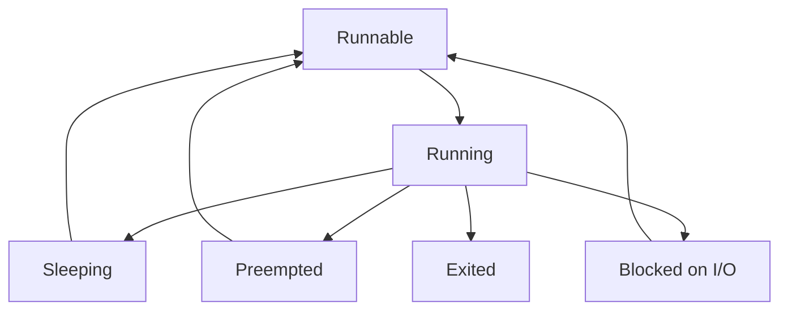

# CPU Performance

[Back to guide index](README.md)

CPU analysis must include:

- architecture
- scheduling
- hotspots
- interrupts
- affinity
- frequency scaling
- NUMA

## 2.1 CPU architecture basics

Key terms:

- socket
- core
- hardware thread
- cache
- NUMA node
- clock frequency
- turbo boost
- SMT

### 2.1.1 Socket

A physical CPU package.

### 2.1.2 Core

An execution engine inside the socket.

### 2.1.3 Hardware thread

A logical execution context.

### 2.1.4 Cache levels

- L1
- L2
- L3

### 2.1.5 NUMA

Local memory is faster than remote memory.

## 2.2 Scheduler overview

Linux mainly uses CFS for normal tasks.

Scheduler goals:

- fairness
- responsiveness
- load balancing
- efficient CPU use

### 2.2.1 Scheduling classes

- `SCHED_OTHER`
- `SCHED_BATCH`
- `SCHED_IDLE`
- `SCHED_FIFO`
- `SCHED_RR`
- `SCHED_DEADLINE`

### 2.2.2 CPU scheduling states



## 2.3 CPU topology inspection

### 2.3.1 `lscpu`

```bash
lscpu
```

Important fields:

- CPU(s)
- Thread(s) per core
- Core(s) per socket
- Socket(s)
- NUMA node(s)
- Model name
- CPU max MHz

### 2.3.2 `/proc/cpuinfo`

```bash
cat /proc/cpuinfo
```

Inspect:

- model name
- flags
- cache size
- siblings
- core id
- physical id

### 2.3.3 `numactl --hardware`

```bash
numactl --hardware
```

Use to view:

- nodes
- CPUs per node
- memory per node
- node distance

## 2.4 CPU metrics

Important metrics:

- `%usr`
- `%sys`
- `%nice`
- `%iowait`
- `%irq`
- `%soft`
- `%steal`
- `%idle`
- run queue length
- context switches
- interrupts

### 2.4.1 Meaning of CPU modes

| Metric | Meaning |
|---|---|
| `%usr` | user-space execution |
| `%sys` | kernel execution |
| `%iowait` | waiting on I/O |
| `%irq` | hard interrupt handling |
| `%soft` | softirq handling |
| `%steal` | time taken by hypervisor |
| `%idle` | CPU not busy |

## 2.5 Core CPU commands

### 2.5.1 `uptime`

```bash
uptime
```

Use for load averages.

### 2.5.2 `top`

```bash
top
```

Use for quick process view.

### 2.5.3 `htop`

```bash
htop
```

Use for per-core view and filtering.

### 2.5.4 `mpstat`

```bash
mpstat -P ALL 1 5
```

Use to spot:

- hot CPUs
- imbalance
- steal time
- softirq hotspots

### 2.5.5 `pidstat`

```bash
pidstat -u -t 1 5
```

Use for per-process and per-thread CPU.

## 2.6 Load average

Load average is not CPU usage.

It counts tasks in:

- runnable state
- uninterruptible sleep

Interpret carefully.

### 2.6.1 Examples

- high load + high `%usr` can mean CPU saturation
- high load + high `%iowait` can mean storage problems
- high load + low CPU can mean blocked tasks

## 2.7 Context switches

Check with:

```bash
vmstat 1 5
pidstat -w 1 5
sar -w 1 5
```

High context switching may indicate:

- too many threads
- lock contention
- frequent wakeups
- oversubscription

## 2.8 Interrupts and softirqs

Inspect:

```bash
cat /proc/interrupts
cat /proc/softirqs
```

Use to find:

- skewed IRQ placement
- NIC queue imbalance
- storage interrupt hotspots

## 2.9 `perf` basics

`perf` is essential.

### 2.9.1 `perf stat`

```bash
perf stat -d ./app
```

Useful counters:

- cycles
- instructions
- branches
- branch misses
- cache references
- cache misses
- page faults
- context switches

### 2.9.2 IPC

IPC means instructions per cycle.

Low IPC may indicate:

- memory stalls
- branch mispredicts
- poor locality
- synchronization overhead

### 2.9.3 `perf top`

```bash
perf top
```

Use for live hotspot triage.

### 2.9.4 `perf record`

```bash
perf record -F 99 -g -p <pid> -- sleep 30
```

### 2.9.5 `perf report`

```bash
perf report
```

Use for call-path analysis.

### 2.9.6 `perf sched`

```bash
perf sched record sleep 10
perf sched latency
```

Useful for scheduler delay analysis.

## 2.10 CPU affinity

CPU affinity controls where a task can run.

### 2.10.1 `taskset`

```bash
taskset -c 0-3 ./server
taskset -pc <pid>
```

Use cases:

- improve cache locality
- isolate workloads
- align CPU and memory locality
- pin interrupt threads

### 2.10.2 Risks of pinning

- overload on pinned CPUs
- less scheduler flexibility
- operational complexity

## 2.11 Frequency scaling

Inspect with:

```bash
cpupower frequency-info
```

Common governors:

- `performance`
- `powersave`
- `schedutil`
- `ondemand`

Set example:

```bash
cpupower frequency-set -g performance
```

Consider:

- latency sensitivity
- power budget
- thermal constraints
- workload burstiness

## 2.12 SMT / Hyper-Threading

SMT can improve throughput.

It can also add contention.

Benchmark with:

- SMT on
- SMT off

Especially for:

- low-latency workloads
- heavily cache-sensitive workloads
- noisy multitenant systems

## 2.13 NUMA and CPU

NUMA affects:

- memory latency
- cache behavior
- scaling across sockets

### 2.13.1 Useful commands

```bash
numactl --hardware
numastat
cat /proc/<pid>/numa_maps
```

### 2.13.2 NUMA symptoms

- poor scaling past one socket
- inconsistent latency
- high remote memory access
- migrations between nodes

### 2.13.3 `numactl`

```bash
numactl --cpunodebind=0 --membind=0 ./app
numactl --physcpubind=0-7 ./app
```

## 2.14 VM steal time

High `%steal` means CPU is being taken by the hypervisor.

Likely causes:

- oversubscribed host
- noisy neighbor
- burst credit exhaustion

## 2.15 CPU bottleneck patterns

### Pattern A

High `%usr`

Possible causes:

- hot code path
- compression
- crypto
- parsing
- busy loop

### Pattern B

High `%sys`

Possible causes:

- syscall-heavy design
- packet processing
- filesystem metadata work
- kernel lock contention

### Pattern C

High `%soft`

Possible causes:

- network packet rate
- poor IRQ distribution
- one hot RX queue

### Pattern D

High `%iowait`

Possible causes:

- slow storage
- blocked writes
- remote filesystem latency

## 2.16 CPU tuning practices

- size thread pools carefully
- avoid oversubscription
- profile before rewriting code
- use affinity only with evidence
- watch IRQ placement
- account for NUMA
- validate governor choices
- benchmark every change

## 2.17 CPU quick commands

```bash
lscpu
cat /proc/cpuinfo
mpstat -P ALL 1 5
pidstat -u -t 1 5
perf stat -d ./app
perf top
perf record -F 99 -g -p <pid> -- sleep 30
perf report
taskset -pc <pid>
numactl --hardware
numastat
cat /proc/interrupts
```

---
