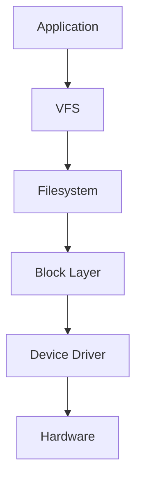

# Disk I/O Performance

[Back to guide index](README.md)

Disk performance depends on:

- latency
- throughput
- IOPS
- queue depth
- access pattern
- filesystem behavior
- scheduler choice

## 4.1 Disk fundamentals

Important dimensions:

- random vs sequential
- read vs write
- sync vs async
- block size
- queue depth
- tail latency

### 4.1.1 Device types

| Device | Typical strength | Typical weakness |
|---|---|---|
| HDD | capacity | seek latency |
| SATA SSD | better latency | lower parallelism than NVMe |
| NVMe SSD | high IOPS | thermal throttling risk |
| network storage | flexibility | path latency |

## 4.2 I/O stack



## 4.3 Core disk metrics

- read IOPS
- write IOPS
- MB/sec
- await
- queue depth
- `%util`
- request size
- p99 latency

## 4.4 `iostat`

```bash
iostat -xz 1 5
```

Important fields:

- `r/s`
- `w/s`
- `rkB/s`
- `wkB/s`
- `await`
- `aqu-sz`
- `%util`

### 4.4.1 Reading `iostat`

| Pattern | Likely meaning |
|---|---|
| high `%util` + high `await` | saturation |
| high `aqu-sz` | queue buildup |
| small requests + low MB/s | random I/O |
| large requests + high MB/s | sequential I/O |

## 4.5 `iotop`

```bash
iotop -oPa
```

Use to find the top I/O processes.

## 4.6 `pidstat -d`

```bash
pidstat -d 1 5
```

Use for per-process reads, writes, and I/O delay.

## 4.7 `blktrace`

```bash
blktrace -d /dev/nvme0n1 -o - | blkparse -i -
```

Use for deep block-layer tracing.

## 4.8 eBPF storage tools

Useful tools include:

- `biolatency`
- `biosnoop`
- `bitesize`
- `filetop`
- `ext4slower`
- `xfsslower`

## 4.9 I/O schedulers

Common multiqueue schedulers:

- `mq-deadline`
- `bfq`
- `kyber`
- `none`

### 4.9.1 `mq-deadline`

Good general-purpose latency predictability.

### 4.9.2 `bfq`

Good fairness for interactive use cases.

### 4.9.3 `kyber`

Latency-oriented token-based approach.

### 4.9.4 `none`

Often suitable for modern NVMe.

### 4.9.5 Check scheduler

```bash
cat /sys/block/nvme0n1/queue/scheduler
```

### 4.9.6 Set scheduler

```bash
echo mq-deadline | sudo tee /sys/block/nvme0n1/queue/scheduler
```

## 4.10 Queue depth

Queue depth is the number of outstanding requests.

Too low:

- device underutilized

Too high:

- latency explodes

## 4.11 Read-ahead

Check:

```bash
blockdev --getra /dev/sda
```

Set example:

```bash
blockdev --setra 4096 /dev/sda
```

Good for sequential workloads.

Risky for random workloads.

## 4.12 Filesystem considerations

Common filesystems:

- ext4
- XFS
- btrfs
- ZFS

Tuning areas:

- mount options
- journaling mode
- atime behavior
- metadata overhead
- allocation strategy

### 4.12.1 Atime

Common options:

- `relatime`
- `noatime`
- `nodiratime`

## 4.13 Buffered vs direct I/O

Buffered I/O uses page cache.

Direct I/O bypasses page cache.

Both are useful.

Benchmark the one that matches the workload.

## 4.14 `fio`

`fio` is the standard benchmarking tool.

### 4.14.1 Sequential read example

```bash
fio --name=seqread --filename=testfile --size=4G --rw=read --bs=1M --iodepth=32 --direct=1 --runtime=60 --time_based
```

### 4.14.2 Random read example

```bash
fio --name=randread --filename=testfile --size=4G --rw=randread --bs=4k --iodepth=64 --direct=1 --numjobs=4 --runtime=60 --time_based
```

### 4.14.3 Mixed example

```bash
fio --name=mixed --filename=testfile --size=4G --rw=randrw --rwmixread=70 --bs=4k --iodepth=64 --direct=1 --numjobs=4 --runtime=60 --time_based
```

### 4.14.4 Important `fio` fields

- `rw`
- `bs`
- `iodepth`
- `numjobs`
- `direct`
- `runtime`
- `ioengine`
- `group_reporting`

## 4.15 Storage health

Examples:

```bash
smartctl -a /dev/sda
nvme smart-log /dev/nvme0
```

Watch for:

- media errors
- temperature
- spare capacity
- unsafe shutdowns
- controller errors

## 4.16 PSI for I/O

```bash
cat /proc/pressure/io
```

This shows stalled time due to I/O pressure.

## 4.17 Disk bottleneck patterns

### Pattern A

High await and high `%util`.

Likely cause:

- saturation

### Pattern B

High await and low `%util`.

Likely causes:

- backend latency
- network storage issues
- queueing above the block layer

### Pattern C

Periodic latency storms.

Likely causes:

- dirty page flush storms
- snapshot activity
- storage tier compaction

### Pattern D

Low throughput with many small writes.

Likely causes:

- sync writes
- metadata overhead
- journal pressure

## 4.18 Disk tuning practices

- benchmark with realistic blocks and queue depths
- watch p99 latency
- tune read-ahead only with evidence
- choose scheduler by workload and device
- keep firmware current
- validate mount options after reboot

## 4.19 Disk quick commands

```bash
iostat -xz 1 5
iotop -oPa
pidstat -d 1 5
lsblk -o NAME,SIZE,TYPE,MOUNTPOINT,SCHED
cat /sys/block/sda/queue/scheduler
blockdev --getra /dev/sda
cat /proc/pressure/io
smartctl -a /dev/sda
nvme smart-log /dev/nvme0
```

---
