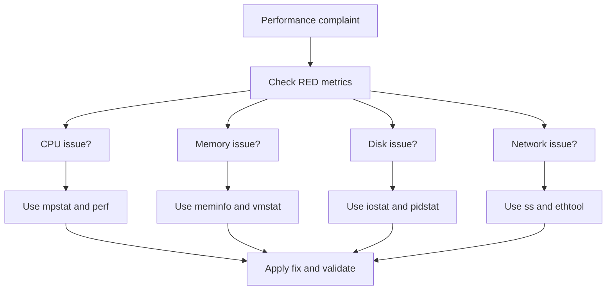

# Troubleshooting Scenarios

[Back to guide index](README.md)

This section gives step-by-step diagnosis patterns.

## 10.1 Troubleshooting decision tree



## 10.2 High CPU

### Symptoms

- high `%usr` or `%sys`
- rising load average
- high queue time
- latency increase

### Workflow

1. confirm user impact
2. run `mpstat -P ALL 1 5`
3. check `top -H -p <pid>`
4. run `pidstat -u -t 1 5`
5. run `perf top`
6. inspect interrupts
7. inspect cgroup CPU stats
8. inspect governor and throttling
9. test a fix
10. validate with same load

### Common causes

- hot loop
- serialization overhead
- heavy compression
- crypto cost
- packet processing overload
- too many threads
- CPU throttling

## 10.3 Memory leak or pressure

### Symptoms

- rising RSS
- swap growth
- OOM kills
- kswapd CPU
- latency spikes

### Workflow

1. check `free -h`
2. check `cat /proc/meminfo`
3. run `vmstat 1 5`
4. inspect PSI
5. identify top memory process
6. inspect `pmap -x <pid>`
7. inspect cgroup memory events
8. inspect OOM logs
9. confirm trend over time
10. fix leak or limit issue

### Common causes

- unbounded cache
- object retention
- fragmentation
- low container limit
- excessive writeback pressure

## 10.4 Disk bottleneck

### Symptoms

- high `%iowait`
- high `await`
- blocked tasks
- write latency spikes

### Workflow

1. run `iostat -xz 1 5`
2. run `pidstat -d 1 5`
3. run `iotop`
4. inspect filesystem mount options
5. inspect dirty and writeback fields
6. inspect scheduler
7. inspect device health
8. trace with `blktrace` or BPF if needed
9. reproduce safely with `fio`
10. validate the change

### Common causes

- sync writes
- shared storage saturation
- metadata-heavy workload
- poor scheduler choice
- read-ahead mismatch
- writeback storms

## 10.5 Network latency or drops

### Symptoms

- timeouts
- retransmits
- packet drops
- poor throughput
- p99 spikes

### Workflow

1. check service RED
2. run `ss -s`
3. run `sar -n DEV,TCP,ETCP 1 5`
4. inspect `ip -s link`
5. inspect `ethtool -S`
6. verify MTU
7. inspect RSS and IRQ balance
8. benchmark with `iperf3`
9. capture packets if needed
10. validate after tuning

### Common causes

- one hot queue
- packet loss in path
- backlog exhaustion
- conntrack pressure
- MTU mismatch
- disabled offloads

## 10.6 High load average with low CPU

Likely causes:

- blocked I/O
- D-state tasks
- network filesystem stalls
- kernel waits

Use:

```bash
vmstat 1 5
ps -eo pid,state,wchan,cmd | grep ' D '
iostat -xz 1 5
```

## 10.7 Container CPU throttling

Check:

```bash
cat /sys/fs/cgroup/cpu.stat
```

High throttling counters indicate quota pressure.

## 10.8 NUMA latency issue

Use:

```bash
numastat
numactl --hardware
cat /proc/<pid>/numa_maps
```

Fix by aligning CPU and memory placement.

## 10.9 Excessive context switching

Use:

```bash
vmstat 1 5
pidstat -w 1 5
```

Likely causes:

- too many threads
- lock contention
- wakeup storms

## 10.10 Softirq saturation

Use:

```bash
mpstat -P ALL 1 5
cat /proc/softirqs
cat /proc/interrupts
```

Fix by balancing queues and interrupts.

## 10.11 Troubleshooting practices

- compare against baseline
- capture evidence before restart
- validate against user-facing metrics
- document command outputs that mattered

---

---

# Cheat Sheets

## Quick triage

```bash
uptime
mpstat -P ALL 1 5
vmstat 1 5
iostat -xz 1 5
free -h
ss -s
ip -s link
cat /proc/pressure/cpu
cat /proc/pressure/memory
cat /proc/pressure/io
```

## CPU cheat sheet

- `lscpu`
- `mpstat -P ALL 1 5`
- `pidstat -u -t 1 5`
- `perf top`
- `perf record`
- `taskset`
- `numastat`
- `/proc/interrupts`

## Memory cheat sheet

- `/proc/meminfo`
- `free -h`
- `vmstat 1 5`
- `slabtop`
- `pmap -x <pid>`
- `/proc/pressure/memory`
- `numastat`

## Disk cheat sheet

- `iostat -xz 1 5`
- `pidstat -d 1 5`
- `iotop -oPa`
- `lsblk -o NAME,SIZE,TYPE,MOUNTPOINT,SCHED`
- `/sys/block/*/queue/scheduler`
- `fio`
- `/proc/pressure/io`

## Network cheat sheet

- `ip -s link`
- `ss -s`
- `sar -n DEV 1 5`
- `sar -n TCP,ETCP 1 5`
- `ethtool -S eth0`
- `ethtool -k eth0`
- `iperf3`
- `tcpdump`

## Kernel cheat sheet

- `sysctl -a`
- `sysctl vm.swappiness`
- `sysctl net.core.somaxconn`
- `sysctl fs.file-max`
- `/proc/sys/*`

## Application cheat sheet

- `ulimit -a`
- `/proc/<pid>/limits`
- `/proc/<pid>/oom_score`
- `/proc/<pid>/oom_score_adj`
- `/sys/fs/cgroup/cpu.max`
- `/sys/fs/cgroup/memory.current`
- `/sys/fs/cgroup/io.stat`

---

---

# Appendix

## Appendix A: Useful `/proc` files

| File | Purpose |
|---|---|
| `/proc/cpuinfo` | CPU details |
| `/proc/meminfo` | memory summary |
| `/proc/interrupts` | IRQ distribution |
| `/proc/softirqs` | softirq counters |
| `/proc/loadavg` | system load averages |
| `/proc/diskstats` | disk stats |
| `/proc/net/dev` | interface counters |
| `/proc/pressure/cpu` | CPU PSI |
| `/proc/pressure/memory` | memory PSI |
| `/proc/pressure/io` | I/O PSI |

## Appendix B: PSI overview

PSI tells you how much time tasks lose waiting on resources.

Useful commands:

```bash
cat /proc/pressure/cpu
cat /proc/pressure/memory
cat /proc/pressure/io
```

## Appendix C: Metrics to pair with host metrics

- request rate
- error rate
- timeout rate
- p50 latency
- p95 latency
- p99 latency
- queue depth
- connection pool usage
- worker utilization
- cache hit ratio

## Appendix D: Tuning change template

```text
Date:
Host or cluster:
Service:
Problem:
Baseline:
Change:
Reason:
Validation:
Result:
Rollback:
Owner:
```

## Appendix E: Review questions

1. What changed recently?
2. Which metric defines the problem?
3. Which resource is saturated?
4. What evidence proves the bottleneck?
5. What metric proves the improvement?
6. What trade-off does the tuning introduce?

---

---

# Extended Reference Notes

The following note blocks intentionally expand the guide into a field reference.

They provide concise reminders and operational heuristics.

## CPU Extended Notes

### CPU note 001

A single saturated core can bottleneck a whole service.

### CPU note 002

Per-core data matters more than averages.

### CPU note 003

High load average does not guarantee CPU saturation.

### CPU note 004

High `%sys` usually deserves profiling.

### CPU note 005

High `%soft` often points to network receive work.

### CPU note 006

High `%irq` may indicate a device interrupt storm.

### CPU note 007

Context-switch storms waste useful CPU time.

### CPU note 008

Too many runnable threads increase latency.

### CPU note 009

Low IPC often means memory stalls or branch misses.

### CPU note 010

Cache locality matters more than many teams expect.

### CPU note 011

CPU pinning is powerful and easy to misuse.

### CPU note 012

IRQ affinity changes should be benchmarked.

### CPU note 013

NUMA-unaware scheduling can flatten scaling.

### CPU note 014

Thermal throttling can mimic mystery regressions.

### CPU note 015

Governor changes can affect latency variance.

### CPU note 016

`perf top` is ideal for fast incident triage.

### CPU note 017

`perf record` is better for root-cause reports.

### CPU note 018

Hot functions are not always the correct fix target.

### CPU note 019

Inclusive cost often matters more than leaf cost.

### CPU note 020

One hot lock can create many “CPU issues.”

### CPU note 021

Busy loops often hide behind “healthy” system metrics.

### CPU note 022

High thread count is not the same as high parallelism.

### CPU note 023

SMT helps some workloads and hurts others.

### CPU note 024

Benchmark SMT changes under real latency goals.

### CPU note 025

Hypervisor steal time is outside guest control.

### CPU note 026

One noisy neighbor can distort VM benchmarks.

### CPU note 027

Packet-rate workloads can be CPU-bound far below line rate.

### CPU note 028

Scheduler delay can exist even when average CPU is moderate.

### CPU note 029

CPU migrations can destroy cache warmth.

### CPU note 030

Run queue length is a saturation signal, not a performance guarantee.

### CPU note 031

Check softirqs when NIC throughput rises suddenly.

### CPU note 032

Use thread-level views for multithreaded services.

### CPU note 033

High `%usr` often means application optimization opportunity.

### CPU note 034

High `%sys` often means syscall or kernel-path review.

### CPU note 035

Use `strace -c` when syscalls are suspected.

### CPU note 036

Small packet traffic stresses CPUs differently than large transfers.

### CPU note 037

More workers can increase throughput until queueing dominates.

### CPU note 038

Tail latency often rises before average CPU looks scary.

### CPU note 039

CPU isolation is advanced and workload-specific.

### CPU note 040

Measure the benefit of every affinity choice.

## Memory Extended Notes

### Memory note 001

Low free memory alone is not a problem.

### Memory note 002

`MemAvailable` is usually the better headline metric.

### Memory note 003

Page cache is productive memory use.

### Memory note 004

Swap use is not automatically bad.

### Memory note 005

Active swap-in during peak traffic is usually bad.

### Memory note 006

Major faults deserve attention.

### Memory note 007

Slab growth can be a clue to kernel-side accumulation.

### Memory note 008

THP is workload-dependent.

### Memory note 009

THP can help throughput and hurt latency.

### Memory note 010

Compaction overhead can appear as CPU cost.

### Memory note 011

Cgroup memory limits can trigger OOM on otherwise healthy hosts.

### Memory note 012

`memory.high` often gives gentler control than `memory.max`.

### Memory note 013

NUMA memory placement affects CPU efficiency too.

### Memory note 014

Allocator fragmentation can keep RSS high.

### Memory note 015

Unbounded caches are a classic leak pattern.

### Memory note 016

Managed runtimes need runtime-specific memory telemetry.

### Memory note 017

`kswapd` activity can reveal global pressure.

### Memory note 018

Direct reclaim hurts latency.

### Memory note 019

Dirty-page bursts can feel like memory issues and storage issues at once.

### Memory note 020

PSI is excellent for identifying chronic pressure.

### Memory note 021

Page tables matter on large-memory systems.

### Memory note 022

Mapped files can confuse leak investigations.

### Memory note 023

Measure RSS, PSS, and heap separately when possible.

### Memory note 024

OOM score adjustment should be used carefully.

### Memory note 025

Protecting one process makes others more killable.

### Memory note 026

THP defrag settings can influence latency behavior.

### Memory note 027

Huge pages can reduce TLB pressure.

### Memory note 028

Huge page reservation needs capacity planning.

### Memory note 029

Page cache growth after deploy may be normal warmup.

### Memory note 030

A memory graph without swap and PSI is incomplete.

### Memory note 031

Check `smaps_rollup` for fast process memory inspection.

### Memory note 032

Frequent OOMs are often configuration problems, not kernel problems.

### Memory note 033

Use historical trends, not only snapshots.

### Memory note 034

Memory leaks can surface first as latency regressions.

### Memory note 035

Leaks inside containers may look like random restarts.

### Memory note 036

Remote NUMA access increases effective memory latency.

### Memory note 037

Benchmark allocator changes under real fragmentation patterns.

### Memory note 038

Write-heavy workloads need VM and storage analysis together.

### Memory note 039

Low swappiness does not replace enough RAM.

### Memory note 040

Good memory tuning starts with understanding the working set.

## Disk Extended Notes

### Disk note 001

Average throughput hides latency pain.

### Disk note 002

p99 storage latency matters for databases.

### Disk note 003

Queue depth is both a tool and a risk.

### Disk note 004

Small synchronous writes are expensive.

### Disk note 005

Metadata-heavy workloads may saturate before raw media does.

### Disk note 006

Filesystem choice affects behavior under load.

### Disk note 007

Writeback storms can create periodic latency spikes.

### Disk note 008

Read-ahead helps only when access is sufficiently sequential.

### Disk note 009

Cloud storage often has hidden caps and burst models.

### Disk note 010

`fio` should mimic application access patterns.

### Disk note 011

`direct=1` is useful when measuring the device, not cache.

### Disk note 012

Buffered I/O may better represent some application behavior.

### Disk note 013

NVMe can still saturate and throttle thermally.

### Disk note 014

Shared storage requires end-to-end visibility.

### Disk note 015

A quiet host can still suffer from remote array latency.

### Disk note 016

Check firmware and health before blaming Linux.

### Disk note 017

Mount options should match durability requirements.

### Disk note 018

Dropping atime updates can reduce metadata writes.

### Disk note 019

IOPS alone is not enough; capture latency percentiles.

### Disk note 020

One busy log path can distort a whole service.

### Disk note 021

Separate data and log devices where it makes sense.

### Disk note 022

Flush behavior often matters more than peak read speed.

### Disk note 023

Storage benchmarks need warmup and steady state.

### Disk note 024

Background snapshots and backups can mimic device saturation.

### Disk note 025

Use PSI to see whether applications are actually stalled.

### Disk note 026

High `%util` is not a universal saturation law on all devices.

### Disk note 027

Interpret `iostat` in the context of device type.

### Disk note 028

Deep queues can flatter throughput while wrecking p99.

### Disk note 029

Tune scheduler choice per workload, not by folklore.

### Disk note 030

The best write is the one you avoid creating.

### Disk note 031

Compression can trade CPU for disk efficiency.

### Disk note 032

Filesystem journal behavior shapes latency under burst writes.

### Disk note 033

Use BPF tools for slow file-operation visibility.

### Disk note 034

File-level latency tools are often more actionable than raw block traces.

### Disk note 035

RAID rebuilds can invalidate normal benchmarks.

### Disk note 036

Controller cache policy changes should be documented and benchmarked.

### Disk note 037

Block size selection dominates measured results.

### Disk note 038

Request size histograms explain many surprises.

### Disk note 039

Never compare cached and direct results as equals.

### Disk note 040

Always validate with the real filesystem and mount options.

## Network Extended Notes

### Network note 001

Bandwidth and latency are different problems.

### Network note 002

Packets per second often drive CPU cost.

### Network note 003

TCP retransmits are symptoms, not root causes.

### Network note 004

Small packets can saturate one core quickly.

### Network note 005

Good average RTT can hide bad jitter.

### Network note 006

Jumbo frames require end-to-end support.

### Network note 007

Offloads change CPU cost profiles.

### Network note 008

Interrupt coalescing trades latency for efficiency.

### Network note 009

RSS balance matters for multicore scaling.

### Network note 010

RPS can help when hardware queues are limited.

### Network note 011

RFS can improve locality for socket consumers.

### Network note 012

XPS matters on high transmit workloads.

### Network note 013

Backlog settings need app and kernel alignment.

### Network note 014

One overloaded queue can distort the whole host.

### Network note 015

Ring sizes can reduce drops and increase latency.

### Network note 016

Bufferbloat can make throughput look good and UX look bad.

### Network note 017

Service meshes add measurable latency and CPU overhead.

### Network note 018

Conntrack pressure can become the hidden bottleneck.

### Network note 019

Measure both send and receive directions.

### Network note 020

`iperf3` results depend on stream count and path RTT.

### Network note 021

Benchmark congestion-control changes, do not assume them.

### Network note 022

Socket buffer limits can cap throughput silently.

### Network note 023

Receive-path CPU limits often appear as packet drops.

### Network note 024

Use `ethtool -S` before and after a tuning change.

### Network note 025

Packet capture filters are part of good operations.

### Network note 026

Retransmits from the sender can still mean receiver overload.

### Network note 027

Path MTU issues can produce strange intermittent slowness.

### Network note 028

QoS and queue discipline settings matter on shaped links.

### Network note 029

Latency-sensitive apps should care about jitter, not only mean RTT.

### Network note 030

NIC driver and firmware versions are performance variables.

### Network note 031

Cloud networking limits should be part of capacity planning.

### Network note 032

UDP apps must design for visibility into loss and backlog.

### Network note 033

A host can show low bandwidth yet be CPU-bound on packet processing.

### Network note 034

Many outbound connections can exhaust ephemeral ports.

### Network note 035

Burst traffic can break systems that pass steady-state tests.

### Network note 036

Tune queueing with both pps and latency data in hand.

### Network note 037

Use MTR for path behavior, not just a single ping.

### Network note 038

Cross-zone and cross-region paths need different tuning assumptions.

### Network note 039

Load balancers and proxies must be part of the performance model.

### Network note 040

The cheapest packet is the packet you never send.

## Profiling Extended Notes

### Profiling note 001

A profile should overlap the actual problem window.

### Profiling note 002

Short, targeted captures are often enough.

### Profiling note 003

Sampling is usually safer than tracing everything.

### Profiling note 004

Symbols matter for useful call graphs.

### Profiling note 005

User and kernel stacks together are often most valuable.

### Profiling note 006

Off-CPU analysis explains many latency mysteries.

### Profiling note 007

A hot syscall may reflect application design.

### Profiling note 008

Flame graphs are visual summaries, not explanations by themselves.

### Profiling note 009

Investigate wide frames first.

### Profiling note 010

Do not optimize a frame without understanding why it is hot.

### Profiling note 011

High sampling frequency increases detail and overhead.

### Profiling note 012

Tracepoints are often safer than raw probes.

### Profiling note 013

`strace -c` is excellent for syscall mix triage.

### Profiling note 014

`ltrace` is useful when library behavior matters.

### Profiling note 015

Use `perf sched` for wakeup and run queue issues.

### Profiling note 016

Lock contention often looks like poor scaling.

### Profiling note 017

Profiles after a fix are mandatory.

### Profiling note 018

Container profiling may require host-side visibility.

### Profiling note 019

Keep profiler overhead in mind for sensitive services.

### Profiling note 020

Profiling without workload context can mislead.

### Profiling note 021

Correlate stack evidence with RED and USE metrics.

### Profiling note 022

Small code changes can move hotspots rather than remove them.

### Profiling note 023

Exclusive cost and inclusive cost tell different stories.

### Profiling note 024

Request tagging plus profiling is powerful when available.

### Profiling note 025

System-wide captures help when the culprit process is unknown.

### Profiling note 026

Per-PID captures help reduce noise.

### Profiling note 027

Scheduler profiles help explain latency variance.

### Profiling note 028

Kernel-path hotspots often need both tracepoints and counters.

### Profiling note 029

Flame graphs do not show wall time directly.

### Profiling note 030

Measure first, then instrument deeper.

## Kernel Extended Notes

### Kernel note 001

Every sysctl change should answer a real need.

### Kernel note 002

Default settings are not random.

### Kernel note 003

Old tuning advice may be wrong on modern kernels.

### Kernel note 004

Tune one parameter at a time.

### Kernel note 005

Write down both default and tuned values.

### Kernel note 006

Use config management to avoid drift.

### Kernel note 007

Network tunables should match actual path RTT and throughput goals.

### Kernel note 008

Dirty-page tuning affects storage behavior strongly.

### Kernel note 009

Global FD limits need memory-awareness too.

### Kernel note 010

Raising limits without capacity planning is not tuning.

### Kernel note 011

NUMA balancing changes should be benchmarked.

### Kernel note 012

Reboot persistence must be verified.

### Kernel note 013

Document rationale inside sysctl files.

### Kernel note 014

A throughput gain may hide a latency regression.

### Kernel note 015

Avoid applying giant sysctl bundles from blogs.

### Kernel note 016

Kernel tuning cannot replace bad application queue design.

### Kernel note 017

Prefer well-known knobs with clear evidence.

### Kernel note 018

Use canaries for production rollout.

### Kernel note 019

Check interactions with container runtime defaults.

### Kernel note 020

Check interactions with cloud vendor recommendations.

### Kernel note 021

The best kernel tuning is often no tuning at all when no bottleneck exists.

### Kernel note 022

`vm.swappiness` is not a universal magic number.

### Kernel note 023

Backlog settings need application-level support to matter.

### Kernel note 024

`vm.overcommit_memory` changes app behavior and failure modes.

### Kernel note 025

Kernel versions may rename, deprecate, or rework behavior around tunables.

### Kernel note 026

Test rollback as seriously as rollout.

### Kernel note 027

Watch for side effects in unrelated services.

### Kernel note 028

Tune for workload class, not abstract “performance.”

### Kernel note 029

Latency-sensitive nodes and batch nodes often need different policies.

### Kernel note 030

A tuning catalog without evidence becomes operational debt.

## Application Extended Notes

### Application note 001

Unbounded internal queues are latency traps.

### Application note 002

Backpressure is a performance feature.

### Application note 003

File descriptors are a common hidden scale limit.

### Application note 004

Connection pools should match backend capacity.

### Application note 005

CPU quotas can create periodic throttling cliffs.

### Application note 006

Too many workers increase contention.

### Application note 007

Too few workers waste capacity.

### Application note 008

Queue wait time belongs in every latency budget.

### Application note 009

Request batching can reduce overhead dramatically.

### Application note 010

Logging cost should be measured under peak load.

### Application note 011

Tracing overhead should be benchmarked, not assumed.

### Application note 012

Metrics cardinality can become a performance issue.

### Application note 013

Allocator choice can change both RSS and latency.

### Application note 014

Warmup matters for autoscaled services.

### Application note 015

Bounded caches beat surprise memory explosions.

### Application note 016

Graceful degradation improves perceived performance under stress.

### Application note 017

Background jobs should often run with lower priority.

### Application note 018

CPU-bound and I/O-bound work should not share the same pool casually.

### Application note 019

Timeouts should reflect actual service-level goals.

### Application note 020

Retries amplify overload when backoff is poor.

### Application note 021

Containers change the meaning of host-level free capacity.

### Application note 022

Sidecars must be included in CPU and memory budgets.

### Application note 023

Health probes can become self-inflicted load.

### Application note 024

Large default stack sizes can waste memory at scale.

### Application note 025

Do not use OOM protection to hide memory leaks.

### Application note 026

Observe queue rejection and shed load deliberately.

### Application note 027

Use admission control when queues become dangerous.

### Application note 028

Connection churn can exhaust ports and FDs before CPU saturates.

### Application note 029

Each app runtime has its own tuning surface beyond Linux.

### Application note 030

App tuning and OS tuning should be tested together.

## Benchmarking Extended Notes

### Benchmarking note 001

Every benchmark needs a question.

### Benchmarking note 002

If you cannot reproduce the command, you cannot trust the result.

### Benchmarking note 003

Warm caches change results.

### Benchmarking note 004

JIT compilation changes results.

### Benchmarking note 005

Storage needs steady-state benchmarking.

### Benchmarking note 006

Multiple trials beat one lucky run.

### Benchmarking note 007

Keep the environment quiet between runs.

### Benchmarking note 008

Load generators can become the bottleneck.

### Benchmarking note 009

Capture latency percentiles every time.

### Benchmarking note 010

Averages hide queueing.

### Benchmarking note 011

Use the same environment for before/after tests.

### Benchmarking note 012

Document kernel and firmware versions.

### Benchmarking note 013

Thermal equilibrium matters.

### Benchmarking note 014

Cloud burst credits distort naive benchmarks.

### Benchmarking note 015

Payload size changes conclusions.

### Benchmarking note 016

Concurrency changes conclusions.

### Benchmarking note 017

Steady throughput with rising p99 means hidden pressure.

### Benchmarking note 018

Compare equal-load scenarios, not only peak numbers.

### Benchmarking note 019

Synthetic tests complement, not replace, end-to-end tests.

### Benchmarking note 020

Benchmark changes one variable at a time.

### Benchmarking note 021

Collect host metrics alongside benchmark output.

### Benchmarking note 022

Use medians across runs for stable comparison.

### Benchmarking note 023

Note whether caches were warmed or cleared.

### Benchmarking note 024

Coordinated omission can understate tail latency.

### Benchmarking note 025

Random benchmarks should reflect real block distributions.

### Benchmarking note 026

Throughput wins with worse error rate are not wins.

### Benchmarking note 027

A benchmark must reflect production bottlenecks to matter.

### Benchmarking note 028

Long enough runs reveal GC, checkpoint, and flush cycles.

### Benchmarking note 029

If results vary wildly, investigate before tuning further.

### Benchmarking note 030

Good benchmarking is controlled skepticism.

## Troubleshooting Extended Notes

### Troubleshooting note 001

Start with the user-visible complaint.

### Troubleshooting note 002

Capture the time window.

### Troubleshooting note 003

Look for recent changes first.

### Troubleshooting note 004

Use both service and host metrics.

### Troubleshooting note 005

One dominant bottleneck usually matters most.

### Troubleshooting note 006

High load average is a clue, not a diagnosis.

### Troubleshooting note 007

Low CPU does not mean the system is healthy.

### Troubleshooting note 008

Pressure metrics help where utilization misleads.

### Troubleshooting note 009

Avoid restarts before evidence capture when possible.

### Troubleshooting note 010

Use snapshots plus trends.

### Troubleshooting note 011

Compare with a healthy peer host if possible.

### Troubleshooting note 012

Store the decisive commands and outputs.

### Troubleshooting note 013

Validate the mitigation with the same metric that showed the problem.

### Troubleshooting note 014

A deploy can change resource shape without increasing total traffic.

### Troubleshooting note 015

Retries can amplify small failures into major incidents.

### Troubleshooting note 016

Background jobs often coincide with mysterious spikes.

### Troubleshooting note 017

Packet loss can produce CPU, network, and application symptoms simultaneously.

### Troubleshooting note 018

Memory pressure can first appear as I/O pressure.

### Troubleshooting note 019

Storage stalls can first appear as high load average.

### Troubleshooting note 020

Lock contention can first appear as poor CPU scaling.

### Troubleshooting note 021

Container limits change what “free capacity” means.

### Troubleshooting note 022

Cloud instance class limits should be part of triage.

### Troubleshooting note 023

Keep an incident template ready.

### Troubleshooting note 024

The shell is most useful when paired with historical dashboards.

### Troubleshooting note 025

Do not let averages hide tail pain.

### Troubleshooting note 026

Treat every tuning as a hypothesis test.

### Troubleshooting note 027

Fixes without evidence tend to return as recurring incidents.

### Troubleshooting note 028

Document whether the change improved throughput, latency, or stability.

### Troubleshooting note 029

Good postmortems preserve the reasoning chain.

### Troubleshooting note 030

Performance troubleshooting is a discipline, not a bag of tricks.

## Mini playbooks

### Playbook: slow API after deploy

- compare RED before and after deploy
- inspect CPU hotspots
- inspect memory growth
- inspect disk latency
- inspect connection counts
- profile the new code path
- roll back or fix based on evidence

### Playbook: database write latency spike

- inspect `iostat`
- inspect dirty memory
- inspect fsync behavior
- inspect storage health
- reproduce with `fio` in staging
- tune write path carefully

### Playbook: packet drops during burst traffic

- inspect `ip -s link`
- inspect `ethtool -S`
- inspect ring sizes
- inspect IRQ distribution
- inspect softirq CPU
- adjust RSS or backlog if evidence supports it

### Playbook: container restarts under load

- inspect OOM events
- inspect `cpu.stat`
- inspect memory events
- inspect probe timeouts
- inspect FD exhaustion
- fix limits or app behavior

---

---

# Closing Summary

Linux performance tuning works best when you:

- use RED for service symptoms
- use USE for resource bottlenecks
- use profiling for exact causes
- use benchmarking for proof
- change one thing at a time
- validate every improvement

The real skill is not memorizing knobs.

The real skill is building a chain of evidence from symptom to bottleneck to verified fix.
