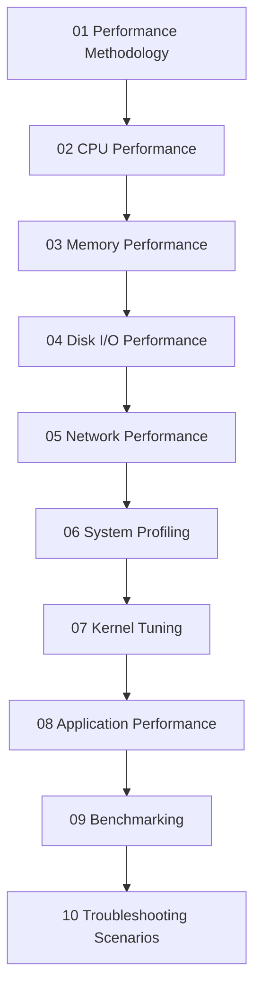

# Linux Performance Tuning Guide

## Overview

A production-grade guide for Linux performance analysis and tuning. It is designed for operators, SREs, platform engineers, and developers, and it emphasizes measurement before tuning with practical, production-safe habits.

## Learning Path

## Table of Contents

- [Performance Methodology](01-methodology.md)
- [CPU Performance](02-cpu.md)
- [Memory Performance](03-memory.md)
- [Disk I/O Performance](04-disk-io.md)
- [Network Performance](05-network.md)
- [System Profiling](06-profiling.md)
- [Kernel Tuning](07-kernel-tuning.md)
- [Application Performance](08-application.md)
- [Benchmarking](09-benchmarking.md)
- [Troubleshooting Scenarios](10-troubleshooting.md)
