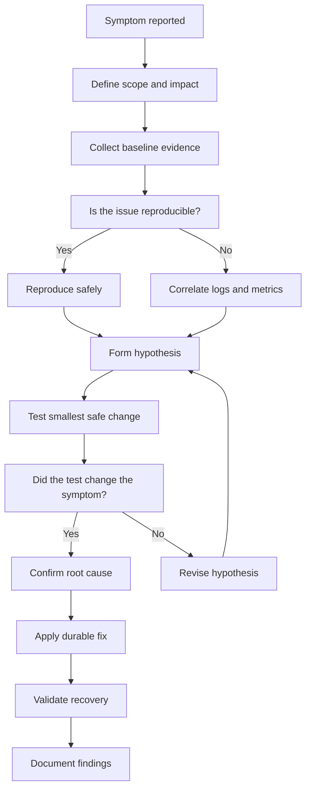

# Troubleshooting Methodology

This guide covers the troubleshooting process, evidence collection, safe-response checklists, and appendix reference material.

## 1.1 Core principles

- Stay calm.
- Preserve evidence.
- Change one variable at a time.
- Prefer observation before intervention.
- Reproduce the symptom if safe.
- Record exact commands and outputs.
- Distinguish symptom from root cause.
- Build a hypothesis.
- Test the hypothesis.
- Update the hypothesis when facts change.
- Avoid cargo-cult fixes.
- Do not reboot blindly on production systems.
- Time matters during outages.
- Scope matters during outages.
- Blast radius matters during outages.
- Always ask: what changed?
- Always ask: who is affected?
- Always ask: when did it start?
- Always ask: can it wait?
- Always ask: what is the rollback?

## 1.2 Scientific troubleshooting loop

1. Define the problem clearly.
2. Establish what normal looks like.
3. Collect evidence.
4. Form one or more hypotheses.
5. Test the simplest high-probability hypothesis first.
6. Observe results.
7. Narrow the search space.
8. Fix the root cause.
9. Validate service recovery.
10. Document lessons learned.

## 1.3 General troubleshooting flow



## 1.4 Divide and conquer

- Split the system into layers.
- Test one boundary at a time.
- Determine the highest layer that still works.
- Determine the lowest layer that fails.
- Focus on the boundary between good and bad states.

Examples:

- App error or database error?
- DNS problem or routing problem?
- Kernel issue or filesystem issue?
- Service issue or reverse proxy issue?
- Local host issue or external dependency issue?

## 1.5 Binary search debugging

Use binary search when a long chain exists.

Examples:

- Network path through multiple hops.
- Service dependency chain.
- Boot sequence steps.
- Deployment history.
- Package dependency tree.

Approach:

1. Pick the midpoint.
2. Test whether the midpoint behaves normally.
3. Discard half the search space.
4. Repeat until the failing boundary is obvious.

## 1.6 Start with context

Capture these before making changes:

```bash
date
hostnamectl
uname -a
cat /etc/os-release
who -a
uptime
last -x | head
systemctl --failed
journalctl -b -p err..alert --no-pager | tail -100
```

## 1.7 High-value baseline commands

| Goal | Command |
|---|---|
| OS and kernel | `uname -a` |
| Distribution | `cat /etc/os-release` |
| Uptime and load | `uptime` |
| CPU overview | `mpstat -P ALL 1 3` |
| Memory overview | `free -h` |
| Swap overview | `swapon --show` |
| Disk usage | `df -hT` |
| Inodes | `df -i` |
| Block devices | `lsblk -f` |
| Mounts | `findmnt -A` |
| Failed services | `systemctl --failed` |
| Recent errors | `journalctl -p err..alert -b --no-pager` |
| Sockets | `ss -tulpn` |
| Routes | `ip route` |
| Interfaces | `ip -br addr` |
| DNS test | `resolvectl query example.com` |
| Process tree | `pstree -ap` |

## 1.8 Ask timeline questions

- What changed before the issue began?
- Was there a deploy?
- Was there a reboot?
- Was there a kernel update?
- Was storage nearly full?
- Was a firewall rule added?
- Was a certificate rotated?
- Was DNS changed?
- Did a backup or batch job start?
- Did traffic spike?

## 1.9 Change correlation sources

Check:

- Deployment pipelines.
- Configuration management runs.
- Package update logs.
- Cron activity.
- Cloud events.
- Hardware alerts.
- Monitoring annotations.
- User reports.
- Ticket timeline.

## 1.10 Golden questions

- Is it all users or some users?
- Is it all hosts or one host?
- Is it all traffic or one endpoint?
- Is it persistent or intermittent?
- Is it recent or longstanding?
- Is it reproducible on demand?
- Is there data loss risk?
- Is there security risk?

## 1.11 Evidence categories

- Symptoms.
- Logs.
- Metrics.
- Configuration.
- Recent changes.
- Dependencies.
- Resource state.
- Security controls.
- Kernel state.
- Hardware state.

## 1.12 Common anti-patterns

- Restarting everything immediately.
- Deleting logs to free disk before reviewing them.
- Running `chmod -R 777`.
- Disabling SELinux without proving it is the cause.
- Rebuilding a server before collecting evidence.
- Running fsck on a mounted read-write filesystem unless specifically supported.
- Killing unknown processes in shared environments.
- Assuming free memory must be high.

## 1.13 Safe first-response checklist

- Confirm impact.
- Start a timeline.
- Open the monitoring dashboard.
- Check for recent changes.
- Capture system state.
- Avoid destructive actions.
- Communicate status.
- Decide whether to mitigate or investigate first.

## 1.14 Mitigation vs root cause

Mitigation examples:

- Fail over traffic.
- Restart a crashed service.
- Increase disk space.
- Roll back a bad deploy.
- Drain a broken node.

Root cause actions:

- Fix a memory leak.
- Correct a firewall rule.
- Replace failing hardware.
- Repair filesystem corruption.
- Remove runaway log generation.

## 1.15 Documentation template

Use a simple incident note:

```text
Issue:
Impact:
Start time:
Detection method:
Systems affected:
Recent changes:
Observed symptoms:
Commands run:
Key evidence:
Hypotheses tested:
Mitigation:
Root cause:
Permanent fix:
Follow-up actions:
```

## 1.16 Quick decision table

| Situation | First action |
|---|---|
| System unreachable | Verify network path and power state |
| High load | Check CPU, D-state tasks, I/O wait, run queue |
| Disk full | Identify largest paths and open deleted files |
| Service down | Check `systemctl status` and `journalctl -u` |
| Boot failure | Identify GRUB, initramfs, fs, or kernel stage |
| Slow app | Compare app latency to CPU, disk, and network metrics |
| Permission denied | Check ownership, mode, ACL, SELinux, capabilities |

## 1.17 Minimal incident command pack

```bash
set -o pipefail
uptime
free -h
df -hT
df -i
ip -br addr
ip route
ss -tulpn | head -50
ps -eo pid,ppid,user,stat,%cpu,%mem,comm --sort=-%cpu | head -20
journalctl -b -p warning..alert --no-pager | tail -200
```

## 1.18 Know your layers

- Hardware.
- Firmware.
- Bootloader.
- Kernel.
- Init system.
- Filesystems.
- Network stack.
- Service manager.
- Application runtime.
- Application logic.
- External dependencies.

## 1.19 When to escalate

Escalate when:

- You suspect hardware failure.
- Filesystem corruption is severe.
- Production data is at risk.
- Security compromise is possible.
- A vendor-supported component is failing.
- Recovery requires privileged offline operations.

## 1.20 Exit criteria

A troubleshooting task is not done until:

- Symptoms are gone.
- Monitoring is green.
- Root cause is known or bounded.
- Data integrity is verified.
- Temporary changes are tracked.
- Permanent fixes are planned.

---

## Appendices

## Appendix A: Fast incident command bundle

```bash
date
hostnamectl
uname -a
uptime
free -h
df -hT
df -i
lsblk -f
findmnt -A
ip -br addr
ip route
ss -tulpn | head -50
systemctl --failed
journalctl -b -p err..alert --no-pager | tail -200
ps -eo pid,ppid,user,stat,%cpu,%mem,comm --sort=-%cpu | head -20
ps -eo pid,ppid,user,stat,%cpu,%mem,comm --sort=-%mem | head -20
```

## Appendix B: Quick symptom-to-command map

| Symptom | First commands |
|---|---|
| Boot failure | `journalctl -xb`, `blkid`, `cat /etc/fstab` |
| Disk full | `df -hT`, `df -i`, `du -xhd1 /var`, `lsof +L1` |
| I/O errors | `journalctl -k`, `smartctl -a`, `iostat -xz 1 5` |
| OOM | `journalctl -k | grep -i oom`, `free -h`, `ps --sort=-rss` |
| High CPU | `top -H`, `mpstat -P ALL 1 5`, `pidstat -u 1 5` |
| No network | `ip -br addr`, `ip route`, `ping`, `resolvectl status` |
| Service down | `systemctl status`, `journalctl -u`, `ss -tulpn` |
| Permission denied | `namei -l`, `id`, `getfacl`, `ls -Z` |
| Package failure | `apt update` or `dnf check`, `dpkg --audit`, `rpm -Va` |

## Appendix C: Common files to inspect

- `/etc/fstab`
- `/etc/default/grub`
- `/boot/grub/grub.cfg`
- `/etc/crypttab`
- `/etc/resolv.conf`
- `/etc/hosts`
- `/etc/ssh/sshd_config`
- `/etc/systemd/system/*.service`
- `/var/log/syslog`
- `/var/log/messages`
- `/var/log/auth.log`
- `/var/log/secure`
- `/var/log/audit/audit.log`

## Appendix D: Useful one-liners

Find top memory users:

```bash
ps -eo pid,user,comm,rss,%mem --sort=-rss | head -20
```

Find top CPU users:

```bash
ps -eo pid,user,comm,%cpu --sort=-%cpu | head -20
```

Find deleted open files:

```bash
lsof +L1
```

Find failed services:

```bash
systemctl --failed
```

Find boot errors:

```bash
journalctl -b -p err..alert --no-pager
```

Find D-state tasks:

```bash
ps -eo pid,stat,wchan:32,comm | awk '$2 ~ /D/'
```

## Appendix E: Troubleshooting mindset reminders

- Facts before fixes.
- Scope before action.
- Safety before speed when data is at risk.
- Mitigate first when impact is severe.
- Document every change.
- Prefer reversible actions.
- Validate after every change.
- Leave the system more observable than before.

## Appendix F: Expanded command reference

### System identity

```bash
hostnamectl
uname -r
cat /etc/os-release
```

### Process state

```bash
ps auxf
pstree -ap
top -H
```

### Memory

```bash
free -h
vmstat 1 5
cat /proc/meminfo
```

### Disk

```bash
df -hT
df -i
lsblk -f
iostat -xz 1 5
```

### Network

```bash
ip -br addr
ip route
ss -s
ss -tulpn
```

### Logs

```bash
journalctl -b --no-pager
journalctl -k --no-pager
journalctl -u service --since '1 hour ago' --no-pager
```

## Appendix G: Questions to close every incident

- What exactly failed?
- Why did it fail now?
- How was it detected?
- Could monitoring have caught it sooner?
- Could blast radius have been smaller?
- What permanent fix is needed?
- What documentation should be updated?

## Appendix H: Practice drills

Suggested tabletop exercises:

1. Broken `fstab` entry.
2. Full `/var` due to logs.
3. DNS server outage.
4. App OOM in container.
5. RAID degraded during traffic peak.
6. Expired certificate causing service outage.
7. Proxy misconfiguration breaking package updates.
8. NFS hang causing high load.
9. SELinux denial after app move.
10. Kernel upgrade boot failure.

## Appendix I: Command safety notes

- Prefer read-only inspection commands first.
- Avoid `rm -rf` during pressure unless scope is certain.
- Avoid forceful filesystem repair on mounted filesystems.
- Avoid disabling security controls as a first response.
- Avoid broad ownership or permission changes.

## Appendix J: Final recap

A reliable troubleshooter:

- narrows scope quickly,
- gathers evidence before guessing,
- uses layer-by-layer isolation,
- validates every change,
- documents what happened,
- and leaves behind better monitoring and runbooks.

## Appendix K: Extended triage checklists

### K.1 Server unreachable checklist

- Confirm whether the host is powered on.
- Confirm whether the VM is running.
- Check console access.
- Check recent reboots.
- Check upstream network path.
- Check security group changes.
- Check firewall changes.
- Check DNS records.
- Check whether ICMP is expected.
- Check whether SSH or service ports are open.
- Check host routes.
- Check default gateway.
- Check interface carrier state.
- Check whether a maintenance window is active.
- Check monitoring history.

### K.2 Slow system checklist

- Compare with normal baseline.
- Check load average.
- Check CPU saturation.
- Check memory pressure.
- Check swap activity.
- Check storage latency.
- Check D-state tasks.
- Check network retransmits.
- Check app logs for timeouts.
- Check dependency latency.
- Check cron or batch jobs.
- Check backup windows.
- Check container restarts.
- Check cloud throttling.
- Check recent deploys.

### K.3 Authentication failure checklist

- Confirm username and source IP.
- Check time synchronization.
- Check PAM logs.
- Check account lockout.
- Check MFA or external auth dependencies.
- Check expired passwords.
- Check shell validity.
- Check home directory permissions.
- Check SSH key permissions.
- Check SELinux contexts.
- Check SSSD or LDAP reachability.
- Check certificates for directory services.

### K.4 Web application outage checklist

- Check reverse proxy status.
- Check upstream application status.
- Check database reachability.
- Check cache reachability.
- Check queue backlog.
- Check disk space.
- Check TLS certificate validity.
- Check DNS resolution.
- Check environment variables.
- Check feature flag changes.
- Check deployment health.
- Check error rate by endpoint.
- Check latency by endpoint.
- Check logs by request ID.

### K.5 Database issue checklist

- Check whether the process is running.
- Check listener port.
- Check disk usage.
- Check inode usage.
- Check transaction log growth.
- Check replication state.
- Check connection count.
- Check slow query logs.
- Check lock waits.
- Check buffer settings.
- Check OOM events.
- Check filesystem latency.
- Check backup job overlap.
- Check recent schema changes.

## Appendix L: Common command interpretation notes

### L.1 `uptime`

- Load average near CPU count may be normal on busy systems.
- Load average much higher than CPU count needs investigation.
- High load with low CPU suggests blocked work.

### L.2 `free -h`

- Low free memory is not automatically bad.
- Low available memory with active swapping is more concerning.
- Cached memory is often reclaimable.

### L.3 `df -h`

- Check the specific filesystem hosting the workload.
- Separate `/`, `/var`, `/boot`, and container storage can fail independently.
- Overlay or tmpfs filesystems can hide the real pressure point.

### L.4 `df -i`

- High inode usage often means many tiny files.
- Mail queues, caches, and failed batch output are common causes.
- Inode exhaustion can break writes even with free disk blocks.

### L.5 `ss -tulpn`

- Use it to verify listen sockets.
- Compare expected bind address to actual bind address.
- A service on `127.0.0.1` is not reachable remotely without a proxy.

### L.6 `journalctl`

- Narrow by boot, unit, and time.
- Always capture the first error near symptom onset.
- Repeated secondary failures can hide the primary trigger.

### L.7 `vmstat`

- `r` indicates runnable tasks.
- `b` indicates blocked tasks.
- `si` and `so` reveal swap activity.
- Rising `wa` suggests I/O wait.

### L.8 `iostat -xz`

- High `await` indicates long completion time.
- High `%util` suggests saturation.
- Compare affected devices, not just totals.

### L.9 `ip route get`

- Reveals actual route selection.
- Useful on hosts with multiple interfaces.
- Helps identify policy routing surprises.

### L.10 `namei -l`

- Reveals permission issues hidden in parent directories.
- Often faster than checking each directory manually.
- Very useful for service account troubleshooting.

## Appendix M: Post-incident follow-up actions

- Add alerting for leading indicators.
- Add dashboards for critical resources.
- Add runbook links to alerts.
- Add storage capacity thresholds.
- Add inode usage monitoring.
- Add OOM and restart alerts.
- Add DNS latency and error monitoring.
- Add TLS expiration monitoring.
- Add package repo reachability checks.
- Add boot failure console capture.
- Add log retention review.
- Add configuration validation in CI.
- Add rollback procedures to deployment docs.
- Add dependency health checks.
- Add chaos or tabletop exercises.
- Add ownership for each corrective action.
- Add due dates for follow-up work.
- Review whether security posture was weakened during mitigation.
- Remove temporary workarounds after permanent fixes land.
- Publish concise lessons learned for the team.

End of guide.
