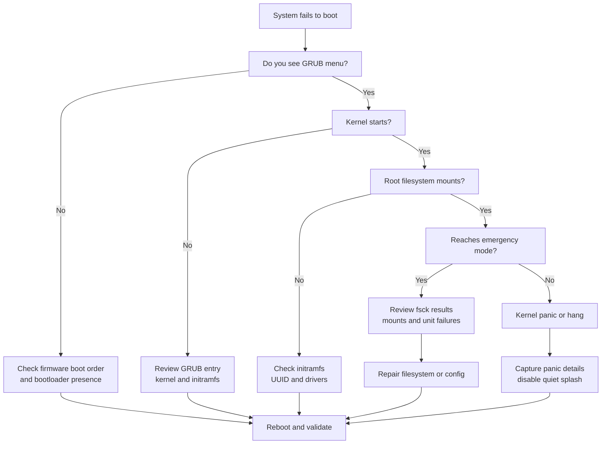

# Boot Issues

> **📌 Disclaimer**: Any third-party logos, screenshots, or diagrams referenced in this document are used for educational purposes only. All trademarks belong to their respective owners.


## 2.1 Boot stages

1. Firmware initializes hardware.
2. Bootloader loads kernel and initramfs.
3. Kernel initializes drivers.
4. Initramfs discovers root filesystem.
5. Real root filesystem mounts.
6. `systemd` or init launches userspace.
7. Targets and services start.

## 2.2 Boot failure decision tree



## 2.3 Initial questions for boot issues

- Did this start after an update?
- Was the kernel upgraded?
- Was `/etc/fstab` changed?
- Was disk layout changed?
- Is the root disk visible in firmware?
- Is encryption involved?
- Is this bare metal, VM, or cloud?

## 2.4 GRUB rescue basics

Symptoms:

- `grub rescue>` prompt.
- Missing normal module.
- Incorrect root prefix.
- Boot disk UUID changed.

Useful commands inside GRUB:

```text
ls
ls (hd0,gpt1)/
set
set root=(hd0,gpt1)
set prefix=(hd0,gpt1)/boot/grub
insmod normal
normal
```

## 2.5 Reinstall GRUB from rescue environment

BIOS systems:

```bash
mount /dev/sdXn /mnt
mount --bind /dev /mnt/dev
mount --bind /proc /mnt/proc
mount --bind /sys /mnt/sys
chroot /mnt
grub-install /dev/sdX
grub-mkconfig -o /boot/grub/grub.cfg
exit
```

UEFI systems:

```bash
mount /dev/sdXn /mnt
mount /dev/sdYn /mnt/boot/efi
mount --bind /dev /mnt/dev
mount --bind /proc /mnt/proc
mount --bind /sys /mnt/sys
chroot /mnt
grub-install --target=x86_64-efi --efi-directory=/boot/efi --bootloader-id=GRUB
grub-mkconfig -o /boot/grub/grub.cfg
exit
```

## 2.6 Initramfs problems

Symptoms:

- Dropped to initramfs shell.
- Root device not found.
- Missing LVM or RAID modules.
- Missing disk controller driver.

Check from initramfs shell:

```bash
cat /proc/cmdline
blkid
ls /dev
lvm pvscan
mdadm --assemble --scan
```

Common causes:

- Wrong root UUID in kernel command line.
- Stale initramfs after disk or driver changes.
- Missing dm-crypt, LVM, or RAID tooling.
- Corrupt initramfs image.

Rebuild initramfs after chroot:

Debian or Ubuntu:

```bash
update-initramfs -u -k all
```

RHEL or Rocky or AlmaLinux:

```bash
dracut -f --regenerate-all
```

## 2.7 Kernel panic basics

Common panic causes:

- Missing root filesystem.
- Unsupported storage controller.
- Corrupted kernel module.
- Severe memory errors.
- Filesystem corruption.
- Incompatible kernel parameters.

Collect better panic details:

- Remove `quiet` and `rhgb` or `splash` from GRUB.
- Add `systemd.log_level=debug` when needed.
- Use serial console in VMs or servers.
- Capture screenshots if console logging is unavailable.

## 2.8 Emergency mode and rescue mode

Inspect failed units:

```bash
systemctl --failed
journalctl -xb --no-pager
```

Common causes:

- Bad `/etc/fstab` entry.
- Missing network filesystem at boot.
- Filesystem needs fsck.
- Root mounted read-only.

## 2.9 Fixing `/etc/fstab`

Checklist:

- Confirm UUIDs with `blkid`.
- Ensure mount points exist.
- Verify filesystem type.
- Add `nofail` for noncritical mounts.
- Add `_netdev` for network mounts.
- Test with `mount -a`.

Example validation:

```bash
blkid
findmnt -A
mount -a
```

## 2.10 Single-user or rescue boot

From GRUB kernel line:

- Append `single`.
- Or append `systemd.unit=rescue.target`.
- For deeper minimal boot use `systemd.unit=emergency.target`.

Use single-user mode when:

- You need password reset.
- A broken service blocks multi-user boot.
- You need to fix auth or mount issues.

## 2.11 Root filesystem read-only

Symptoms:

- Remount failures.
- Services fail with write errors.
- Boot reaches emergency mode.

Check:

```bash
mount | grep ' / '
dmesg | tail -100
journalctl -k -b --no-pager | tail -200
```

If corruption is suspected:

- Boot from rescue media if possible.
- Unmount the filesystem.
- Run the appropriate fsck tool.

## 2.12 fsck guidance

Filesystem | Tool
---|---
ext2 or ext3 or ext4 | `fsck.ext4`
XFS | `xfs_repair` on unmounted fs
Btrfs | `btrfs check` with caution
VFAT | `fsck.vfat`

Important notes:

- Do not run destructive repair without backups if avoidable.
- XFS uses `xfs_repair`, not generic `fsck` in the usual sense.
- On LVM or RAID, verify the correct logical device.

Example ext4 repair:

```bash
umount /dev/mapper/vg-root
fsck.ext4 -f /dev/mapper/vg-root
```

Example XFS repair:

```bash
umount /dev/mapper/vg-root
xfs_repair /dev/mapper/vg-root
```

## 2.13 Boot log analysis

Commands:

```bash
journalctl -b -0 --no-pager
journalctl -b -1 --no-pager
journalctl -k -b --no-pager
systemd-analyze critical-chain
systemd-analyze blame | head -30
```

Use `-b -1` to compare the previous failed boot with the current boot.

## 2.14 Slow boot troubleshooting

Check:

- Failing network mounts.
- Long DNS timeouts.
- Misconfigured services waiting on dependencies.
- Hardware device probe delays.
- `cloud-init` stalls.
- `fsck` duration.

Useful commands:

```bash
systemd-analyze
systemd-analyze blame | head -50
systemd-analyze critical-chain
```

## 2.15 Encrypted root troubleshooting

Check:

- Is the LUKS header intact?
- Is the key slot valid?
- Is the keyboard layout causing passphrase mismatch?
- Is `crypttab` correct?
- Is initramfs built with crypt support?

Commands:

```bash
cryptsetup luksDump /dev/sdXn
cat /etc/crypttab
lsinitramfs /boot/initrd.img-$(uname -r) | grep crypt
```

## 2.16 Bootloader and kernel package mismatch

Symptoms:

- Kernel entry exists but files missing.
- New kernel installed but old initramfs referenced.
- Broken symlink under `/boot`.

Check:

```bash
ls -lh /boot
grep menuentry -n /boot/grub/grub.cfg
rpm -qa | grep kernel
apt list --installed 2>/dev/null | grep linux-image
```

## 2.17 Cloud or VM specific checks

- Verify attached root disk.
- Verify hypervisor disk order.
- Check console screenshot.
- Check serial console output.
- Ensure initramfs includes paravirtual drivers.
- Confirm correct boot mode: BIOS vs UEFI.

## 2.18 Secure Boot concerns

Symptoms:

- Unsigned kernel modules fail.
- Third-party drivers do not load.
- Boot halts after custom kernel changes.

Check:

```bash
mokutil --sb-state
journalctl -k | grep -i -E 'secure boot|lockdown|module verification'
```

## 2.19 Practical boot triage checklist

- Capture exact stage of failure.
- Check previous change records.
- Verify root disk presence.
- Verify `/boot` and EFI partitions.
- Verify kernel and initramfs matching versions.
- Verify `fstab` UUIDs.
- Review boot logs.
- Repair filesystem only after confirming need.
- Reboot only after documenting changes.

## 2.20 Common boot commands summary

```bash
lsblk -f
blkid
findmnt -A
cat /etc/fstab
journalctl -xb --no-pager
journalctl -k -b --no-pager
systemctl --failed
grub2-mkconfig -o /boot/grub2/grub.cfg
update-grub
update-initramfs -u
dracut -f
```

---
