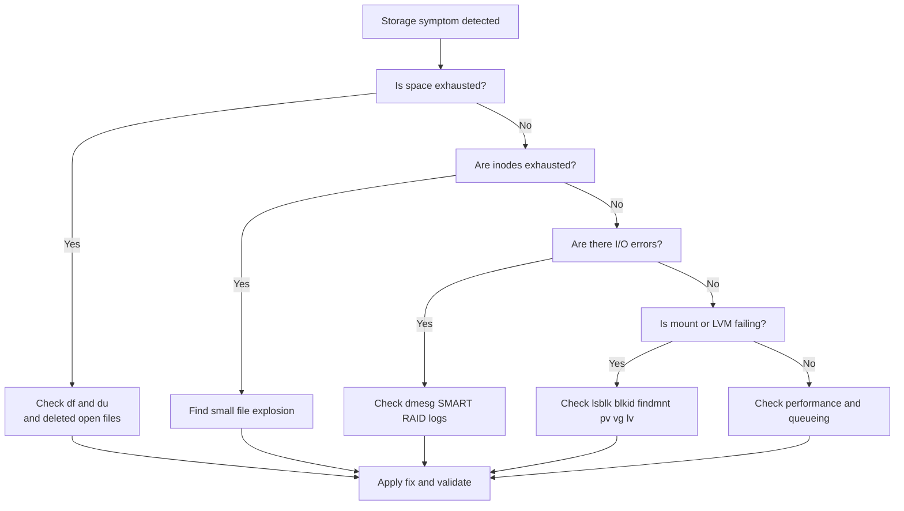

# Disk and Storage Issues

## 3.1 Common storage symptoms

- `No space left on device`.
- `Input/output error`.
- `Read-only filesystem`.
- Mount failure.
- Missing device.
- Degraded RAID.
- LVM volume inactive.
- High disk latency.
- Many blocked tasks in D state.

## 3.2 Disk troubleshooting flow



## 3.3 First commands for storage issues

```bash
df -hT
df -i
lsblk -f
findmnt -A
mount | column -t | head -50
dmesg -T | tail -200
journalctl -k --no-pager | tail -200
```

## 3.4 Disk full vs inode full

Disk blocks full:

- `df -h` shows 100% use.
- Large files or directories are the likely cause.

Inodes full:

- `df -i` shows 100% inode use.
- Usually millions of tiny files.

Check top space users:

```bash
du -xhd1 / | sort -h
du -xhd1 /var | sort -h
du -xhd1 /home | sort -h
```

Check tiny file explosion:

```bash
find /var -xdev -type f | awk -F/ '{print "/"$2"/"$3}' | sort | uniq -c | sort -nr | head
```

## 3.5 Open deleted files consuming space

Symptoms:

- `df -h` full.
- `du` totals do not match.
- Log rotation happened but space did not return.

Check:

```bash
lsof +L1
```

Fix:

- Restart or reload the process holding the deleted file.
- Avoid truncating unknown descriptors blindly.

## 3.6 Large file discovery

```bash
find / -xdev -type f -size +500M -printf '%s %p\n' 2>/dev/null | sort -n | tail -50
```

## 3.7 When `/var` fills unexpectedly

Common causes:

- Log storms.
- Package cache growth.
- Docker overlay layers.
- Core dumps.
- Stuck application temp files.
- Backup staging.
- Journald retention misconfiguration.

Useful checks:

```bash
journalctl --disk-usage
du -sh /var/log/* 2>/dev/null | sort -h
du -sh /var/cache/* 2>/dev/null | sort -h
du -sh /var/lib/docker 2>/dev/null
coredumpctl list | tail
```

## 3.8 Safe space recovery options

- Remove obsolete package caches.
- Vacuum journal logs.
- Rotate oversized app logs.
- Remove stale temp files after verification.
- Delete old backups from known locations.
- Expand the filesystem if appropriate.

Examples:

```bash
journalctl --vacuum-time=7d
apt clean
yum clean all
dnf clean all
```

## 3.9 I/O errors

Symptoms:

- `Input/output error`.
- Filesystem remounted read-only.
- Kernel logs show SATA or NVMe resets.
- Tasks stuck in D state.

Check kernel logs:

```bash
journalctl -k --no-pager | grep -i -E 'error|I/O|reset|nvme|ata|scsi|blk_update_request|buffer i/o'
```

Hardware checks:

```bash
smartctl -a /dev/sdX
smartctl -a /dev/nvme0
```

Interpret carefully:

- Reallocated sectors rising is bad.
- Pending sectors are bad.
- Media errors on NVMe are bad.
- Repeated controller resets suggest path or device instability.

## 3.10 Mount failures

Common causes:

- Wrong UUID.
- Unsupported filesystem type.
- Corrupted superblock.
- Missing mount point.
- Dirty filesystem.
- Bad options in `fstab`.

Check:

```bash
blkid
lsblk -f
cat /etc/fstab
mount -av
```

## 3.11 ext4 superblock recovery hint

Find backup superblocks:

```bash
mke2fs -n /dev/sdXn
```

Repair with a backup superblock:

```bash
fsck.ext4 -b 32768 /dev/sdXn
```

Use only after confirming the filesystem type and backup strategy.

## 3.12 XFS specifics

- XFS repair requires unmounted filesystem.
- Do not use `fsck.ext4` on XFS.
- Review kernel logs for metadata corruption.

Useful commands:

```bash
xfs_info /mountpoint
xfs_repair -n /dev/mapper/vg-data
```

## 3.13 LVM essentials

Inspect physical, volume, and logical layers:

```bash
pvs
vgs
lvs -a -o +devices
pvscan
vgscan
lvscan
```

Activate VGs:

```bash
vgchange -ay
```

If metadata is damaged, check backups in:

- `/etc/lvm/archive/`
- `/etc/lvm/backup/`

Restore metadata cautiously:

```bash
vgcfgrestore -f /etc/lvm/archive/<file> <vgname>
```

## 3.14 Extending a logical volume

Typical sequence for ext4:

```bash
pvcreate /dev/sdX
vgextend vgdata /dev/sdX
lvextend -r -L +100G /dev/vgdata/lvdata
```

Typical sequence for XFS:

```bash
lvextend -L +100G /dev/vgdata/lvdata
xfs_growfs /mountpoint
```

## 3.15 Shrinking warning

- XFS cannot be shrunk online or in the normal way.
- ext4 shrinking requires unmount and careful sequencing.
- Shrinking is riskier than extending.

## 3.16 RAID degraded arrays

Software RAID status:

```bash
cat /proc/mdstat
mdadm --detail /dev/md0
```

Key questions:

- Is the array degraded or failed?
- Which member is missing?
- Is the replacement device identical or larger?
- Is the problem the disk, cable, controller, or slot?

Add replacement device example:

```bash
mdadm /dev/md0 --add /dev/sdX1
```

## 3.17 Hardware RAID considerations

- Use vendor tooling for controller state.
- Check battery-backed cache status.
- Check patrol read or rebuild events.
- Check predictive failure alerts.

## 3.18 Multipath issues

Symptoms:

- Duplicate devices.
- Flapping paths.
- Slow I/O.
- Device mapper path failures.

Check:

```bash
multipath -ll
lsblk
```

## 3.19 D-state tasks and storage stalls

Check blocked tasks:

```bash
ps -eo pid,stat,wchan:32,comm | awk '$2 ~ /D/' | head -50
```

If many processes are in `D` state:

- Suspect storage latency or hangs.
- Inspect kernel messages.
- Inspect SAN or cloud volume status.

## 3.20 Filesystem usage hotspots

Find recent file growth:

```bash
find /var -xdev -type f -mtime -1 -printf '%TY-%Tm-%Td %TT %s %p\n' | sort | tail -100
```

## 3.21 Thin provisioning issues

Symptoms:

- Thin pool metadata full.
- New writes fail.
- Snapshots break.

Check:

```bash
lvs -a -o +seg_monitor,lv_size,data_percent,metadata_percent
```

## 3.22 Container storage problems

Common locations:

- `/var/lib/docker`
- `/var/lib/containerd`
- `/var/lib/containers`

Useful commands:

```bash
docker system df
docker ps -a
du -sh /var/lib/docker/* 2>/dev/null | sort -h
```

## 3.23 Network filesystem issues

For NFS and CIFS:

- Confirm server reachability.
- Confirm DNS resolution.
- Confirm firewall ports.
- Confirm credentials and export settings.
- Use `_netdev` in `fstab`.

Check:

```bash
showmount -e nfs-server
mount -v -t nfs nfs-server:/export /mnt
```

## 3.24 Swap storage concerns

If swap resides on a failing disk:

- Page-ins will stall.
- System may appear frozen.

Check swap devices:

```bash
swapon --show --output=NAME,TYPE,SIZE,USED,PRIO
```

## 3.25 Storage incident checklist

- Verify symptoms: full, slow, or corrupt.
- Check `df -h` and `df -i`.
- Check `du` against `df`.
- Check `lsof +L1`.
- Review kernel logs.
- Check SMART or RAID state.
- Verify mounts, UUIDs, LVM, RAID.
- Repair only after backups and scope validation.

---
