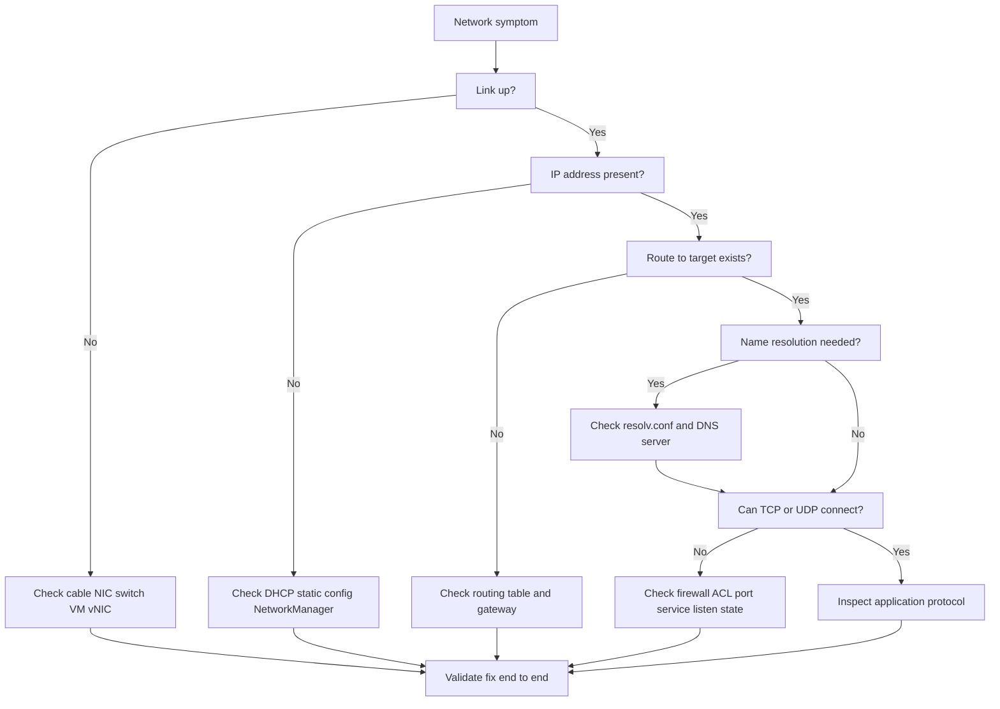

# Network Issues

## 6.1 Troubleshooting model

Work from lower layers upward:

- Link.
- IP addressing.
- Routing.
- Firewall.
- DNS.
- Transport.
- Application protocol.

## 6.2 Network troubleshooting layers



## 6.3 First commands

```bash
ip -br addr
ip route
ip rule
ss -tulpn
ping -c 3 8.8.8.8
ping -c 3 gateway-ip
tracepath target
resolvectl status
journalctl -u NetworkManager --no-pager | tail -100
```

## 6.4 No connectivity

Checklist:

- Is the interface up?
- Is it carrier up?
- Does it have the correct IP?
- Is default route present?
- Can it ping the gateway?
- Can it reach a public IP?
- Can it resolve DNS names?

Commands:

```bash
ip link
ip -br addr
ip route
arp -n
```

## 6.5 Interface state

Inspect:

```bash
ip -details link show dev eth0
ethtool eth0
```

Look for:

- `LOWER_UP`.
- duplex mismatch.
- speed mismatch.
- excessive drops.
- CRC errors.

## 6.6 DHCP problems

Check:

- Lease present.
- DHCP server reachable.
- Client logs.
- Duplicate IP conflicts.

Commands:

```bash
journalctl -u NetworkManager --no-pager | grep -i dhcp
journalctl -u systemd-networkd --no-pager | grep -i dhcp
```

## 6.7 Routing issues

Common symptoms:

- Can reach local subnet only.
- Wrong default gateway.
- Asymmetric path.
- Policy routing mismatch.

Check route selection:

```bash
ip route get 1.1.1.1
ip route get target-ip
ip rule
```

## 6.8 DNS failures

Check resolver configuration:

```bash
cat /etc/resolv.conf
resolvectl status
resolvectl query example.com
getent hosts example.com
host example.com
nslookup example.com
```

Common causes:

- Bad nameserver IP.
- Search domain confusion.
- Resolver timeout due to firewall.
- Broken split DNS.
- Stale local cache.

## 6.9 Slow DNS

Symptoms:

- App is slow at connect time.
- `curl` by IP is fast but hostname is slow.
- SSH delays before banner.

Measure:

```bash
time getent hosts example.com
dig +stats example.com
```

## 6.10 Packet loss

Check with:

```bash
ping -c 20 target
mtr -rwzbc 100 target
```

Interpret carefully:

- ICMP rate limiting can mislead.
- Loss only on one hop may be harmless if downstream is fine.
- End-to-end loss matters most.

## 6.11 Firewall blocks

Common frameworks:

- `iptables`
- `nftables`
- `firewalld`
- cloud security groups
- external ACLs

Check:

```bash
nft list ruleset
iptables -S
iptables -L -n -v
firewall-cmd --list-all
```

## 6.12 Port conflicts and listen state

Check listening processes:

```bash
ss -tulpn
ss -ltnp '( sport = :80 )'
```

## 6.13 Connection refused vs timeout

- `Connection refused` usually means reachable host, no listener, or active reject.
- `Timeout` often means packet drop, routing issue, firewall, or host unreachable.

## 6.14 MTU issues

Symptoms:

- Small traffic works.
- Large transfers fail or stall.
- VPN traffic behaves strangely.
- HTTPS or SSH hangs after connect.

Check path MTU:

```bash
tracepath target
ping -M do -s 1472 target
```

Reduce MTU for testing if needed.

## 6.15 Network drops and errors

Check counters:

```bash
ip -s link
ethtool -S eth0 | head -100
```

Look for:

- RX drops.
- TX drops.
- frame errors.
- FIFO errors.
- overruns.

## 6.16 TCP diagnostics

Useful tools:

```bash
ss -s
ss -tan state syn-sent
ss -tan state established
sar -n TCP,ETCP 1 5
```

Possible issues:

- SYN backlog overflow.
- Retransmits.
- Reset storms.
- Too many `TIME_WAIT` sockets.

## 6.17 Capture packets when needed

Use `tcpdump` carefully:

```bash
tcpdump -ni eth0 host target-ip and port 443
```

Questions to answer:

- Are packets leaving?
- Are replies coming back?
- Is there ARP resolution?
- Is there TCP handshake completion?

## 6.18 Reverse path filtering

Check rp_filter settings on multi-homed systems:

```bash
sysctl net.ipv4.conf.all.rp_filter
sysctl net.ipv4.conf.eth0.rp_filter
```

## 6.19 Conntrack exhaustion

Symptoms:

- Random connection failures.
- Firewalling host under heavy connection churn.

Check:

```bash
sysctl net.netfilter.nf_conntrack_count
sysctl net.netfilter.nf_conntrack_max
```

## 6.20 Ephemeral port exhaustion

Symptoms:

- Clients fail to create new outbound connections.
- Many sockets in `TIME_WAIT`.

Check:

```bash
cat /proc/sys/net/ipv4/ip_local_port_range
ss -tan | awk '{print $1}' | sort | uniq -c
```

## 6.21 Bonding and teaming

Check:

```bash
cat /proc/net/bonding/bond0
nmcli connection show
```

Verify:

- active slave.
- LACP state.
- switch configuration alignment.

## 6.22 VLAN issues

Check subinterfaces:

```bash
ip -d link show
bridge vlan show 2>/dev/null
```

## 6.23 Network namespace and container issues

Check:

```bash
ip netns list
docker inspect <container>
podman inspect <container>
```

## 6.24 Proxy confusion

Check environment variables:

```bash
env | grep -i proxy
```

## 6.25 TLS is not basic connectivity

A host can be reachable while TLS fails.

Check certificate and handshake:

```bash
openssl s_client -connect host:443 -servername host
curl -vk https://host/
```

## 6.26 Network issue checklist

- Verify link.
- Verify IP.
- Verify route.
- Verify DNS.
- Verify firewall.
- Verify listener.
- Verify MTU.
- Verify packet flow.
- Verify application protocol.

---
