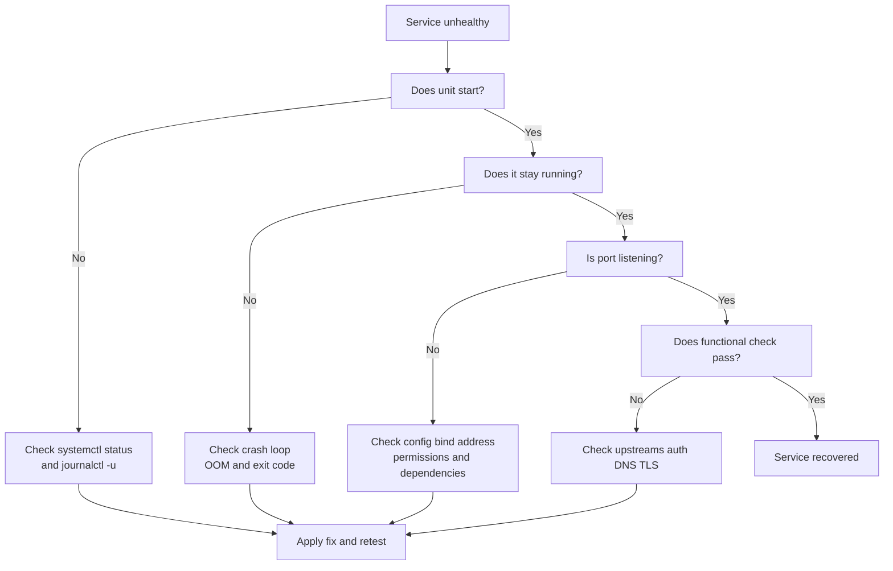

# Service Issues

## 7.1 First commands

```bash
systemctl status myservice --no-pager
journalctl -u myservice -b --no-pager | tail -200
systemctl list-dependencies myservice
ss -tulpn
```

## 7.2 Service failure diagnosis flow



## 7.3 Read `systemctl status` carefully

Important fields:

- `Loaded`.
- `Active`.
- `Main PID`.
- recent log lines.
- exit status.
- restart counter.

## 7.4 Common failure classes

- Bad configuration.
- Missing dependency.
- Port already in use.
- Permission denied.
- Missing file or directory.
- User account missing.
- SELinux denial.
- Environment variable issue.
- Secret or certificate missing.
- OOM crash.

## 7.5 Validate service unit files

Check the unit:

```bash
systemctl cat myservice
systemd-analyze verify /etc/systemd/system/myservice.service
```

## 7.6 Dependency failures

Check dependencies:

```bash
systemctl list-dependencies myservice
systemctl show -p After,Wants,Requires myservice
```

If a database or network mount must exist first, ensure the unit ordering is correct.

## 7.7 Restart loops

Check:

```bash
systemctl show myservice -p Restart,RestartSec,NRestarts
journalctl -u myservice --no-pager | tail -200
```

Possible causes:

- App crashes instantly.
- Readiness probe fails.
- Environment missing.
- Health check is too aggressive.

## 7.8 Exit codes matter

Typical meanings:

- `1` general failure.
- `126` command invoked cannot execute.
- `127` command not found.
- `137` SIGKILL or OOM.
- `139` segmentation fault.
- `143` SIGTERM.

## 7.9 Port already in use

Check:

```bash
ss -ltnp '( sport = :8080 )'
```

Fix options:

- Stop conflicting service.
- Change bind port.
- Fix duplicate startup.

## 7.10 Permission denied in services

Check:

- service user exists.
- file ownership.
- directory execute bits.
- SELinux context.
- capabilities for low ports or raw sockets.

## 7.11 SELinux denials

Inspect:

```bash
aausearch -m AVC,USER_AVC -ts recent 2>/dev/null
journalctl -t setroubleshoot --no-pager | tail -50
getenforce
```

## 7.12 Environment file issues

Check:

```bash
systemctl show myservice -p Environment,EnvironmentFiles
systemctl cat myservice
```

Common issues:

- file missing.
- wrong quoting.
- file permissions.
- variable not exported where expected.

## 7.13 Working directory issues

- Relative paths break under systemd.
- Use absolute paths.
- Ensure `WorkingDirectory=` exists.

## 7.14 Socket activation confusion

Some services are started by sockets.

Check:

```bash
systemctl list-sockets | grep myservice
systemctl status myservice.socket --no-pager
```

## 7.15 Resource limits

Check unit limits:

```bash
systemctl show myservice -p LimitNOFILE,LimitNPROC,MemoryMax,TasksMax
```

## 7.16 Manual foreground start

Starting the binary manually can reveal clear errors.

Example pattern:

```bash
sudo -u serviceuser /usr/bin/myservice --config /etc/myservice.conf
```

Do this only when safe and when the service manager is not already controlling the process.

## 7.17 Health check failures

A service can be running but unhealthy.

Check:

- local port responds.
- readiness endpoint returns expected status.
- downstream dependencies are reachable.
- credentials are valid.

## 7.18 Service issue checklist

- Read unit status.
- Read recent journal.
- Verify config syntax.
- Verify dependencies.
- Verify ports.
- Verify permissions and SELinux.
- Verify resource limits.
- Verify functional health.

---
