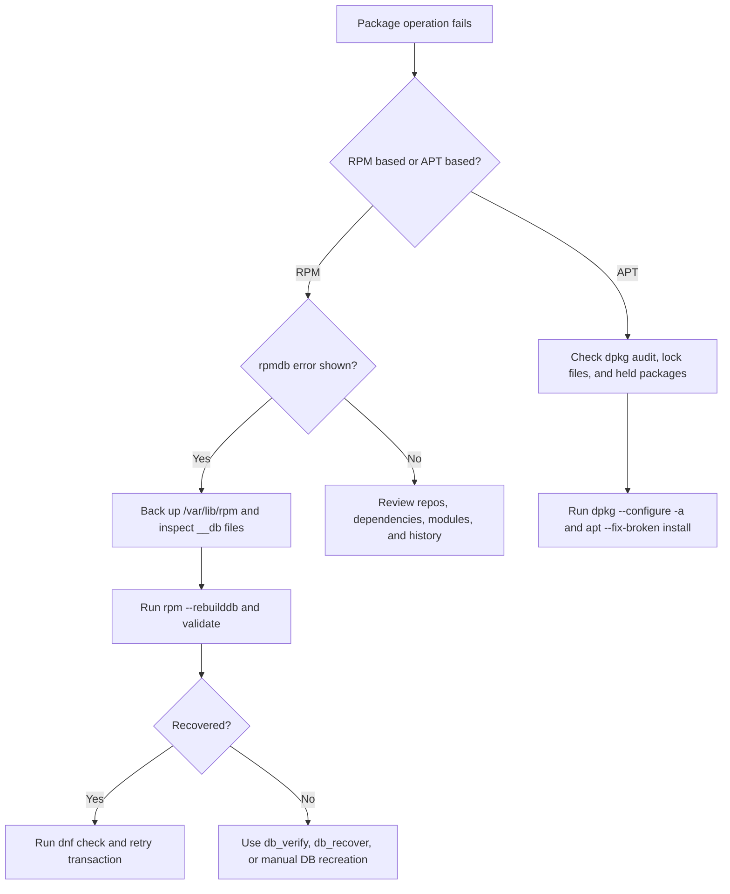
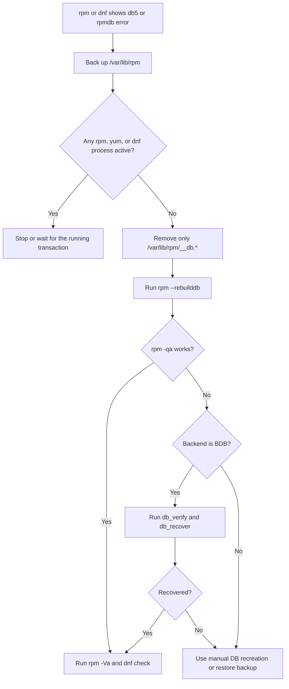
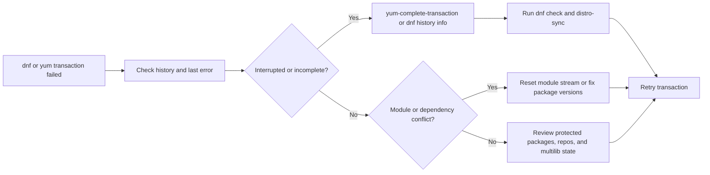

# Package Issues

This chapter expands package troubleshooting into production-ready recovery workflows. The main focus is RPM database corruption and recovery, but the guide also covers YUM and DNF failures, APT recovery, repository trust issues, kernel package problems, and real-world package incidents. Pair it with [04-SystemAdministration/18-rpm-patching-advanced.md](../04-SystemAdministration/18-rpm-patching-advanced.md), [14-advanced-troubleshooting.md](./14-advanced-troubleshooting.md), and [15-production-incident-playbooks.md](./15-production-incident-playbooks.md).

## 9.1 Fast triage checklist

Before changing package state, capture the current condition.

```bash
sudo date
sudo uname -r
sudo df -h /
sudo df -h /boot
sudo rpm --eval '%{_db_backend}' 2>/dev/null || true
sudo dnf repolist -v 2>/dev/null || sudo yum repolist all
sudo dnf history list 2>/dev/null || sudo yum history list
sudo rpm -qa --last | head -20
```

On Debian and Ubuntu:

```bash
sudo apt update
sudo apt-cache policy
sudo dpkg --audit
sudo apt-mark showhold
sudo journalctl -u apt-daily.service -u apt-daily-upgrade.service --no-pager
```

## 9.2 Package failure workflow



## 9.3 RPM Database Corruption & Recovery

RPM database corruption is the most dangerous package failure on RPM-based systems because it affects every install, erase, verify, and patch action.

### Recognizing the symptoms

Common messages include:

- `rpmdb: Thread/process failed`
- `rpmdb open failed`
- `error: db5 error(-30973) from dbenv->failchk`
- `BDB0113 Thread/process failed: BDB1507 Thread died in Berkeley DB library`
- `cannot open Packages index using db5`
- `error: cannot open Packages database in /var/lib/rpm`

Typical causes:

- abrupt reboot or power loss during `yum`, `dnf`, or `rpm`
- disk full conditions in `/var`
- stale Berkeley DB environment lock files on older systems
- filesystem corruption or storage path instability
- attempting concurrent package operations

### Verify whether anything is still using the database

Never delete lock files or rebuild the database while a real package operation is still running.

```bash
ps -ef | grep -E 'dnf|yum|rpm' | grep -v grep
sudo lsof /var/lib/rpm/Packages
sudo lsof /var/lib/rpm/__db.* 2>/dev/null
sudo fuser -v /var/lib/rpm/Packages
```

If package tools are active because a legitimate patch job is still running, wait for it or stop it cleanly from the controlling automation.

### Back up the RPM database before touching it

```bash
sudo mkdir -p /root/rpmdb-backups
sudo tar -C /var/lib -czf /root/rpmdb-backups/rpmdb-before-repair-$(date +%F-%H%M).tar.gz rpm
sudo cp -a /var/lib/rpm /root/rpmdb-backups/rpm-raw-copy-$(date +%F-%H%M)
```

Backing up the database before patching is also a best practice during healthy maintenance windows.

### Understand `/var/lib/rpm/__db.*` lock files

On Berkeley DB-based RPM databases, files such as `/var/lib/rpm/__db.001`, `/var/lib/rpm/__db.002`, and `/var/lib/rpm/__db.003` are environment and lock files.

Remove them only when all of the following are true:

- no `rpm`, `yum`, or `dnf` process is running
- no configuration management job is patching the host
- you have a current backup of `/var/lib/rpm`

Safe removal workflow:

```bash
sudo rm -f /var/lib/rpm/__db.*
```

Do **not** delete `Packages`, `Basenames`, `Name`, or other real database content as a first step.

### Standard `rpm --rebuilddb` recovery workflow

This is the safest first repair attempt on a damaged but recoverable RPM database.

1. Back up `/var/lib/rpm`.
2. Confirm no package tools are running.
3. Remove stale `__db.*` files if present.
4. Rebuild the database.
5. Validate the result.

```bash
sudo mkdir -p /root/rpmdb-backups
sudo tar -C /var/lib -czf /root/rpmdb-backups/rpmdb-pre-rebuild-$(date +%F-%H%M).tar.gz rpm
ps -ef | grep -E 'dnf|yum|rpm' | grep -v grep
sudo rm -f /var/lib/rpm/__db.*
sudo rpm --rebuilddb
sudo rpm -qa | head
sudo rpm -Va
sudo dnf check 2>/dev/null || sudo yum check
```

If `rpm -qa` works after the rebuild, retry the failed package transaction.

### When to use `db_verify`

`db_verify` is useful on older BDB-backed systems when `rpm --rebuilddb` is not enough or the Berkeley DB environment itself is suspect.

Check the backend first:

```bash
rpm --eval '%{_db_backend}'
```

If the backend is `bdb`, verify the package database:

```bash
sudo db_verify /var/lib/rpm/Packages
```

If `db_verify` reports page or B-tree errors, move to `db_recover` or manual recreation.

### When to use `db_recover`

`db_recover` can repair the Berkeley DB environment without rebuilding package metadata from scratch.

```bash
sudo db_recover -h /var/lib/rpm
sudo rpm --rebuilddb
sudo rpm -qa | head
```

Recommended sequence on BDB systems:

1. confirm no package process is active
2. back up `/var/lib/rpm`
3. remove `__db.*`
4. run `db_verify /var/lib/rpm/Packages`
5. run `db_recover -h /var/lib/rpm` if verify or rebuild still fails
6. run `rpm --rebuilddb`

### Recovery decision tree



### Recovery when `--rebuilddb` fails

If `rpm --rebuilddb` still fails, use a more controlled manual recovery.

#### Option 1: rebuild from a copied database directory

```bash
sudo systemctl stop packagekit 2>/dev/null || true
sudo mkdir -p /root/rpmdb-emergency
sudo cp -a /var/lib/rpm /root/rpmdb-emergency/original
sudo rm -f /root/rpmdb-emergency/original/__db.*
sudo rpm --dbpath /root/rpmdb-emergency/original --rebuilddb
sudo rpm --dbpath /root/rpmdb-emergency/original -qa | head
```

If this succeeds, replace the live database only after a backup:

```bash
sudo mv /var/lib/rpm /var/lib/rpm.broken-$(date +%F-%H%M)
sudo cp -a /root/rpmdb-emergency/original /var/lib/rpm
sudo rpm -qa | head
```

#### Option 2: create a fresh DB directory and repopulate from `Packages`

This method is for BDB-style failures when the `Packages` file still exists but the indexes are broken.

```bash
sudo mkdir -p /root/rpmdb-emergency/newdb
sudo cp -a /var/lib/rpm/Packages /root/rpmdb-emergency/newdb/
sudo rpm --dbpath /root/rpmdb-emergency/newdb --rebuilddb
sudo rpm --dbpath /root/rpmdb-emergency/newdb -qa | head
```

If it works, swap directories carefully:

```bash
sudo mv /var/lib/rpm /var/lib/rpm.pre-swap-$(date +%F-%H%M)
sudo install -d -m 0755 /var/lib/rpm
sudo cp -a /root/rpmdb-emergency/newdb/. /var/lib/rpm/
sudo rpm -qa | head
```

#### Option 3: restore from backup

If `Packages` is missing or unreadable, restoring `/var/lib/rpm` from a known-good system backup is often faster and safer than trying to reconstruct the package state manually.

### Post-recovery validation

Always validate after recovery:

```bash
sudo rpm -qa | wc -l
sudo rpm -Va
sudo dnf check 2>/dev/null || sudo yum check
sudo dnf history list 2>/dev/null || sudo yum history list
sudo journalctl -p err -b --no-pager | tail -50
```

Look for:

- unreadable package metadata
- duplicate package versions
- missing files from critical packages
- transactions that were interrupted before scripts completed

## 9.4 YUM and DNF transaction failures

Package managers can fail even when the RPM database itself is healthy.

### Incomplete transactions

On legacy YUM systems:

```bash
sudo yum-complete-transaction
sudo yum history list
sudo yum check
```

On DNF systems, start with history and consistency checks:

```bash
sudo dnf history
sudo dnf history info last
sudo dnf check
sudo dnf distro-sync
```

### Use history undo, redo, and rollback carefully

```bash
sudo yum history
sudo yum history undo 125
sudo yum history redo 125
sudo yum history rollback 120
```

Equivalent DNF actions:

```bash
sudo dnf history
sudo dnf history undo 125
sudo dnf history redo 125
```

Operational notes:

- `undo` tries to reverse one transaction
- `redo` replays a transaction
- `rollback` on YUM reverts to a transaction point, but results depend on repo availability and package retention
- history-based rollback is weaker than a VM snapshot if kernels, glibc, or multiple repos changed

### DNF module stream conflicts

Modules can block updates when streams are mutually exclusive.

Symptoms:

- `conflicting requests`
- `module <name>:<stream> is enabled`
- package requires a stream that differs from the currently enabled one

Commands:

```bash
sudo dnf module list
sudo dnf module list php
sudo dnf module reset php
sudo dnf module enable php:8.2
sudo dnf distro-sync
```

If a module caused the conflict, reset or disable the wrong stream before retrying.

### Protected packages preventing updates or removals

DNF and YUM protect critical packages such as `systemd`, `dnf`, `kernel`, and `glibc`.

Symptoms:

- `Problem: The operation would result in removing the following protected packages`

Checks:

```bash
sudo grep -R '^protected_packages' /etc/dnf /etc/yum.conf /etc/yum.repos.d 2>/dev/null
sudo dnf history info last
sudo dnf repoquery --duplicates
```

Do not bypass protected package checks casually. A blocked update usually indicates a dependency or repo inconsistency that needs correction.

### Multilib version problems

Typical message:

- `Protected multilib versions: package.x86_64 != package.i686`

Diagnosis and cleanup:

```bash
sudo dnf repoquery --duplicates
sudo rpm -qa | grep -E '\.(i686|x86_64)$' | sort
sudo package-cleanup --problems
sudo package-cleanup --dupes
sudo package-cleanup --cleandupes
```

If the workload does not need 32-bit libraries, remove the stale `i686` package only after dependency review:

```bash
sudo dnf remove glibc.i686
```

### Useful cleanup commands

```bash
sudo package-cleanup --problems
sudo package-cleanup --orphans
sudo package-cleanup --dupes
sudo dnf clean all
sudo rm -rf /var/cache/dnf
sudo yum clean all
```

### DNF transaction recovery flow



## 9.5 APT issues on Debian and Ubuntu

### Repair half-configured packages

Interrupted APT transactions often leave `dpkg` in an unfinished state.

```bash
sudo dpkg --configure -a
sudo apt --fix-broken install
sudo apt install -f
sudo dpkg --audit
```

### Check held packages and pinning

```bash
apt-mark showhold
apt-cache policy <pkgname>
grep -R . /etc/apt/preferences /etc/apt/preferences.d 2>/dev/null
```

Held packages frequently explain partial upgrades or impossible dependency chains.

### Broken dependencies

```bash
sudo apt --fix-broken install
sudo apt-cache depends <pkgname>
sudo apt-cache rdepends <pkgname>
```

If a package is half-installed and blocks progress:

```bash
sudo dpkg -l | awk '$1 ~ /..r|..H|..F/'
```

### Lock file issues

APT lock files are usually a symptom, not the core problem.

Common lock paths:

- `/var/lib/dpkg/lock`
- `/var/lib/dpkg/lock-frontend`
- `/var/cache/apt/archives/lock`

Check first:

```bash
ps -ef | grep -E 'apt|dpkg|unattended' | grep -v grep
sudo lsof /var/lib/dpkg/lock-frontend
sudo systemctl status apt-daily.service apt-daily-upgrade.service
```

If no process owns the lock and the system crashed mid-transaction, remove the stale lock and repair dpkg:

```bash
sudo rm -f /var/lib/dpkg/lock-frontend /var/lib/dpkg/lock /var/cache/apt/archives/lock
sudo dpkg --configure -a
sudo apt --fix-broken install
```

## 9.6 GPG key issues

GPG problems appear when repository signing keys rotate, local trust stores are wrong, proxies modify content, or the system clock is inaccurate.

### RPM-based systems

List installed keys:

```bash
rpm -q gpg-pubkey
rpm -qi gpg-pubkey-$(rpm -q gpg-pubkey --qf '%{VERSION}-%{RELEASE}\n' | head -1)
```

Import a key:

```bash
sudo rpm --import /etc/pki/rpm-gpg/RPM-GPG-KEY-redhat-release
sudo rpm --import https://repo.example.com/RPM-GPG-KEY-example
```

Verify a package or repository signature:

```bash
rpm -Kv package.rpm
sudo dnf repolist -v
```

### APT-based systems

Modern APT prefers per-repository keyrings.

```bash
curl -fsSL https://repo.example.com/repo.asc | sudo gpg --dearmor -o /usr/share/keyrings/example-archive-keyring.gpg
```

Example source entry:

```text
deb [signed-by=/usr/share/keyrings/example-archive-keyring.gpg] https://repo.example.com/debian stable main
```

### Troubleshooting checklist

- confirm the system time is correct
- verify the expected key fingerprint from vendor documentation
- inspect HTTPS interception proxies or mirrored repositories
- make sure the repo file points to the correct key and URL

## 9.7 Repository problems

### Metadata cache issues

Broken cache can produce false dependency errors or outdated metadata.

```bash
sudo dnf clean all
sudo dnf makecache
sudo yum clean all
sudo rm -rf /var/cache/dnf
sudo apt clean
sudo apt update
```

### Subscription-manager on RHEL

```bash
sudo subscription-manager status
sudo subscription-manager identity
sudo subscription-manager repos --list-enabled
sudo subscription-manager refresh
```

Common failures:

- expired subscription or detached entitlement
- wrong content set enabled
- system registered to the wrong organization or activation key

### Satellite or Katello environments

When hosts use Satellite or Katello:

- verify the host is attached to the correct lifecycle environment
- check whether the content view contains the needed package or erratum
- validate capsule or proxy reachability
- compare host repo files with the activation key design

Useful checks on the host:

```bash
sudo grep -R '^baseurl\|^enabled\|^name' /etc/yum.repos.d
sudo dnf repolist -v
sudo subscription-manager identity
```

## 9.8 Dependency hell and conflicting providers

### Circular or conflicting dependencies

Useful RPM commands:

```bash
sudo dnf repoquery --unsatisfied
sudo rpm -q --whatrequires <pkgname>
sudo repoquery --whatprovides '<capability>'
```

Useful APT commands:

```bash
apt-cache depends <pkgname>
apt-cache rdepends <pkgname>
```

### Conflicting providers

Two packages may offer the same capability or file.

Example checks:

```bash
sudo repoquery --whatprovides /usr/bin/python3
sudo rpm -qf /usr/bin/python3
sudo rpm -Va | grep '^..5'
```

### Risks of `rpm -e --nodeps`

`rpm -e --nodeps` ignores dependency safety checks. It can remove a package that other packages or the boot process still require.

Use it only when:

- you fully understand the dependency graph
- the system has a tested rollback path
- the package is already broken and blocking all repair paths
- you are ready to reinstall dependent packages immediately afterward

Safer alternatives:

- `dnf remove <pkg>` after cleaning repos and dependency state
- `dnf distro-sync`
- reinstalling the conflicting packages from a clean repo source

## 9.9 Kernel package issues

Kernel package failures often involve both package state and bootloader state.

### Failed kernel install

Check:

```bash
df -h /boot
sudo dnf history info last
sudo journalctl -u dnf* --no-pager | tail -100
rpm -qa | grep '^kernel' | sort
```

Common causes:

- `/boot` full
- post-install script failed
- initramfs generation failed
- subscription or repo mismatch produced an incomplete kernel set

### GRUB not updated

If the kernel packages are installed but boot entries were not refreshed:

```bash
sudo grubby --info=ALL
sudo grub2-mkconfig -o /boot/grub2/grub.cfg
sudo grub2-mkconfig -o /boot/efi/EFI/redhat/grub.cfg
```

Use the correct output path for BIOS or UEFI systems.

### Removing old kernels safely

Keep at least one known-good older kernel.

```bash
sudo package-cleanup --oldkernels --count=2 -y
sudo dnf remove kernel-core-<old-version>
rpm -qa | grep '^kernel' | sort
```

Do not remove the running kernel:

```bash
uname -r
```

## 9.10 Real-world scenarios

### Scenario 1: Power loss during patching corrupts the RPM DB

**Symptoms**

- `yum update` fails with `db5 error(-30973)`
- `rpm -qa` hangs or exits with `rpmdb: Thread/process failed`

**Diagnosis**

```bash
ps -ef | grep -E 'yum|dnf|rpm' | grep -v grep
sudo lsof /var/lib/rpm/Packages
rpm --eval '%{_db_backend}'
```

**Root cause**

The host rebooted while Berkeley DB environment files were active.

**Fix**

```bash
sudo tar -C /var/lib -czf /root/rpmdb-incident.tar.gz rpm
sudo rm -f /var/lib/rpm/__db.*
sudo db_verify /var/lib/rpm/Packages
sudo rpm --rebuilddb
sudo dnf check
```

If rebuild still fails, use the manual DB recreation procedure from section 9.3.

### Scenario 2: PHP app server blocked by module stream conflict

**Symptoms**

- `dnf upgrade` reports `module php:7.4 is enabled`
- new app release requires PHP 8.2 packages

**Diagnosis**

```bash
sudo dnf module list php
sudo dnf repoquery --upgrades | grep php
```

**Root cause**

The server remained pinned to an older module stream while the repos published a newer application stack.

**Fix**

```bash
sudo dnf module reset php
sudo dnf module enable php:8.2
sudo dnf distro-sync
```

### Scenario 3: Protected package prevents update after repo drift

**Symptoms**

- `dnf` says the operation would remove `systemd` or `dnf`

**Diagnosis**

```bash
sudo dnf repolist -v
sudo dnf history info last
sudo package-cleanup --problems
```

**Root cause**

A third-party repo provided a conflicting dependency chain.

**Fix**

- disable the third-party repo temporarily
- refresh metadata
- run `dnf distro-sync`
- retry the update only from approved repos

### Scenario 4: Interrupted Ubuntu upgrade leaves dpkg half-configured

**Symptoms**

- `apt upgrade` says `dpkg was interrupted`
- unattended-upgrades was running when the VM was rebooted

**Diagnosis**

```bash
ps -ef | grep -E 'apt|dpkg|unattended' | grep -v grep
sudo dpkg --audit
apt-mark showhold
```

**Root cause**

The transaction was interrupted during package configuration.

**Fix**

```bash
sudo rm -f /var/lib/dpkg/lock-frontend /var/lib/dpkg/lock
sudo dpkg --configure -a
sudo apt --fix-broken install
sudo apt update
```

### Scenario 5: Satellite host cannot install security errata

**Symptoms**

- `dnf update --security` says no package available
- Satellite UI shows the erratum exists

**Diagnosis**

```bash
sudo subscription-manager identity
sudo dnf repolist -v
sudo grep -R '^baseurl\|^name' /etc/yum.repos.d
```

**Root cause**

The host was attached to the wrong content view or lifecycle environment.

**Fix**

- reattach the correct activation key or lifecycle assignment
- refresh subscriptions
- clear DNF cache and retry

### Scenario 6: Kernel installed but system still boots the old kernel

**Symptoms**

- `rpm -qa | grep '^kernel'` shows the new kernel
- after reboot, `uname -r` still shows the old one

**Diagnosis**

```bash
uname -r
sudo grubby --info=ALL
sudo efibootmgr -v 2>/dev/null
```

**Root cause**

GRUB configuration was not regenerated correctly, or the wrong boot entry remained default.

**Fix**

```bash
sudo grub2-mkconfig -o /boot/grub2/grub.cfg
sudo grub2-mkconfig -o /boot/efi/EFI/redhat/grub.cfg
sudo grubby --set-default /boot/vmlinuz-<new-version>
```

## 9.11 Final verification after any package repair

```bash
sudo rpm -qa | tail
sudo rpm -Va
sudo dnf check 2>/dev/null || sudo yum check
sudo dnf history info last 2>/dev/null || sudo yum history info last
sudo apt --fix-broken install 2>/dev/null || true
sudo dpkg --audit 2>/dev/null || true
sudo systemctl --failed
```

Confirm additionally:

- repositories point to the correct environment
- the expected kernel is selected for the next reboot
- critical services start successfully
- no package tool is left running in the background

## 9.12 Summary

The safest package recovery flow is always the same: preserve evidence, back up metadata, repair the smallest broken layer first, validate the result, and only then retry the original transaction. For RPM-based systems, most high-impact outages come from damaged package metadata or broken repo state, so protect `/var/lib/rpm`, treat `__db.*` files carefully, and use `rpm --rebuilddb`, `db_verify`, and `db_recover` in that order.
