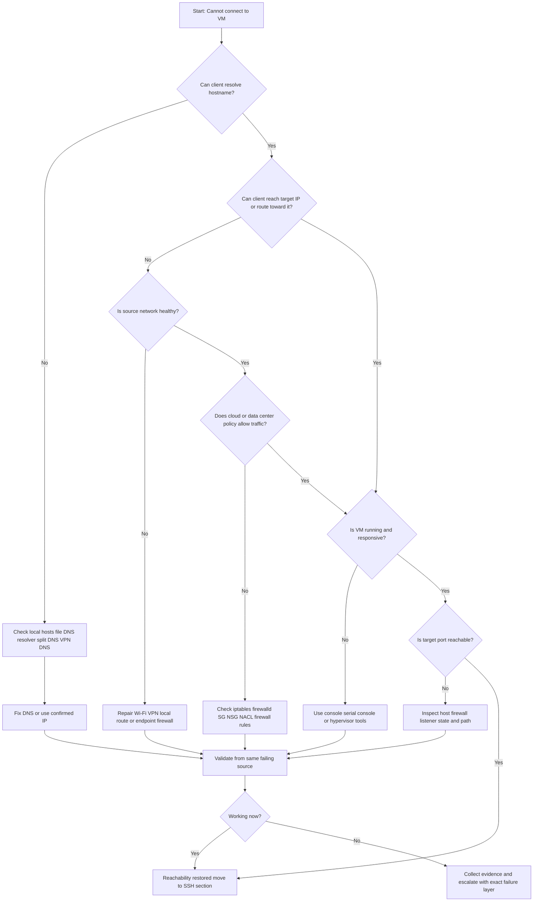
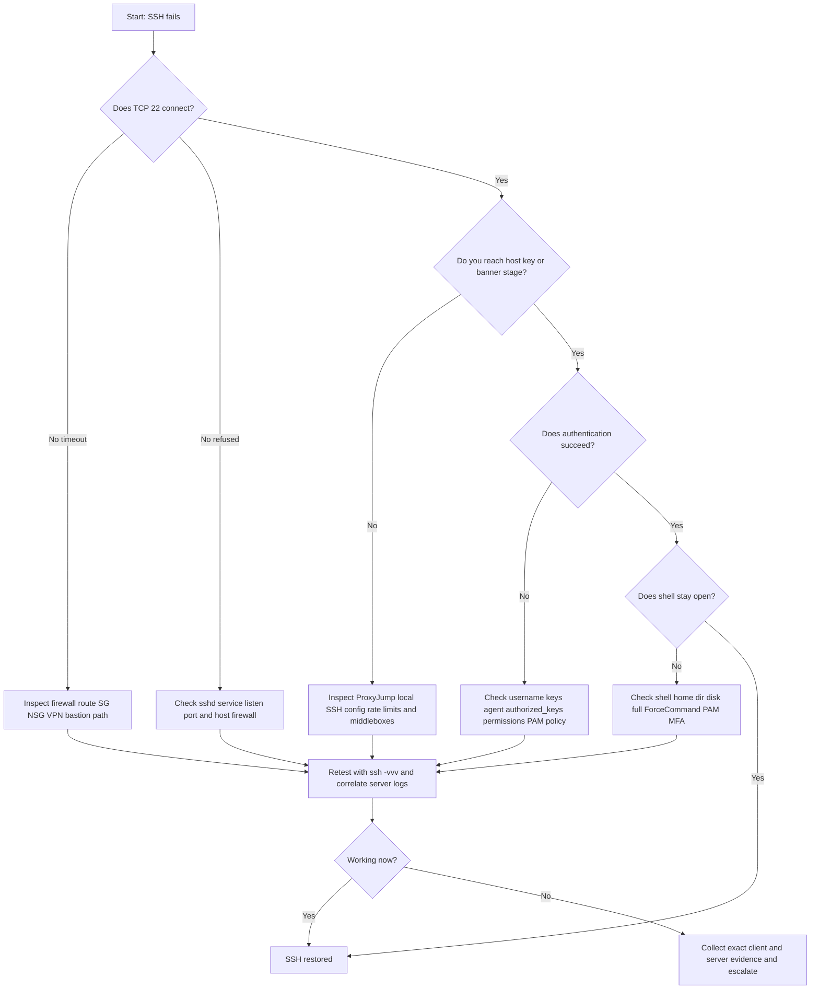
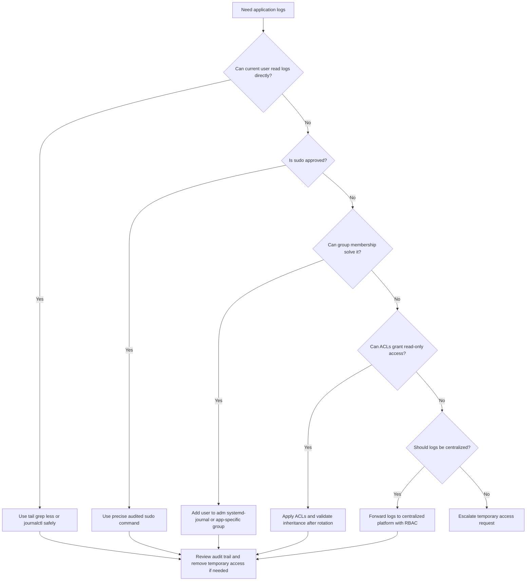

# 🔐 VM and SSH Access Issues

Comprehensive runbook for diagnosing **VM reachability**, **SSH failures**, and **application log access limitations** in Linux and cloud environments.

---

## 🎯 How to Use This Guide

- Classify the problem first: **cannot connect to the VM**, **cannot complete SSH**, or **cannot read application logs**.
- Start with read-only evidence collection before changing production infrastructure.
- Treat networking, host state, SSH transport, authentication, and authorization as separate layers.
- Use the decision trees for triage, then follow the matching deep-dive section.
- Record timestamps, changes made, rollback steps, and the exact symptom text during incidents.

## 🌈 Severity Legend

| Indicator | Meaning | Typical action | Examples |
|---|---|---|---|
| 🟢 Low | Informational or isolated issue | Fix in normal work queue | One stale host key entry |
| 🟡 Medium | Limited impact or workaround exists | Same-day remediation | One engineer needs log-read access |
| 🟠 High | Access blocked for part of the team or path | Immediate triage | Port 22 blocked from admin subnet |
| 🔴 Critical | Production outage or no administrative access path | Incident response now | VM hung or broken control-plane policy |

## 🧭 Quick Index

- [13.1 Unable to Connect to VM](#131--unable-to-connect-to-vm)
- [13.2 Unable to SSH](#132--unable-to-ssh)
- [13.3 Checking Application Logs Without Permissions](#133--checking-application-logs-without-permissions)
- [13.4 Real-World Scenarios](#134--real-world-scenarios)
- [13.5 Command Cheat Sheets](#135--command-cheat-sheets)
- [13.6 Evidence Collection Templates](#136--evidence-collection-templates)
- [13.7 Troubleshooting Matrix](#137--troubleshooting-matrix)
- [13.8 Closing Guidance](#138--closing-guidance)

## 📌 Golden Rules Before You Change Anything

- Confirm the **source IP**, **destination IP**, **hostname**, **username**, **cloud region**, and **intended access path**.
- Differentiate **timeout**, **refused**, **DNS error**, **host key mismatch**, and **permission denied**.
- If you must change a firewall rule or SSH setting, document the exact before/after state and rollback plan.
- Use the smallest safe access change; do not broadly open firewalls or relax file permissions just to get unstuck.
- Keep break-glass methods such as console access, bastion access, or serial console tested ahead of time.

---

## 13.1 🌐 Unable to Connect to VM

> 🔴 **Critical symptom**: If you cannot reach the VM over the network, do not assume SSH is the root cause. Prove whether the client, path, cloud control plane, or guest OS is failing first.

### 13.1.1 🗺️ Mermaid Decision Tree for VM Reachability



### 13.1.2 🚦 Quick Symptom-to-Layer Map

| Symptom | Likely layer | Severity | First action |
|---|---|---|---|
| `Could not resolve hostname` | DNS or local SSH config | 🟡 | Run `getent hosts` and `ssh -G` |
| `No route to host` | Routing or local gateway issue | 🟠 | Inspect route table and VPN routes |
| `Connection timed out` | Firewall drop, path issue, hung VM | 🟠/🔴 | Run `nc`, `traceroute`, and inspect cloud rules |
| Cloud console shows stopped VM | Compute control plane | 🔴 | Check instance status and boot path |
| Works only from bastion | Expected private design or direct path policy block | 🟡/🟠 | Confirm intended access method |
| Ping fails but TCP works | ICMP intentionally blocked | 🟢/🟡 | Use TCP checks instead of ICMP as success criteria |

### 13.1.3 ⏱️ First 5 Minutes Checklist

- Verify the hostname and IP are current and not copied from an old ticket or chat thread.
- Test from at least one more source such as a bastion, another VM in the same subnet, or a cloud shell.
- Check whether the VM was recently recreated, rebooted, resized, or failed over.
- Compare ICMP reachability, traceroute results, and a direct TCP test to the target port.
- Open the cloud console and confirm the NIC, subnet, security policy, and instance state are what you expect.

### 13.1.4 🧰 Baseline Commands from the Client Side

```bash
# Resolve the target
getent hosts vm.example.internal
host vm.example.internal
nslookup vm.example.internal

# Basic path tests
ping -c 4 10.10.20.15
traceroute 10.10.20.15
tracepath 10.10.20.15
mtr -rwzbc 20 10.10.20.15

# TCP checks
nc -vz 10.10.20.15 22
curl -vk telnet://10.10.20.15:22

# Local routing checks
ip addr
ip route
ip route get 10.10.20.15
```

### 13.1.5 🔎 Network connectivity issues

**Severity:** 🟠 High

**Common symptoms**

- The trace dies on the first or second hop.
- The laptop or source VM is missing the expected route.
- One network path works, but another network path consistently fails.

**Useful checks**

```bash
ip addr
ip route
ping -c 3 gateway-ip
ping -c 3 8.8.8.8
traceroute target-ip
mtr -rwzbc 30 target-ip
```

**Practical fixes**

1. Repair the source network first by reconnecting Wi-Fi, renewing DHCP, or re-establishing the VPN session.
2. Compare working and failing route tables to find a missing prefix or bad default route.
3. If only one office or VPN pool fails, investigate source NAT, egress ACLs, or split-tunnel policy.

**How to validate the fix**

- The same source that failed can now reach the gateway and target path consistently.
- `nc -vz target-ip 22` succeeds or moves to a more specific error such as refused.
- The path remains healthy after reconnecting the VPN or renewing the client network state.

**Prevention and operational notes**

- Keep a known-good comparison host in the same subnet or VPC/VNet.
- Document required source routes for VPN users.
- Do not rely on a single engineer laptop as proof that the service is down.

### 13.1.6 🔎 Firewall blocking

**Severity:** 🔴 Critical

**Common symptoms**

- TCP connections time out while the VM appears healthy in the control plane.
- Traffic works from one source range but not another.
- The problem started after a hardening change, ACL update, or security review.

**Useful checks**

```bash
sudo nft list ruleset
sudo iptables -S
sudo iptables -L -n -v
sudo firewall-cmd --list-all
sudo ss -ltnp | grep ':22'
sudo tcpdump -ni any port 22
```

**Practical fixes**

1. Open the minimum required source CIDR and destination port in the closest blocking layer.
2. Check both host firewall and cloud firewall because either can independently drop traffic.
3. If traffic still fails, use packet capture or flow logs to prove where the drop occurs.

**How to validate the fix**

- Live packet capture shows SYN and SYN-ACK after the rule change.
- The original failing source can now reach the port.
- The rule is documented in code or change management rather than left as an unexplained exception.

**Prevention and operational notes**

- Review effective policy, not just intended policy.
- Avoid broad allow rules that outlive the incident.
- Test from approved and disallowed source ranges after security changes.

### 13.1.7 🔎 VM not running or hung

**Severity:** 🔴 Critical

**Common symptoms**

- The cloud console shows stopped, impaired, failed status checks, or a boot problem.
- Serial console or hypervisor log shows kernel panic, boot loop, or storage errors.
- The host does not answer ARP, ICMP, or TCP even though network policy looks correct.

**Useful checks**

```bash
# AWS
aws ec2 describe-instance-status --instance-ids i-xxxxxxxx

# Azure
az vm get-instance-view --name vm-name --resource-group rg-name

# GCP
gcloud compute instances describe vm-name --zone us-central1-a
```

**Practical fixes**

1. Use serial or console access to inspect the boot path before forcing a reboot.
2. If the guest is hard hung, coordinate a reboot with the application owner and capture evidence first.
3. Investigate root causes such as disk full, memory exhaustion, kernel panic, or broken boot dependencies.

**How to validate the fix**

- The instance passes provider status checks and responds to network probes again.
- The console shows a clean boot without repeated errors.
- Application owners confirm expected services returned after the host became reachable.

**Prevention and operational notes**

- Test console access outside incidents.
- Monitor disk, memory, and boot failures so the host does not silently degrade into a hang.
- Keep recent snapshots or recovery patterns for critical systems.

### 13.1.8 🔎 Wrong IP or DNS resolution failure

**Severity:** 🟡 Medium

**Common symptoms**

- SSH works by IP but fails by hostname.
- The hostname resolves to an old public IP after rebuild or failover.
- On VPN and off VPN produce different answers for the same name.

**Useful checks**

```bash
getent hosts vm-name
host vm-name
nslookup vm-name
resolvectl query vm-name
ssh -G vm-name | grep -E 'hostname|port|user'
```

**Practical fixes**

1. Update the DNS record, bastion alias, load balancer mapping, or local inventory entry.
2. Clear stale local resolver caches where applicable and wait for TTL expiry if necessary.
3. Correct split-horizon DNS or document which resolver path is authoritative.

**How to validate the fix**

- The same hostname resolves to the expected IP from all intended source networks.
- The SSH client effective config shows the correct host, port, and username.
- Connection attempts by name behave the same as by the confirmed IP.

**Prevention and operational notes**

- Prefer stable DNS aliases or static admin entry points instead of ad hoc IP sharing.
- Document whether internal and external resolvers are expected to differ.
- Check both A and AAAA records when troubleshooting modern environments.

### 13.1.9 🔎 Cloud-specific policy or platform issue

**Severity:** 🟠 High

**Common symptoms**

- Rules look correct on the host, but the path still fails.
- Only one VPC/VNet, subnet, project, or region is affected.
- Infrastructure-as-code changed security tags, service accounts, or network rules recently.

**Useful checks**

```bash
# AWS
aws ec2 describe-security-groups --group-ids sg-xxxxxxxx
aws ec2 describe-network-acls --filters Name=association.subnet-id,Values=subnet-xxxxxxxx

# Azure
az network nic list-effective-nsg --name nic-name --resource-group rg-name
az network watcher test-connectivity --source-resource source-id --dest-address 10.1.2.4 --dest-port 22

# GCP
gcloud compute firewall-rules list
gcloud compute instances describe vm-name --zone us-central1-a
```

**Practical fixes**

1. Review effective policy at NIC, subnet, and route-table level rather than trusting the intended design.
2. Check tags, service accounts, network ACLs, peering, internet gateways, NAT, and health probes.
3. Use provider-native flow logs or connectivity tests when manual inspection is inconclusive.

**How to validate the fix**

- Provider connectivity or flow logging confirms the path is now allowed.
- The VM retains the expected public/private IP and route behavior after remediation.
- The infrastructure code reflects the final state so the issue does not reappear later.

**Prevention and operational notes**

- Include effective-policy validation in change review.
- Use tags and labels consistently so rules match what you think they match.
- Monitor for drift between cloud intent and actual instance attachments.

### 13.1.10 🔎 VPN or bastion host issue

**Severity:** 🟠 High

**Common symptoms**

- The VM is reachable on the corporate LAN but not from remote users.
- Bastion host is reachable, but the second hop fails.
- Name resolution for internal hosts only works while the VPN is active.

**Useful checks**

```bash
ip route | grep -E '10\.|172\.|192\.168\.'
scutil --dns
ssh -J bastion user@target-ip -vvv
nc -vz bastion-host 22
ssh bastion-host 'nc -vz target-ip 22'
```

**Practical fixes**

1. Reconnect or restart the VPN client and confirm the required split routes and DNS servers are installed.
2. Validate bastion security groups, outbound rules, and target-subnet east-west permissions.
3. Update stale ProxyJump or bastion host definitions in user SSH configuration.

**How to validate the fix**

- Remote users can resolve the internal name and complete the bastion path.
- A second-hop `nc` test from the bastion succeeds.
- The same workflow works for multiple users, not just one laptop.

**Prevention and operational notes**

- Monitor bastions like production services because they are part of the access plane.
- Document the intended jump path clearly so engineers do not try unsupported direct access.
- Include route and DNS verification in VPN client rollout testing.

### 13.1.11 🔎 Local workstation security or proxy interference

**Severity:** 🟡 Medium

**Common symptoms**

- Only one engineer is affected.
- The same target works from another laptop or cloud shell.
- Corporate endpoint tooling or local SSH config changed recently.

**Useful checks**

```bash
ssh -F /dev/null -o ConnectTimeout=5 user@target-ip -vvv
nc -vz target-ip 22
ssh -G target-host | sed -n '1,80p'
```

**Practical fixes**

1. Bypass local aliases and custom config to confirm whether the issue is client-side.
2. Review local firewall, proxy, endpoint policy, and stale SSH options.
3. Escalate to endpoint engineering with evidence if the failure follows a managed security rollout.

**How to validate the fix**

- `ssh -F /dev/null` works or isolates the exact local config causing the issue.
- A clean client profile behaves normally to the same target.
- The engineer can repeat the fix after reconnecting to the network or VPN.

**Prevention and operational notes**

- Keep a known-good access path such as a cloud shell for comparison.
- Minimize surprising local overrides in `~/.ssh/config`.
- Teach responders to compare failing and working clients quickly.

### 13.1.12 ☁️ Cloud-Specific Deep Dive

#### Azure NSG troubleshooting

- Check both subnet NSG and NIC NSG because Azure evaluates both.
- Use effective security rules to see the merged result actually applied to the NIC.
- Validate whether Azure Bastion, Just-In-Time access, route tables, or Azure Firewall are part of the path.
- Use connectivity tests to prove where the flow is blocked.

```bash
az network nic list-effective-nsg --name vm-nic --resource-group rg-name
az network watcher test-connectivity --source-resource source-vm-id --dest-address 10.1.2.4 --dest-port 22
az vm run-command invoke --command-id RunShellScript --name vm-name --resource-group rg-name --scripts "ss -ltnp | grep :22"
```

#### AWS Security Group troubleshooting

- Verify Security Group rules and Network ACLs because SGs are stateful but NACLs are stateless.
- Confirm the instance still has the expected Elastic IP or public IP.
- If the instance is private, validate whether Session Manager, VPN, Direct Connect, or a bastion is the intended access path.
- VPC Flow Logs often settle disputes about whether traffic was allowed or rejected.

```bash
aws ec2 describe-instances --instance-ids i-xxxxxxxx --query 'Reservations[].Instances[].{State:State.Name,Private:PrivateIpAddress,Public:PublicIpAddress,SG:SecurityGroups}'
aws ec2 describe-security-groups --group-ids sg-xxxxxxxx
aws ec2 describe-network-acls --filters Name=association.subnet-id,Values=subnet-xxxxxxxx
```

#### GCP Firewall Rules troubleshooting

- GCP rules often depend on network tags or service accounts, so confirm the target still matches the rule.
- Check the VM zone, subnet, internal/external IPs, and VPC routes.
- Use connectivity tests or firewall rule logging when a simple visual inspection is not enough.

```bash
gcloud compute instances describe vm-name --zone us-central1-a
gcloud compute firewall-rules list
gcloud compute network-management connectivity-tests create ssh-test --source-instance=source-vm --destination-instance=target-vm --destination-port=22 --protocol=TCP
```

### 13.1.13 📊 Reachability Quick Reference Table

| Observation | Meaning | Next step |
|---|---|---|
| Ping fails and traceroute fails on hop 1 | Source network problem | Fix local route, gateway, VPN, or endpoint firewall |
| Ping fails and `nc` to 22 times out | Possible firewall drop or path issue | Inspect cloud and host policies |
| Ping works and `nc` says refused | Host reachable but no listener or active reject | Inspect SSH service and host firewall |
| Hostname resolves to old IP | Stale DNS or bad inventory | Update record and clear stale references |
| Works from bastion only | Private design or source-specific block | Use bastion path or request scoped ingress |
| No ARP on same subnet | NIC, host, or hypervisor problem | Check VM state and virtual NIC attachment |

### 13.1.14 🧪 Real-World VM Reachability Scenarios

#### Scenario 1: Office users time out, bastion works

**Observed behavior**

- Users attempt direct SSH from the office or home network.
- Bastion to target path still succeeds.

**Likely root cause**

- Direct ingress is blocked and the documented bastion path was ignored or outdated instructions remained in use.

**Resolution steps**

1. Update the runbook to show the required bastion path.
2. Validate bastion health and outbound rules.
3. Retest from the original user source.

**Key lesson**

- If one path is designed and another is not, the documentation must be explicit.

#### Scenario 2: Hostname works on VPN but not off VPN

**Observed behavior**

- Internal hostname resolves to a private IP only on VPN.
- Off VPN, users get NXDOMAIN or a different answer.

**Likely root cause**

- Split-horizon DNS and remote-user DNS configuration are inconsistent.

**Resolution steps**

1. Confirm the intended resolver path.
2. Fix DNS push settings on the VPN client.
3. Document that the hostname is internal-only if that is expected.

**Key lesson**

- Many access tickets are really DNS design misunderstandings.

#### Scenario 3: Instance recreated by autoscaling

**Observed behavior**

- The target IP changed after replacement.
- Operators still use the old address from previous incidents.

**Likely root cause**

- People are using an old direct IP instead of a stable admin endpoint.

**Resolution steps**

1. Move access instructions to DNS or static IPs.
2. Update inventory and chat bookmarks.
3. Verify host identity before reconnecting.

**Key lesson**

- Human memory is not a reliable discovery system for dynamic infrastructure.

#### Scenario 4: Trace dies after VPN gateway

**Observed behavior**

- Users can reach the VPN concentrator but not the application subnet.
- Another working engineer has the route present.

**Likely root cause**

- Required split-tunnel route is missing from the VPN client.

**Resolution steps**

1. Compare working and failing route tables.
2. Reconnect or repair the VPN policy.
3. Retest path and SSH after route installation.

**Key lesson**

- Always compare a failing client against a known-good client.

#### Scenario 5: Cloud flow logs show REJECT

**Observed behavior**

- VPC/NSG flow data clearly shows rejected SSH traffic.
- Host firewall is not the blocker.

**Likely root cause**

- A cloud security control such as NACL, SG, NSG, or rule tag mismatch is dropping the traffic.

**Resolution steps**

1. Fix the correct rule scope.
2. Retest from approved source ranges only.
3. Update infrastructure code to persist the change.

**Key lesson**

- Provider flow logs are often the fastest route to certainty.

#### Scenario 6: Serial console shows kernel panic

**Observed behavior**

- All network tests fail.
- Serial console shows the guest crashing during boot.

**Likely root cause**

- The issue is guest OS health, not network policy.

**Resolution steps**

1. Capture console output.
2. Use rescue or recovery workflow.
3. Repair the boot issue before troubleshooting access again.

**Key lesson**

- A dead guest cannot respond to a perfectly healthy network.

#### Scenario 7: Only one VM in a scale set fails

**Observed behavior**

- Peer instances in the same environment still work.
- One node fails all probes and has drifted config.

**Likely root cause**

- The node is an outlier due to bad config, broken NIC attachment, or corruption.

**Resolution steps**

1. Compare working versus failing instances.
2. Repair or replace the outlier.
3. Confirm autoscaling policy produces healthy replacements.

**Key lesson**

- Outlier analysis is powerful in fleets.

#### Scenario 8: Ping blocked but SSH works

**Observed behavior**

- Responders assume the VM is unreachable because ping fails.
- A TCP check to port 22 succeeds.

**Likely root cause**

- ICMP is intentionally denied while TCP/22 is allowed.

**Resolution steps**

1. Use TCP checks as the primary validation for SSH availability.
2. Document ICMP policy so responders do not misdiagnose the issue.
3. Avoid opening ICMP just to satisfy habit.

**Key lesson**

- Different protocols are governed by different policies.

---

## 13.2 🔑 Unable to SSH

> 🟠 **High-impact symptom**: If the VM is reachable but SSH fails, focus on whether the failure is in the transport path, the SSH daemon, authentication, account policy, or post-login environment.

### 13.2.1 🔀 Mermaid Flowchart for SSH Troubleshooting



### 13.2.2 🧾 Fast Triage Table

| Error | Interpretation | Primary checks |
|---|---|---|
| `Connection timed out` | Packets are likely dropped before service response | Path, firewall, VPN, bastion |
| `Connection refused` | Host reachable but no SSH listener or active reject | `sshd`, listen port, host firewall |
| `Permission denied (publickey,password)` | Authentication failure | User, key, agent, account policy |
| `Host key verification failed` | Known-host mismatch or wrong target | Verify host identity before removing entry |
| `kex_exchange_identification` | Rate limiting, proxy, fail2ban, or connection interruption | Client debug and server logs |
| Login succeeds then exits | Shell, PAM, disk, home dir, or forced command issue | Server logs and account environment |

### 13.2.3 🧰 Core Commands for SSH Triage

```bash
# Client-side
ssh -vvv user@target
ssh -F /dev/null -vvv user@target
ssh -o IdentitiesOnly=yes -i ~/.ssh/id_ed25519 -vvv user@target
ssh -G target | sed -n '1,120p'
ssh-add -l
nc -vz target 22

# Server-side via console or alternate access
sudo systemctl status sshd --no-pager
sudo journalctl -u sshd --since '2 hours ago' --no-pager
sudo ss -ltnp | grep ':22'
sudo sshd -t
sudo grep -Ev '^#|^$' /etc/ssh/sshd_config
sudo ls -ld /home/user /home/user/.ssh /home/user/.ssh/authorized_keys
sudo tail -n 100 /var/log/auth.log
sudo tail -n 100 /var/log/secure
```

### 13.2.4 🔍 SSH service not running

**Severity:** 🔴 Critical

**Common symptoms**

- `nc` returns refused or times out while the host otherwise responds.
- `systemctl status sshd` shows failed, inactive, or crash looping.
- A config or package change happened shortly before access was lost.

**Useful checks**

```bash
sudo systemctl status sshd --no-pager
sudo journalctl -u sshd -b --no-pager | tail -200
sudo sshd -t
sudo ss -ltnp | grep ':22'
```

**Practical fixes**

1. Run `sshd -t` before restart to catch syntax problems.
2. Fix invalid directives, missing host keys, or bad bind settings.
3. If the disk is full or the boot state is unhealthy, resolve that first and then restart the daemon.

**How to validate the fix**

- `systemctl status` reports active and stable.
- Port 22 is listening on the expected interface.
- A fresh connection reaches the banner or auth stage normally.

**Prevention and operational notes**

- Use configuration management and peer review for SSH changes.
- Validate with `sshd -t` during deployment pipelines when possible.
- Monitor for service restarts and failures.

### 13.2.5 🔍 Port 22 blocked

**Severity:** 🟠 High

**Common symptoms**

- `ssh` hangs until timeout.
- Cloud console shows healthy instance but path tests fail.
- One source network works while another fails.

**Useful checks**

```bash
sudo ss -ltnp | grep ':22'
sudo nft list ruleset
sudo iptables -L -n -v
sudo firewall-cmd --list-all
sudo tcpdump -ni any port 22
```

**Practical fixes**

1. Allow TCP/22 from approved admin sources or bastion ranges.
2. If a non-standard SSH port is used, align both client and server policy consistently.
3. Use live packet capture while retesting to prove where the failure occurs.

**How to validate the fix**

- The original failing source can now reach the port.
- Packet capture shows both inbound SYN and outbound SYN-ACK.
- No unplanned source ranges gained access.

**Prevention and operational notes**

- Document whether direct SSH is supported or bastion-only access is required.
- Test ingress from approved CIDRs after firewall changes.
- Keep host firewall and cloud firewall rules aligned.

### 13.2.6 🔍 Key authentication failures

**Severity:** 🟠 High

**Common symptoms**

- `Permission denied (publickey)` appears.
- The same user works from another laptop.
- SSH agent offers too many or the wrong keys.

**Useful checks**

```bash
ssh-add -l
ssh -o IdentitiesOnly=yes -i ~/.ssh/id_ed25519 -vvv user@target
sudo grep -i 'Failed publickey\|Accepted publickey' /var/log/auth.log
sudo grep -i 'Failed publickey\|Accepted publickey' /var/log/secure
```

**Practical fixes**

1. Force the intended key with `-i` and `IdentitiesOnly=yes`.
2. Verify the matching public key exists in the correct `authorized_keys` file.
3. Use a supported key type and signature algorithm such as Ed25519 or RSA SHA-2.

**How to validate the fix**

- Client debug shows the right key is offered.
- Server logs show the key accepted or a more specific remaining error.
- The user can log in without repeated retries or fallback methods.

**Prevention and operational notes**

- Keep SSH agent contents minimal during troubleshooting.
- Standardize key management for operators.
- Avoid silent drift in `AuthorizedKeysFile` paths.

### 13.2.7 🔍 Permission denied (publickey,password)

**Severity:** 🟠 High

**Common symptoms**

- Neither password nor key login works.
- The username may be wrong for the image or cloud platform.
- Account lockout, expiration, or identity-provider problems may be involved.

**Useful checks**

```bash
getent passwd user
sudo passwd -S user
sudo chage -l user
sudo faillock --user user 2>/dev/null
sudo tail -n 100 /var/log/auth.log
sudo tail -n 100 /var/log/secure
```

**Practical fixes**

1. Confirm the intended username for the OS image.
2. Unlock or restore the account according to policy.
3. If password auth is intentionally disabled, stop testing the wrong method and fix key auth instead.

**How to validate the fix**

- Server auth logs show either success or a clear remaining account-policy error.
- The correct user can authenticate using the approved method.
- Repeat attempts do not trigger lockout or fail2ban again.

**Prevention and operational notes**

- Document standard login users for each image type.
- Avoid repeated random password retries that pollute the evidence trail.
- Monitor identity-provider and PAM dependencies for SSH-dependent systems.

### 13.2.8 🔍 SSH config issues (`sshd_config`)

**Severity:** 🔴 Critical

**Common symptoms**

- The service fails to reload after config changes.
- Only a subset of users or source addresses are affected.
- Unexpected auth methods or ports are in effect.

**Useful checks**

```bash
sudo sshd -t
sudo sshd -T | sed -n '1,120p'
sudo grep -nE '^(Port|ListenAddress|PasswordAuthentication|PubkeyAuthentication|PermitRootLogin|AllowUsers|AllowGroups|DenyUsers|DenyGroups|AuthorizedKeysFile|Match)' /etc/ssh/sshd_config
```

**Practical fixes**

1. Validate syntax before reload or restart.
2. Inspect `Match` blocks carefully because later rules override general settings.
3. Restore known-good configuration from version control or configuration management when in doubt.

**How to validate the fix**

- `sshd -t` passes cleanly.
- `sshd -T` shows the expected effective settings.
- Users affected by the earlier rule can now log in as intended.

**Prevention and operational notes**

- Keep SSH configuration in version control.
- Use peer review for hardening changes.
- Test with a second session before closing the only working admin connection.

### 13.2.9 🔍 Host key verification failed

**Severity:** 🟡 Medium

**Common symptoms**

- The client warns that the remote host identification changed.
- The VM was rebuilt, replaced, or its IP was reassigned.
- Users may be connecting to the wrong target entirely.

**Useful checks**

```bash
ssh-keygen -F target-host
ssh-keyscan -t ed25519,rsa target-host
ssh-keygen -R target-host
```

**Practical fixes**

1. Validate the new host key from a trusted source before removing the old entry.
2. Remove only the stale `known_hosts` entry rather than deleting the entire file.
3. Fix DNS or inventory if the name now points to a different machine than expected.

**How to validate the fix**

- The new host fingerprint matches trusted records.
- The client no longer reports mismatch after the correct update.
- Users connect to the intended host identity.

**Prevention and operational notes**

- Consider host certificates or a stronger host-identity workflow for dynamic fleets.
- Avoid reusing names and IPs without updating inventory promptly.
- Teach responders not to ignore host key warnings blindly.

### 13.2.10 🔍 Connection timed out vs connection refused

**Severity:** 🟠 High

**Common symptoms**

- Responders treat distinct error types as the same issue.
- Timeouts trigger network investigation while refused should trigger daemon inspection.
- Time is lost because the failure is not classified early.

**Useful checks**

```bash
# Timeout focus
nc -vz -w 5 target 22
traceroute target

# Refused focus
nc -vz -w 5 target 22
sudo ss -ltnp | grep ':22'
```

**Practical fixes**

1. For timeout, inspect drop points and routing first.
2. For refused, inspect listener state and host response first.
3. Capture the exact client error text in the ticket or incident channel.

**How to validate the fix**

- Responders can name the precise failure mode after the first tests.
- The issue follows the correct runbook branch instead of a generic SSH checklist.
- Subsequent remediation is targeted and faster.

**Prevention and operational notes**

- Train on-call staff to distinguish these errors quickly.
- Use health checks that verify the expected transport behavior.
- Avoid ambiguous incident notes like "SSH broken" without the actual error.

### 13.2.11 🔍 SSH debug mode (`-vvv`) interpretation

**Severity:** 🟢 Low

**Common symptoms**

- The failure stage is unclear without detailed client output.
- ProxyJump, ControlMaster, or agent forwarding hides the real cause.
- Multiple config files may be affecting the final behavior.

**Useful checks**

```bash
ssh -vvv user@target
ssh -F /dev/null -vvv user@target
ssh -vvv -J bastion user@target
ssh -G target | sed -n '1,120p'
```

**Practical fixes**

1. Look for the exact stage: DNS resolution, TCP connect, host key, auth method negotiation, key acceptance, or session setup.
2. Bypass local config with `-F /dev/null` to isolate local drift.
3. Capture sanitized excerpts when escalating to another team.

**How to validate the fix**

- The failing stage is identified clearly in the debug trace.
- Removing a local config override changes or resolves the issue as expected.
- The final debug log shows clean negotiation and session establishment.

**Prevention and operational notes**

- Keep SSH client config organized and commented.
- Avoid unnecessary complexity in jump-host chains.
- Teach responders the meaning of key debug phrases such as `Offering public key` and `Authentications that can continue`.

### 13.2.12 🔍 Account, shell, or post-authentication policy issue

**Severity:** 🟠 High

**Common symptoms**

- Auth succeeds and then the session closes immediately.
- Home directory ownership or shell startup files are broken.
- PAM, MFA, forced commands, or a full disk break session setup.

**Useful checks**

```bash
getent passwd user
sudo ls -ld /home/user
sudo ls -la /home/user
sudo df -h
sudo tail -n 100 /var/log/auth.log
sudo tail -n 100 /var/log/secure
```

**Practical fixes**

1. Ensure the user has a valid shell and a readable home directory.
2. Fix broken shell startup files or forced command definitions.
3. Free disk space if session creation or logging fails due to full storage.

**How to validate the fix**

- The user can run an interactive shell and a non-interactive command.
- Server logs show a complete login session rather than immediate teardown.
- The same user can reconnect repeatedly without reproducing the failure.

**Prevention and operational notes**

- Test login health after changing shells, PAM, or forced commands.
- Monitor root filesystem utilization.
- Keep shell customization minimal on service accounts.

### 13.2.13 🔍 Fail2ban, MaxStartups, or connection throttling

**Severity:** 🟡 Medium

**Common symptoms**

- SSH failures are intermittent under load or repeated retries.
- `kex_exchange_identification` appears during bursts.
- Only some source IPs fail because they were temporarily banned.

**Useful checks**

```bash
sudo fail2ban-client status 2>/dev/null
sudo fail2ban-client status sshd 2>/dev/null
sudo grep -i MaxStartups /etc/ssh/sshd_config
sudo journalctl -u sshd --since '1 hour ago' --no-pager | tail -100
```

**Practical fixes**

1. Unban legitimate source IPs only after confirming why they were banned.
2. Tune `MaxStartups` carefully if many legitimate concurrent connections are expected.
3. Reduce bad retries in automation and ensure the correct key is offered first.

**How to validate the fix**

- The affected source IP can connect consistently again.
- Automation no longer floods the daemon with repeated bad attempts.
- Logs show normal negotiation rather than rate limiting or bans.

**Prevention and operational notes**

- Track SSH retry rates from CI or automation systems.
- Use connection pooling or agent alternatives for high-volume automation.
- Document fail2ban and rate-limit behavior for responders.

### 13.2.14 🔐 SSH Permission and Ownership Rules That Commonly Break Logins

| Path | Recommended ownership | Typical mode | Why it matters |
|---|---|---|---|
| `~/.ssh` | user:user | `700` | Directory must not be writable by others |
| `~/.ssh/authorized_keys` | user:user | `600` | Loose permissions commonly cause key rejection |
| Client private key | user:user | `600` | Loose permissions can cause client refusal |
| Home directory | user:user or approved owner | `755` or stricter | Broken home perms can trigger policy failure |
| `/etc/ssh/sshd_config` | root:root | `600` or distro default | Unauthorized edits must be prevented |

```bash
chmod 700 ~/.ssh
chmod 600 ~/.ssh/authorized_keys
chmod 600 ~/.ssh/id_ed25519
chown -R user:user ~/.ssh
```

### 13.2.15 🧪 Real-World SSH Failure Scenarios

#### SSH Scenario 1: After hardening, all SSH logins fail

**Observed behavior**

- A new hardening change was deployed.
- Users now fail before or during authentication.

**Likely root cause**

- A bad `Match` block or restrictive allow-list excluded legitimate admins.

**Resolution steps**

1. Run `sshd -t` and inspect `sshd -T`.
2. Restore or fix the hardening change.
3. Retest with a second admin session before ending the maintenance window.

**Key lesson**

- Always keep one verified fallback session when editing SSH controls.

#### SSH Scenario 2: Only one engineer gets `Permission denied (publickey)`

**Observed behavior**

- The same user works from another machine.
- The failing client offers multiple keys.

**Likely root cause**

- The SSH agent is offering the wrong key and the intended identity is never used.

**Resolution steps**

1. Use `IdentitiesOnly=yes` and specify the right key.
2. Clean stale agent identities.
3. Confirm acceptance in server auth logs.

**Key lesson**

- Client-side key confusion is extremely common and easy to prove.

#### SSH Scenario 3: Host key mismatch after autoscaling replacement

**Observed behavior**

- A node was rebuilt automatically.
- Users now get host key warnings.

**Likely root cause**

- The hostname points to a new instance with a different legitimate host key.

**Resolution steps**

1. Validate the new fingerprint from a trusted source.
2. Remove only the stale known_hosts entry.
3. Retest to the verified endpoint.

**Key lesson**

- Treat host identity as a security event until proven otherwise.

#### SSH Scenario 4: Connection refused but ping works

**Observed behavior**

- ICMP succeeds.
- TCP/22 fails immediately with refused.

**Likely root cause**

- `sshd` is down or not listening on the expected address or port.

**Resolution steps**

1. Inspect service state and `ss -ltnp`.
2. Repair config and restart the daemon.
3. Confirm port 22 listens again.

**Key lesson**

- Refused generally means you reached the host and it answered.

#### SSH Scenario 5: Auth succeeds then the shell exits immediately

**Observed behavior**

- The key is accepted.
- The user is disconnected right after login.

**Likely root cause**

- The shell environment, home directory, PAM stack, or disk state is broken.

**Resolution steps**

1. Check shell startup files.
2. Inspect auth logs and disk utilization.
3. Test both interactive and non-interactive commands.

**Key lesson**

- Not every post-auth disconnect is an SSH daemon problem.

#### SSH Scenario 6: CI jobs randomly fail to SSH

**Observed behavior**

- Failures occur in bursts under automation load.
- Manual logins still work sometimes.

**Likely root cause**

- The target is hitting `MaxStartups`, fail2ban, or another throttling control.

**Resolution steps**

1. Reduce concurrency or retry storms.
2. Tune limits carefully if justified.
3. Whitelist approved automation ranges only when policy allows.

**Key lesson**

- Automation can DoS your own admin plane if left untuned.

#### SSH Scenario 7: Password login never works on a cloud image

**Observed behavior**

- Users keep trying passwords.
- The image was built for key-only access.

**Likely root cause**

- The wrong auth method is being tested repeatedly.

**Resolution steps**

1. Confirm image defaults.
2. Install the correct key or use the provider-approved access path.
3. Stop wasting cycles on disabled password auth.

**Key lesson**

- Use the auth method the platform was designed for.

#### SSH Scenario 8: ProxyJump chain fails silently

**Observed behavior**

- Direct bastion login works.
- Final target login through the chain fails unexpectedly.

**Likely root cause**

- The local SSH config or one hop in the chain is stale or mis-specified.

**Resolution steps**

1. Inspect `ssh -G` output.
2. Test each hop independently.
3. Fix jump-host user, key, or host entries.

**Key lesson**

- Multi-hop SSH needs step-by-step validation.

---

## 13.3 📜 Checking Application Logs Without Permissions

> 🟡 **Common operational issue**: Operators often have shell access but not log-read access. Solve it with least privilege, auditability, and a long-term ownership model.

### 13.3.1 🧭 Mermaid Diagram for Log Access Flow



### 13.3.2 🧾 Quick Reference Table

| Need | Recommended method | Security posture | Notes |
|---|---|---|---|
| One-time urgent read | `sudo journalctl` or `sudo tail` | 🟠 Emergency but auditable | Prefer exact commands over full root shell |
| Regular ops read access | Group-based read-only access | 🟡 Controlled | Use least privilege and review exposure |
| Granular access to one app path | POSIX ACLs | 🟢/🟡 Strong when managed well | Good for one team and one directory |
| Systemd unit logs | `systemd-journal` group or scoped sudo | 🟡 | Journal access may expose more than one service |
| Multi-team long-term access | Centralized logging with RBAC | 🟢 Best practice | Preferred for scale and auditability |
| Access lost after rotation | Fix `logrotate` ownership and mode | 🟡 | Current file fix alone is not enough |

### 13.3.3 📘 Using sudo to read logs safely

**Severity:** 🟠 High

**Common symptoms**

- The operator can log in but sees permission denied on root-owned logs.
- Access is urgent and there is no long-term delegated model yet.
- Security requires auditable privileged commands.

**Useful checks**

```bash
sudo journalctl -u myapp --since '30 minutes ago' --no-pager
sudo tail -n 200 /var/log/myapp/error.log
sudo grep -i 'error\|fatal' /var/log/myapp/error.log | tail -50
```

**Practical fixes**

1. Use precise sudo commands instead of a broad interactive root shell.
2. Document the business reason or incident reference for the access.
3. Redact sensitive data before sharing excerpts broadly.

**How to validate the fix**

- The operator can read exactly the required log source.
- The activity is captured in sudo logs or privileged session recording.
- No unnecessary persistent privilege was granted.

**Prevention and operational notes**

- Turn recurring emergency sudo into a deliberate delegated access pattern.
- Prefer command whitelists over unrestricted root shells.
- Audit sudo usage for repeated patterns that should become permanent RBAC.

### 13.3.4 📘 Adding users to log groups (`adm`, `systemd-journal`, app-specific groups)

**Severity:** 🟡 Medium

**Common symptoms**

- A team needs repeat read access to a known log source.
- Traditional files under `/var/log` or journal access are involved.
- The current sudo approach is too manual or too noisy.

**Useful checks**

```bash
id alice
getent group adm
getent group systemd-journal
```

**Practical fixes**

1. Add the user to the smallest appropriate read-only group.
2. Prefer a dedicated app-specific log group when broad system groups reveal too much.
3. Ensure the user logs out and back in so the new group membership takes effect.

**How to validate the fix**

- The user can read the intended logs after refreshing membership.
- The user still cannot read unrelated sensitive logs if a narrower model is intended.
- Operational docs mention the required group for that team.

**Prevention and operational notes**

- Review group memberships periodically.
- Avoid using `adm` or `systemd-journal` when a tighter app-specific group would suffice.
- Capture these memberships in infrastructure or identity management rather than ad hoc shell history.

### 13.3.5 📘 Setting up ACLs on log directories

**Severity:** 🟢 Low

**Common symptoms**

- One team needs access to one directory but not the rest of `/var/log`.
- Traditional UNIX group design is too broad.
- Current file permissions do not survive all access needs cleanly.

**Useful checks**

```bash
getfacl /var/log/myapp
getfacl /var/log/myapp/error.log
sudo setfacl -m u:alice:rx /var/log/myapp
sudo setfacl -m u:alice:r /var/log/myapp/error.log
```

**Practical fixes**

1. Grant read-only ACLs on the specific directory and files needed.
2. Add default ACLs when new files must inherit access after rotation.
3. Record ACL intent in configuration management so future administrators understand why it exists.

**How to validate the fix**

- The user can read the intended path but not unrelated locations.
- The ACL remains in place after the next log rotation or file recreation.
- The service still writes normally after the ACL change.

**Prevention and operational notes**

- Test ACL inheritance in a lower environment before production rollout.
- Avoid piling unrelated ACL entries onto shared directories without documentation.
- Reconcile ACLs with backup and restore procedures.

### 13.3.6 📘 Using `journalctl` with user permissions

**Severity:** 🟡 Medium

**Common symptoms**

- The application writes to the systemd journal instead of a plain file.
- Users keep looking in `/var/log/myapp` but the relevant events live in the journal.
- Journal access exists, but users do not know how to filter safely.

**Useful checks**

```bash
journalctl -u myapp --since today --no-pager
journalctl -u myapp -p warning..alert --since '1 hour ago' --no-pager
journalctl _SYSTEMD_UNIT=myapp.service _PID=1234 --no-pager
```

**Practical fixes**

1. Teach responders to use unit, priority, and time filters.
2. Grant journal access through `systemd-journal` or scoped sudo if policy allows.
3. Stop chasing nonexistent file paths when the service is journal-native.

**How to validate the fix**

- Users can retrieve the needed events with proper filters.
- The chosen access model does not expose more journal data than necessary.
- Incident responders can repeat the query during the next event.

**Prevention and operational notes**

- Document whether each service logs to files, journal, container runtime, or centralized platform.
- Prefer reusable journal query patterns in runbooks.
- Avoid mixed assumptions across teams about where logs live.

### 13.3.7 📘 Sudo audit trail considerations

**Severity:** 🟡 Medium

**Common symptoms**

- Compliance requires knowing who accessed sensitive logs.
- Temporary access requests are frequent.
- Shared admin accounts are discouraged or forbidden.

**Useful checks**

```bash
sudo -l
sudo journalctl -u sudo --since today --no-pager
sudo grep -i sudo /var/log/auth.log | tail -50
```

**Practical fixes**

1. Use named accounts and precise sudo rules so actions are attributable.
2. Tie emergency access to a change or incident reference.
3. Forward sudo and auth logs to a centralized security store when required.

**How to validate the fix**

- Privileged log access is attributable to a specific user and time.
- The access path satisfies audit and security review requirements.
- Temporary privileges are removed when the need expires.

**Prevention and operational notes**

- Design log access with auditability from the start.
- Avoid undocumented privilege escalations during incidents.
- Review repeated emergency patterns and replace them with controlled RBAC.

### 13.3.8 📘 Using logrotate permissions correctly

**Severity:** 🟠 High

**Common symptoms**

- Access works on the current file but breaks after midnight or rotation.
- New log files appear as `root:root 600` even though the previous file was readable.
- Operators keep reapplying permissions manually.

**Useful checks**

```bash
sudo grep -Rni myapp /etc/logrotate.d /etc/logrotate.conf
sudo ls -l /var/log/myapp
sudo logrotate -vf /etc/logrotate.d/myapp
```

**Practical fixes**

1. Set the `create` owner, group, and mode correctly in the logrotate stanza.
2. Use the `su` directive where needed so rotation happens with the expected ownership model.
3. Retest in a lower environment or maintenance window to prove permissions persist.

**How to validate the fix**

- A newly rotated file has the expected owner, group, mode, and ACL state.
- The application can still reopen or continue writing to the new file.
- The app team retains read access after the next natural rotation.

**Prevention and operational notes**

- Never treat current-file `chmod` as the whole fix.
- Capture rotation ownership policy in code or managed config.
- Test log access after every major logging or packaging change.

### 13.3.9 📘 Centralized logging with `rsyslog` forwarding or another aggregator

**Severity:** 🟢 Low

**Common symptoms**

- Developers repeatedly request root just to inspect their own application logs.
- Many teams share servers but should not share shell-level privileges.
- Searching across rotated files or many hosts is painful.

**Useful checks**

```bash
# Example rsyslog forwarding concept
module(load="imfile")
input(type="imfile" File="/var/log/myapp/error.log" Tag="myapp-error" Severity="error" Facility="local0")
*.* action(type="omfwd" target="log-gateway.example.internal" port="514" protocol="tcp")
```

**Practical fixes**

1. Forward logs to a platform with team-based RBAC, retention, and search capabilities.
2. Expose application logs to the owning team there instead of through root-owned servers.
3. Keep local logs for break-glass scenarios but make centralized access the normal path.

**How to validate the fix**

- The app team can search its own logs without privileged shell access.
- Logs arrive with the right tags, timestamps, and retention behavior.
- Operational teams are no longer using root shell as the primary log viewer.

**Prevention and operational notes**

- Design centralized logging early for multi-team environments.
- Use structured logs where possible.
- Review RBAC and retention policies regularly.

### 13.3.10 🧪 Real-World Log Access Scenarios

#### Log Scenario 1: Ops can SSH but cannot read `/var/log/myapp/error.log`

**Observed behavior**

- The host login works.
- Reading the log returns permission denied.

**Likely root cause**

- The file is root-owned and there is no delegated read model.

**Resolution steps**

1. Use scoped sudo for the urgent incident.
2. Implement ACL or group-based read access for future cases.
3. Document the approved path.

**Key lesson**

- Do not solve recurring access needs with repeated ad hoc root usage.

#### Log Scenario 2: Engineers added to `adm` still cannot read journal logs

**Observed behavior**

- Traditional log files are visible.
- Journal-backed service events remain inaccessible.

**Likely root cause**

- The application logs to the journal and the user still lacks journal-level access.

**Resolution steps**

1. Grant `systemd-journal` or scoped `sudo journalctl -u myapp`.
2. Teach the journal query pattern.
3. Validate least privilege.

**Key lesson**

- File access and journal access are related but not identical.

#### Log Scenario 3: Access works today but breaks after midnight

**Observed behavior**

- The current file is readable.
- The new rotated file is not.

**Likely root cause**

- Logrotate recreates files with restrictive defaults.

**Resolution steps**

1. Fix `create` and `su` settings.
2. Retest rotation.
3. Confirm access survives the next scheduled run.

**Key lesson**

- A fix that dies at rotation is not a fix.

#### Log Scenario 4: Developers keep requesting root just to inspect logs

**Observed behavior**

- Many incidents require app-team log review.
- Ops becomes a bottleneck for every request.

**Likely root cause**

- The organization lacks centralized logging or delegated access design.

**Resolution steps**

1. Use temporary sudo only as a bridge.
2. Build centralized logging with RBAC.
3. Move routine troubleshooting off privileged shells.

**Key lesson**

- Operational scalability requires self-service observability.

#### Log Scenario 5: Containerized app logs are not in `/var/log/myapp`

**Observed behavior**

- Users look for files that do not exist.
- The service actually writes to stdout/stderr and journal or container runtime.

**Likely root cause**

- The logging destination assumption is wrong.

**Resolution steps**

1. Use `journalctl -u service`, container runtime logs, or platform logging.
2. Update runbooks to reflect the real logging path.
3. Stop fixing permissions on paths that do not contain the data.

**Key lesson**

- Always verify where the application really logs.

### 13.3.11 ✅ Recommended Access Model by Maturity

| Environment maturity | Short-term approach | Preferred long-term approach |
|---|---|---|
| Small team, few servers | Scoped sudo commands | Dedicated app log groups or ACLs |
| Growing ops team | Group-based read access and journal delegation | Infrastructure-managed ACLs and rotation policy |
| Multi-team platform | Temporary sudo with approval | Centralized logging with RBAC and dashboards |
| Regulated environment | Named sudo with strong audit trail | Centralized logging with tenancy and access review |

---

## 13.4 🧪 Real-World Scenarios

This section combines VM reachability, SSH, and log-access failures into end-to-end incident patterns.

#### Combined Scenario 1: Private cloud VM unreachable after network hardening

**Observed behavior**

- A subnet ACL change was deployed.
- Monitoring and SSH checks started timing out.
- The VM still looked healthy in the console.

**Likely root cause**

- A stateless ACL denied the return path even though instance-level policy looked correct.

**Resolution steps**

1. Use path tests and provider flow logs to prove the drop point.
2. Repair the ACL with the minimum required scope.
3. Retest from the original failing source and update infrastructure code.

**Key lesson**

- Stateful and stateless controls behave differently; responders must know which is which.

#### Combined Scenario 2: Azure VM reachable only through serial console

**Observed behavior**

- Port 22 is refused.
- NSGs look correct.
- Serial console shows `sshd` failed after a config-management push.

**Likely root cause**

- The daemon is unhealthy because of a bad SSH configuration, not because of the network.

**Resolution steps**

1. Run `sshd -t` from console.
2. Repair the invalid config.
3. Restart the daemon and verify listening state.

**Key lesson**

- Break-glass console access is a core part of the admin plane.

#### Combined Scenario 3: AWS instance replaced and host key mismatch confuses responders

**Observed behavior**

- Auto Scaling replaced a node.
- DNS updated quickly.
- Users still have the old host key cached.

**Likely root cause**

- The host identity changed legitimately, but clients were not updated safely.

**Resolution steps**

1. Validate the new fingerprint from a trusted source.
2. Remove only the stale entry.
3. Use a more stable host identity pattern where practical.

**Key lesson**

- Security validation still matters during urgent recovery.

#### Combined Scenario 4: GCP VM accessible, but app team cannot inspect failures

**Observed behavior**

- SSH via bastion works.
- App logs are root-owned.
- Developers ask for root shell just to troubleshoot.

**Likely root cause**

- Log access design is missing even though admin access works.

**Resolution steps**

1. Use ACLs or group-based read access as an immediate improvement.
2. Fix rotation policy.
3. Move to centralized logging with RBAC.

**Key lesson**

- Administrative access and observability access should not be the same thing.

#### Combined Scenario 5: VPN outage masquerades as SSH outage

**Observed behavior**

- Multiple users report SSH timeouts at once.
- Bastion works from on-prem but not from laptops.
- Internal DNS still resolves.

**Likely root cause**

- A VPN route push or client policy update broke the source path.

**Resolution steps**

1. Compare working and failing client routes.
2. Restore the missing subnet route.
3. Validate end-to-end SSH again.

**Key lesson**

- The source network is part of the system, not just the operator experience.

#### Combined Scenario 6: Midnight log access outage

**Observed behavior**

- Day shift can read logs.
- Night shift loses access after rotation.
- The current-file permission fix did not persist.

**Likely root cause**

- Logrotate ownership and ACL behavior were never fixed permanently.

**Resolution steps**

1. Repair the rotation policy.
2. Validate in lower environments.
3. Update the on-call runbook with the permanent model.

**Key lesson**

- Any log access design must survive rotation, compression, and service restart.

## 13.5 🧰 Command Cheat Sheets

### 13.5.1 Network and path validation commands

- **Resolve hostname**
```bash
getent hosts target-host
```

- **Show local routes**
```bash
ip route
```

- **Ping target**
```bash
ping -c 4 target-ip
```

- **Trace path**
```bash
traceroute target-ip
```

- **Measure loss and latency**
```bash
mtr -rwzbc 30 target-ip
```

- **TCP port check**
```bash
nc -vz target-ip 22
```

- **See DNS answers**
```bash
host target-host
```

- **Show effective Linux route**
```bash
ip route get target-ip
```

- **Inspect ARP**
```bash
arp -n | grep target-ip
```

- **Capture SSH packets**
```bash
sudo tcpdump -ni any port 22
```

### 13.5.2 SSH diagnostics commands

- **Verbose SSH**
```bash
ssh -vvv user@target
```

- **Bypass local config**
```bash
ssh -F /dev/null -vvv user@target
```

- **Force specific key**
```bash
ssh -o IdentitiesOnly=yes -i ~/.ssh/id_ed25519 -vvv user@target
```

- **Show effective client config**
```bash
ssh -G target | sed -n "1,120p"
```

- **List agent keys**
```bash
ssh-add -l
```

- **Check daemon status**
```bash
sudo systemctl status sshd --no-pager
```

- **Show SSH logs**
```bash
sudo journalctl -u sshd --since '1 hour ago' --no-pager
```

- **Validate daemon config**
```bash
sudo sshd -t
```

- **See listen sockets**
```bash
sudo ss -ltnp | grep ':22'
```

- **Inspect failed login counters**
```bash
sudo faillock --user user 2>/dev/null
```

### 13.5.3 Log access and permission commands

- **Read service journal with sudo**
```bash
sudo journalctl -u myapp --since '30 minutes ago' --no-pager
```

- **Read a file tail with sudo**
```bash
sudo tail -n 200 /var/log/myapp/error.log
```

- **Check group membership**
```bash
id alice
```

- **Show journal group**
```bash
getent group systemd-journal
```

- **Inspect ACLs**
```bash
getfacl /var/log/myapp
```

- **Grant read ACL on directory**
```bash
sudo setfacl -m u:alice:rx /var/log/myapp
```

- **Grant read ACL on file**
```bash
sudo setfacl -m u:alice:r /var/log/myapp/error.log
```

- **Review rotation config**
```bash
sudo grep -Rni myapp /etc/logrotate.d /etc/logrotate.conf
```

- **Force a test rotation**
```bash
sudo logrotate -vf /etc/logrotate.d/myapp
```

- **Follow logs live**
```bash
sudo journalctl -u myapp -f
```

## 13.6 📝 Evidence Collection Templates

### 13.6.1 VM reachability evidence

- Target hostname, target IP, instance ID, region, subnet, and environment.
- Exact source IP or source network from which the failure was observed.
- Output of `getent hosts`, `ping`, `traceroute`, and `nc -vz target 22`.
- Cloud console or CLI output showing VM state and effective security policy.
- Recent changes involving DNS, routing, firewall, bastion, or VM lifecycle.

### 13.6.2 SSH failure evidence

- Exact SSH error text copied verbatim.
- Sanitized `ssh -vvv` excerpt showing the failing stage.
- Relevant server logs from `journalctl -u sshd`, `/var/log/auth.log`, or `/var/log/secure`.
- Output of `sshd -t`, `ss -ltnp`, and critical SSH configuration directives.
- Any recent changes to keys, users, MFA, PAM, image type, or hardening policy.

### 13.6.3 Log access evidence

- The exact file path or journal unit requested.
- Current ownership, mode, ACL, and group state.
- Whether the log source is file-based, journal-based, container-based, or centralized.
- Whether the problem occurs only after rotation or only for certain files.
- Which least-privilege model was selected: sudo, group, ACL, or centralized RBAC.

## 13.7 📚 Troubleshooting Matrix

| Symptom | Likely causes | Best checks | Preferred fix |
|---|---|---|---|
| Cannot resolve hostname | DNS record missing, split DNS, bad local alias | Use `getent hosts`, `host`, `ssh -G` | Fix the record or local config |
| No route to host | Missing route, VPN path missing, gateway issue | Inspect `ip route`, compare working client | Repair source routing or VPN policy |
| Timeout to port 22 | Firewall drop, route issue, hung VM | Use `nc`, `traceroute`, flow logs, console checks | Open correct policy or recover the VM |
| Connection refused to port 22 | No SSH listener, daemon down, reject rule | Use `ss -ltnp`, `systemctl status sshd` | Start or repair SSH service and listener |
| Permission denied publickey | Wrong key, wrong user, bad permissions | Use `ssh -vvv`, `ssh-add -l`, auth logs | Install correct key and fix ownership |
| Permission denied publickey,password | Account issue or wrong auth method | Check account state and auth policy | Unlock, correct user, or fix auth method |
| Host key verification failed | Rebuilt host, wrong DNS, IP reuse | Validate fingerprint from trusted source | Update known_hosts safely |
| Works from bastion only | Private design or direct ingress blocked | Test second hop from bastion | Use bastion or adjust scoped ingress |
| Auth succeeds then disconnects | Shell, PAM, disk, or home dir issue | Check auth logs and shell environment | Repair post-auth environment |
| Can SSH but cannot read logs | Permissions or ownership issue | Inspect groups, ACLs, sudo path | Grant least-privilege access |
| Log access breaks after rotation | Bad logrotate ownership or ACL persistence | Inspect rotation policy and force test | Fix `create`, `su`, and ACL inheritance |
| Many teams need logs | Poor delegation model | Review current access requests and audit findings | Centralize logs with RBAC |

### 13.7.1 Extended symptom cards

#### Symptom Card 1: Laptop cannot resolve private VM name

- **Likely explanation:** VPN DNS or split-horizon issue
- **Immediate action:** Reconnect VPN and compare resolver output with a working client.

#### Symptom Card 2: Ping succeeds but SSH times out

- **Likely explanation:** TCP-specific filtering or host firewall
- **Immediate action:** Run `nc -vz target 22` and inspect packet captures or flow logs.

#### Symptom Card 3: SSH times out from home but works from office

- **Likely explanation:** Source-CIDR policy mismatch
- **Immediate action:** Compare inbound rule source ranges and home NAT IP.

#### Symptom Card 4: SSH refused after maintenance

- **Likely explanation:** Daemon failed to restart cleanly
- **Immediate action:** Run `sshd -t` and inspect `systemctl status sshd`.

#### Symptom Card 5: Known host changed after rebuild

- **Likely explanation:** Legitimate host identity change or wrong target
- **Immediate action:** Validate fingerprint from console or inventory.

#### Symptom Card 6: Public key works for one user but not another

- **Likely explanation:** Wrong `authorized_keys` location or file ownership
- **Immediate action:** Check user home, `.ssh`, and file permissions.

#### Symptom Card 7: Auth works only with one old RSA key

- **Likely explanation:** Algorithm mismatch or compatibility drift
- **Immediate action:** Review supported key algorithms on both client and server.

#### Symptom Card 8: App team cannot read journal logs

- **Likely explanation:** File access was granted but journal access was not
- **Immediate action:** Use `systemd-journal` or scoped sudo for journal queries.

#### Symptom Card 9: ACL works on file but not new rotated file

- **Likely explanation:** No default ACL or logrotate recreate problem
- **Immediate action:** Add default ACLs or fix logrotate create mode.

#### Symptom Card 10: Only bastion can reach target subnet

- **Likely explanation:** Expected private topology or missing direct route
- **Immediate action:** Document bastion dependency and test second hop regularly.

#### Symptom Card 11: Cloud rule exists but traffic still drops

- **Likely explanation:** Wrong tag, wrong NIC, wrong subnet, or NACL
- **Immediate action:** Review effective policy rather than intended policy.

#### Symptom Card 12: Session closes after MOTD

- **Likely explanation:** Shell startup, PAM, or home dir problem
- **Immediate action:** Check non-interactive command behavior and auth logs.

#### Symptom Card 13: Repeated retries now always fail

- **Likely explanation:** Fail2ban or lockout triggered by earlier bad attempts
- **Immediate action:** Check ban or lockout state before retrying again.

#### Symptom Card 14: Users keep asking for root to view logs

- **Likely explanation:** No delegated observability model
- **Immediate action:** Implement RBAC-backed centralized logging.

#### Symptom Card 15: SSH works by IP but not by name

- **Likely explanation:** DNS or SSH alias drift
- **Immediate action:** Compare `ssh -G`, `getent hosts`, and inventory.

#### Symptom Card 16: One VM in a fleet is unreachable

- **Likely explanation:** Host-specific drift or health issue
- **Immediate action:** Compare with a healthy sibling instance.

#### Symptom Card 17: Serial console works but network does not

- **Likely explanation:** Guest booted but network path or firewall still broken
- **Immediate action:** Inspect NIC, routes, and policy from the guest.

#### Symptom Card 18: Only IPv6 path fails

- **Likely explanation:** Unexpected AAAA record or IPv6 policy gap
- **Immediate action:** Force IPv4 once to isolate and inspect IPv6 rules.

#### Symptom Card 19: Sudo log reads are questioned by compliance

- **Likely explanation:** Access lacks clear audit linkage
- **Immediate action:** Tie sudo usage to named accounts and incident/change references.

#### Symptom Card 20: Engineers use stale IPs after failover

- **Likely explanation:** Inventory or documentation drift
- **Immediate action:** Adopt stable DNS names and update runbooks after every failover.

## 13.8 🏁 Closing Guidance

- Treat VM reachability, SSH transport, SSH authentication, and log authorization as four separate layers.
- Use the smallest safe change that restores access and keep an audit trail for every privileged action.
- For recurring log access needs, move away from manual sudo and toward groups, ACLs, or centralized logging with RBAC.
- For recurring access outages, codify firewall, bastion, DNS, and SSH settings in managed configuration rather than tribal knowledge.
- After every incident, update the runbook with the exact symptom, root cause, and validated fix path.

## 13.9 📒 Expanded Validation and Recovery Notes

### VM validation loop

- Retest from the original failing source and at least one control source.
- Confirm the VM state in the cloud console or hypervisor after the fix.
- Verify the expected IP, NIC attachment, and route table did not drift.
- If a firewall change was made, prove only the intended source can now connect.
- Record the exact rule, change ID, and rollback point.

### SSH validation loop

- Retest with `ssh -vvv` once to confirm the failure stage is gone.
- Confirm `sshd` is active and listening on the intended address and port.
- Verify the intended user can log in with the approved auth method.
- If a host key changed, confirm clients updated only after identity verification.
- Document any key, account, or config changes in the change log.

### Log access validation loop

- Confirm the user can read exactly the intended logs and not unrelated sensitive data.
- Test the chosen model after a service restart or rotation event if applicable.
- Validate that sudo, ACL, or group access is auditable and documented.
- Ensure application processes still write logs normally after permission changes.
- Update runbooks so future responders use the approved path first.

## 13.10 📗 FAQ for On-Call Responders

### FAQ 1: Should I trust ping as proof that SSH should work?

No. ICMP can be blocked while TCP/22 works, and the reverse can also be true.

### FAQ 2: What is the first command I should run for a hostname problem?

Use `getent hosts target` and compare it with `ssh -G target` output.

### FAQ 3: What does `Connection refused` usually mean?

It usually means you reached the host and no service is listening or an active reject happened.

### FAQ 4: What does `Connection timed out` usually mean?

It usually points to a dropped packet, bad route, or an unresponsive host.

### FAQ 5: Why do I care about `sshd -t`?

It validates SSH daemon configuration before a restart so you do not make the outage worse.

### FAQ 6: Why not just `chmod 644` the log file?

Because it is often too broad, may expose sensitive data, and may break again after rotation.

### FAQ 7: When should I use ACLs instead of groups?

Use ACLs when one team needs narrow access to one path without broader group exposure.

### FAQ 8: Why is centralized logging better for app teams?

It gives them searchable access without root shell and scales better for many teams.

### FAQ 9: What if the VM is healthy in the console but unreachable?

Check effective policy, routes, and whether the guest OS or firewall is actually listening and responding.

### FAQ 10: What if only one engineer fails to connect?

Suspect local config, VPN, endpoint policy, or stale SSH client settings first.

