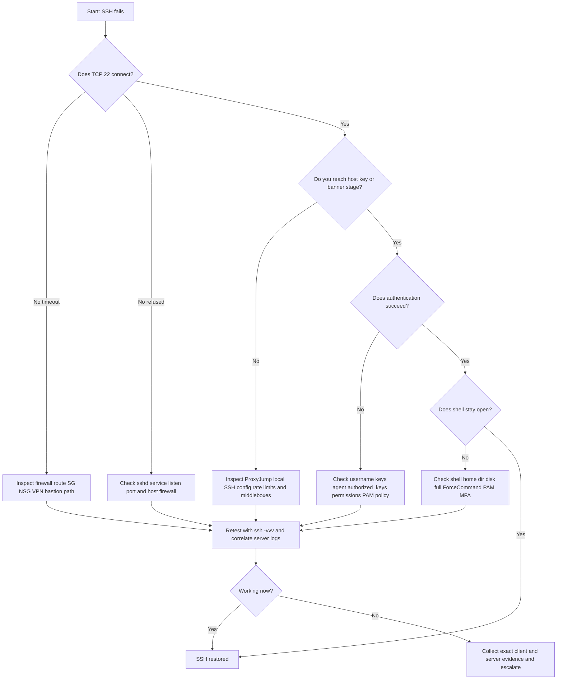

# SSH Connectivity

← Back to [13-vm-ssh-access-issues.md](./13-vm-ssh-access-issues.md)

SSH reachability, daemon checks, port-path validation, and SSH-specific triage flows.

---

## 13.2 🔑 Unable to SSH

> 🟠 **High-impact symptom**: If the VM is reachable but SSH fails, focus on whether the failure is in the transport path, the SSH daemon, authentication, account policy, or post-login environment.

### 13.2.1 🔀 Mermaid Flowchart for SSH Troubleshooting



### 13.2.2 🧾 Fast Triage Table

| Error | Interpretation | Primary checks |
|---|---|---|
| `Connection timed out` | Packets are likely dropped before service response | Path, firewall, VPN, bastion |
| `Connection refused` | Host reachable but no SSH listener or active reject | `sshd`, listen port, host firewall |
| `Permission denied (publickey,password)` | Authentication failure | User, key, agent, account policy |
| `Host key verification failed` | Known-host mismatch or wrong target | Verify host identity before removing entry |
| `kex_exchange_identification` | Rate limiting, proxy, fail2ban, or connection interruption | Client debug and server logs |
| Login succeeds then exits | Shell, PAM, disk, home dir, or forced command issue | Server logs and account environment |

### 13.2.3 🧰 Core Commands for SSH Triage

```bash
# Client-side
ssh -vvv user@target
ssh -F /dev/null -vvv user@target
ssh -o IdentitiesOnly=yes -i ~/.ssh/id_ed25519 -vvv user@target
ssh -G target | sed -n '1,120p'
ssh-add -l
nc -vz target 22

# Server-side via console or alternate access
sudo systemctl status sshd --no-pager
sudo journalctl -u sshd --since '2 hours ago' --no-pager
sudo ss -ltnp | grep ':22'
sudo sshd -t
sudo grep -Ev '^#|^$' /etc/ssh/sshd_config
sudo ls -ld /home/user /home/user/.ssh /home/user/.ssh/authorized_keys
sudo tail -n 100 /var/log/auth.log
sudo tail -n 100 /var/log/secure
```

### 13.2.4 🔍 SSH service not running

**Severity:** 🔴 Critical

**Common symptoms**

- `nc` returns refused or times out while the host otherwise responds.
- `systemctl status sshd` shows failed, inactive, or crash looping.
- A config or package change happened shortly before access was lost.

**Useful checks**

```bash
sudo systemctl status sshd --no-pager
sudo journalctl -u sshd -b --no-pager | tail -200
sudo sshd -t
sudo ss -ltnp | grep ':22'
```

**Practical fixes**

1. Run `sshd -t` before restart to catch syntax problems.
2. Fix invalid directives, missing host keys, or bad bind settings.
3. If the disk is full or the boot state is unhealthy, resolve that first and then restart the daemon.

**How to validate the fix**

- `systemctl status` reports active and stable.
- Port 22 is listening on the expected interface.
- A fresh connection reaches the banner or auth stage normally.

**Prevention and operational notes**

- Use configuration management and peer review for SSH changes.
- Validate with `sshd -t` during deployment pipelines when possible.
- Monitor for service restarts and failures.

### 13.2.5 🔍 Port 22 blocked

**Severity:** 🟠 High

**Common symptoms**

- `ssh` hangs until timeout.
- Cloud console shows healthy instance but path tests fail.
- One source network works while another fails.

**Useful checks**

```bash
sudo ss -ltnp | grep ':22'
sudo nft list ruleset
sudo iptables -L -n -v
sudo firewall-cmd --list-all
sudo tcpdump -ni any port 22
```

**Practical fixes**

1. Allow TCP/22 from approved admin sources or bastion ranges.
2. If a non-standard SSH port is used, align both client and server policy consistently.
3. Use live packet capture while retesting to prove where the failure occurs.

**How to validate the fix**

- The original failing source can now reach the port.
- Packet capture shows both inbound SYN and outbound SYN-ACK.
- No unplanned source ranges gained access.

**Prevention and operational notes**

- Document whether direct SSH is supported or bastion-only access is required.
- Test ingress from approved CIDRs after firewall changes.
- Keep host firewall and cloud firewall rules aligned.

### 13.2.9 🔍 Host key verification failed

**Severity:** 🟡 Medium

**Common symptoms**

- The client warns that the remote host identification changed.
- The VM was rebuilt, replaced, or its IP was reassigned.
- Users may be connecting to the wrong target entirely.

**Useful checks**

```bash
ssh-keygen -F target-host
ssh-keyscan -t ed25519,rsa target-host
ssh-keygen -R target-host
```

**Practical fixes**

1. Validate the new host key from a trusted source before removing the old entry.
2. Remove only the stale `known_hosts` entry rather than deleting the entire file.
3. Fix DNS or inventory if the name now points to a different machine than expected.

**How to validate the fix**

- The new host fingerprint matches trusted records.
- The client no longer reports mismatch after the correct update.
- Users connect to the intended host identity.

**Prevention and operational notes**

- Consider host certificates or a stronger host-identity workflow for dynamic fleets.
- Avoid reusing names and IPs without updating inventory promptly.
- Teach responders not to ignore host key warnings blindly.

### 13.2.10 🔍 Connection timed out vs connection refused

**Severity:** 🟠 High

**Common symptoms**

- Responders treat distinct error types as the same issue.
- Timeouts trigger network investigation while refused should trigger daemon inspection.
- Time is lost because the failure is not classified early.

**Useful checks**

```bash
# Timeout focus
nc -vz -w 5 target 22
traceroute target

# Refused focus
nc -vz -w 5 target 22
sudo ss -ltnp | grep ':22'
```

**Practical fixes**

1. For timeout, inspect drop points and routing first.
2. For refused, inspect listener state and host response first.
3. Capture the exact client error text in the ticket or incident channel.

**How to validate the fix**

- Responders can name the precise failure mode after the first tests.
- The issue follows the correct runbook branch instead of a generic SSH checklist.
- Subsequent remediation is targeted and faster.

**Prevention and operational notes**

- Train on-call staff to distinguish these errors quickly.
- Use health checks that verify the expected transport behavior.
- Avoid ambiguous incident notes like "SSH broken" without the actual error.

### 13.2.11 🔍 SSH debug mode (`-vvv`) interpretation

## 13.5 🧰 Command Cheat Sheets

### 13.5.1 Network and path validation commands

- **Resolve hostname**
```bash
getent hosts target-host
```

- **Show local routes**
```bash
ip route
```

- **Ping target**
```bash
ping -c 4 target-ip
```

- **Trace path**
```bash
traceroute target-ip
```

- **Measure loss and latency**
```bash
mtr -rwzbc 30 target-ip
```

- **TCP port check**
```bash
nc -vz target-ip 22
```

- **See DNS answers**
```bash
host target-host
```

- **Show effective Linux route**
```bash
ip route get target-ip
```

- **Inspect ARP**
```bash
arp -n | grep target-ip
```

- **Capture SSH packets**
```bash
sudo tcpdump -ni any port 22
```

## 13.9 📒 Expanded Validation and Recovery Notes

### VM validation loop

- Retest from the original failing source and at least one control source.
- Confirm the VM state in the cloud console or hypervisor after the fix.
- Verify the expected IP, NIC attachment, and route table did not drift.
- If a firewall change was made, prove only the intended source can now connect.
- Record the exact rule, change ID, and rollback point.

### SSH validation loop

- Retest with `ssh -vvv` once to confirm the failure stage is gone.
- Confirm `sshd` is active and listening on the intended address and port.
- Verify the intended user can log in with the approved auth method.
- If a host key changed, confirm clients updated only after identity verification.
- Document any key, account, or config changes in the change log.
