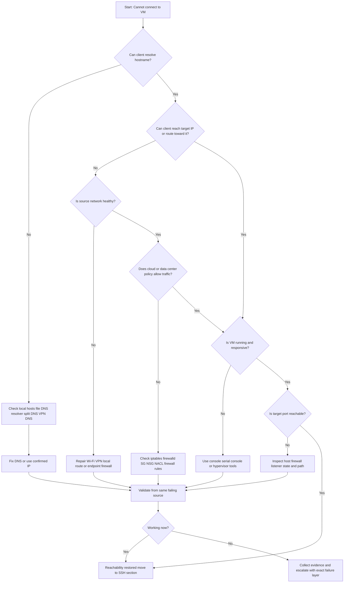

# VM Network Issues

← Back to [13-vm-ssh-access-issues.md](./13-vm-ssh-access-issues.md)

VM reachability, cloud network controls, VPN path issues, and evidence collection for network faults.

---

## 13.1 🌐 Unable to Connect to VM

> 🔴 **Critical symptom**: If you cannot reach the VM over the network, do not assume SSH is the root cause. Prove whether the client, path, cloud control plane, or guest OS is failing first.

### 13.1.1 🗺️ Mermaid Decision Tree for VM Reachability



### 13.1.2 🚦 Quick Symptom-to-Layer Map

| Symptom | Likely layer | Severity | First action |
|---|---|---|---|
| `Could not resolve hostname` | DNS or local SSH config | 🟡 | Run `getent hosts` and `ssh -G` |
| `No route to host` | Routing or local gateway issue | 🟠 | Inspect route table and VPN routes |
| `Connection timed out` | Firewall drop, path issue, hung VM | 🟠/🔴 | Run `nc`, `traceroute`, and inspect cloud rules |
| Cloud console shows stopped VM | Compute control plane | 🔴 | Check instance status and boot path |
| Works only from bastion | Expected private design or direct path policy block | 🟡/🟠 | Confirm intended access method |
| Ping fails but TCP works | ICMP intentionally blocked | 🟢/🟡 | Use TCP checks instead of ICMP as success criteria |

### 13.1.3 ⏱️ First 5 Minutes Checklist

- Verify the hostname and IP are current and not copied from an old ticket or chat thread.
- Test from at least one more source such as a bastion, another VM in the same subnet, or a cloud shell.
- Check whether the VM was recently recreated, rebooted, resized, or failed over.
- Compare ICMP reachability, traceroute results, and a direct TCP test to the target port.
- Open the cloud console and confirm the NIC, subnet, security policy, and instance state are what you expect.

### 13.1.4 🧰 Baseline Commands from the Client Side

```bash
# Resolve the target
getent hosts vm.example.internal
host vm.example.internal
nslookup vm.example.internal

# Basic path tests
ping -c 4 10.10.20.15
traceroute 10.10.20.15
tracepath 10.10.20.15
mtr -rwzbc 20 10.10.20.15

# TCP checks
nc -vz 10.10.20.15 22
curl -vk telnet://10.10.20.15:22

# Local routing checks
ip addr
ip route
ip route get 10.10.20.15
```

### 13.1.5 🔎 Network connectivity issues

**Severity:** 🟠 High

**Common symptoms**

- The trace dies on the first or second hop.
- The laptop or source VM is missing the expected route.
- One network path works, but another network path consistently fails.

**Useful checks**

```bash
ip addr
ip route
ping -c 3 gateway-ip
ping -c 3 8.8.8.8
traceroute target-ip
mtr -rwzbc 30 target-ip
```

**Practical fixes**

1. Repair the source network first by reconnecting Wi-Fi, renewing DHCP, or re-establishing the VPN session.
2. Compare working and failing route tables to find a missing prefix or bad default route.
3. If only one office or VPN pool fails, investigate source NAT, egress ACLs, or split-tunnel policy.

**How to validate the fix**

- The same source that failed can now reach the gateway and target path consistently.
- `nc -vz target-ip 22` succeeds or moves to a more specific error such as refused.
- The path remains healthy after reconnecting the VPN or renewing the client network state.

**Prevention and operational notes**

- Keep a known-good comparison host in the same subnet or VPC/VNet.
- Document required source routes for VPN users.
- Do not rely on a single engineer laptop as proof that the service is down.

### 13.1.6 🔎 Firewall blocking

**Severity:** 🔴 Critical

**Common symptoms**

- TCP connections time out while the VM appears healthy in the control plane.
- Traffic works from one source range but not another.
- The problem started after a hardening change, ACL update, or security review.

**Useful checks**

```bash
sudo nft list ruleset
sudo iptables -S
sudo iptables -L -n -v
sudo firewall-cmd --list-all
sudo ss -ltnp | grep ':22'
sudo tcpdump -ni any port 22
```

**Practical fixes**

1. Open the minimum required source CIDR and destination port in the closest blocking layer.
2. Check both host firewall and cloud firewall because either can independently drop traffic.
3. If traffic still fails, use packet capture or flow logs to prove where the drop occurs.

**How to validate the fix**

- Live packet capture shows SYN and SYN-ACK after the rule change.
- The original failing source can now reach the port.
- The rule is documented in code or change management rather than left as an unexplained exception.

**Prevention and operational notes**

- Review effective policy, not just intended policy.
- Avoid broad allow rules that outlive the incident.
- Test from approved and disallowed source ranges after security changes.

### 13.1.7 🔎 VM not running or hung

**Severity:** 🔴 Critical

**Common symptoms**

- The cloud console shows stopped, impaired, failed status checks, or a boot problem.
- Serial console or hypervisor log shows kernel panic, boot loop, or storage errors.
- The host does not answer ARP, ICMP, or TCP even though network policy looks correct.

**Useful checks**

```bash
# AWS
aws ec2 describe-instance-status --instance-ids i-xxxxxxxx

# Azure
az vm get-instance-view --name vm-name --resource-group rg-name

# GCP
gcloud compute instances describe vm-name --zone us-central1-a
```

**Practical fixes**

1. Use serial or console access to inspect the boot path before forcing a reboot.
2. If the guest is hard hung, coordinate a reboot with the application owner and capture evidence first.
3. Investigate root causes such as disk full, memory exhaustion, kernel panic, or broken boot dependencies.

**How to validate the fix**

- The instance passes provider status checks and responds to network probes again.
- The console shows a clean boot without repeated errors.
- Application owners confirm expected services returned after the host became reachable.

**Prevention and operational notes**

- Test console access outside incidents.
- Monitor disk, memory, and boot failures so the host does not silently degrade into a hang.
- Keep recent snapshots or recovery patterns for critical systems.

### 13.1.8 🔎 Wrong IP or DNS resolution failure

**Severity:** 🟡 Medium

**Common symptoms**

- SSH works by IP but fails by hostname.
- The hostname resolves to an old public IP after rebuild or failover.
- On VPN and off VPN produce different answers for the same name.

**Useful checks**

```bash
getent hosts vm-name
host vm-name
nslookup vm-name
resolvectl query vm-name
ssh -G vm-name | grep -E 'hostname|port|user'
```

**Practical fixes**

1. Update the DNS record, bastion alias, load balancer mapping, or local inventory entry.
2. Clear stale local resolver caches where applicable and wait for TTL expiry if necessary.
3. Correct split-horizon DNS or document which resolver path is authoritative.

**How to validate the fix**

- The same hostname resolves to the expected IP from all intended source networks.
- The SSH client effective config shows the correct host, port, and username.
- Connection attempts by name behave the same as by the confirmed IP.

**Prevention and operational notes**

- Prefer stable DNS aliases or static admin entry points instead of ad hoc IP sharing.
- Document whether internal and external resolvers are expected to differ.
- Check both A and AAAA records when troubleshooting modern environments.

### 13.1.9 🔎 Cloud-specific policy or platform issue

**Severity:** 🟠 High

**Common symptoms**

- Rules look correct on the host, but the path still fails.
- Only one VPC/VNet, subnet, project, or region is affected.
- Infrastructure-as-code changed security tags, service accounts, or network rules recently.

**Useful checks**

```bash
# AWS
aws ec2 describe-security-groups --group-ids sg-xxxxxxxx
aws ec2 describe-network-acls --filters Name=association.subnet-id,Values=subnet-xxxxxxxx

# Azure
az network nic list-effective-nsg --name nic-name --resource-group rg-name
az network watcher test-connectivity --source-resource source-id --dest-address 10.1.2.4 --dest-port 22

# GCP
gcloud compute firewall-rules list
gcloud compute instances describe vm-name --zone us-central1-a
```

**Practical fixes**

1. Review effective policy at NIC, subnet, and route-table level rather than trusting the intended design.
2. Check tags, service accounts, network ACLs, peering, internet gateways, NAT, and health probes.
3. Use provider-native flow logs or connectivity tests when manual inspection is inconclusive.

**How to validate the fix**

- Provider connectivity or flow logging confirms the path is now allowed.
- The VM retains the expected public/private IP and route behavior after remediation.
- The infrastructure code reflects the final state so the issue does not reappear later.

**Prevention and operational notes**

- Include effective-policy validation in change review.
- Use tags and labels consistently so rules match what you think they match.
- Monitor for drift between cloud intent and actual instance attachments.

### 13.1.10 🔎 VPN or bastion host issue

**Severity:** 🟠 High

**Common symptoms**

- The VM is reachable on the corporate LAN but not from remote users.
- Bastion host is reachable, but the second hop fails.
- Name resolution for internal hosts only works while the VPN is active.

**Useful checks**

```bash
ip route | grep -E '10\.|172\.|192\.168\.'
scutil --dns
ssh -J bastion user@target-ip -vvv
nc -vz bastion-host 22
ssh bastion-host 'nc -vz target-ip 22'
```

**Practical fixes**

1. Reconnect or restart the VPN client and confirm the required split routes and DNS servers are installed.
2. Validate bastion security groups, outbound rules, and target-subnet east-west permissions.
3. Update stale ProxyJump or bastion host definitions in user SSH configuration.

**How to validate the fix**

- Remote users can resolve the internal name and complete the bastion path.
- A second-hop `nc` test from the bastion succeeds.
- The same workflow works for multiple users, not just one laptop.

**Prevention and operational notes**

- Monitor bastions like production services because they are part of the access plane.
- Document the intended jump path clearly so engineers do not try unsupported direct access.
- Include route and DNS verification in VPN client rollout testing.

### 13.1.11 🔎 Local workstation security or proxy interference

**Severity:** 🟡 Medium

**Common symptoms**

- Only one engineer is affected.
- The same target works from another laptop or cloud shell.
- Corporate endpoint tooling or local SSH config changed recently.

**Useful checks**

```bash
ssh -F /dev/null -o ConnectTimeout=5 user@target-ip -vvv
nc -vz target-ip 22
ssh -G target-host | sed -n '1,80p'
```

**Practical fixes**

1. Bypass local aliases and custom config to confirm whether the issue is client-side.
2. Review local firewall, proxy, endpoint policy, and stale SSH options.
3. Escalate to endpoint engineering with evidence if the failure follows a managed security rollout.

**How to validate the fix**

- `ssh -F /dev/null` works or isolates the exact local config causing the issue.
- A clean client profile behaves normally to the same target.
- The engineer can repeat the fix after reconnecting to the network or VPN.

**Prevention and operational notes**

- Keep a known-good access path such as a cloud shell for comparison.
- Minimize surprising local overrides in `~/.ssh/config`.
- Teach responders to compare failing and working clients quickly.

### 13.1.12 ☁️ Cloud-Specific Deep Dive

#### Azure NSG troubleshooting

- Check both subnet NSG and NIC NSG because Azure evaluates both.
- Use effective security rules to see the merged result actually applied to the NIC.
- Validate whether Azure Bastion, Just-In-Time access, route tables, or Azure Firewall are part of the path.
- Use connectivity tests to prove where the flow is blocked.

```bash
az network nic list-effective-nsg --name vm-nic --resource-group rg-name
az network watcher test-connectivity --source-resource source-vm-id --dest-address 10.1.2.4 --dest-port 22
az vm run-command invoke --command-id RunShellScript --name vm-name --resource-group rg-name --scripts "ss -ltnp | grep :22"
```

#### AWS Security Group troubleshooting

- Verify Security Group rules and Network ACLs because SGs are stateful but NACLs are stateless.
- Confirm the instance still has the expected Elastic IP or public IP.
- If the instance is private, validate whether Session Manager, VPN, Direct Connect, or a bastion is the intended access path.
- VPC Flow Logs often settle disputes about whether traffic was allowed or rejected.

```bash
aws ec2 describe-instances --instance-ids i-xxxxxxxx --query 'Reservations[].Instances[].{State:State.Name,Private:PrivateIpAddress,Public:PublicIpAddress,SG:SecurityGroups}'
aws ec2 describe-security-groups --group-ids sg-xxxxxxxx
aws ec2 describe-network-acls --filters Name=association.subnet-id,Values=subnet-xxxxxxxx
```

#### GCP Firewall Rules troubleshooting

- GCP rules often depend on network tags or service accounts, so confirm the target still matches the rule.
- Check the VM zone, subnet, internal/external IPs, and VPC routes.
- Use connectivity tests or firewall rule logging when a simple visual inspection is not enough.

```bash
gcloud compute instances describe vm-name --zone us-central1-a
gcloud compute firewall-rules list
gcloud compute network-management connectivity-tests create ssh-test --source-instance=source-vm --destination-instance=target-vm --destination-port=22 --protocol=TCP
```

### 13.1.13 📊 Reachability Quick Reference Table

| Observation | Meaning | Next step |
|---|---|---|
| Ping fails and traceroute fails on hop 1 | Source network problem | Fix local route, gateway, VPN, or endpoint firewall |
| Ping fails and `nc` to 22 times out | Possible firewall drop or path issue | Inspect cloud and host policies |
| Ping works and `nc` says refused | Host reachable but no listener or active reject | Inspect SSH service and host firewall |
| Hostname resolves to old IP | Stale DNS or bad inventory | Update record and clear stale references |
| Works from bastion only | Private design or source-specific block | Use bastion path or request scoped ingress |
| No ARP on same subnet | NIC, host, or hypervisor problem | Check VM state and virtual NIC attachment |

### 13.1.14 🧪 Real-World VM Reachability Scenarios

#### Scenario 1: Office users time out, bastion works

**Observed behavior**

- Users attempt direct SSH from the office or home network.
- Bastion to target path still succeeds.

**Likely root cause**

- Direct ingress is blocked and the documented bastion path was ignored or outdated instructions remained in use.

**Resolution steps**

1. Update the runbook to show the required bastion path.
2. Validate bastion health and outbound rules.
3. Retest from the original user source.

**Key lesson**

- If one path is designed and another is not, the documentation must be explicit.

#### Scenario 2: Hostname works on VPN but not off VPN

**Observed behavior**

- Internal hostname resolves to a private IP only on VPN.
- Off VPN, users get NXDOMAIN or a different answer.

**Likely root cause**

- Split-horizon DNS and remote-user DNS configuration are inconsistent.

**Resolution steps**

1. Confirm the intended resolver path.
2. Fix DNS push settings on the VPN client.
3. Document that the hostname is internal-only if that is expected.

**Key lesson**

- Many access tickets are really DNS design misunderstandings.

#### Scenario 3: Instance recreated by autoscaling

**Observed behavior**

- The target IP changed after replacement.
- Operators still use the old address from previous incidents.

**Likely root cause**

- People are using an old direct IP instead of a stable admin endpoint.

**Resolution steps**

1. Move access instructions to DNS or static IPs.
2. Update inventory and chat bookmarks.
3. Verify host identity before reconnecting.

**Key lesson**

- Human memory is not a reliable discovery system for dynamic infrastructure.

#### Scenario 4: Trace dies after VPN gateway

**Observed behavior**

- Users can reach the VPN concentrator but not the application subnet.
- Another working engineer has the route present.

**Likely root cause**

- Required split-tunnel route is missing from the VPN client.

**Resolution steps**

1. Compare working and failing route tables.
2. Reconnect or repair the VPN policy.
3. Retest path and SSH after route installation.

**Key lesson**

- Always compare a failing client against a known-good client.

#### Scenario 5: Cloud flow logs show REJECT

**Observed behavior**

- VPC/NSG flow data clearly shows rejected SSH traffic.
- Host firewall is not the blocker.

**Likely root cause**

- A cloud security control such as NACL, SG, NSG, or rule tag mismatch is dropping the traffic.

**Resolution steps**

1. Fix the correct rule scope.
2. Retest from approved source ranges only.
3. Update infrastructure code to persist the change.

**Key lesson**

- Provider flow logs are often the fastest route to certainty.

#### Scenario 6: Serial console shows kernel panic

**Observed behavior**

- All network tests fail.
- Serial console shows the guest crashing during boot.

**Likely root cause**

- The issue is guest OS health, not network policy.

**Resolution steps**

1. Capture console output.
2. Use rescue or recovery workflow.
3. Repair the boot issue before troubleshooting access again.

**Key lesson**

- A dead guest cannot respond to a perfectly healthy network.

#### Scenario 7: Only one VM in a scale set fails

**Observed behavior**

- Peer instances in the same environment still work.
- One node fails all probes and has drifted config.

**Likely root cause**

- The node is an outlier due to bad config, broken NIC attachment, or corruption.

**Resolution steps**

1. Compare working versus failing instances.
2. Repair or replace the outlier.
3. Confirm autoscaling policy produces healthy replacements.

**Key lesson**

- Outlier analysis is powerful in fleets.

#### Scenario 8: Ping blocked but SSH works

**Observed behavior**

- Responders assume the VM is unreachable because ping fails.
- A TCP check to port 22 succeeds.

**Likely root cause**

- ICMP is intentionally denied while TCP/22 is allowed.

**Resolution steps**

1. Use TCP checks as the primary validation for SSH availability.
2. Document ICMP policy so responders do not misdiagnose the issue.
3. Avoid opening ICMP just to satisfy habit.

**Key lesson**

- Different protocols are governed by different policies.

---

### 13.6.1 VM reachability evidence

- Target hostname, target IP, instance ID, region, subnet, and environment.
- Exact source IP or source network from which the failure was observed.
- Output of `getent hosts`, `ping`, `traceroute`, and `nc -vz target 22`.
- Cloud console or CLI output showing VM state and effective security policy.
- Recent changes involving DNS, routing, firewall, bastion, or VM lifecycle.
