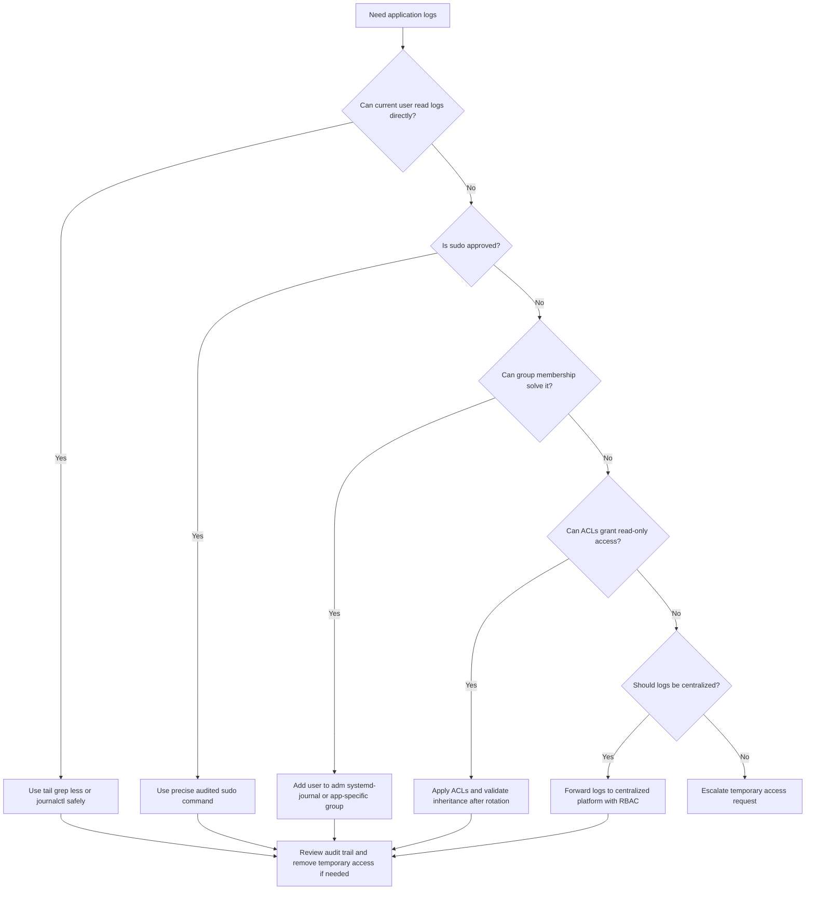

# Log Access Guidance

← Back to [13-vm-ssh-access-issues.md](./13-vm-ssh-access-issues.md)

Least-privilege approaches for reading logs, collecting evidence, and sharing diagnostics safely.

---

## 13.3 📜 Checking Application Logs Without Permissions

> 🟡 **Common operational issue**: Operators often have shell access but not log-read access. Solve it with least privilege, auditability, and a long-term ownership model.

### 13.3.1 🧭 Mermaid Diagram for Log Access Flow



### 13.3.2 🧾 Quick Reference Table

| Need | Recommended method | Security posture | Notes |
|---|---|---|---|
| One-time urgent read | `sudo journalctl` or `sudo tail` | 🟠 Emergency but auditable | Prefer exact commands over full root shell |
| Regular ops read access | Group-based read-only access | 🟡 Controlled | Use least privilege and review exposure |
| Granular access to one app path | POSIX ACLs | 🟢/🟡 Strong when managed well | Good for one team and one directory |
| Systemd unit logs | `systemd-journal` group or scoped sudo | 🟡 | Journal access may expose more than one service |
| Multi-team long-term access | Centralized logging with RBAC | 🟢 Best practice | Preferred for scale and auditability |
| Access lost after rotation | Fix `logrotate` ownership and mode | 🟡 | Current file fix alone is not enough |

### 13.3.3 📘 Using sudo to read logs safely

**Severity:** 🟠 High

**Common symptoms**

- The operator can log in but sees permission denied on root-owned logs.
- Access is urgent and there is no long-term delegated model yet.
- Security requires auditable privileged commands.

**Useful checks**

```bash
sudo journalctl -u myapp --since '30 minutes ago' --no-pager
sudo tail -n 200 /var/log/myapp/error.log
sudo grep -i 'error\|fatal' /var/log/myapp/error.log | tail -50
```

**Practical fixes**

1. Use precise sudo commands instead of a broad interactive root shell.
2. Document the business reason or incident reference for the access.
3. Redact sensitive data before sharing excerpts broadly.

**How to validate the fix**

- The operator can read exactly the required log source.
- The activity is captured in sudo logs or privileged session recording.
- No unnecessary persistent privilege was granted.

**Prevention and operational notes**

- Turn recurring emergency sudo into a deliberate delegated access pattern.
- Prefer command whitelists over unrestricted root shells.
- Audit sudo usage for repeated patterns that should become permanent RBAC.

### 13.3.4 📘 Adding users to log groups (`adm`, `systemd-journal`, app-specific groups)

**Severity:** 🟡 Medium

**Common symptoms**

- A team needs repeat read access to a known log source.
- Traditional files under `/var/log` or journal access are involved.
- The current sudo approach is too manual or too noisy.

**Useful checks**

```bash
id alice
getent group adm
getent group systemd-journal
```

**Practical fixes**

1. Add the user to the smallest appropriate read-only group.
2. Prefer a dedicated app-specific log group when broad system groups reveal too much.
3. Ensure the user logs out and back in so the new group membership takes effect.

**How to validate the fix**

- The user can read the intended logs after refreshing membership.
- The user still cannot read unrelated sensitive logs if a narrower model is intended.
- Operational docs mention the required group for that team.

**Prevention and operational notes**

- Review group memberships periodically.
- Avoid using `adm` or `systemd-journal` when a tighter app-specific group would suffice.
- Capture these memberships in infrastructure or identity management rather than ad hoc shell history.

### 13.3.5 📘 Setting up ACLs on log directories

**Severity:** 🟢 Low

**Common symptoms**

- One team needs access to one directory but not the rest of `/var/log`.
- Traditional UNIX group design is too broad.
- Current file permissions do not survive all access needs cleanly.

**Useful checks**

```bash
getfacl /var/log/myapp
getfacl /var/log/myapp/error.log
sudo setfacl -m u:alice:rx /var/log/myapp
sudo setfacl -m u:alice:r /var/log/myapp/error.log
```

**Practical fixes**

1. Grant read-only ACLs on the specific directory and files needed.
2. Add default ACLs when new files must inherit access after rotation.
3. Record ACL intent in configuration management so future administrators understand why it exists.

**How to validate the fix**

- The user can read the intended path but not unrelated locations.
- The ACL remains in place after the next log rotation or file recreation.
- The service still writes normally after the ACL change.

**Prevention and operational notes**

- Test ACL inheritance in a lower environment before production rollout.
- Avoid piling unrelated ACL entries onto shared directories without documentation.
- Reconcile ACLs with backup and restore procedures.

### 13.3.6 📘 Using `journalctl` with user permissions

**Severity:** 🟡 Medium

**Common symptoms**

- The application writes to the systemd journal instead of a plain file.
- Users keep looking in `/var/log/myapp` but the relevant events live in the journal.
- Journal access exists, but users do not know how to filter safely.

**Useful checks**

```bash
journalctl -u myapp --since today --no-pager
journalctl -u myapp -p warning..alert --since '1 hour ago' --no-pager
journalctl _SYSTEMD_UNIT=myapp.service _PID=1234 --no-pager
```

**Practical fixes**

1. Teach responders to use unit, priority, and time filters.
2. Grant journal access through `systemd-journal` or scoped sudo if policy allows.
3. Stop chasing nonexistent file paths when the service is journal-native.

**How to validate the fix**

- Users can retrieve the needed events with proper filters.
- The chosen access model does not expose more journal data than necessary.
- Incident responders can repeat the query during the next event.

**Prevention and operational notes**

- Document whether each service logs to files, journal, container runtime, or centralized platform.
- Prefer reusable journal query patterns in runbooks.
- Avoid mixed assumptions across teams about where logs live.

### 13.3.7 📘 Sudo audit trail considerations

**Severity:** 🟡 Medium

**Common symptoms**

- Compliance requires knowing who accessed sensitive logs.
- Temporary access requests are frequent.
- Shared admin accounts are discouraged or forbidden.

**Useful checks**

```bash
sudo -l
sudo journalctl -u sudo --since today --no-pager
sudo grep -i sudo /var/log/auth.log | tail -50
```

**Practical fixes**

1. Use named accounts and precise sudo rules so actions are attributable.
2. Tie emergency access to a change or incident reference.
3. Forward sudo and auth logs to a centralized security store when required.

**How to validate the fix**

- Privileged log access is attributable to a specific user and time.
- The access path satisfies audit and security review requirements.
- Temporary privileges are removed when the need expires.

**Prevention and operational notes**

- Design log access with auditability from the start.
- Avoid undocumented privilege escalations during incidents.
- Review repeated emergency patterns and replace them with controlled RBAC.

### 13.3.8 📘 Using logrotate permissions correctly

**Severity:** 🟠 High

**Common symptoms**

- Access works on the current file but breaks after midnight or rotation.
- New log files appear as `root:root 600` even though the previous file was readable.
- Operators keep reapplying permissions manually.

**Useful checks**

```bash
sudo grep -Rni myapp /etc/logrotate.d /etc/logrotate.conf
sudo ls -l /var/log/myapp
sudo logrotate -vf /etc/logrotate.d/myapp
```

**Practical fixes**

1. Set the `create` owner, group, and mode correctly in the logrotate stanza.
2. Use the `su` directive where needed so rotation happens with the expected ownership model.
3. Retest in a lower environment or maintenance window to prove permissions persist.

**How to validate the fix**

- A newly rotated file has the expected owner, group, mode, and ACL state.
- The application can still reopen or continue writing to the new file.
- The app team retains read access after the next natural rotation.

**Prevention and operational notes**

- Never treat current-file `chmod` as the whole fix.
- Capture rotation ownership policy in code or managed config.
- Test log access after every major logging or packaging change.

### 13.3.9 📘 Centralized logging with `rsyslog` forwarding or another aggregator

**Severity:** 🟢 Low

**Common symptoms**

- Developers repeatedly request root just to inspect their own application logs.
- Many teams share servers but should not share shell-level privileges.
- Searching across rotated files or many hosts is painful.

**Useful checks**

```bash
# Example rsyslog forwarding concept
module(load="imfile")
input(type="imfile" File="/var/log/myapp/error.log" Tag="myapp-error" Severity="error" Facility="local0")
*.* action(type="omfwd" target="log-gateway.example.internal" port="514" protocol="tcp")
```

**Practical fixes**

1. Forward logs to a platform with team-based RBAC, retention, and search capabilities.
2. Expose application logs to the owning team there instead of through root-owned servers.
3. Keep local logs for break-glass scenarios but make centralized access the normal path.

**How to validate the fix**

- The app team can search its own logs without privileged shell access.
- Logs arrive with the right tags, timestamps, and retention behavior.
- Operational teams are no longer using root shell as the primary log viewer.

**Prevention and operational notes**

- Design centralized logging early for multi-team environments.
- Use structured logs where possible.
- Review RBAC and retention policies regularly.

### 13.3.10 🧪 Real-World Log Access Scenarios

#### Log Scenario 1: Ops can SSH but cannot read `/var/log/myapp/error.log`

**Observed behavior**

- The host login works.
- Reading the log returns permission denied.

**Likely root cause**

- The file is root-owned and there is no delegated read model.

**Resolution steps**

1. Use scoped sudo for the urgent incident.
2. Implement ACL or group-based read access for future cases.
3. Document the approved path.

**Key lesson**

- Do not solve recurring access needs with repeated ad hoc root usage.

#### Log Scenario 2: Engineers added to `adm` still cannot read journal logs

**Observed behavior**

- Traditional log files are visible.
- Journal-backed service events remain inaccessible.

**Likely root cause**

- The application logs to the journal and the user still lacks journal-level access.

**Resolution steps**

1. Grant `systemd-journal` or scoped `sudo journalctl -u myapp`.
2. Teach the journal query pattern.
3. Validate least privilege.

**Key lesson**

- File access and journal access are related but not identical.

#### Log Scenario 3: Access works today but breaks after midnight

**Observed behavior**

- The current file is readable.
- The new rotated file is not.

**Likely root cause**

- Logrotate recreates files with restrictive defaults.

**Resolution steps**

1. Fix `create` and `su` settings.
2. Retest rotation.
3. Confirm access survives the next scheduled run.

**Key lesson**

- A fix that dies at rotation is not a fix.

#### Log Scenario 4: Developers keep requesting root just to inspect logs

**Observed behavior**

- Many incidents require app-team log review.
- Ops becomes a bottleneck for every request.

**Likely root cause**

- The organization lacks centralized logging or delegated access design.

**Resolution steps**

1. Use temporary sudo only as a bridge.
2. Build centralized logging with RBAC.
3. Move routine troubleshooting off privileged shells.

**Key lesson**

- Operational scalability requires self-service observability.

#### Log Scenario 5: Containerized app logs are not in `/var/log/myapp`

**Observed behavior**

- Users look for files that do not exist.
- The service actually writes to stdout/stderr and journal or container runtime.

**Likely root cause**

- The logging destination assumption is wrong.

**Resolution steps**

1. Use `journalctl -u service`, container runtime logs, or platform logging.
2. Update runbooks to reflect the real logging path.
3. Stop fixing permissions on paths that do not contain the data.

**Key lesson**

- Always verify where the application really logs.

### 13.3.11 ✅ Recommended Access Model by Maturity

| Environment maturity | Short-term approach | Preferred long-term approach |
|---|---|---|
| Small team, few servers | Scoped sudo commands | Dedicated app log groups or ACLs |
| Growing ops team | Group-based read access and journal delegation | Infrastructure-managed ACLs and rotation policy |
| Multi-team platform | Temporary sudo with approval | Centralized logging with RBAC and dashboards |
| Regulated environment | Named sudo with strong audit trail | Centralized logging with tenancy and access review |

---

### 13.5.3 Log access and permission commands

- **Read service journal with sudo**
```bash
sudo journalctl -u myapp --since '30 minutes ago' --no-pager
```

- **Read a file tail with sudo**
```bash
sudo tail -n 200 /var/log/myapp/error.log
```

- **Check group membership**
```bash
id alice
```

- **Show journal group**
```bash
getent group systemd-journal
```

- **Inspect ACLs**
```bash
getfacl /var/log/myapp
```

- **Grant read ACL on directory**
```bash
sudo setfacl -m u:alice:rx /var/log/myapp
```

- **Grant read ACL on file**
```bash
sudo setfacl -m u:alice:r /var/log/myapp/error.log
```

- **Review rotation config**
```bash
sudo grep -Rni myapp /etc/logrotate.d /etc/logrotate.conf
```

- **Force a test rotation**
```bash
sudo logrotate -vf /etc/logrotate.d/myapp
```

- **Follow logs live**
```bash
sudo journalctl -u myapp -f
```

## 13.6 📝 Evidence Collection Templates

### 13.6.1 VM reachability evidence

- Target hostname, target IP, instance ID, region, subnet, and environment.
- Exact source IP or source network from which the failure was observed.
- Output of `getent hosts`, `ping`, `traceroute`, and `nc -vz target 22`.
- Cloud console or CLI output showing VM state and effective security policy.
- Recent changes involving DNS, routing, firewall, bastion, or VM lifecycle.

### 13.6.2 SSH failure evidence

- Exact SSH error text copied verbatim.
- Sanitized `ssh -vvv` excerpt showing the failing stage.
- Relevant server logs from `journalctl -u sshd`, `/var/log/auth.log`, or `/var/log/secure`.
- Output of `sshd -t`, `ss -ltnp`, and critical SSH configuration directives.
- Any recent changes to keys, users, MFA, PAM, image type, or hardening policy.

### 13.6.3 Log access evidence

- The exact file path or journal unit requested.
- Current ownership, mode, ACL, and group state.
- Whether the log source is file-based, journal-based, container-based, or centralized.
- Whether the problem occurs only after rotation or only for certain files.
- Which least-privilege model was selected: sudo, group, ACL, or centralized RBAC.
