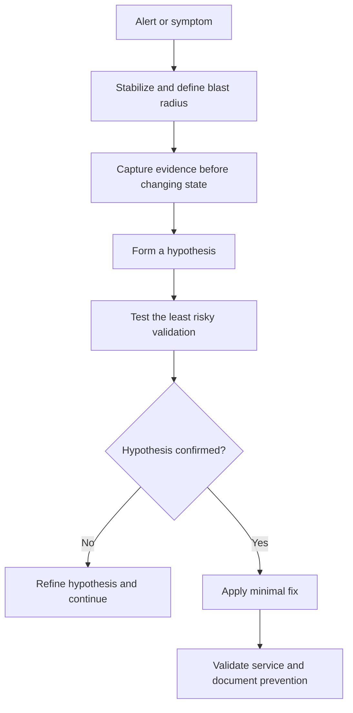
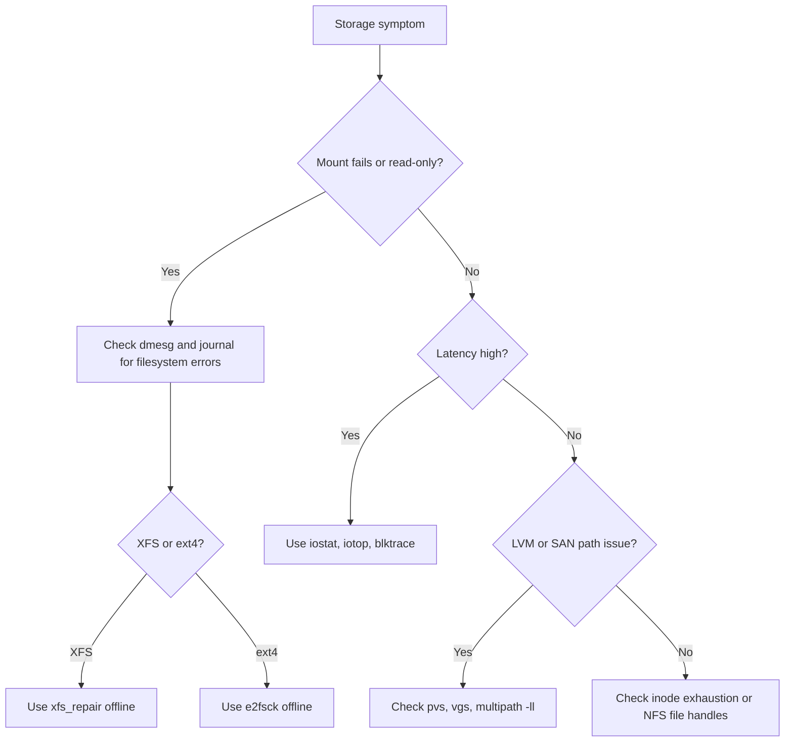

# Advanced Troubleshooting

This chapter collects production-grade investigations that go beyond basic service restarts and simple log checks. Use it with [01-methodology.md](./01-methodology.md), [09-package-issues.md](./09-package-issues.md), [15-production-incident-playbooks.md](./15-production-incident-playbooks.md), and [05-Security/14-kerberos-authentication.md](../05-Security/14-kerberos-authentication.md).

## 14.1 Methodology for high-pressure incidents

When a system is unstable, structure matters more than speed.



### Golden rules

- capture state before rebooting or clearing caches
- prefer console access for storage, boot, and authentication failures
- validate one layer at a time: hardware, kernel, OS, service, app
- avoid making multiple speculative fixes at once

## 14.2 Filesystem and storage issues

### XFS metadata corruption

**Symptoms**

- mounts fail with `Structure needs cleaning`
- `dmesg` reports XFS metadata errors
- applications get I/O errors although the block device exists

**Initial diagnosis**

```bash
sudo dmesg -T | grep -i xfs
sudo xfs_info /dev/mapper/vgdata-lvdata
sudo lsblk -f
```

**Root cause**

Unclean shutdowns, storage controller glitches, or underlying block corruption can damage XFS metadata.

**Fix**

1. Unmount the filesystem.
2. Take a snapshot if the storage platform supports it.
3. Run `xfs_repair` offline.

```bash
sudo umount /data
sudo xfs_repair /dev/mapper/vgdata-lvdata
sudo mount /data
```

If the log is corrupt and replay cannot occur, a last-resort option is:

```bash
sudo xfs_repair -L /dev/mapper/vgdata-lvdata
```

That can discard pending metadata operations, so treat it as a recovery action, not a first action.

**Prevention**

- keep storage firmware current
- maintain healthy UPS coverage
- monitor SMART and SAN path errors

### ext4 journal recovery

**Symptoms**

- boot stops in emergency mode
- `fsck` requested after crash
- `EXT4-fs error` messages in `dmesg`

**Initial diagnosis**

```bash
sudo dmesg -T | grep -i ext4
sudo journalctl -xb --no-pager
cat /etc/fstab
```

**Root cause**

Interrupted writes or inconsistent journal replay left the filesystem dirty.

**Fix**

Boot rescue mode if the filesystem is the root device, then run:

```bash
sudo e2fsck -f /dev/sda2
```

If bad blocks are suspected:

```bash
sudo e2fsck -c /dev/sda2
```

**Prevention**

- clean shutdowns for virtual hosts before hypervisor maintenance
- monitor disk errors early

### LVM: missing PV or corrupt metadata

**Symptoms**

- volume group missing after boot
- `lvs` or `vgs` shows partial activation
- root filesystem may drop to dracut shell

**Initial diagnosis**

```bash
sudo pvs -a -o +pv_used
sudo vgs -a -o +devices
sudo lvs -a -o +devices
sudo vgcfgbackup -f /root/current-vg-backup.conf vgdata
```

**Root cause**

A disk path disappeared, metadata became inconsistent, or a SAN LUN was presented with a different identifier.

**Fix**

If metadata must be restored:

```bash
sudo vgcfgrestore -f /etc/lvm/archive/vgdata_00012-123456789.vg vgdata
sudo vgchange -ay vgdata
```

If a single PV is missing but redundant data exists, evaluate `vgreduce --removemissing` carefully.

**Prevention**

- keep copies of `/etc/lvm/archive/`
- document multipath and SAN mappings
- avoid force-removing disks without VG review

### Inode exhaustion

**Symptoms**

- `No space left on device` while `df -h` still shows free space
- package installs and mail delivery fail unexpectedly

**Initial diagnosis**

```bash
df -h
df -i
sudo find /var -xdev -printf '%h\n' | sort | uniq -c | sort -nr | head
```

**Root cause**

Millions of tiny files consumed all inodes.

**Fix**

- clear cache or spool directories safely
- rotate or archive mail queues and app temp files
- move small-file workloads to a filesystem created with more inodes or XFS

**Prevention**

- watch `df -i` in monitoring
- set retention on temporary file producers

### Disk I/O bottlenecks

**Symptoms**

- high latency, low throughput, and stalled applications
- CPU appears idle but `wa` in `top` is high

**Initial diagnosis**

```bash
iostat -xz 1 5
pidstat -d 1 5
iotop -oPa
sar -d 1 5
```

For deep traces:

```bash
sudo blktrace -d /dev/sdb -o - | blkparse -i -
```

**Root cause**

Queue depth saturation, slow backend storage, noisy neighbors, sync-heavy workloads, or missing filesystem tuning.

**Fix**

- identify top writers and coordinate workload reduction
- move hot write paths to faster storage
- tune application flush patterns rather than only tuning the kernel

**Prevention**

- baseline storage latency by workload class
- isolate backup jobs from transactional volumes

### NFS stale file handles

**Symptoms**

- users see `Stale file handle`
- app processes cannot stat or open files on mounted shares

**Initial diagnosis**

```bash
mount | grep nfs
nfsstat -m
sudo journalctl -k --no-pager | grep -i nfs
```

**Root cause**

The server-side inode changed because exports were recreated, a filesystem was restored, or failover occurred without preserving file handles.

**Fix**

```bash
sudo umount -f /mnt/share
sudo mount -a -t nfs,nfs4
```

If the share is busy, find holders:

```bash
sudo lsof +D /mnt/share
```

**Prevention**

- coordinate failover procedures with clients
- preserve export identities where the platform supports it

### Multipath failures

**Symptoms**

- SAN-backed LUNs flap or disappear
- I/O pauses during path failure

**Initial diagnosis**

```bash
sudo multipath -ll
sudo lsblk
sudo journalctl -k --no-pager | grep -Ei 'multipath|sd[a-z]'
```

**Root cause**

Broken HBA paths, zoning issues, or inconsistent WWID mappings.

**Fix**

- restore failed paths at the SAN or fabric layer
- reload multipath maps after validation

```bash
sudo systemctl restart multipathd
sudo multipath -r
```

**Prevention**

- standardize WWID aliases
- validate path redundancy during every storage change

## 14.3 Storage decision tree



## 14.4 Network troubleshooting advanced

### MTU and fragmentation issues

**Symptoms**

- VPN or database connections hang only for large payloads
- pings work but file transfers stall

**Initial diagnosis**

```bash
ip link show dev eth0
tracepath remote.example.com
ping -M do -s 1472 remote.example.com
```

**Root cause**

Mismatched MTU or blocked ICMP fragmentation-needed messages broke path MTU discovery.

**Fix**

- align MTU across VLAN, tunnel, and physical interfaces
- allow ICMP type 3 code 4 where applicable
- temporarily lower MTU to validate the hypothesis

```bash
sudo ip link set dev eth0 mtu 1400
```

**Prevention**

- document MTU per segment and overlay
- test jumbo frames end to end before enabling them in production

### VLAN tagging problems

**Symptoms**

- host is reachable on native VLAN but not tagged network
- ARP works on the wrong segment

**Initial diagnosis**

```bash
ip -d link show
tcpdump -eni eth0 vlan
nmcli connection show
```

**Root cause**

Wrong VLAN ID, trunk misconfiguration, or native VLAN mismatch.

**Fix**

Correct the VLAN interface or switch configuration.

```bash
sudo nmcli connection modify vlan20 vlan.id 20 vlan.parent eth0
sudo nmcli connection up vlan20
```

**Prevention**

- treat switch and host changes as one change set
- verify tagging with captures during rollout

### Bond or team failover not working

**Symptoms**

- traffic drops when one NIC is unplugged
- bond remains stuck on a failed slave

**Initial diagnosis**

```bash
cat /proc/net/bonding/bond0
nmcli device status
ethtool eth0
ethtool eth1
```

**Root cause**

Switch LACP mismatch, monitoring interval misconfiguration, or both links connected to the same failed switch path.

**Fix**

- align LACP mode on host and switch
- verify `miimon` or ARP monitoring
- test failover intentionally after change

**Prevention**

- use standard bond profiles per environment
- validate dual-switch diversity physically

### ARP flux and ARP issues

**Symptoms**

- intermittent reachability on multihomed servers
- traffic returns on the wrong interface

**Initial diagnosis**

```bash
ip addr
ip route
arp -an
sysctl net.ipv4.conf.all.arp_ignore
sysctl net.ipv4.conf.all.arp_announce
```

**Root cause**

The kernel answered ARP requests from an unexpected interface, confusing peers.

**Fix**

```bash
sudo sysctl -w net.ipv4.conf.all.arp_ignore=1
sudo sysctl -w net.ipv4.conf.all.arp_announce=2
```

Persist only after testing.

**Prevention**

- avoid unnecessary multihoming on the same subnet
- template sysctl values for cluster nodes

### TCP state explosions and SYN floods

**Symptoms**

- thousands of `TIME_WAIT` or `SYN_RECV` sockets
- load balancer sees resets or timeouts

**Initial diagnosis**

```bash
ss -s
ss -ant state time-wait | head
ss -ant state syn-recv | head
sar -n TCP,ETCP 1 5
```

**Root cause**

Connection churn, client leaks, backlog exhaustion, or a real SYN flood.

**Fix**

- tune the application and load balancer to reuse or pool connections
- increase backlog safely
- enable SYN cookies if under attack

```bash
sudo sysctl -w net.ipv4.tcp_syncookies=1
sudo sysctl -w net.core.somaxconn=4096
```

**Prevention**

- use connection pooling
- alert on state growth trends instead of only host CPU

### DNS resolution failures

**Symptoms**

- services cannot resolve hostnames although raw IP connectivity works
- intermittent lookup results due to stale caches

**Initial diagnosis**

```bash
getent hosts api.example.com
resolvectl status
systemctl status systemd-resolved nscd
cat /etc/resolv.conf
```

**Root cause**

Broken resolv.conf, stale nscd or resolved cache, wrong search domains, or unreachable DNS servers.

**Fix**

```bash
sudo resolvectl flush-caches
sudo systemctl restart systemd-resolved
sudo systemctl restart nscd
```

If `/etc/resolv.conf` is wrong, restore the correct symlink or static file.

**Prevention**

- manage resolver config from one source of truth
- avoid overlapping DHCP and config-management ownership

### Intermittent connectivity

**Symptoms**

- pings show occasional loss or jitter
- application sessions drop randomly

**Initial diagnosis**

```bash
mtr -rwzc 100 remote.example.com
tcpdump -ni eth0 host remote.example.com
ethtool -S eth0
```

**Root cause**

Bad cabling, duplex mismatch, queue drops, firewall rate limits, or flaky middleboxes.

**Fix**

- capture both ends if possible
- compare sequence gaps, retransmits, and interface errors
- replace suspect physical components or misconfigured network policies

**Prevention**

- baseline packet loss during normal operations
- monitor interface counters continuously

## 14.5 Authentication and identity failures

### SSSD cache corruption

**Symptoms**

- `id user` fails intermittently
- cached users behave differently from fresh lookups

**Initial diagnosis**

```bash
sssctl domain-status example.com
journalctl -u sssd --no-pager
ls -l /var/lib/sss/db
```

**Root cause**

Stale or damaged cache database, often after abrupt shutdown or directory-side changes.

**Fix**

```bash
sudo systemctl stop sssd
sudo sss_cache -E
sudo rm -f /var/lib/sss/db/*
sudo systemctl start sssd
```

**Prevention**

- restart SSSD cleanly during major identity changes
- keep time and DNS correct

### NSS or PAM misconfiguration and admin lockout

**Symptoms**

- SSH logins fail after auth stack changes
- even local users may be denied

**Initial diagnosis**

Use console access and inspect:

```bash
sudo authselect current
sudo grep -R pam_sss /etc/pam.d
sudo journalctl -b --no-pager | grep -Ei 'pam|sssd|authentication'
```

**Root cause**

Broken PAM ordering, missing modules, or an incomplete `authselect` profile.

**Fix**

Rollback to a known-good profile:

```bash
sudo authselect select sssd --force
sudo authselect apply-changes
```

If the host is isolated from identity services, ensure local `pam_unix.so` remains usable.

**Prevention**

- always test PAM changes in a second active root session
- maintain out-of-band console access

### LDAP bind failures

**Symptoms**

- services report invalid credentials or cannot search users
- TLS-protected binds fail while plain TCP works in testing

**Initial diagnosis**

```bash
ldapsearch -x -H ldap://ldap01.example.com -b dc=example,dc=com '(uid=alice)'
ldapsearch -x -ZZ -H ldap://ldap01.example.com -b dc=example,dc=com '(uid=alice)'
openssl s_client -connect ldap01.example.com:636 -showcerts
```

**Root cause**

Wrong bind DN, expired password, broken CA trust, or server-side ACL changes.

**Fix**

- verify service account credentials
- update CA trust and TLS settings
- confirm bind DN search permissions

**Prevention**

- track service account expiry and certificate expiry
- avoid undocumented direct binds where SSSD can abstract the integration

### Kerberos ticket issues

See [05-Security/14-kerberos-authentication.md](../05-Security/14-kerberos-authentication.md). The most common production causes are clock skew, stale keytabs, and DNS or SPN mismatches.

### `sudo` not working

**Symptoms**

- `sudo: user is not in the sudoers file`
- `sudo` hangs waiting on directory services

**Initial diagnosis**

```bash
sudo -l
visudo -c
getent group wheel
journalctl -t sudo --no-pager
```

**Root cause**

Syntax errors, missing group resolution, broken LDAP sudo provider, or SELinux denials.

**Fix**

- validate sudoers syntax with `visudo -c`
- restore group resolution or SSSD sudo service
- check SELinux using `ausearch -m avc -ts recent`

**Prevention**

- store sudo policy in version control
- validate every rule before deployment

### SELinux denying authentication

**Symptoms**

- auth service appears correctly configured but access still fails
- audit log shows AVC denials

**Initial diagnosis**

```bash
getenforce
sudo ausearch -m avc -ts recent
sudo audit2why < /var/log/audit/audit.log | tail -40
```

**Root cause**

Context mismatch, wrong boolean, or custom path not labeled for the service.

**Fix**

- correct file contexts with `restorecon`
- enable the required boolean when appropriate
- avoid disabling SELinux as the first fix

**Prevention**

- label custom directories properly during deployment
- review AVCs after service migrations

## 14.6 Performance troubleshooting

### System is slow but CPU and memory look fine

**Symptoms**

- response times spike yet CPU usage seems low
- users report hangs during file access or database calls

**Initial diagnosis**

```bash
top
vmstat 1 5
iostat -xz 1 5
sar -B 1 5
```

**Root cause**

I/O wait, swap thrashing, or stalled network storage makes the system look idle while users suffer.

**Fix**

- identify the blocked resource and reduce pressure there
- move active working sets back into RAM if swapping heavily

**Prevention**

- graph `wa`, swap in or out, and storage latency together

### OOM killer analysis

**Symptoms**

- processes disappear suddenly
- application logs end abruptly

**Initial diagnosis**

```bash
dmesg -T | grep -i -E 'killed process|oom'
grep -E 'MemTotal|MemFree|SwapTotal|SwapFree' /proc/meminfo
systemd-cgls --no-pager
```

**Root cause**

Memory leak, cgroup memory limit, or too little swap for burst behavior.

**Fix**

- identify whether system-wide memory or cgroup memory caused the kill
- tune limits, fix the leak, or right-size the host

**Prevention**

- alert on `memory.current` and RSS growth before OOM

### CPU steal time on VMs

**Symptoms**

- guest looks idle yet performance is poor
- `top` shows high `st` time

**Initial diagnosis**

```bash
top
mpstat -P ALL 1 5
```

**Root cause**

The hypervisor is oversubscribed; the guest waits for CPU scheduling.

**Fix**

- move the VM to a less-contended host or resize vCPU allocation
- coordinate with the virtualization team instead of only tuning the guest

**Prevention**

- watch steal time in monitoring for all critical VMs

### Zombie process accumulation

**Symptoms**

- process table cluttered with `Z` state
- parent process is not reaping children

**Initial diagnosis**

```bash
ps -eo pid,ppid,state,cmd | awk '$3=="Z"'
```

**Root cause**

Application bug or supervisor problem prevented child reaping.

**Fix**

- restart or fix the parent process
- if the parent is PID 1 managed, inspect the unit and signals

**Prevention**

- test signal handling and child reaping in long-running daemons

### Fork bomb recovery

**Symptoms**

- system stops accepting shells or commands
- process count skyrockets

**Initial diagnosis**

Use console or existing root shell.

**Fix**

- apply user-level process limits
- stop the spawning parent or isolate the host

```bash
sudo sysctl -w kernel.pid_max=131072
ulimit -u 1024
sudo systemctl rescue
```

**Prevention**

- use PAM limits and cgroup process limits
- educate teams about unsafe shell constructs

### High context switching

**Symptoms**

- CPUs are busy but useful work is low
- `vmstat` shows very high `cs`

**Initial diagnosis**

```bash
vmstat 1 5
pidstat -wt 1 5
perf sched record sleep 10
perf sched latency
```

**Root cause**

Too many runnable threads, lock contention, or chatty polling loops.

**Fix**

- reduce thread counts and tune application concurrency
- inspect mutex contention in the application stack

**Prevention**

- benchmark realistic thread counts before production

### NUMA imbalance

**Symptoms**

- memory-heavy workloads underperform on multi-socket servers
- remote memory access rates are high

**Initial diagnosis**

```bash
numactl --hardware
numastat -p <pid>
```

**Root cause**

The process allocates memory on remote NUMA nodes or migrates excessively.

**Fix**

- pin workloads or use NUMA-aware tuning
- review database or JVM NUMA settings

**Prevention**

- benchmark NUMA-sensitive applications during capacity planning

## 14.7 Service-specific issues

### systemd unit failing

**Symptoms**

- service repeatedly restarts or exits immediately

**Initial diagnosis**

```bash
systemctl status myservice
journalctl -u myservice --no-pager
systemctl show myservice -p Requires -p Wants -p After
```

**Root cause**

Bad dependency ordering, invalid environment file, missing path, or ExecStart syntax error.

**Fix**

```bash
sudo systemd-analyze verify /etc/systemd/system/myservice.service
sudo systemctl daemon-reload
sudo systemctl restart myservice
```

**Prevention**

- validate unit files in CI
- keep overrides documented in `/etc/systemd/system/*.d/`

### Cron jobs not running

**Symptoms**

- scheduled task never fires or behaves differently than manual execution

**Initial diagnosis**

```bash
systemctl status crond cron
journalctl -u crond --no-pager
sudo grep CRON /var/log/cron 2>/dev/null
```

**Root cause**

Minimal environment, missing PATH, bad permissions, or SELinux denial.

**Fix**

- use absolute paths in scripts
- set environment explicitly inside the job or wrapper script
- label scripts correctly for SELinux

**Prevention**

- run cron jobs under the exact service account during testing

### Mail delivery failures with Postfix

**Symptoms**

- local alerts never arrive
- outbound relay rejects mail

**Initial diagnosis**

```bash
postqueue -p
journalctl -u postfix --no-pager
postconf -n
```

**Root cause**

DNS failure, relay authentication issue, queue corruption, or certificate mismatch.

**Fix**

- validate relayhost credentials and DNS resolution
- inspect the queue and retry after correction

**Prevention**

- monitor queue depth and deferred mail count

### Log rotation not working

**Symptoms**

- logs grow indefinitely or rotate without compression

**Initial diagnosis**

```bash
logrotate -dv /etc/logrotate.conf
systemctl status logrotate.timer logrotate.service
ls -l /etc/logrotate.d
```

**Root cause**

Bad syntax, missing `copytruncate` or postrotate action, or timers disabled.

**Fix**

- test the specific policy with `logrotate -d`
- correct ownership and timer state

**Prevention**

- lint new logrotate files during deployment

### Time sync issues

**Symptoms**

- certificates appear invalid or Kerberos fails
- logs from clustered systems do not line up

**Initial diagnosis**

```bash
chronyc tracking
chronyc sources -v
timedatectl status
```

**Root cause**

Chrony or ntpd misconfiguration, blocked UDP 123, or wrong RTC settings.

**Fix**

- pick one time daemon, not both
- correct sources and allow outbound NTP

**Prevention**

- standardize on chrony for modern Linux fleets

## 14.8 Kernel and system issues

### Kernel panic analysis

**Symptoms**

- spontaneous reboot or crash to panic screen

**Initial diagnosis**

- collect console screenshots if kdump is absent
- verify `kdump` is enabled for future crashes

```bash
systemctl status kdump
ls -lh /var/crash
```

**Fix**

Use `crash` against the vmcore and matching vmlinux package when available.

```bash
sudo crash /usr/lib/debug/lib/modules/$(uname -r)/vmlinux /var/crash/127.0.0.1-*/vmcore
```

**Prevention**

- enable kdump on critical systems
- retain symbol packages for supported kernels

### Hung tasks

**Symptoms**

- `INFO: task blocked for more than 120 seconds`

**Initial diagnosis**

```bash
dmesg -T | grep -i 'blocked for more than'
cat /proc/sys/kernel/hung_task_timeout_secs
```

**Root cause**

Tasks are stuck on I/O, NFS, or kernel locks.

**Fix**

- diagnose the blocked subsystem instead of only increasing the timeout
- collect stack traces from `/proc/<pid>/stack` when possible

**Prevention**

- investigate recurring storage stalls promptly

### System clock wrong

**Symptoms**

- logs jump after reboot
- time resets to the past

**Initial diagnosis**

```bash
timedatectl
hwclock --show
```

**Root cause**

RTC drift, timezone mistakes, dual-boot RTC settings, or hypervisor time sync conflict.

**Fix**

```bash
sudo timedatectl set-ntp true
sudo hwclock --systohc
```

**Prevention**

- document whether hardware clock uses UTC

### Module loading failures

**Symptoms**

- network or storage devices disappear after reboot

**Initial diagnosis**

```bash
modprobe <module>
dmesg -T | tail -50
modinfo <module>
```

**Root cause**

Module missing for the running kernel, Secure Boot signature issue, or dependency mismatch.

**Fix**

- reinstall the kernel module package for the running kernel
- verify signatures for Secure Boot environments

**Prevention**

- rebuild third-party modules whenever kernels change

### sysctl tuning gone wrong

**Symptoms**

- network becomes unreachable after a tuning rollout
- services fail under unexpected kernel parameter changes

**Initial diagnosis**

```bash
sysctl -a | grep '^net\.' | head
systemd-analyze cat-config sysctl
```

**Root cause**

An unsafe parameter or wrong value was applied globally.

**Fix**

- revert the offending file in `/etc/sysctl.d/`
- reload with `sysctl --system`
- apply only validated changes to production

**Prevention**

- stage sysctl rollouts and record every tuned value

## 14.9 Container troubleshooting

### Docker daemon will not start

**Symptoms**

- `docker.service` fails on boot or restart

**Initial diagnosis**

```bash
systemctl status docker
journalctl -u docker --no-pager
df -h /var/lib/docker
```

**Root cause**

Disk full, corrupt overlay storage, wrong cgroup driver, or invalid daemon JSON.

**Fix**

- free space or correct `/etc/docker/daemon.json`
- verify storage driver support on the running kernel

```bash
sudo dockerd --validate --config-file /etc/docker/daemon.json
```

**Prevention**

- monitor `/var/lib/docker` growth
- keep the daemon config under version control

### Container networking issues

**Symptoms**

- containers cannot reach external services or each other

**Initial diagnosis**

```bash
docker network ls
iptables -t nat -S
ip addr show docker0
```

**Root cause**

Broken bridge, missing NAT rules, firewalld interaction, or overlapping subnets.

**Fix**

- restore bridge and NAT configuration
- avoid subnet overlap with corporate ranges

**Prevention**

- reserve standard container CIDRs per environment

### Image pull failures

**Symptoms**

- `docker pull` fails from a private registry

**Initial diagnosis**

```bash
curl -vk https://registry.example.com/v2/
docker login registry.example.com
systemctl show docker -p Environment
```

**Root cause**

Registry auth failure, broken CA trust, or proxy configuration problem.

**Fix**

- update credentials, CA trust, or proxy variables
- verify no TLS interception breaks the registry handshake

**Prevention**

- monitor certificate expiry and robot account validity

### Resource limits causing container OOM

**Symptoms**

- container restarts with exit code 137

**Initial diagnosis**

```bash
docker inspect --format '{{.State.OOMKilled}} {{.HostConfig.Memory}}' myapp
journalctl -u docker --no-pager | grep -i oom
```

**Root cause**

Container memory limit too low or application memory leak.

**Fix**

- raise limit temporarily and profile the application
- review memory reservations and swap behavior

**Prevention**

- test under production-like memory pressure

## 14.10 Summary

Advanced troubleshooting succeeds when you preserve evidence, narrow the failing layer, and validate the smallest safe fix. Use this guide when basic checks stop being useful, then promote the final prevention steps into monitoring, automation, or configuration management.
