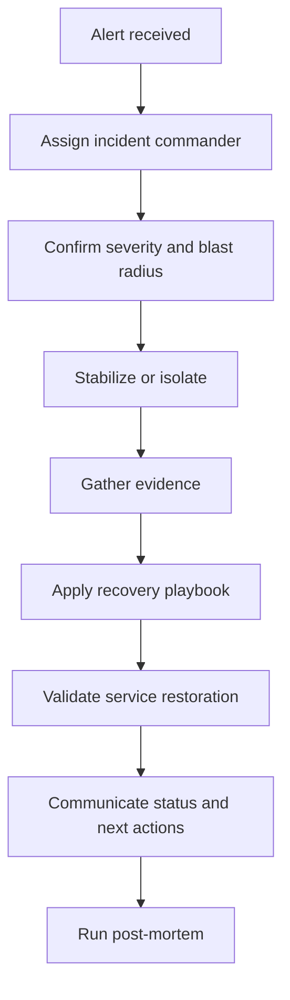
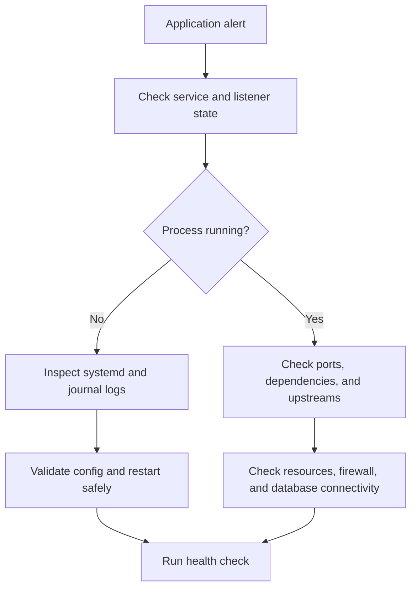
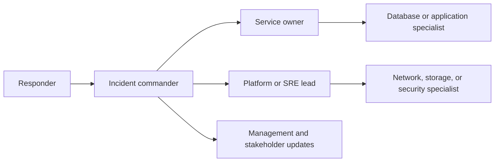

# Production Incident Playbooks

These playbooks are designed for live operational use. Pair them with [14-advanced-troubleshooting.md](./14-advanced-troubleshooting.md), [11-recovery.md](./11-recovery.md), and [09-package-issues.md](./09-package-issues.md). The goal is not exhaustive theory; it is to move from detection to stabilization and recovery with minimal confusion.

## 15.1 Severity matrix

| Severity | Typical meaning | Expected response |
|---|---|---|
| P1 | Critical outage, broad customer impact, no workaround | Immediate incident bridge, leadership notification, all-hands triage |
| P2 | Major degradation, partial outage, workaround exists | Rapid triage, service owner engaged, executive awareness as needed |
| P3 | Limited impact or operational risk with low urgency | Standard support workflow, scheduled remediation |

### Severity decision points

Use these questions to avoid overreacting or underreacting:

- Is the outage externally visible to customers or only internal users?
- Is there a viable workaround that keeps business flow moving?
- Is data loss, data corruption, or security exposure possible?
- Are multiple services failing because of one shared dependency?
- Is the issue actively expanding in scope?

A conservative rule is safer than a delayed escalation: if impact is unclear, treat it as P1 until the blast radius is better understood.

## 15.2 Incident response flow



### Recommended roles during an incident

- **Incident commander**: owns priorities, communication cadence, and escalation.
- **Primary responder**: drives terminal work and evidence collection.
- **Secondary responder**: verifies findings, pulls logs, and protects against tunnel vision.
- **Communications lead**: updates stakeholders and status pages.
- **Scribe**: records timeline, commands used, and decision points.

### Guardrails during live response

- avoid changing multiple subsystems at once
- do not reboot until you have captured enough evidence to justify it
- keep one known-good shell or console session open while changing auth or network settings
- write down every destructive command before you run it

## 15.3 Communication template

Use short updates every 15 to 30 minutes during active response.

```text
Incident: <short title>
Severity: P1 / P2 / P3
Start time: <UTC>
Current impact: <who or what is affected>
What changed: <deploy, patch, infra event, unknown>
Current actions: <top 3 actions>
Next update: <time>
Owner: <incident commander>
```

### Evidence collection checklist

Capture these before cleanup when possible:

```text
Current time and timezone
Who detected the issue and how
Last known good timestamp
Recent deploys, patches, reboots, or config changes
Current console output or panic screen
Relevant systemd, kernel, and application logs
Resource snapshots: CPU, memory, I/O, disk, network
```

### Change correlation shortcuts

```bash
rpm -qa --last | head -20
last -n 20
who -b
journalctl --since '2 hours ago' --no-pager | tail -100
```

### Common validation checklist

Use this after every attempted fix:

```text
Did the immediate symptom improve?
Did another dependency get worse?
Is monitoring green from more than one location?
Did logs quiet down or simply stop updating?
Can the service survive a second request, not just one manual test?
Was the recovery captured in the incident timeline?
```

## 15.4 P1: Server unreachable

### Symptoms

- host does not respond to ping, SSH, or monitoring
- service checks fail from multiple locations

### Immediate actions

1. Open the remote console through IPMI, iLO, iDRAC, hypervisor console, or cloud serial console.
2. Determine whether this is a server issue or only a network path issue.
3. Check whether the host is powered on, kernel-panicked, or waiting at an emergency shell.

### Console versus network differentiation

If the console is responsive:

```bash
ip addr
ip route
nmcli device status
journalctl -b --no-pager | tail -100
```

If the console is frozen or panicking, focus on storage, kernel, or hardware recovery instead of network debugging.

### Rescue mode boot

Use rescue mode when the root filesystem, initramfs, or boot configuration is suspect.

Common workflow:

1. Boot the installer or rescue ISO.
2. Choose rescue mode.
3. Mount the system image under `/mnt/sysimage` or the platform-equivalent path.
4. `chroot` into the recovered environment if needed.

```bash
chroot /mnt/sysimage
mount | grep ' / '
cat /etc/fstab
```

### Filesystem check from rescue

```bash
fsck -f /dev/sda2
xfs_repair /dev/mapper/rhel-root
```

Pick the correct tool for the filesystem type.

### Network recovery

If the host boots but networking is missing:

```bash
nmcli connection show
nmcli connection up ens192
ip link show
ethtool ens192
```

### Validation

- host reachable over console and SSH
- monitoring restored
- application listeners present

### Escalate immediately when

- the console shows storage corruption, kernel panic, or repeated filesystem errors
- multiple hosts in the same rack, AZ, or VLAN are unreachable
- remote management interfaces are also unavailable
- the issue follows a firmware, hypervisor, or network maintenance event

## 15.5 P1: Application down

### Symptoms

- service endpoint unavailable or returning errors
- process may be running but not serving traffic

### Workflow



### Service status checks

```bash
systemctl status myapp
journalctl -u myapp --no-pager
ss -tulpn | grep :8080
curl -vk http://127.0.0.1:8080/health
```

### Port binding issues

```bash
ss -tulpn | grep ':80\|:443\|:8080'
lsof -iTCP:8080 -sTCP:LISTEN
```

### Resource exhaustion diagnosis

```bash
top
free -h
df -h
iostat -xz 1 3
```

### Config syntax validation

Examples:

```bash
nginx -t
apachectl configtest
named-checkconf
postgres -D /var/lib/pgsql/data --single </dev/null
```

### Dependency checks

Validate the app's immediate dependencies before you restart it repeatedly.

```bash
ss -tulpn
curl -vk http://127.0.0.1:8080/health
getent hosts db01.example.com
nc -zv db01.example.com 5432
journalctl -u postgresql --no-pager | tail -50
```

Questions to answer:

- is the app listening only on localhost instead of the service IP?
- did a certificate, token, or password expire?
- is the database or message broker up but rejecting connections?
- is a recent package or config deployment the clearest change point?

### Correlate recent changes

```bash
rpm -qa --last | head -20
last -n 10
ausearch -m USER_CMD -ts recent
```

### Validation

- app health endpoint returns success
- listener bound on expected address
- dependency checks succeed

### Rollback clues

Consider immediate rollback if all of the following are true:

- the outage began immediately after a deploy or package change
- the previous version is known good
- the rollback action is faster and safer than deep live debugging
- database schema changes are compatible with rollback

## 15.6 P2: High CPU, memory, or I/O

### Symptoms

- latency rises while the host still responds
- users report slowness rather than full outage

### Immediate triage

```bash
top -H
pidstat -u -r -d 1 5
free -h
iostat -xz 1 5
```

### Top consumers identification

```bash
ps -eo pid,ppid,%cpu,%mem,cmd --sort=-%cpu | head
ps -eo pid,ppid,%cpu,%mem,cmd --sort=-%mem | head
```

### Stop versus graceful restart

Use this order:

1. Application-specific drain or graceful stop
2. `systemctl restart service`
3. send `TERM` to the process only if the service cannot be controlled through the supervisor
4. use a hard signal only if the process is unrecoverable and business impact justifies it

### Memory leak detection

```bash
pmap -x <pid> | tail -20
grep -E 'VmRSS|VmSize|VmSwap' /proc/<pid>/status
cat /proc/<pid>/smaps_rollup
```

Valgrind is more appropriate for controlled reproductions than emergency production use.

### I/O scheduler and pressure review

```bash
cat /sys/block/sda/queue/scheduler
cat /proc/pressure/io
cat /proc/pressure/memory
```

### Containment options

- reduce traffic at the load balancer
- disable non-critical batch jobs or cron tasks
- move a hot workload to another node if capacity exists
- raise cgroup or service limits only after confirming the process is healthy enough to benefit

### Validation

- resource graphs trend downward
- app latency returns to normal
- no fresh OOM or throttling events appear

## 15.7 P2: Disk space emergency

### Symptoms

- writes fail, logs stop, packages fail, or databases become read-only

### Quick space recovery

```bash
df -h
du -xhd1 /var | sort -h
du -xhd1 / | sort -h
find /var/log -type f -size +100M -ls | sort -k7 -n
journalctl --disk-usage
```

### Fast cleanup candidates

Review these in order before deleting anything:

- compressed and rotated logs in `/var/log`
- stale application caches under `/var/cache`
- orphaned container images and stopped containers
- crash dumps in `/var/crash`
- forgotten backup exports on local storage

### Deleted but still open files

```bash
lsof +L1
```

If a deleted file is still held open by a process, restart the service or truncate the open descriptor carefully after review.

### Journal cleanup

```bash
sudo journalctl --vacuum-time=7d
sudo journalctl --vacuum-size=1G
```

### Old package and cache cleanup

```bash
sudo dnf clean all
sudo package-cleanup --oldkernels --count=2 -y
sudo apt clean
```

### LVM extend procedure

```bash
sudo pvcreate /dev/sdb
sudo vgextend vgdata /dev/sdb
sudo lvextend -r -L +50G /dev/vgdata/lvvar
```

### Emergency logging suppression

As a short-lived emergency measure, redirect a noisy app log to `/dev/null` only with explicit incident approval and a plan to restore proper logging immediately after stabilization.

### Validation

- at least 10 to 20 percent free space restored on the affected filesystem
- critical applications resume writes

## 15.8 P3: SSL certificate expiry

### Check expiry

```bash
openssl s_client -connect web01.example.com:443 -servername web01.example.com </dev/null 2>/dev/null | openssl x509 -noout -dates -issuer -subject
```

### Renewal procedure

For certbot-managed systems:

```bash
sudo certbot renew --dry-run
sudo certbot renew
```

For internal PKI, generate a CSR and follow your CA workflow.

### Chain verification

```bash
openssl verify -CAfile /etc/pki/tls/certs/ca-bundle.crt /etc/pki/tls/certs/server.crt
```

### Automation and monitoring

- schedule a dry-run renewal before the shortest certificate lifetime in your fleet
- alert on both end-entity expiry and intermediate CA expiry
- test every node behind the load balancer because one stale cert can still break clients

### Validation

- new certificate served on all nodes
- monitoring shows healthy chain and expiry window

## 15.9 P3: Slow database

### MySQL and MariaDB

```bash
mysql -e "SHOW FULL PROCESSLIST;"
mysql -e "SHOW ENGINE INNODB STATUS\G"
```

### PostgreSQL

```bash
psql -c "select pid, usename, state, wait_event_type, wait_event, query from pg_stat_activity order by query_start asc;"
psql -c "select * from pg_locks where not granted;"
```

### Connection pool exhaustion

- check pool size versus database max connections
- look for leaked or idle-in-transaction sessions
- compare pool timeout settings with upstream request timeout settings

### Lock contention

```bash
mysql -e "SHOW ENGINE INNODB STATUS\G" | grep -i -E 'lock|wait'
psql -c "select pid, locktype, relation::regclass, mode, granted from pg_locks order by granted, relation;"
```

### Slow query analysis

- enable or inspect the slow query log on MySQL
- use `pg_stat_statements` on PostgreSQL when available

### Index review and memory tuning

- check execution plans before adding indexes
- review InnoDB buffer pool sizing or PostgreSQL `shared_buffers`
- compare current working set with available cache memory and I/O latency

### Safe emergency mitigations

- terminate one runaway reporting query rather than restarting the whole database
- route read traffic to replicas if the architecture supports it
- raise pool limits only when the database has headroom and the bottleneck is not lock contention

### Validation

- slow query count drops
- application response time recovers
- lock waits clear

## 15.10 Escalation matrix



## 15.11 Handoff and escalation checklist

Before handing off or escalating, record:

```text
What was ruled out
Commands that changed system state
Current customer impact
Known workaround if full recovery is incomplete
Most likely next diagnostic step
Specialist team or vendor already engaged
```

## 15.12 Post-mortem template

```text
Incident title:
Severity:
Start and end time:
Customer impact:
Detection source:
Timeline:
Root cause:
Contributing factors:
What worked well:
What failed or delayed recovery:
Corrective actions:
Owners and due dates:
```

## 15.13 Final reminders

- preserve evidence before cleanup when the issue may recur
- keep one person driving communications and one person driving technical recovery
- use the simplest stable recovery, not the most elegant redesign, during the incident
- convert repeated fixes into automation, monitoring, and documented guardrails after the event

### After-action follow-up checklist

- update monitoring thresholds or missing alerts that would have shortened detection time
- convert manual recovery steps into automation or runbooks
- identify access gaps such as missing console rights or expired credentials
- schedule preventive patching, capacity, or configuration changes while the incident is still fresh
- share the incident summary with adjacent teams if the same failure mode can affect them
