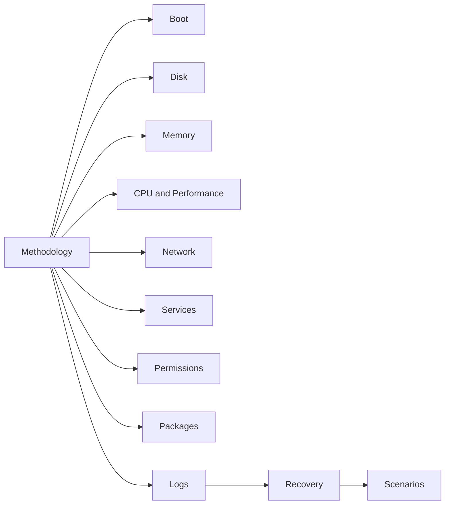

# Linux Troubleshooting Guide

---

## 🎬 Troubleshooting Decision Tree — Animated Workflow

```mermaid
graph TD
    subgraph TRIAGE["🚨 Issue Triage"]
        direction TB
        ISSUE["🔴 Issue Reported"]:::alert --> TYPE{"What type?"}:::decision
        TYPE -->|Boot| BOOT["🔧 Boot Issues"]:::boot
        TYPE -->|Network| NET_T["🌐 Network Issues"]:::network
        TYPE -->|Disk| DISK_T["💾 Disk Issues"]:::disk
        TYPE -->|Service| SVC["⚙️ Service Issues"]:::service
        TYPE -->|Memory| OOM["🧠 OOM / Memory"]:::memory
        TYPE -->|CPU| CPU_T["🔲 CPU Issues"]:::cpu
    end

    subgraph BOOT_FIX["🔧 Boot Troubleshooting"]
        direction LR
        B1["GRUB rescue"]:::step --> B2["Single user mode"]:::step
        B2 --> B3["Check fstab"]:::step
        B3 --> B4["Repair filesystem"]:::step
        B4 --> B5["Reinstall GRUB"]:::step
        B5 --> B6["✅ Rebooted"]:::fixed
    end

    subgraph NET_FIX["🌐 Network Troubleshooting"]
        direction LR
        NF1["ip addr"]:::cmd --> NF2["ping gateway"]:::cmd
        NF2 --> NF3["ping DNS"]:::cmd
        NF3 --> NF4["nslookup"]:::cmd
        NF4 --> NF5["traceroute"]:::cmd
        NF5 --> NF6["ss/netstat"]:::cmd
        NF6 --> NF7["tcpdump"]:::cmd
        NF7 --> NF8["✅ Found"]:::fixed
    end

    subgraph DISK_FIX["💾 Disk Troubleshooting"]
        direction LR
        DF1["df -h"]:::cmd --> DF2["du -sh /*"]:::cmd
        DF2 --> DF3["lsof +D"]:::cmd
        DF3 --> DF4["find large files"]:::cmd
        DF4 --> DF5["Clean/Extend"]:::cmd
        DF5 --> DF6["✅ Space Free"]:::fixed
    end

    classDef alert fill:#F44336,stroke:#C62828,color:#fff,stroke-width:3px
    classDef decision fill:#FF9800,stroke:#E65100,color:#fff,stroke-width:2px
    classDef boot fill:#9C27B0,stroke:#6A1B9A,color:#fff
    classDef network fill:#2196F3,stroke:#1565C0,color:#fff
    classDef disk fill:#795548,stroke:#4E342E,color:#fff
    classDef service fill:#607D8B,stroke:#37474F,color:#fff
    classDef memory fill:#e94560,stroke:#b71c1c,color:#fff
    classDef cpu fill:#FF9800,stroke:#E65100,color:#fff
    classDef step fill:#0f3460,stroke:#16213e,color:#fff
    classDef fixed fill:#4CAF50,stroke:#2E7D32,color:#fff,stroke-width:3px
    classDef cmd fill:#0f3460,stroke:#16213e,color:#fff
```

---

This guide is now split into focused troubleshooting runbooks so you can jump directly to the subsystem or recovery workflow you need.

## Overview

- Start with methodology before making changes on a production system.
- Use the subsystem guides for boot, storage, memory, CPU, network, service, permission, package, and log issues.
- Use the recovery and scenario guides for high-pressure incidents and end-to-end practice.

## Learning Path

## Table of Contents

1. [Troubleshooting Methodology](01-methodology.md)
2. [Boot Issues](02-boot-issues.md)
3. [Disk Issues](03-disk-issues.md)
4. [Memory Issues](04-memory-issues.md)
5. [CPU Issues](05-cpu-issues.md)
6. [Network Issues](06-network-issues.md)
7. [Service Issues](07-service-issues.md)
8. [Permission Issues](08-permission-issues.md)
9. [Package Issues](09-package-issues.md)
10. [Log Analysis](10-log-analysis.md)
11. [Recovery](11-recovery.md)
12. [Real-World Scenarios](12-real-world-scenarios.md)
13. [VM and SSH Access Issues](13-vm-ssh-access-issues.md)
14. [Advanced Troubleshooting](14-advanced-troubleshooting.md)
15. [Production Incident Playbooks](15-production-incident-playbooks.md)
