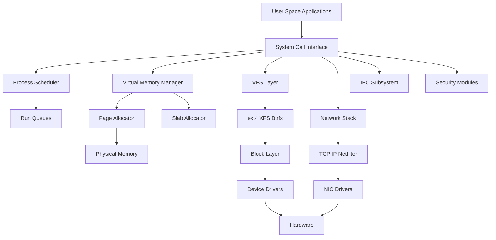

# Kernel Architecture

> **📌 Disclaimer**: Any third-party logos, screenshots, or diagrams referenced in this document are used for educational purposes only. All trademarks belong to their respective owners.


This guide explains Linux kernel organization, subsystem boundaries, modules, and core architecture concepts.

Linux is a **monolithic kernel with modular capabilities**. That single sentence packs several important ideas.

A pure monolithic kernel places most core operating system services inside kernel space. A microkernel keeps only minimal mechanisms in kernel space and pushes more services into user space. Linux is monolithic because device drivers, filesystems, schedulers, memory management, and networking all execute in kernel mode. However, Linux is also highly modular because many subsystems can be built and loaded as kernel modules.

## 1.1 Why Linux Is Called Monolithic

In Linux, the following typically run in kernel space:

- Process scheduler
- Virtual memory subsystem
- VFS and filesystem implementations
- Networking stack
- Block I/O subsystem
- Device drivers
- Inter-process communication primitives
- Security hooks and LSM integrations

This yields performance advantages because components can call each other directly without message-passing overhead typical of microkernel designs.

## 1.2 Monolithic vs Microkernel

| Property | Monolithic Kernel | Microkernel |
|---|---|---|
| Service location | Mostly kernel space | Minimal kernel, services in user space |
| Performance | Generally lower overhead | More IPC overhead |
| Fault isolation | Lower | Higher |
| Complexity placement | Inside kernel | Shifted to userspace services |
| Example | Linux | MINIX 3, QNX (microkernel style) |

## 1.3 Linux Kernel Design Philosophy

Linux emphasizes:

- Performance on real hardware
- Portability across many CPU architectures
- Incremental evolution rather than academic purity
- Broad hardware support
- Backward compatibility where practical
- Strong tooling and visibility via `/proc`, `/sys`, tracepoints, perf, and eBPF

## 1.4 Kernel Space vs User Space

**User space** is where ordinary applications run with restricted privileges.

**Kernel space** is privileged execution mode where the kernel has direct access to hardware and all memory.

Crossing between the two happens through:

- System calls
- Interrupts
- Exceptions
- Signals and return paths
- Special entry points such as vDSO for some optimized operations

## 1.5 Protection Rings and Privilege

Most modern CPUs implement privilege levels. Linux primarily uses:

- Ring 0 for kernel
- Ring 3 for user space

The hardware enforces permission checks so user applications cannot arbitrarily execute privileged instructions.

## 1.6 Mermaid Diagram: Linux Kernel Subsystems

### 📸 Linux Kernel Subsystems

> *Source: Wikimedia Commons — Linux kernel interactive map showing all subsystems*



## 1.7 Kernel Modules

Kernel modules are loadable pieces of kernel code.

They enable:

- Dynamic driver loading
- Filesystem support without rebuilding the kernel
- Optional features activated at runtime
- Easier development and deployment of kernel components

Common commands:

```bash
lsmod
modinfo xfs
sudo modprobe xfs
sudo rmmod xfs
```

Important points:

- Modules execute in kernel space.
- A buggy module can crash the system.
- Modules can export symbols for other modules.
- Module loading may trigger device discovery or subsystem registration.

## 1.8 Built-In vs Loadable Modules

| Type | Description | Typical Use |
|---|---|---|
| Built-in | Linked into kernel image | Core boot-critical features |
| Loadable module | Loaded at runtime | Drivers, optional filesystems, features |

## 1.9 Module Lifecycle

A typical module provides:

- Initialization function
- Exit function
- Metadata such as license and description
- Registration with a subsystem such as netdev, char device, block layer, USB, or platform bus

Minimal example:

```c
#include <linux/init.h>
#include <linux/module.h>

static int __init demo_init(void)
{
    pr_info("demo module loaded\n");
    return 0;
}

static void __exit demo_exit(void)
{
    pr_info("demo module unloaded\n");
}

module_init(demo_init);
module_exit(demo_exit);
MODULE_LICENSE("GPL");
MODULE_DESCRIPTION("Minimal example module");
```

## 1.10 Kernel Source Tree Overview

The Linux source tree is large but methodical.

| Directory | Purpose |
|---|---|
| `arch/` | Architecture-specific code |
| `block/` | Block layer |
| `crypto/` | Cryptographic framework |
| `Documentation/` | Kernel docs |
| `drivers/` | Device drivers |
| `fs/` | Filesystems and VFS pieces |
| `include/` | Header files |
| `init/` | Early boot and init |
| `ipc/` | IPC implementations |
| `kernel/` | Core scheduler, signals, timers, etc. |
| `lib/` | Generic helper code |
| `mm/` | Memory management |
| `net/` | Networking stack |
| `samples/` | Samples and reference code |
| `security/` | Linux Security Modules |
| `sound/` | Audio stack |
| `tools/` | User-space tools such as perf and bpftool |

## 1.11 Kernel Build Artifacts

| Artifact | Meaning |
|---|---|
| `vmlinux` | Uncompressed ELF kernel image with symbols |
| `bzImage` | Bootable compressed kernel image |
| `System.map` | Symbol table |
| `initramfs` | Early userspace root image |
| `.config` | Kernel configuration |

## 1.12 Kconfig and Kbuild

Linux uses:

- **Kconfig** for feature selection
- **Kbuild** for build orchestration

Useful commands:

```bash
make menuconfig
make oldconfig
make -j$(nproc)
```

## 1.13 Kernel Configuration Symbols

Examples:

- `CONFIG_PREEMPT`
- `CONFIG_CGROUPS`
- `CONFIG_BPF`
- `CONFIG_KALLSYMS`
- `CONFIG_DEBUG_INFO`

A symbol may be built as:

- `y` built-in
- `m` module
- `n` disabled

## 1.14 Boot Flow at a High Level

1. Firmware initializes hardware.
2. Bootloader loads kernel and initramfs.
3. Kernel decompresses and initializes CPU, memory, and devices.
4. Early init code mounts initramfs.
5. Kernel launches PID 1.
6. User-space init system transitions into normal boot.

## 1.15 System Calls as the Controlled Boundary

Applications cannot directly invoke arbitrary kernel functions. Instead, they use **system calls**.

Examples:

- `open()`
- `read()`
- `write()`
- `mmap()`
- `clone()`
- `ioctl()`
- `epoll_wait()`

A libc wrapper may do one of the following:

- Invoke a real syscall instruction
- Use vDSO for optimized time-related operations
- Compose behavior using multiple syscalls

## 1.16 Syscall Entry Path

On x86_64, user space typically uses `syscall` instruction.

The path is conceptually:

1. Place syscall number and arguments in registers.
2. Execute `syscall`.
3. CPU switches to kernel mode and jumps to kernel entry code.
4. Kernel validates arguments and dispatches to handler.
5. Return value is placed in register.
6. CPU returns to user mode.

## 1.17 Kernel Preemption Models

Linux offers several kernel preemption options.

| Model | Summary |
|---|---|
| None | Lowest overhead, least preemptible |
| Voluntary | Explicit preemption points |
| Preempt | Better responsiveness |
| RT style variants | Very low latency for real-time needs |

## 1.18 SMP and Scalability

Linux is designed for **SMP** systems with multiple CPUs.

Scalability techniques include:

- Per-CPU data structures
- Fine-grained locking
- RCU for read-mostly structures
- Lockless algorithms in hot paths
- NUMA-aware placement

## 1.19 RCU at a Glance

**Read-Copy-Update** is a synchronization mechanism optimized for many readers and fewer updates.

Writers:

- Create a new version
- Publish pointer changes safely
- Wait for grace period before freeing old version

Readers:

- Often avoid heavy locking
- Traverse shared data safely within read-side critical sections

## 1.20 Interrupts and Softirqs

Linux splits work into layers:

- Hard IRQ: immediate interrupt handling
- Softirq: deferred interrupt work
- Tasklets: older deferred mechanism built on softirqs
- Workqueues: process-context deferred work

This prevents doing too much in hard interrupt context.

## 1.21 Important Kernel Execution Contexts

| Context | Can Sleep? | Example |
|---|---|---|
| User context | Yes | Syscall path |
| Process context in kernel | Usually yes | Filesystem operation |
| Softirq context | No | Network receive processing |
| Hard IRQ context | No | Interrupt top half |
| NMI context | No | Performance monitoring interrupt |

## 1.22 Kernel Logging

Kernel messages use the ring buffer.

Commands:

```bash
dmesg --color=always | less -R
journalctl -k
```

## 1.23 Kernel Symbol Resolution

Files and tools:

- `/proc/kallsyms`
- `System.map`
- `nm`
- `objdump`

These are essential for tracing and crash analysis.

## 1.24 Common Operational Questions

| Question | Tool |
|---|---|
| Which modules are loaded? | `lsmod` |
| Which kernel config enabled a feature? | `grep CONFIG_* .config` |
| Which symbols are available? | `/proc/kallsyms` |
| Which subsystem handles a syscall? | `strace`, source tree, perf trace |

## 1.25 Practical Example: Inspect the Running Kernel

```bash
uname -a
uname -r
cat /proc/version
cat /proc/cmdline
zgrep CONFIG_BPF /proc/config.gz
```

## 1.26 Common Misconceptions

- Linux is not a microkernel.
- Kernel modules are not “safe plugins”; they are trusted kernel code.
- `glibc` is not the kernel; it is a user-space library.
- `/proc` is not just files on disk; it is a virtual filesystem exposing kernel state.

## 1.27 Section Summary

Kernel architecture is the foundation of every other topic in this guide. Once you understand where code executes, how privilege changes occur, and how subsystems are organized, the rest of Linux internals becomes much easier to reason about.

---
