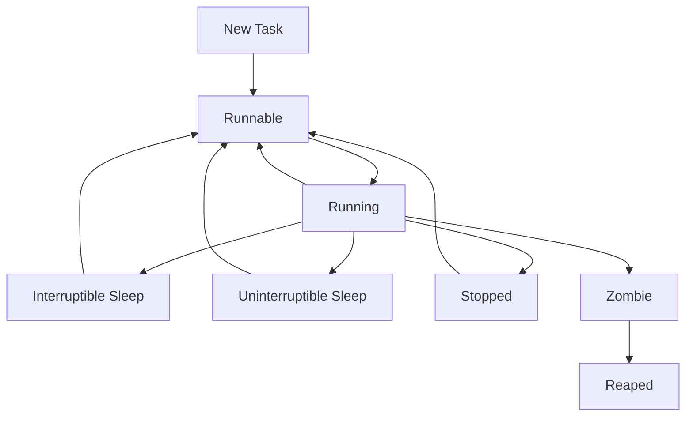

# Process Internals

This guide covers Linux task creation, scheduling, process metadata, and execution flow.

Processes are one of the most visible abstractions in Linux, but internally Linux models execution using **tasks** represented primarily by `task_struct`.

## 2.1 Process vs Thread in Linux

Linux treats processes and threads similarly. Both are tasks; the difference comes from what resources are shared.

A “thread” usually means tasks created with `clone()` that share:

- Address space
- File descriptor table
- Signal handlers
- Other process resources

## 2.2 Core Structure: `task_struct`

`task_struct` is the kernel’s central data structure for a task.

It contains or references:

- PID and thread group identifiers
- Scheduling information
- Memory descriptor
- Open file table
- Signal state
- Credentials
- CPU affinity
- Namespace pointers
- Cgroup membership
- Parent and child relations
- Statistics and accounting fields

## 2.3 High-Level Process Creation Paths

Linux supports several creation styles:

- `fork()`
- `vfork()`
- `clone()`
- `execve()` as program image replacement

## 2.4 `fork()`

`fork()` creates a new child task by duplicating the parent’s process context.

But Linux does not immediately copy all memory pages. Instead it uses **copy-on-write**.

What is duplicated or logically inherited?

- Virtual address layout
- File descriptors
- Signal dispositions
- Credentials
- Working directory and root directory references
- Environment and arguments snapshot

What is different?

- PID
- Pending signals
- CPU runtime statistics
- Some timers and accounting fields

## 2.5 `execve()`

`execve()` replaces the current process image.

After a successful `execve()`:

- New executable and memory map are loaded.
- Old userspace memory image is discarded.
- PID stays the same.
- File descriptors remain unless marked `CLOEXEC`.
- Signal dispositions may change according to POSIX rules.

## 2.6 `clone()`

`clone()` is the flexible primitive behind Linux threading.

Flags control which resources are shared, for example:

- `CLONE_VM`
- `CLONE_FILES`
- `CLONE_SIGHAND`
- `CLONE_FS`
- `CLONE_THREAD`
- `CLONE_NEWNS`
- `CLONE_NEWNET`

## 2.7 `vfork()`

`vfork()` is an optimization historically used when the child immediately calls `execve()`.

The parent is suspended until the child execs or exits.

## 2.8 Mermaid Diagram: Process State Machine



## 2.9 Process States in Practice

Linux exposes process states in tools like `ps`, `top`, and `/proc/[pid]/stat`.

Common states:

| State | Meaning |
|---|---|
| `R` | Running or runnable |
| `S` | Interruptible sleep |
| `D` | Uninterruptible sleep, often waiting on I/O |
| `T` | Stopped or traced |
| `Z` | Zombie |
| `I` | Idle kernel thread on some systems |

## 2.10 Zombie Processes

A zombie is a task that has exited but whose exit status has not yet been collected by its parent.

It retains a minimal kernel entry so the parent can call `wait()`.

## 2.11 Orphans and Reparenting

If a parent exits before a child, the child is reparented, usually to PID 1 or a designated subreaper.

## 2.12 Process Hierarchy Fields

Important identifiers:

- `pid`: task ID
- `tgid`: thread group ID, often the process ID users see
- `ppid`: parent PID
- `sid`: session ID
- `pgid`: process group ID

## 2.13 Scheduler Classes

Linux scheduler is not one single algorithm. It has multiple classes.

Examples:

- Fair scheduling class for normal tasks
- Real-time class for `SCHED_FIFO` and `SCHED_RR`
- Deadline scheduling for specific deterministic needs

## 2.14 Completely Fair Scheduler (CFS)

CFS models CPU time as a fairness problem.

Key ideas:

- Each runnable task accumulates **virtual runtime**.
- The scheduler prefers the task with the smallest virtual runtime.
- Tasks are stored in a red-black tree keyed by virtual runtime.
- Nice levels influence weight and thus runtime progression.

## 2.15 CFS Terms

| Term | Meaning |
|---|---|
| `vruntime` | Weighted execution progress |
| Run queue | Per-CPU runnable task set |
| Scheduling entity | Abstract schedulable unit |
| Weight | Priority impact based on nice value |

## 2.16 Nice Values

`nice` affects scheduling weight for normal tasks.

Range:

- `-20` highest priority
- `19` lowest priority

Commands:

```bash
nice -n 10 myjob
renice -n -5 -p 1234
```

## 2.17 Real-Time Scheduling

Linux also supports real-time policies.

### `SCHED_FIFO`

- Runs until blocked, preempted by higher-priority RT task, or yields
- No timeslice rotation among equal priorities

### `SCHED_RR`

- Like FIFO but uses round-robin timeslices among equal-priority RT tasks

## 2.18 Deadline Scheduling

`SCHED_DEADLINE` uses concepts such as runtime, deadline, and period.

It is intended for specific latency-sensitive workloads where admission control matters.

## 2.19 Per-CPU Run Queues

Each CPU maintains scheduler state.

Advantages:

- Reduced contention
- Locality of execution
- Better cache warmth

But load balancing is required so one CPU is not overloaded while another is idle.

## 2.20 Scheduler Load Balancing

Linux periodically balances tasks across CPUs and scheduling domains.

Factors include:

- CPU affinity masks
- NUMA topology
- Cache sharing relationships
- Task wakeup behavior
- Real-time constraints

## 2.21 Context Switching

A context switch saves execution state of one task and restores another.

Saved state typically includes:

- CPU registers
- Stack pointer
- Instruction pointer
- Scheduling/accounting state
- Memory context if switching between different address spaces

## 2.22 Why Context Switches Matter

They are necessary but not free.

Costs include:

- CPU cycles for save/restore
- Cache pollution
- TLB effects on address space switches
- Locking and scheduler overhead

## 2.23 User vs Kernel Threads

| Type | Description |
|---|---|
| User thread | Typically managed by user-space runtime atop kernel tasks |
| Kernel thread | Task created by kernel, often no user address space |

Kernel threads often appear in `ps` with names like `[kworker/0:1]`.

## 2.24 Memory Descriptor: `mm_struct`

Each process address space is described by `mm_struct`.

It tracks:

- Virtual memory areas
- Page tables
- Address space stats
- Mapped files
- Anonymous memory
- Executable layout

Threads in the same process usually share the same `mm_struct`.

## 2.25 Open Files and `files_struct`

Open file descriptors are managed through a per-process or shared descriptor table.

Each descriptor points to an open file description with:

- File offset
- Flags
- Operation table
- Underlying inode/dentry references

## 2.26 Signals Internals

Processes have:

- Pending signal queues
- Blocked signal masks
- Disposition tables
- Shared or per-thread signal state depending on threading model

## 2.27 Credentials

Linux credentials include:

- Real UID/GID
- Effective UID/GID
- Saved IDs
- Supplementary groups
- Capability sets
- Security module context

## 2.28 `/proc/[pid]` Deep Dive

The `/proc` filesystem exposes process state.

Important entries:

| Path | Meaning |
|---|---|
| `/proc/[pid]/cmdline` | Command line |
| `/proc/[pid]/environ` | Environment |
| `/proc/[pid]/maps` | Memory mappings |
| `/proc/[pid]/smaps` | Mapping details |
| `/proc/[pid]/fd/` | Open file descriptors |
| `/proc/[pid]/status` | Human-readable summary |
| `/proc/[pid]/stat` | Single-line stats |
| `/proc/[pid]/sched` | Scheduler data |
| `/proc/[pid]/stack` | Kernel stack trace if permitted |
| `/proc/[pid]/ns/` | Namespace references |
| `/proc/[pid]/cgroup` | Cgroup membership |

## 2.29 Practical Example: Inspect a Process

```bash
pid=1234
cat /proc/$pid/status
cat /proc/$pid/sched
ls -l /proc/$pid/fd
cat /proc/$pid/maps | head
```

## 2.30 Understanding `/proc/[pid]/stat`

This file is dense and positional. It includes:

- PID
- Command name
- State
- PPID
- Process group
- Session
- TTY
- Fault counts
- CPU time
- Start time
- RSS
- Processor last executed on

## 2.31 `ps` Output vs Kernel Reality

User-space tools summarize kernel data and sometimes omit nuance.

For example:

- One `ps` line may represent a thread group or thread depending on flags.
- CPU usage is derived over intervals, not a fixed field in the kernel.
- “Memory usage” may refer to RSS, PSS, or virtual memory depending on the tool.

## 2.32 Copy-on-Write During `fork()`

Initially, parent and child share physical pages marked read-only.

On write:

1. CPU raises page fault.
2. Kernel detects COW condition.
3. New physical page is allocated.
4. Data is copied.
5. Page table updated.
6. Write proceeds.

## 2.33 Thread-Local Storage and Threads

User-space thread libraries use per-thread areas and kernel-provided thread IDs to manage thread-local data.

## 2.34 CPU Affinity

A task may be restricted to specific CPUs.

Commands:

```bash
taskset -p 1234
taskset -cp 0-3 1234
```

Reasons:

- Improve cache locality
- Reserve CPUs for latency-sensitive work
- Constrain noisy neighbors

## 2.35 Process Accounting Metrics

Linux tracks:

- User CPU time
- System CPU time
- Voluntary context switches
- Involuntary context switches
- Major and minor faults
- I/O counters in some interfaces

## 2.36 Wait Queues and Sleeping

When a task waits for an event, it may sleep on a wait queue.

This avoids busy waiting and allows efficient wakeup when the event occurs.

## 2.37 Futexes

Fast userspace mutexes use a hybrid model:

- Uncontended path stays in user space
- Contended path enters kernel via `futex()`

This is crucial for efficient threading libraries.

## 2.38 Practical Example: Observe Scheduling

```bash
pidstat -w 1
perf sched record -- sleep 5
perf sched latency
chrt -p 1234
```

## 2.39 Common Failure Modes

| Symptom | Likely Cause |
|---|---|
| Many zombies | Parent not reaping children |
| High context switches | Lock contention or oversubscription |
| Tasks stuck in `D` | Storage, NFS, or driver wait |
| CPU starvation | Priority inversion or bad RT config |

## 2.40 Section Summary

The Linux “process” is really a carefully structured task abstraction built atop shared and unshared kernel objects. Understanding `task_struct`, scheduling classes, context switching, and `/proc` makes performance work and debugging much easier.

---
