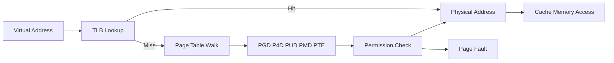

# Memory Management

> **📌 Disclaimer**: Any third-party logos, screenshots, or diagrams referenced in this document are used for educational purposes only. All trademarks belong to their respective owners.


This guide covers address spaces, paging, allocators, NUMA, and memory behavior under pressure.

Linux memory management is one of the most sophisticated parts of the kernel. It deals with virtual memory, physical page allocation, reclaim, page cache, NUMA locality, huge pages, and out-of-memory behavior.

## 3.1 Why Virtual Memory Exists

Virtual memory provides:

- Isolation between processes
- A contiguous address space illusion
- Demand paging
- File-backed mappings
- Shared memory mechanisms
- Efficient protection and permission control

## 3.2 Virtual vs Physical Addresses

### 📸 Virtual Memory

> *Source: Wikimedia Commons — Virtual memory mapping to physical memory*

Applications use **virtual addresses**.

The MMU translates virtual addresses to physical addresses using page tables managed by the kernel.

## 3.3 Memory Management Components

| Component | Role |
|---|---|
| MMU | Hardware translation |
| Page tables | Mapping metadata |
| TLB | Translation cache |
| `mm_struct` | Process memory descriptor |
| VMA | Region metadata |
| Page allocator | Physical page allocation |
| Slab allocator | Kernel object caching |
| Reclaim | Free memory recovery |

## 3.4 Virtual Memory Areas

A process address space is composed of VMAs.

Examples:

- Text segment
- Data segment
- Heap
- Stack
- Shared libraries
- Anonymous mappings
- File-backed mappings

Inspect with:

```bash
cat /proc/self/maps
cat /proc/self/smaps
```

## 3.5 Page Tables

### 📸 Page Table

> *Source: Wikimedia Commons — Virtual to physical address translation*

Linux uses multi-level page tables on modern architectures.

The exact levels vary by architecture and paging mode, but conceptually the kernel walks tables from upper levels toward a page table entry that describes the mapping.

## 3.6 Mermaid Diagram: Virtual Memory Address Translation



## 3.7 Translation Lookaside Buffer (TLB)

The TLB caches recent address translations.

Benefits:

- Avoid expensive page table walks
- Improve memory access latency

Costs when ineffective:

- TLB misses cause page table walks
- Frequent address space changes may require TLB flushes
- Large working sets may exceed TLB capacity

## 3.8 Page Sizes

Common page sizes:

- 4 KiB base pages on many systems
- 2 MiB huge pages on x86_64
- 1 GiB gigantic pages on some systems

Larger pages can reduce TLB pressure but have tradeoffs.

## 3.9 Demand Paging

Memory is often mapped before pages are physically instantiated.

Actual allocation may occur on first access.

Benefits:

- Faster startup
- Lower memory use for untouched regions
- Lazy loading of executable and shared library pages

## 3.10 Minor vs Major Faults

| Fault Type | Meaning |
|---|---|
| Minor fault | Mapping established without disk I/O |
| Major fault | Disk I/O required to bring page in |

## 3.11 Page Fault Handling Flow

1. CPU detects invalid or permission-failing translation.
2. Trap enters kernel.
3. Kernel inspects VMA and fault reason.
4. If valid and recoverable, kernel allocates page or reads from storage.
5. Page tables are updated.
6. Faulting instruction resumes.

## 3.12 Anonymous Memory

Anonymous memory is not directly backed by a regular file.

Examples:

- Heap allocations
- Stack pages
- Anonymous `mmap()`

## 3.13 File-Backed Memory

File-backed mappings allow pages to be populated from files.

Examples:

- Shared libraries
- Memory-mapped files
- Executable code pages

## 3.14 Copy-on-Write and Fork Efficiency

COW makes `fork()` practical even for large processes.

Without COW, every fork would require immediate duplication of the parent memory image.

## 3.15 Overcommit

Linux can allow memory allocations beyond immediately available RAM plus swap depending on overcommit policy.

Relevant sysctls:

- `vm.overcommit_memory`
- `vm.overcommit_ratio`
- `vm.overcommit_kbytes`

## 3.16 Physical Memory Organization

Linux organizes physical memory into **nodes** and **zones**.

- Nodes represent NUMA domains.
- Zones represent allocation constraints.

## 3.17 Memory Zones

Common zones include:

| Zone | Purpose |
|---|---|
| `ZONE_DMA` | Legacy DMA-constrained memory |
| `ZONE_DMA32` | 32-bit addressable DMA zone |
| `ZONE_NORMAL` | Normal directly mapped memory |
| `ZONE_MOVABLE` | Migratable pages |
| `ZONE_HIGHMEM` | High memory on 32-bit systems |

## 3.18 Buddy Allocator

The buddy allocator manages physical pages in power-of-two blocks.

It supports efficient splitting and coalescing.

## 3.19 Fragmentation

Fragmentation occurs when free memory exists but not in the right contiguous form.

This matters for:

- Huge page allocation
- Large DMA buffers
- Some latency-sensitive allocations

## 3.20 Slab, SLUB, and SLOB

Linux uses specialized allocators for kernel objects.

Modern systems often use **SLUB**.

Benefits:

- Object reuse
- Reduced fragmentation
- Fast allocation of common kernel objects
- Cache coloring and locality considerations

## 3.21 Slab Caches

Examples of objects often cached:

- `task_struct`
- `inode`
- `dentry`
- `kmalloc-*` size classes

Inspect:

```bash
cat /proc/slabinfo | head
slabtop
```

## 3.22 `kmalloc()` vs `vmalloc()`

| API | Properties |
|---|---|
| `kmalloc()` | Physically contiguous, typically for smaller allocations |
| `vmalloc()` | Virtually contiguous, physically non-contiguous |

## 3.23 Page Reclaim

When free memory is low, Linux reclaims pages.

This may involve:

- Dropping clean page cache
- Writing dirty pages back to storage
- Swapping anonymous pages
- Shrinking slab caches

## 3.24 LRU Lists and Reclaim Heuristics

Linux tracks page activity to approximate recency and reclaimability.

Modern internals are more nuanced than a pure textbook LRU, but the essential idea remains: cold pages are better eviction candidates.

## 3.25 Swap

Swap extends apparent memory capacity by moving anonymous pages to swap space.

Tradeoffs:

- Prevents immediate OOM in some cases
- Much slower than RAM
- Can cause latency spikes if heavily used

## 3.26 Swappiness

`vm.swappiness` influences reclaim preference between page cache and anonymous pages.

## 3.27 OOM Killer Internals

When the kernel cannot satisfy allocations and reclaim fails sufficiently, the **OOM killer** may select a victim process.

Factors include:

- Memory footprint
- `oom_score_adj`
- Process role and privileges
- Cgroup-local pressure in cgroup v2 environments

Inspect:

```bash
cat /proc/1234/oom_score
cat /proc/1234/oom_score_adj
```

## 3.28 OOM Killer Flow

1. Allocation fails after reclaim attempts.
2. Kernel determines OOM scope.
3. Badness heuristic scores tasks.
4. Victim is selected.
5. Victim receives kill signal.
6. Memory is freed when it exits.

## 3.29 NUMA

**Non-Uniform Memory Access** means memory latency varies depending on which CPU accesses which memory node.

Goals:

- Keep threads near their data
- Reduce remote node access
- Improve scalability on large servers

Useful tools:

```bash
numactl --hardware
numastat
```

## 3.30 NUMA Policies

Examples:

- Default local allocation
- Interleave across nodes
- Bind to specific nodes
- Preferred node

## 3.31 Transparent Huge Pages (THP)

THP automatically promotes suitable regions to huge pages.

Benefits:

- Fewer TLB misses
- Potential performance gains for large memory workloads

Tradeoffs:

- Allocation and compaction overhead
- Latency spikes in some workloads
- Not universally beneficial

## 3.32 Explicit HugeTLB Pages

Separate from THP, applications can use preallocated huge pages via HugeTLB mechanisms.

## 3.33 Memory Compaction

Compaction rearranges movable pages to create larger contiguous free ranges.

Important for:

- Huge page allocation
- Fragmentation reduction

## 3.34 `mmap()` Internals

`mmap()` creates a new VMA and establishes mapping metadata.

Actual physical pages may not be allocated until accessed.

Common use cases:

- File mapping
- Shared memory
- Allocator arenas
- JIT code regions
- Large data processing

## 3.35 `brk()` vs `mmap()`

Traditional heap growth uses `brk()`.

Modern allocators often use a mix of:

- `brk()` for smaller contiguous heap growth
- `mmap()` for large or specialized allocations

## 3.36 Shared Memory via Mapping

Processes can share pages using:

- POSIX shared memory
- System V shared memory
- Shared file-backed mappings
- `memfd_create()` plus `mmap()`

## 3.37 KSM

**Kernel Samepage Merging** can deduplicate identical anonymous pages across processes.

Useful in virtualization and some memory-dense environments.

## 3.38 Memory Cgroups

Cgroups can account for and limit memory.

This enables:

- Per-container memory isolation
- OOM handling within control group scopes
- Fine-grained resource visibility

## 3.39 Page Cache

The page cache stores cached file data in memory.

It is central to Linux I/O performance and tightly integrated with VM reclaim.

## 3.40 Dirty Pages and Writeback

Dirty pages contain modified file-backed data not yet committed to storage.

The kernel writes them back asynchronously according to policies and thresholds.

## 3.41 Observability Commands

```bash
free -h
vmstat 1
cat /proc/meminfo
cat /proc/vmstat | head
sar -B 1
```

## 3.42 Interpreting `/proc/meminfo`

Important fields:

| Field | Meaning |
|---|---|
| `MemTotal` | Total RAM |
| `MemFree` | Totally unused RAM |
| `MemAvailable` | Estimated allocatable memory without heavy reclaim |
| `Buffers` | Block device metadata buffers |
| `Cached` | File cache |
| `SwapTotal` | Total swap |
| `SwapFree` | Free swap |
| `AnonPages` | Anonymous memory |
| `Dirty` | Dirty data pending writeback |
| `Slab` | Kernel slab memory |

## 3.43 Troubleshooting Patterns

| Symptom | Possible Cause |
|---|---|
| High major faults | Slow storage or cold working set |
| Frequent OOM kills | Underprovisioned memory or leaks |
| High remote NUMA access | Poor placement or CPU pinning |
| THP latency spikes | Compaction or huge page promotion cost |
| Slab growth | Filesystem cache or kernel object leak |

## 3.44 Practical Example: Memory Mapping a File in C

```c
#include <fcntl.h>
#include <sys/mman.h>
#include <sys/stat.h>
#include <unistd.h>

int main(void)
{
    int fd = open("data.bin", O_RDONLY);
    struct stat st;
    fstat(fd, &st);
    void *p = mmap(NULL, st.st_size, PROT_READ, MAP_PRIVATE, fd, 0);
    write(STDOUT_FILENO, p, st.st_size);
    munmap(p, st.st_size);
    close(fd);
    return 0;
}
```

## 3.45 Section Summary

Linux memory management is not just “RAM allocation.” It is a coordinated system spanning hardware translation, page allocation, reclaim, cache management, NUMA placement, and application-visible APIs like `mmap()`.

---
