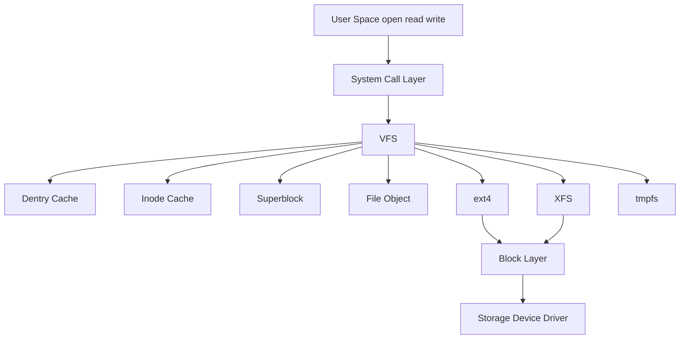

# File System Internals

This guide covers the VFS layer, core filesystem objects, and storage-facing filesystem behavior.

Linux filesystem internals revolve around the **Virtual Filesystem Switch (VFS)**, which provides a common interface across many filesystem types.

## 4.1 Why VFS Exists

Applications should not need different system calls for ext4, XFS, NFS, tmpfs, or procfs. VFS abstracts filesystem operations behind common objects and methods.

## 4.2 Core VFS Objects

| Object | Purpose |
|---|---|
| Superblock | Mounted filesystem instance metadata |
| Inode | File metadata and object identity |
| Dentry | Directory entry cache object |
| File | Open file instance |

## 4.3 Path Resolution

When you call `open("/var/log/app.log")`, Linux performs pathname lookup:

1. Start from root or current directory.
2. Walk each path component.
3. Use dentry cache where possible.
4. Follow mount points and permissions.
5. Resolve final object and create/open file object.

## 4.4 Mermaid Diagram: VFS Architecture



## 4.5 Inodes

An inode represents filesystem metadata for a file-like object.

Typical inode data:

- File type
- Permissions
- Ownership
- Timestamps
- Size
- Block mapping information
- Link count
- Extended attributes pointers

Notably, the filename is not stored in the inode itself. Filenames live in directory entries.

## 4.6 Dentries

Dentries map names to inodes in directory context.

They are heavily cached because pathname lookup is common and expensive.

## 4.7 Superblock

A superblock represents a mounted filesystem instance.

It contains:

- Filesystem type
- Block size
- Root inode reference
- Operation tables
- Mount options
- State information

## 4.8 File Objects

A file object corresponds to an open file description.

It tracks:

- Current file offset
- Status flags
- File operations table
- References to dentry/inode

## 4.9 VFS Operation Tables

Linux uses function pointer tables such as:

- `file_operations`
- `inode_operations`
- `super_operations`
- `address_space_operations`

This makes VFS polymorphic across filesystem implementations.

## 4.10 The Dentry Cache and Path Performance

The dcache is crucial for performance.

Repeated lookups of hot paths can avoid expensive disk access and filesystem parsing.

## 4.11 Page Cache and Filesystems

Most regular buffered file I/O interacts with the page cache.

Reads:

- May be served from cache
- Otherwise fill cache from storage

Writes:

- Often update cache pages
- Mark pages dirty
- Later write back asynchronously

## 4.12 Buffered vs Direct I/O

| Mode | Characteristics |
|---|---|
| Buffered I/O | Uses page cache |
| Direct I/O | Attempts to bypass page cache |

Direct I/O has alignment and workload-specific tradeoffs.

## 4.13 Journaling Basics

Journaling filesystems record intended metadata changes before final application, improving crash recovery.

Important nuance:

- Journaling usually guarantees metadata consistency.
- It does not necessarily mean user data is fully durable unless sync semantics are used.

## 4.14 ext4 Overview

ext4 is the widely deployed successor to ext3.

Major features:

- Extents instead of only block maps
- Delayed allocation
- Journaling
- Large filesystem support
- Multiblock allocation
- Checksums for some metadata

## 4.15 ext4 Extents

Extents describe ranges of contiguous blocks efficiently.

This reduces metadata overhead compared to individual block mappings for large files.

## 4.16 ext4 Delayed Allocation

Delayed allocation postpones physical block allocation until writeback time.

Benefits:

- Better allocation decisions
- Reduced fragmentation
- Improved throughput

## 4.17 ext4 Journaling Modes

| Mode | Summary |
|---|---|
| `data=journal` | Data and metadata journaled |
| `data=ordered` | Metadata journaled, data written before metadata commit |
| `data=writeback` | Metadata journaled, weaker ordering for data |

## 4.18 XFS Overview

XFS is designed for scalability and large systems.

Characteristics:

- High parallelism
- Allocation groups
- Strong metadata design
- Efficient handling of large files and filesystems
- Delayed allocation and extent-based allocation

## 4.19 XFS Allocation Groups

Allocation groups allow parallel metadata and block allocation work across regions of the filesystem.

## 4.20 Inode Lifecycle

1. Inode loaded from disk or cache
2. Referenced by dentry or file object
3. Metadata updated in memory
4. Dirty inode eventually written back
5. Reclaimed when no longer in use

## 4.21 Directory Internals

Directories map names to inode references.

Large directories often use indexed or hashed schemes for efficient lookup.

## 4.22 Hard Links vs Symlinks

| Type | Behavior |
|---|---|
| Hard link | Another directory entry to same inode |
| Symbolic link | Special file containing path reference |

## 4.23 `unlink()` Semantics

Removing a filename decrements link count.

If link count reaches zero and no file descriptors remain open, storage can be reclaimed.

This explains why deleted files may still occupy space until processes close them.

## 4.24 Useful Diagnostics

```bash
stat file.txt
ls -li file.txt
findmnt
mount | column -t
xfs_info /mountpoint
sudo tune2fs -l /dev/sdX1 | head
```

## 4.25 `/proc` and `/sys` Are Filesystems Too

Linux includes many pseudo-filesystems:

- `procfs`
- `sysfs`
- `tmpfs`
- `devtmpfs`
- `cgroup2`
- `tracefs`
- `debugfs`

## 4.26 Writeback and Durability Caveats

A successful `write()` does not always mean data is on stable storage.

Durability requires combinations such as:

- `fsync()`
- `fdatasync()`
- `O_SYNC`
- Storage with proper flush semantics

## 4.27 `rename()` Guarantees

Within the same filesystem, `rename()` is typically atomic from the namespace perspective.

This is widely used for safe file replacement patterns.

## 4.28 File Locking

Linux supports:

- Advisory locks with `flock()`
- POSIX byte-range locks with `fcntl()`
- Leases and more advanced mechanisms in some cases

## 4.29 Filesystem Caches to Know

| Cache | Purpose |
|---|---|
| Dentry cache | Pathname components |
| Inode cache | Metadata objects |
| Page cache | File content pages |
| Buffer heads or metadata buffers | Block metadata in some paths |

## 4.30 Common Performance Issues

| Symptom | Likely Cause |
|---|---|
| High metadata latency | Dentry misses, slow storage, directory scaling |
| Fragmented large files | Poor allocation patterns |
| Slow sync writes | Journal or device latency |
| Space not reclaimed after delete | Open deleted file handles |

## 4.31 Practical Example: Find Open Deleted Files

```bash
sudo lsof +L1
```

## 4.32 Practical Example: Observe Mounts

```bash
cat /proc/mounts
findmnt -o TARGET,SOURCE,FSTYPE,OPTIONS
```

## 4.33 Section Summary

Filesystem internals make much more sense once you know the VFS object model: dentries for names, inodes for metadata identity, superblocks for mounted instances, and file objects for open state. ext4 and XFS implement the same abstract interface with different internal strategies.

---
