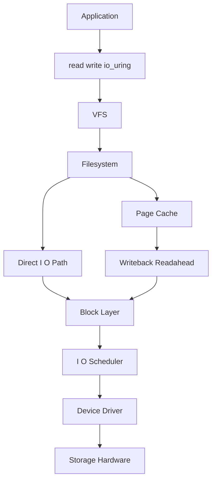

# I/O Subsystem

This guide covers Linux block I/O, page cache interactions, writeback, and modern async I/O.

The Linux I/O subsystem bridges filesystem logic, page cache, block layer, device drivers, and storage hardware.

## 5.1 Buffered I/O Path

Typical buffered read path:

1. Process calls `read()`.
2. Kernel resolves file and offset.
3. Page cache checked.
4. If miss, storage request issued.
5. Data loaded into page cache.
6. Bytes copied to user buffer.

Typical buffered write path:

1. Process calls `write()`.
2. Data copied into page cache pages.
3. Pages marked dirty.
4. Writeback later flushes to storage.

## 5.2 Block Layer Role

The block layer manages block device I/O request submission, merging, dispatch, and completion.

## 5.3 Mermaid Diagram: I/O Stack



## 5.4 BIO and Requests

Historically and conceptually:

- BIO structures describe block I/O segments.
- Requests aggregate or schedule I/O for devices.

The exact internals evolve, but this distinction helps reason about the stack.

## 5.5 I/O Schedulers

Schedulers decide request ordering to optimize throughput, latency, or fairness.

Common schedulers in modern Linux vary by kernel and device type.

Examples include:

- `mq-deadline`
- `none`
- `bfq`
- `kyber`

## 5.6 Multi-Queue Block Layer

Modern Linux uses blk-mq for scalable multi-queue I/O.

Benefits:

- Better SMP scalability
- Reduced lock contention
- Better fit for SSDs and NVMe devices

## 5.7 Readahead

Linux performs readahead when sequential access is detected.

Goal:

- Overlap storage latency with future reads
- Improve throughput for sequential workloads

## 5.8 Writeback

Dirty pages are written out by kernel flusher mechanisms.

Important concepts:

- Background writeback
- Dirty thresholds
- Congestion and throttling
- Per-bdi or device-specific behavior depending on kernel generation

## 5.9 Direct I/O

Direct I/O tries to bypass the page cache.

Use cases:

- Databases with own cache management
- Large streaming workloads where page cache pollution is undesirable

Tradeoffs:

- Alignment requirements
- More complex application behavior
- Loss of page-cache-based coalescing benefits

## 5.10 `fsync()` and Durability

`fsync()` requests that dirty data and required metadata be flushed for a file.

Caveat:

- Full durability still depends on device write cache settings and barriers/flushes.

## 5.11 `O_DIRECT`

Open a file with direct I/O semantics:

```c
int fd = open("data.bin", O_RDONLY | O_DIRECT);
```

But ensure proper alignment of buffers, offsets, and sizes.

## 5.12 Asynchronous I/O Models

Linux provides multiple async mechanisms:

- Nonblocking I/O with readiness notification
- POSIX AIO in some environments
- `libaio` for kernel AIO APIs
- `io_uring` for modern high-performance async operations

## 5.13 `libaio`

`libaio` exposes older Linux AIO interfaces, more historically associated with direct I/O and storage-heavy workloads.

## 5.14 `io_uring`

`io_uring` is a modern async interface using shared submission and completion rings between user space and kernel.

Benefits:

- Reduced syscall overhead
- Batched submission
- Efficient async and even sync-like patterns
- Support for many operations beyond basic read/write

## 5.15 `io_uring` Concepts

| Term | Meaning |
|---|---|
| SQ | Submission Queue |
| CQ | Completion Queue |
| SQE | Submission Queue Entry |
| CQE | Completion Queue Entry |
| Registered buffers/files | Optimization to reduce overhead |

## 5.16 Practical `io_uring` Flow

1. Application fills SQE.
2. Kernel consumes submission.
3. Operation executes asynchronously.
4. Completion posted to CQ.
5. Application reads CQE.

## 5.17 Polling vs Interrupt-Driven I/O

Some devices and workloads benefit from polling.

Examples:

- Busy polling in low-latency networking
- NVMe polling modes in specific scenarios

## 5.18 Disk vs SSD vs NVMe Considerations

| Device Type | Characteristics |
|---|---|
| HDD | High seek cost, sequential access matters greatly |
| SATA SSD | Lower latency, no mechanical seek |
| NVMe | Very high parallelism, low latency, multiple queues |

## 5.19 Block Device Observability

```bash
iostat -xz 1
cat /proc/diskstats
lsblk -o NAME,SIZE,ROTA,SCHED,MOUNTPOINT
```

## 5.20 Queue Depth

Queue depth influences throughput and latency.

Too low:

- Device underutilized

Too high:

- Tail latency increases
- Application response times may degrade

## 5.21 Page Cache Effects on Benchmarks

Beware of misleading benchmarks:

- Second run may hit page cache
- Write completion may only mean cache population
- Buffering can mask device limits

## 5.22 Drop Caches Carefully

```bash
sync
echo 3 | sudo tee /proc/sys/vm/drop_caches
```

Use only in controlled testing, not casually in production.

## 5.23 DAX

**Direct Access (DAX)** lets some persistent memory workloads bypass page cache and use direct memory-style access semantics.

## 5.24 I/O Control Groups

Cgroups can limit or weight I/O by device depending on configuration and cgroup version.

## 5.25 Common Bottlenecks

| Symptom | Likely Cause |
|---|---|
| High `%util` on disk | Saturated block device |
| High await latency | Queueing or slow media |
| Large dirty backlog | Writeback lag |
| Good throughput but bad p99 latency | Queue depth too high |

## 5.26 Practical Example: Observe Writeback Pressure

```bash
watch -n 1 'grep -E "Dirty|Writeback" /proc/meminfo'
vmstat 1
```

## 5.27 Section Summary

The Linux I/O subsystem is not just “read from disk” and “write to disk.” It is a layered pipeline involving VFS, page cache, writeback, block scheduling, and hardware queues. Modern performance work often depends on understanding when you are measuring cache effects versus real device behavior.

---
