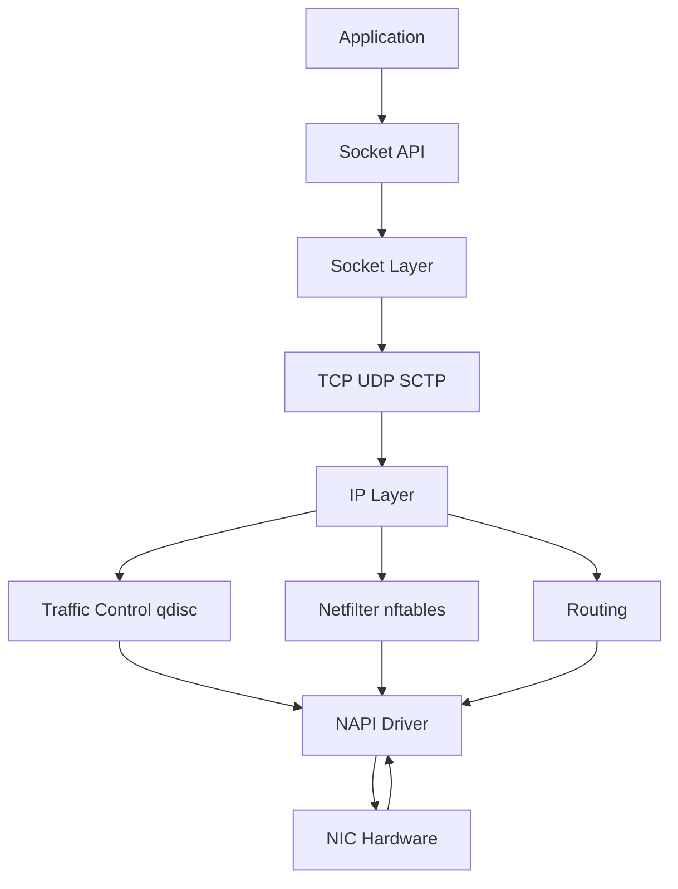

# Network Stack

This guide covers sockets, packet flow, TCP/IP processing, and core Linux networking internals.

Linux networking is a rich subsystem spanning socket APIs, protocol stacks, routing, packet filtering, driver mechanics, and programmable fast paths such as XDP.

## 6.1 Layered View

At a high level, Linux networking includes:

- User-space socket API
- Socket layer and protocol families
- Transport protocols like TCP and UDP
- IP layer and routing
- Netfilter hooks and policy
- Queuing disciplines and traffic control
- Network device drivers and NAPI
- Hardware NIC queues

## 6.2 Mermaid Diagram: Linux Network Stack



## 6.3 Sockets as Kernel Objects

A socket is a kernel object representing an endpoint for communication.

Important dimensions:

- Domain: `AF_INET`, `AF_INET6`, `AF_UNIX`, `AF_NETLINK`
- Type: `SOCK_STREAM`, `SOCK_DGRAM`, `SOCK_RAW`
- Protocol: TCP, UDP, etc.

## 6.4 Socket Buffers

Linux uses packet buffer structures often referred to as `sk_buff` or skb.

They carry packet metadata and payload through the stack.

## 6.5 TCP Internals

TCP provides:

- Reliable byte stream
- Sequencing
- Retransmission
- Congestion control
- Flow control
- Connection state machine

## 6.6 TCP State Machine Highlights

Common states:

- `LISTEN`
- `SYN-SENT`
- `SYN-RECEIVED`
- `ESTABLISHED`
- `FIN-WAIT-1`
- `FIN-WAIT-2`
- `CLOSE-WAIT`
- `LAST-ACK`
- `TIME-WAIT`

## 6.7 Listen Queues

A listening socket involves:

- SYN backlog for half-open handshakes
- Accept queue for completed connections pending `accept()`

## 6.8 TCP Congestion Control

Linux supports multiple congestion control algorithms, such as:

- CUBIC
- BBR
- Reno

Inspect:

```bash
sysctl net.ipv4.tcp_congestion_control
sysctl net.ipv4.tcp_available_congestion_control
```

## 6.9 UDP Characteristics

UDP is message-oriented and connectionless.

It provides:

- No reliability guarantees
- No ordering guarantees
- Lower overhead
- Frequent use in DNS, telemetry, streaming, and custom protocols

## 6.10 Routing

The routing subsystem decides packet forwarding based on destination and policy.

Commands:

```bash
ip route show
ip rule show
```

## 6.11 Netfilter and nftables

Linux packet filtering and manipulation pass through netfilter hooks.

Modern rule management usually uses **nftables**.

Capabilities:

- Filtering
- NAT
- Packet mangling
- Connection tracking-based policy

## 6.12 Connection Tracking

Conntrack maintains state for flows.

Important for:

- NAT
- Stateful firewalls
- Service meshes in some designs

## 6.13 Traffic Control

Traffic control uses qdiscs, classes, and filters for:

- Rate limiting
- Queue shaping
- Prioritization
- Packet delay simulation

## 6.14 NAPI

**New API (NAPI)** reduces interrupt overhead under packet load.

Instead of interrupting for every packet, the driver can switch to polling behavior during high traffic.

## 6.15 RSS and Multi-Queue NICs

Receive Side Scaling distributes flows across hardware/software queues and CPUs.

This improves parallel packet processing.

## 6.16 GRO, GSO, TSO, LRO

These are packet aggregation/offload mechanisms.

| Mechanism | Summary |
|---|---|
| GRO | Generic Receive Offload |
| GSO | Generic Segmentation Offload |
| TSO | TCP Segmentation Offload |
| LRO | Large Receive Offload |

They improve throughput but can affect observability and latency characteristics.

## 6.17 XDP

**eXpress Data Path** runs BPF programs very early in packet receive path, often before full skb allocation.

Use cases:

- Fast packet drop
- DDoS filtering
- Load balancing
- Telemetry

## 6.18 Namespaces and Virtual Networking

Linux supports network namespaces with independent:

- Interfaces
- Routing tables
- Firewall rules
- `/proc/net` views

This underpins containers.

## 6.19 Virtual Devices

Examples:

- `veth`
- `bridge`
- `bond`
- `vxlan`
- `tun/tap`
- `dummy`

## 6.20 Useful Files and Commands

```bash
ss -tulpn
ip addr show
ip link show
ethtool eth0
nstat
sar -n DEV 1
```

## 6.21 `/proc/net` and `ss`

Socket and network state are visible through:

- `/proc/net/tcp`
- `/proc/net/udp`
- `/proc/net/dev`
- `ss`
- `netstat` on older systems

## 6.22 Socket Buffer Tuning

Important sysctls and settings include:

- `net.core.rmem_max`
- `net.core.wmem_max`
- TCP autotuning parameters
- backlog sizes
- queue limits

## 6.23 `epoll` for Network Servers

Linux servers commonly rely on `epoll` for scalable readiness notification on large socket sets.

## 6.24 Packet Path Receive Side

1. NIC receives packet.
2. DMA places packet into memory.
3. Interrupt or polling notifies driver.
4. NAPI poll processes packets.
5. Protocol layers inspect headers.
6. Netfilter and routing decisions apply.
7. Packet delivered to socket.

## 6.25 Packet Path Transmit Side

1. Application calls `send()` or equivalent.
2. Data enters socket buffers.
3. TCP/UDP/IP processing occurs.
4. Routing and qdisc logic apply.
5. Driver maps buffers for DMA.
6. NIC transmits frames.

## 6.26 Common Production Issues

| Symptom | Possible Cause |
|---|---|
| High retransmits | Packet loss or congestion |
| SYN backlog overflow | Underprovisioned accept handling |
| High softirq CPU | Packet processing bottleneck |
| Uneven CPU utilization | Poor RSS or IRQ affinity |
| Conntrack exhaustion | Firewall/NAT state overload |

## 6.27 Practical Example: Inspect TCP State

```bash
ss -ti dst :443
cat /proc/net/netstat | head
```

## 6.28 Section Summary

Linux networking combines classic kernel protocol handling with highly optimized paths and programmable hooks. To debug it well, you need to understand not just TCP/IP theory but also driver behavior, offloads, queueing, filtering, and namespaces.

---
