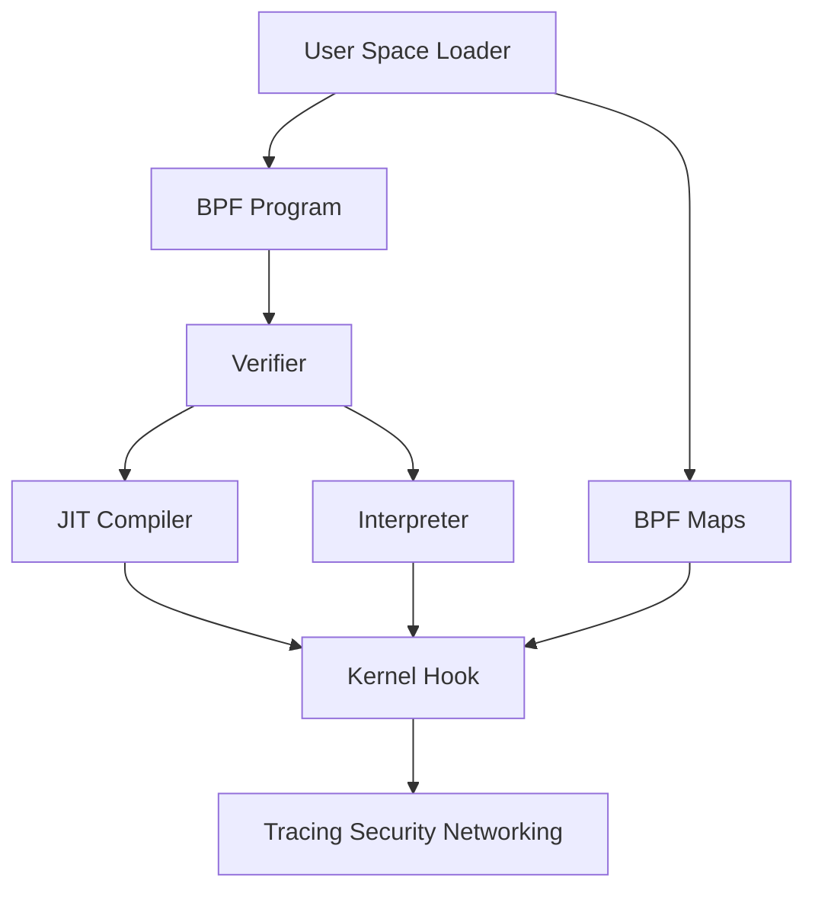

# eBPF and BPF

This guide covers BPF program types, maps, tracing workflows, and operational eBPF usage.

eBPF has transformed Linux observability, security, and networking by allowing safe, verified programs to run inside the kernel in carefully constrained execution contexts.

## 7.1 What Is eBPF

**eBPF** is an in-kernel virtual machine and execution framework.

Programs are:

- Loaded from user space
- Verified for safety
- JIT-compiled on many architectures
- Attached to hooks across kernel subsystems

## 7.2 From Classic BPF to eBPF

Originally, BPF was associated with packet filtering.

Modern eBPF extends the model to many domains:

- Tracing
- Performance analysis
- Security policy
- Networking
- Packet processing
- Cgroup hooks

## 7.3 Core Concepts

| Concept | Meaning |
|---|---|
| Program | Verified bytecode attached to hook |
| Map | Shared kernel data structure |
| Helper | Kernel-provided function callable by BPF |
| Verifier | Safety analysis engine |
| JIT | Native code generation for performance |

## 7.4 Mermaid Diagram: eBPF Architecture



## 7.5 Why eBPF Is Powerful

It enables:

- Dynamic instrumentation without kernel rebuilds
- Fine-grained event collection
- Custom packet policy
- Low-overhead production-safe introspection when used correctly

## 7.6 Safety Model

The verifier ensures programs:

- Terminate safely within model constraints
- Do not dereference invalid pointers
- Respect memory access rules
- Use helpers correctly
- Do not corrupt kernel state

## 7.7 BPF Maps

Maps provide state sharing between user space and BPF programs or among BPF programs.

Common map types:

- Hash map
- Array
- Per-CPU hash
- Per-CPU array
- Ring buffer
- Perf event array
- LRU hash
- Stack trace map

## 7.8 Attach Points

eBPF can attach to many hook types.

Examples:

- kprobes
- uprobes
- tracepoints
- raw tracepoints
- XDP
- tc classifier/action hooks
- cgroup hooks
- LSM hooks
- perf events

## 7.9 Tracing with BPF

Common tasks:

- Measure syscall latency
- Count page faults
- Trace disk I/O
- Observe TCP retransmits
- Capture scheduler events

## 7.10 Security with BPF

BPF can support:

- Policy enforcement at LSM hooks
- Syscall or event auditing
- Container boundary monitoring
- Suspicious behavior detection

## 7.11 Networking with BPF

Use cases:

- XDP packet filtering
- Traffic shaping/classification via tc
- Socket load balancing
- Per-cgroup network controls

## 7.12 BPF Tooling Ecosystem

| Tool | Purpose |
|---|---|
| `bpftool` | Inspect BPF objects and maps |
| `bpftrace` | High-level tracing language |
| `bcc` | Python/Lua/C tooling around BPF |
| `perf` | Performance integration and events |
| `libbpf` | Low-level BPF user-space library |

## 7.13 `bpftool`

Useful examples:

```bash
sudo bpftool prog show
sudo bpftool map show
sudo bpftool net
```

## 7.14 `bpftrace`

`bpftrace` provides concise one-liners for tracing.

Examples:

```bash
sudo bpftrace -e 'tracepoint:syscalls:sys_enter_openat { @[comm] = count(); }'
sudo bpftrace -e 'kprobe:tcp_sendmsg { @[pid, comm] = count(); }'
```

## 7.15 BCC Tools

Popular BCC scripts include:

- `execsnoop`
- `opensnoop`
- `biosnoop`
- `runqlat`
- `tcptop`
- `offcputime`

## 7.16 CO-RE

**Compile Once, Run Everywhere** allows BPF programs to adapt to kernel type layouts using BTF metadata.

This significantly improves portability across kernel versions.

## 7.17 BTF

**BPF Type Format** provides compact type information used by tooling, introspection, and CO-RE relocation.

## 7.18 Performance Considerations

eBPF is powerful, but:

- Too many events can overwhelm systems.
- Per-event map updates can add overhead.
- Stack traces and large maps are costly.
- Trace design matters more than tool choice.

## 7.19 Practical Example: Count Syscalls with `bpftrace`

```bash
sudo bpftrace -e '
tracepoint:syscalls:sys_enter_* 
{ 
    @[probe] = count(); 
}
interval:s:5 
{ 
    print(@); 
    clear(@); 
}'
```

## 7.20 Practical Example: Observe Block I/O Latency

```bash
sudo /usr/share/bcc/tools/biolatency 1 5
```

## 7.21 Common BPF Program Types

| Program Type | Area |
|---|---|
| `kprobe` | Kernel function tracing |
| `tracepoint` | Stable trace hooks |
| `xdp` | Early packet path |
| `sched_cls` | Traffic control classifier |
| `cgroup_skb` | Cgroup networking |
| `lsm` | Security hooks |
| `perf_event` | Sampling and events |

## 7.22 When to Use Which Hook

- Use tracepoints for stable kernel event tracing.
- Use kprobes when no tracepoint exists but symbols are available.
- Use uprobes for user-space function tracing.
- Use XDP for the earliest networking path.
- Use tc when you need skb context and traffic control integration.

## 7.23 Limitations and Caveats

| Limitation | Detail |
|---|---|
| Verifier complexity | Some programs are difficult to make verifier-friendly |
| Kernel feature dependency | Features vary by kernel version |
| Observability impact | Poorly chosen probes can be expensive |
| Privilege requirements | Many operations need elevated privileges |

## 7.24 Production Guidance

- Prefer tracepoints over fragile internal function names when possible.
- Sample or aggregate instead of logging every event.
- Cap map sizes.
- Verify kernel support and BTF availability.
- Test scripts on staging before high-rate production use.

## 7.25 Section Summary

eBPF is one of Linux’s most important modern internals technologies. It gives you programmable, high-fidelity visibility and control across the kernel without requiring custom kernel builds or invasive modules.

---
