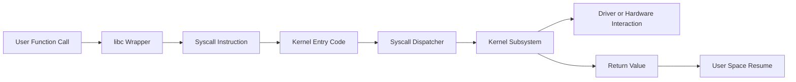

# System Calls

This guide covers the Linux syscall interface, tracing, and important system call behaviors.

System calls are the official entry points from user space into kernel services.

## 9.1 How Syscalls Work

A system call is a controlled privilege transition.

User code requests a kernel service using a designated CPU instruction and ABI convention.

## 9.2 Common Syscall Entry Instructions

Depending on architecture:

- x86_64: `syscall`
- older x86: `int 0x80`, `sysenter`
- arm64: `svc`

## 9.3 Mermaid Diagram: System Call Flow



## 9.4 ABI and Register Conventions

On x86_64 Linux, syscall number and arguments are passed in specific registers. User-space libraries abstract these details.

## 9.5 Syscall Dispatch

The kernel uses a syscall table to map syscall number to handler function.

## 9.6 libc Wrappers vs Raw Syscalls

A libc function may:

- Call exactly one syscall
- Retry on `EINTR`
- Translate ABI details
- Emulate behavior if needed
- Use vDSO for optimized functions

## 9.7 Important Syscalls

| Syscall | Purpose |
|---|---|
| `openat` | Open files relative to directory fd |
| `read` | Read bytes |
| `write` | Write bytes |
| `close` | Close descriptor |
| `mmap` | Create memory mappings |
| `munmap` | Remove mappings |
| `ioctl` | Device or subsystem-specific control |
| `epoll_ctl` | Manage epoll interest |
| `epoll_wait` | Wait for events |
| `poll` | Multiplex readiness |
| `select` | Legacy readiness API |
| `clone` | Create task/thread |
| `execve` | Replace process image |
| `futex` | Synchronization primitive |

## 9.8 `open()` vs `openat()`

Modern Linux code increasingly uses `openat()`-style APIs for race-resistant path handling and directory-relative operations.

## 9.9 `read()` and `write()` Semantics

These operate on file descriptors and may:

- Return fewer bytes than requested
- Block depending on descriptor mode
- Be interrupted by signals
- Interact with page cache or device drivers depending on object type

## 9.10 `ioctl()`

`ioctl()` is a flexible control interface often used by drivers and special files.

It is powerful but less self-describing than dedicated syscalls.

## 9.11 `mmap()`

`mmap()` bridges the syscall and VM worlds by creating mappings that the page-fault subsystem realizes on demand.

## 9.12 `select()`, `poll()`, and `epoll()`

| API | Strength | Limitation |
|---|---|---|
| `select()` | Portable, simple | FD set size and scaling issues |
| `poll()` | Simpler semantics for many fds | O(n) scanning |
| `epoll()` | Scales well for large fd sets | Linux-specific |

## 9.13 `epoll` Internals at a Glance

`epoll` maintains kernel-side interest and ready data structures so applications do not repeatedly rescan all watched descriptors.

## 9.14 `strace` Deep Dive

`strace` traces syscalls by intercepting syscall entry/exit using ptrace or related mechanisms.

Useful examples:

```bash
strace -f -tt -T -o trace.log myapp
strace -p 1234
strace -e trace=openat,read,write -p 1234
```

## 9.15 Reading `strace` Output

Key elements:

- Syscall name
- Arguments
- Return value
- Error codes like `ENOENT` or `EAGAIN`
- Timing if requested

## 9.16 When `strace` Helps

- Missing files or permissions
- Network connection failures
- Hanging syscalls
- Unexpected retries or `EINTR`
- Excessive metadata lookups

## 9.17 When `strace` Distorts Behavior

`strace` adds overhead and may perturb timing-sensitive workloads.

For high-frequency production tracing, eBPF or perf may be better.

## 9.18 `perf trace`

`perf trace` provides syscall tracing using perf infrastructure with lower overhead for some use cases.

## 9.19 vDSO

The **virtual dynamic shared object** exposes some kernel-provided routines in user space, often for time-related calls, reducing syscall overhead.

## 9.20 Restartable Syscalls and `EINTR`

Signals can interrupt blocking syscalls.

Applications need careful handling of:

- `EINTR`
- short reads/writes
- timeout behavior

## 9.21 File Descriptor Model

A descriptor is just an integer index into a process descriptor table. The real open object is kernel-managed and shared across duplicated descriptors.

## 9.22 Syscall Cost

Syscalls are cheaper than they once were in some paths but still nontrivial compared to plain user-space function calls.

Costs include:

- Privilege transition
- Validation and copying
- Security checks
- Potential scheduling or blocking

## 9.23 Example: Raw Syscall in C

```c
#define _GNU_SOURCE
#include <sys/syscall.h>
#include <unistd.h>

int main(void)
{
    const char msg[] = "hello\n";
    syscall(SYS_write, STDOUT_FILENO, msg, sizeof(msg) - 1);
    return 0;
}
```

## 9.24 Common Debugging Questions

| Question | Tool |
|---|---|
| Which files is app opening? | `strace -e openat` |
| Which syscalls are slow? | `strace -T`, eBPF, perf |
| Why is process blocked? | `strace`, `perf`, `/proc/[pid]/stack` |
| Is app polling too often? | `strace -c`, perf, bpftrace |

## 9.25 Section Summary

System calls are the narrow waist of Linux. They connect user intent to kernel machinery. If you understand syscall flow, you can often explain application behavior that otherwise seems mysterious.

---
