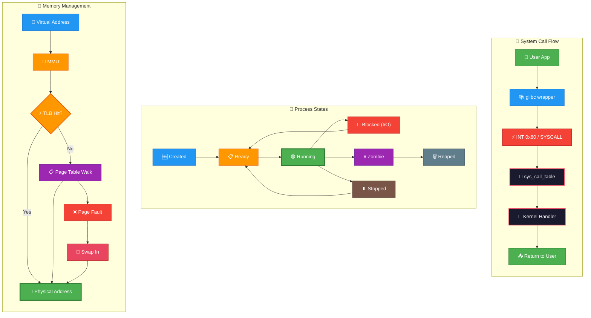

# Advanced Linux Internals

---

## 🎬 Kernel Internals — Animated Workflow

---

This guide is now split into focused deep-dive files so you can study a subsystem in isolation or follow the full internals path from kernel architecture to tracing.

## Overview

- Start with kernel architecture, process internals, and memory management to build a mental model.
- Use the subsystem guides for filesystems, I/O, networking, eBPF, namespaces, cgroups, syscalls, IPC, and drivers.
- Finish with tracing and debugging for practical observability, command references, walkthroughs, glossary material, and recap notes.

## Learning Path

```mermaid
graph LR
A["Kernel Architecture"] --> B["Process Internals"]
B --> C["Memory Management"]
C --> D["File System Internals"]
D --> E["I/O Subsystem"]
E --> F["Network Stack"]
F --> G["eBPF"]
G --> H["Namespaces and Cgroups"]
H --> I["System Calls"]
I --> J["IPC"]
J --> K["Device Drivers"]
K --> L["Tracing and Debugging"]
```

## Table of Contents

1. [Kernel Architecture](01-kernel-architecture.md)
2. [Process Internals](02-process-internals.md)
3. [Memory Management](03-memory-management.md)
4. [Filesystem Internals](04-filesystem-internals.md)
5. [I/O Subsystem](05-io-subsystem.md)
6. [Network Stack](06-network-stack.md)
7. [eBPF](07-ebpf.md)
8. [Namespaces and Cgroups](08-namespaces-cgroups.md)
9. [System Calls](09-syscalls.md)
10. [IPC](10-ipc.md)
11. [Device Drivers](11-device-drivers.md)
12. [Tracing and Debugging](12-tracing-debugging.md)
