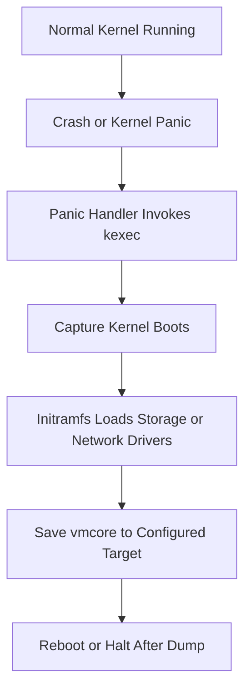

# Kdump Overview

This guide explains what kdump is, how the crash kernel handoff works, and why it matters in production.

## 1.1 What is kdump?

Kdump is a Linux kernel crash dumping mechanism.

It captures memory from a crashed kernel and stores it as a dump file, usually called `vmcore`.

That dump can later be analyzed with tools such as `crash`, `gdb`, `makedumpfile`, `addr2line`, and `objdump`.

Kdump is critical because many serious kernel failures are transient.

After a hard crash or panic, live evidence is gone unless memory is captured immediately.

Kdump preserves the state of the kernel near the failure point.

That state often includes:

- kernel logs
- CPU register state
- process structures
- memory mappings
- loaded modules
- stacks of running tasks
- slab information
- lock state
- device driver state
- networking state

Without kdump, troubleshooting a production kernel panic often becomes guesswork.

With kdump, postmortem analysis becomes evidence-driven.

## 1.2 Why kdump is critical in production

Kdump matters in production for several reasons.

1. It reduces uncertainty after a kernel panic.
2. It shortens mean time to resolution.
3. It provides artifact-based root cause analysis.
4. It helps vendors and kernel maintainers reproduce and fix bugs.
5. It supports compliance and incident review processes.
6. It can reveal hardware-related corruption patterns.
7. It helps distinguish application failures from kernel failures.

In large fleets, a properly configured kdump setup is as important as log shipping.

A panic without a dump is often a lost incident.

A panic with a good dump is an actionable incident.

## 1.3 High-level idea

Kdump works by reserving memory for a second kernel.

This second kernel is often called the crash kernel or capture kernel.

When the main kernel panics, it uses `kexec` to boot directly into the capture kernel without going through firmware or full platform boot.

The capture kernel then saves the memory image of the crashed kernel to persistent storage.

This avoids overwriting too much of the memory you are trying to preserve.

## 1.4 Core components

The major components are:

| Component | Purpose |
|---|---|
| `crashkernel=` boot parameter | Reserves RAM for the capture kernel |
| `kexec` infrastructure | Jumps to another kernel without full reboot |
| capture kernel | Minimal kernel that runs after panic |
| initramfs for crash kernel | Includes storage/network drivers needed to save dump |
| `kdump` service/tooling | Loads the crash kernel during normal boot |
| `makedumpfile` | Filters or compresses memory dump |
| `vmcore` | Captured crash dump artifact |
| `crash` utility | Primary postmortem analysis tool |

## 1.5 Normal boot vs crash boot

During normal boot:

- the main kernel starts
- the system initializes services
- the kdump tooling loads a second kernel image into reserved memory
- the system continues serving workloads

During a crash:

- the main kernel panics
- panic path triggers `kexec`
- capture kernel starts in reserved RAM
- capture environment mounts target storage or network path
- dump is written as `vmcore`
- system can reboot automatically or stay halted based on configuration

## 1.6 Mermaid diagram: Kdump mechanism flow

## 1.7 How kdump differs from a normal reboot

A normal reboot tears down the system and restarts through firmware and bootloader.

That process is slow and destroys useful volatile memory contents.

A kexec-based crash transition is much faster.

It bypasses firmware and jumps directly into another kernel.

That speed is what makes memory capture practical.

## 1.8 Relationship between kdump and kexec

`kexec` is the mechanism.

`kdump` is the crash dump workflow built on top of that mechanism.

You can use `kexec` for fast reboots in other contexts too.

In kdump, the key use is loading a pre-prepared capture kernel and switching to it after panic.

## 1.9 Capture kernel requirements

The crash kernel must be able to:

- initialize CPU and memory sufficiently to run
- include drivers for dump target access
- have enough RAM reserved to handle dump operations
- avoid conflicting with damaged state from the original kernel
- mount filesystems or use network to save dump

If the capture kernel is too small or lacks needed drivers, kdump may fail even though panic handling begins correctly.

## 1.10 Kdump artifacts

Typical dump-related files include:

| File | Meaning |
|---|---|
| `/var/crash/.../vmcore` | raw or filtered memory image |
| `/var/crash/.../vmcore-dmesg.txt` | extracted kernel log from dump |
| `vmlinux` | uncompressed kernel image with debug symbols |
| `System.map` | symbol address table |
| `initrd` or `initramfs` | crash kernel initramfs |

## 1.11 When kdump is most useful

Kdump is especially useful for:

- kernel panics
- BUG and WARN escalation cases
- suspected memory corruption
- RCU stalls that later panic
- driver crashes
- lockups triggering watchdog panic
- machine check or fatal hardware events
- cluster nodes crashing under special workload conditions

## 1.12 When kdump may not help enough

Kdump is not always sufficient by itself.

Cases that may limit usefulness include:

- storage path unavailable during crash capture
- capture kernel missing needed driver
- memory corruption severe enough to affect capture handoff
- power loss instead of panic
- hard reset by external watchdog before dump completes
- firmware-level crashes below OS visibility

## 1.13 Kdump vs other crash dump mechanisms

### 1.13.1 Kdump vs netconsole

`netconsole` streams kernel log messages over the network.

It is lightweight and useful for early panic text.

It does not preserve full memory state.

Kdump captures much more detail.

### 1.13.2 Kdump vs pstore

`pstore` stores crash information in persistent firmware-backed storage.

It often keeps logs or small panic records.

It usually cannot store full memory images.

Kdump is much richer but needs more setup and resources.

### 1.13.3 Kdump vs firmware dump features

Some hardware or hypervisors provide dump features.

These may complement kdump.

But kdump remains the standard Linux-native software mechanism for postmortem kernel analysis.

### 1.13.4 Kdump vs application core dumps

Application core dumps capture a single process address space.

Kdump captures kernel state and system-wide context.

They solve different layers of debugging.

## 1.14 Benefits and trade-offs

| Benefit | Trade-off |
|---|---|
| Detailed postmortem evidence | Reserved memory reduces usable RAM |
| Faster root cause analysis | Setup complexity |
| Vendor supportability | Storage capacity required |
| Works on production systems | Need to test after kernel updates |
| Can compress or filter dumps | Dump may fail if config is incomplete |

## 1.15 Typical kdump workflow summary

1. Reserve memory with `crashkernel=`.
2. Install kdump tooling.
3. Configure dump target.
4. Load crash kernel at boot.
5. Trigger test panic in a safe environment.
6. Verify `vmcore` is written.
7. Analyze with `crash` and symbolized `vmlinux`.
8. Feed results into remediation or escalation workflow.

## 1.16 Terminology

| Term | Meaning |
|---|---|
| panic | unrecoverable kernel condition |
| oops | serious kernel fault, sometimes recoverable |
| vmcore | saved memory image from crashed kernel |
| crash kernel | kernel booted after panic to capture dump |
| kexec | mechanism for jumping to another kernel |
| initramfs | early userspace image used during boot |
| vmlinux | uncompressed symbol-rich kernel binary |

## 1.17 Key operational warning

Never first test kdump on a mission-critical production node.

Validate it in a staging environment or during a controlled maintenance window.

A misconfigured crashkernel reservation or broken capture path may leave the system unable to collect dumps when you need them most.

## 1.18 Minimal checklist

- confirm kernel supports kexec and crash dumping
- reserve crash memory
- install capture tooling
- configure target path
- enable service
- reboot to apply reservation if needed
- verify crash kernel loaded
- test panic in non-production
- retain matching debug symbols

---
