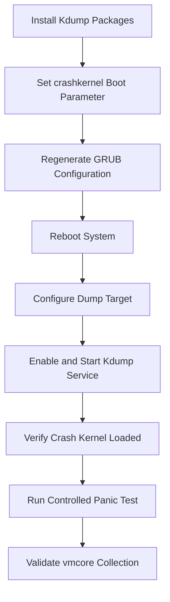

# Kdump Setup

This guide covers installing, configuring, validating, and testing kdump across major Linux distributions.

## 2.1 Overview

Configuration involves several layers:

- package installation
- boot parameter reservation
- capture kernel loading
- dump target selection
- initramfs driver inclusion
- service enablement
- test validation

Different distributions expose this through different tools, but the underlying concepts are the same.

## 2.2 Prerequisites

Before installation, confirm:

- supported kernel version
- enough RAM to reserve crash memory
- storage space for dumps
- access to kernel debug symbols if analysis is required
- console or remote management path for testing
- maintenance window for reboot if boot parameters change

## 2.3 General package summary

| Distribution | Common packages |
|---|---|
| Ubuntu/Debian | `linux-crashdump`, `kdump-tools`, `crash` |
| RHEL/CentOS | `kexec-tools`, `crash`, debug packages |
| SUSE | `kdump`, `kdumptool`, `crash` |

## 2.4 Ubuntu and Debian installation

On Ubuntu or Debian systems, the usual packages are `linux-crashdump` and `kdump-tools`.

Example:

```bash
sudo apt update
sudo apt install -y linux-crashdump kdump-tools crash
```

The installation may prompt for enabling kdump.

If not, it can be configured manually afterward.

## 2.5 Ubuntu and Debian configuration files

Important files include:

| File | Role |
|---|---|
| `/etc/default/kdump-tools` | main kdump-tools behavior |
| `/etc/initramfs-tools/modules` | add modules to initramfs if needed |
| `/etc/default/grub` | crashkernel boot parameter |
| `/etc/sysctl.d/*.conf` | sysrq or panic-related sysctls |

Example `/etc/default/kdump-tools` options often include:

```bash
USE_KDUMP=1
KDUMP_KERNEL=/var/lib/kdump/vmlinuz
KDUMP_INITRD=/var/lib/kdump/initrd.img
KDUMP_COREDIR="/var/crash"
KDUMP_CMDLINE_APPEND="irqpoll nr_cpus=1 reset_devices"
```

Exact contents vary by distribution release.

## 2.6 RHEL and CentOS installation

On RHEL-family systems, install `kexec-tools`.

Example:

```bash
sudo dnf install -y kexec-tools crash
```

Older releases may use `yum`:

```bash
sudo yum install -y kexec-tools crash
```

For symbolized analysis, install debuginfo packages from matching repositories.

Example conceptually:

```bash
sudo debuginfo-install kernel kernel-core kernel-modules
```

Package naming depends on release.

## 2.7 RHEL and CentOS configuration files

Common files:

| File | Role |
|---|---|
| `/etc/kdump.conf` | dump target and makedumpfile settings |
| `/etc/sysconfig/kdump` | extra options in some releases |
| `/etc/default/grub` | boot parameters |
| `/boot/grub2/grub.cfg` | generated boot config |

Sample `/etc/kdump.conf`:

```conf
path /var/crash
core_collector makedumpfile -l --message-level 1 -d 31
default reboot
```

## 2.8 SUSE installation

On SUSE Linux Enterprise or openSUSE, packages and tooling differ slightly.

Typical installation:

```bash
sudo zypper refresh
sudo zypper install -y kdump crash
```

Configuration is often managed using `kdumptool`, YaST, or config files depending on the version.

## 2.9 SUSE configuration notes

SUSE commonly uses files such as:

| File | Role |
|---|---|
| `/etc/sysconfig/kdump` | primary kdump settings |
| `/etc/default/grub` | boot parameters |
| initrd tooling | regenerate initrd after updates |

Example commands may include:

```bash
sudo systemctl enable kdump
sudo systemctl start kdump
```

Always verify against the exact release documentation because SUSE tooling conventions vary.

## 2.10 The crashkernel boot parameter

The most important boot parameter is `crashkernel=`.

It reserves memory for the capture kernel.

Without this reservation, kdump cannot boot a separate kernel reliably after panic.

Common forms include:

- `crashkernel=auto`
- `crashkernel=256M`
- `crashkernel=512M`
- `crashkernel=128M,high`
- `crashkernel=128M,low`
- `crashkernel=512M-2G:64M,2G-:128M`

## 2.11 Understanding `crashkernel=auto`

`auto` asks the distribution's tooling or kernel logic to choose a suitable reservation.

This is convenient.

However, automatic sizing may not always be enough for:

- large-memory systems
- drivers requiring extra initramfs content
- network dump targets
- storage stacks with many modules
- heavy filtering/compression needs

Production teams often prefer explicit sizing after validation.

## 2.12 Understanding fixed reservation sizes

Example:

```bash
crashkernel=256M
```

This reserves 256 MB for the crash kernel.

Whether it is enough depends on:

- CPU count
- RAM size
- drivers needed in capture initramfs
- dump target type
- kernel version
- architecture

## 2.13 High memory and low memory reservations

On some systems, especially x86_64, you may see:

```bash
crashkernel=128M,high crashkernel=64M,low
```

Or shorthand forms like:

```bash
crashkernel=128M,high
```

High memory is used for most crash kernel memory.

Low memory reservation is often needed for DMA and early boot requirements.

If low memory is insufficient, the capture kernel may fail in subtle ways.

## 2.14 Editing GRUB configuration

Typical Linux systems put boot arguments in `/etc/default/grub`.

Example:

```bash
GRUB_CMDLINE_LINUX="crashkernel=256M"
```

If other parameters are already present, append rather than replace.

Example:

```bash
GRUB_CMDLINE_LINUX="quiet splash crashkernel=256M"
```

After editing, regenerate GRUB config.

Ubuntu/Debian:

```bash
sudo update-grub
```

RHEL/CentOS BIOS systems:

```bash
sudo grub2-mkconfig -o /boot/grub2/grub.cfg
```

RHEL/CentOS UEFI systems:

```bash
sudo grub2-mkconfig -o /boot/efi/EFI/redhat/grub.cfg
```

SUSE examples vary, but commonly:

```bash
sudo grub2-mkconfig -o /boot/grub2/grub.cfg
```

## 2.15 Reboot requirement

Changes to `crashkernel=` require reboot.

You cannot reserve the crash kernel memory retroactively for the running kernel.

Plan a reboot window.

## 2.16 Verifying crashkernel reservation

After reboot, confirm reservation using:

```bash
dmesg | grep -i crashkernel
```

And:

```bash
cat /proc/cmdline
```

You can also inspect reserved memory from boot logs.

Example output may show reserved ranges or kdump status messages.

## 2.17 Starting and enabling kdump services

Ubuntu/Debian:

```bash
sudo systemctl enable kdump-tools
sudo systemctl start kdump-tools
```

RHEL/CentOS:

```bash
sudo systemctl enable kdump
sudo systemctl start kdump
```

SUSE:

```bash
sudo systemctl enable kdump
sudo systemctl start kdump
```

Check status:

```bash
systemctl status kdump
```

Or:

```bash
systemctl status kdump-tools
```

## 2.18 Verifying the crash kernel is loaded

Useful commands include:

```bash
sudo kexec -p
```

Or distro-specific service status checks.

On many systems, status output tells you whether the crash kernel is loaded.

Example:

```bash
kdumpctl status
```

Possible output:

```text
kdump: Kdump is operational
```

Or on Debian-based systems:

```text
Current state: ready to kdump
```

## 2.19 `/etc/kdump.conf` basics

This file controls where dumps go and how they are processed.

Typical directives include:

| Directive | Meaning |
|---|---|
| `path` | target directory |
| `ext4` / `xfs` / `nfs` / `ssh` | dump destination type |
| `core_collector` | dump filtering/compression command |
| `default` | post-dump action |
| `failure_action` | action when dump fails |
| `dracut_args` | initramfs customization |

## 2.20 Example local disk configuration

```conf
path /var/crash
core_collector makedumpfile -l --message-level 1 -d 31
default reboot
```

This saves dumps under `/var/crash`.

`makedumpfile` compresses and filters zero or irrelevant pages.

## 2.21 Example raw partition configuration

```conf
raw /dev/sdb1
core_collector makedumpfile -F -l --message-level 1 -d 31
default reboot
```

Raw partition targets can be faster or more reliable in some environments.

But they require careful operational handling because the dump is not simply a regular file in a mounted filesystem.

## 2.22 Example NFS target configuration

```conf
nfs 10.10.10.20:/exports/kdump
path client1
core_collector makedumpfile -l --message-level 1 -d 31
```

This is useful where local disk is limited.

You must ensure:

- network comes up in crash kernel
- NIC driver is in capture initramfs
- routing and firewall allow access
- NFS mount dependencies are minimal

## 2.23 Example SSH target configuration

```conf
ssh root@10.10.10.30
sshkey /root/.ssh/kdump_id_rsa
path /var/crash/client1
core_collector makedumpfile -F -l --message-level 1 -d 31
```

SSH targets provide encrypted transport.

They add dependency on network, authentication, and crypto in the capture environment.

Test carefully.

## 2.24 Example filesystem target directives

Some configurations specify the dump target device explicitly.

Example:

```conf
ext4 /dev/mapper/vg0-crashlv
path /dumps
```

Or:

```conf
xfs UUID=11111111-2222-3333-4444-555555555555
path /vmcores
```

The initramfs must contain the relevant filesystem and storage stack modules.

## 2.25 Choosing the right dump target

| Target | Pros | Cons |
|---|---|---|
| local filesystem | simplest | may be unavailable if local storage is broken |
| raw partition | robust, fast | harder retrieval workflow |
| NFS | central storage | depends on network |
| SSH | encrypted | more complexity in crash kernel |
| SAN/LVM volume | large dedicated space | stack complexity |

## 2.26 `makedumpfile` basics

`makedumpfile` reduces dump size by excluding unnecessary pages.

Common flags:

| Flag | Meaning |
|---|---|
| `-c` | compress dump |
| `-l` | compress with lzo-like method depending on version |
| `-d` | dump level bitmap |
| `-F` | flattened format |
| `--message-level` | verbosity |

Example:

```bash
makedumpfile -l --message-level 1 -d 31 /proc/vmcore vmcore.filtered
```

The exact set of dump levels determines what memory categories are excluded.

## 2.27 Dump level guidance

Dump level settings trade completeness against size.

If you exclude too much, later analysis may lose critical context.

For first production rollout, many teams start with a common proven value such as `-d 31` and validate whether retained data is enough.

For very tricky memory corruption bugs, consider collecting a fuller dump during controlled investigations.

## 2.28 Capture kernel command line

Many kdump setups append special arguments to the crash kernel.

Common examples include:

- `irqpoll`
- `nr_cpus=1`
- `reset_devices`
- `nousb`
- `cgroup_disable=memory`

These aim to simplify the crash environment and reduce failure risk.

Example:

```bash
KDUMP_COMMANDLINE_APPEND="irqpoll nr_cpus=1 reset_devices"
```

## 2.29 Why `nr_cpus=1` is common

It reduces complexity in the crash kernel.

The capture kernel does not need full workload performance.

It only needs enough functionality to save the dump reliably.

Reducing CPU count may avoid secondary issues during dump capture.

## 2.30 Regenerating initramfs

If you change capture kernel modules or related config, regenerate initramfs.

Ubuntu/Debian:

```bash
sudo update-initramfs -u
```

RHEL/CentOS with dracut:

```bash
sudo dracut -f
```

SUSE:

```bash
sudo dracut -f
```

Some distros regenerate the capture initramfs through their kdump tooling directly.

## 2.31 Adding missing modules

If a dump target depends on drivers not present in the crash initramfs, add them explicitly.

Examples:

- storage HBA drivers
- NVMe drivers
- RAID drivers
- network drivers
- bonding or VLAN modules
- filesystem modules
- multipath support

On Debian-based systems, `/etc/initramfs-tools/modules` may be used.

On dracut-based systems, use dracut configuration snippets.

## 2.32 Dracut-based customization example

Example file:

```conf
# /etc/dracut.conf.d/kdump.conf
add_drivers+=" ixgbe nvme xfs "
```

Then rebuild:

```bash
sudo dracut -f
```

## 2.33 Debian initramfs customization example

Example:

```text
# /etc/initramfs-tools/modules
ixgbe
nvme
xfs
```

Then rebuild:

```bash
sudo update-initramfs -u
```

## 2.34 Testing configuration before a real crash

Useful checks include:

- `cat /proc/cmdline`
- `dmesg | grep -i crash`
- service status
- kdump status command
- available target free space
- network reachability for remote target
- presence of `vmlinux` with matching symbols

## 2.35 Safe warning before test panic

A forced panic will crash the machine.

This must only be done on non-production systems or during an approved maintenance window.

Ensure there is out-of-band access if the machine fails to recover automatically.

## 2.36 Enabling SysRq for testing

A common panic test uses SysRq.

Enable it temporarily:

```bash
echo 1 | sudo tee /proc/sys/kernel/sysrq
```

Permanent configuration can be set through sysctl later.

## 2.37 Triggering a test panic

**Warning: this crashes the system immediately.**

```bash
echo c | sudo tee /proc/sysrq-trigger
```

This asks the kernel to panic intentionally.

If kdump is configured correctly:

- the kernel panics
- crash kernel boots
- vmcore is captured
- system reboots or halts based on config

## 2.38 After test panic

After the system comes back:

- inspect `/var/crash`
- verify a new timestamped crash directory exists
- confirm `vmcore` or filtered dump file is present
- inspect `vmcore-dmesg.txt`
- record capture duration and file size
- verify the dump is analyzable

## 2.39 Checking kdump logs

Useful commands:

```bash
journalctl -u kdump --no-pager
```

Or:

```bash
journalctl -u kdump-tools --no-pager
```

And system boot logs:

```bash
journalctl -k -b -1 --no-pager
```

Previous boot logs often contain panic-to-dump messages.

## 2.40 Common configuration failures

| Symptom | Possible cause |
|---|---|
| no dump produced | crash kernel not loaded |
| reboot loop after panic | broken capture kernel or boot settings |
| dump target missing | path not mounted or unavailable |
| network dump fails | driver absent in initramfs |
| capture kernel hangs | not enough reserved memory |
| service says ready but no dump | panic path blocked or watchdog reset too quickly |

## 2.41 Memory reservation sizing guidance

Sizing is environment-specific.

Broad guidelines:

- small VM with local disk target may work with 256M
- systems with complex storage/network stacks often need more
- large-memory servers may require 512M or more
- architectures and distro defaults vary

Always test rather than relying on generic minimums.

## 2.42 Secure Boot considerations

Secure Boot may affect `kexec` or signed kernel loading policies.

In secured environments, validate:

- signed kernel compatibility
- distro-supported kdump path under Secure Boot
- capture kernel/initramfs signature expectations

If crash kernel loading silently fails, Secure Boot policy may be involved.

## 2.43 Virtualized environments

Kdump works in many virtual environments.

Important considerations include:

- hypervisor reset timing
- available virtual disk in crash kernel
- network driver availability
- automatic reboot or watchdog settings
- cloud provider serial console access

Cloud instances may need special handling for persistent dump storage.

## 2.44 Bare metal environments

On bare metal, also validate:

- firmware behavior after panic
- BMC or IPMI access
- storage controller driver support
- multipath setup in crash kernel
- remote hands procedure if capture fails

## 2.45 Example end-to-end Ubuntu setup

```bash
sudo apt update
sudo apt install -y linux-crashdump kdump-tools crash
sudo sed -i 's/^GRUB_CMDLINE_LINUX=.*/GRUB_CMDLINE_LINUX="crashkernel=256M"/' /etc/default/grub
sudo update-grub
sudo systemctl enable kdump-tools
sudo reboot
```

After reboot:

```bash
systemctl status kdump-tools
cat /proc/cmdline
ls -lah /var/crash
```

## 2.46 Example end-to-end RHEL setup

```bash
sudo dnf install -y kexec-tools crash
sudo grubby --update-kernel=ALL --args="crashkernel=auto"
sudo systemctl enable kdump
sudo reboot
```

After reboot:

```bash
kdumpctl status
cat /proc/cmdline
sudo kdumpctl showmem
```

## 2.47 Example kdump configuration flow diagram



## 2.48 Example `/etc/kdump.conf` with comments

```conf
path /var/crash
core_collector makedumpfile -l --message-level 1 -d 31
default reboot
failure_action reboot
```

Interpretation:

- save under `/var/crash`
- compress and filter with `makedumpfile`
- reboot after success
- reboot even after failure

## 2.49 Example `/etc/default/kdump-tools`

```bash
USE_KDUMP=1
KDUMP_COREDIR="/var/crash"
KDUMP_CMDLINE_APPEND="irqpoll nr_cpus=1 reset_devices"
MAKEDUMP_ARGS="-l --message-level 1 -d 31"
```

Exact variables differ by release.

Treat this as a conceptual example.

## 2.50 Production validation checklist

- booted with intended `crashkernel=` value
- service enabled and active
- capture kernel loaded
- dump path writable
- enough free space for expected dump size
- debug symbols archived for exact kernel build
- panic test completed successfully
- runbook documented

---
