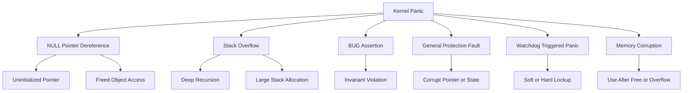

# Kernel Panic Analysis

> **📌 Disclaimer**: Any third-party logos, screenshots, or diagrams referenced in this document are used for educational purposes only. All trademarks belong to their respective owners.


This guide covers panic signatures, oops decoding, call traces, and interpreting fatal kernel failures.

## 4.1 What is a kernel panic?

A kernel panic is a fatal state from which the kernel decides it cannot safely continue.

The system typically halts, reboots, or triggers kdump depending on configuration.

A panic may result directly from a fatal exception or be intentionally invoked after a serious condition such as watchdog lockup.

## 4.2 Panic vs oops vs warning

| Event | Severity | Can system continue? |
|---|---|---|
| warning | lower | usually yes |
| oops | serious | sometimes |
| panic | fatal | no |

A kernel oops may not always panic immediately.

Some environments configure `panic_on_oops=1`, converting oopses into panics.

## 4.3 Common kernel panic types

- NULL pointer dereference
- invalid memory access
- stack overflow
- BUG assertion failure
- general protection fault
- divide by zero
- machine check fatal event
- double fault
- spinlock or scheduling invariant violation
- watchdog-triggered panic
- out-of-memory panic if configured

## 4.4 NULL pointer dereference

This is one of the most common bug classes.

Typical signs:

- address close to zero
- function offset near a structure member access
- `CR2` or fault address like `0x18`, `0x20`, `0x8`

These often correspond to dereferencing a NULL base pointer plus field offset.

## 4.5 Stack overflow

Kernel stacks are limited.

Deep recursion, excessive on-stack allocation, or pathological call chains can overflow the stack.

Symptoms may include:

- corrupt backtrace
n- `kernel stack overflow`
- strange return addresses
- double fault on x86

## 4.6 BUG() and BUG_ON()

`BUG()` and `BUG_ON()` force a fatal kernel failure when an invariant is violated.

They indicate the kernel reached a state the developer considered impossible or unrecoverable.

Modern kernels prefer warnings in some paths, but BUGs still exist.

## 4.7 General protection fault

On x86, a general protection fault can occur due to:

- invalid segment or access rules
- corrupted pointers
- executing invalid memory patterns
- stack corruption
- misuse of kernel/user address boundaries

## 4.8 Use-after-free and corruption panics

Memory corruption may not panic immediately.

The actual panic may happen later in allocator, list manipulation, or unrelated subsystem code.

Look for earlier warnings or inconsistent metadata.

## 4.9 Watchdog-triggered panic

Soft lockups, hard lockups, or hung tasks may be configured to panic.

This helps capture dumps instead of leaving a node frozen indefinitely.

The panic reason then reflects the watchdog policy rather than the first underlying bug.

## 4.10 Reading kernel oops messages

An oops message usually includes:

- bug description
- fault address
- CPU number
- PID and task name
- taint flags
- register dump
- call trace
- code bytes around RIP
- loaded modules list

## 4.11 Example oops snippet

```text
BUG: kernel NULL pointer dereference, address: 0000000000000018
#PF: supervisor read access in kernel mode
#PF: error_code(0x0000) - not-present page
PGD 0 P4D 0
Oops: 0000 [#1] SMP PTI
CPU: 3 PID: 2145 Comm: kworker/3:1 Tainted: G OE
RIP: 0010:my_driver_handle_event+0x2a/0x80 [my_driver]
Call Trace:
 process_one_work
 worker_thread
 kthread
 ret_from_fork
```

## 4.12 Important oops fields

| Field | Meaning |
|---|---|
| `BUG:` or exception line | class of failure |
| `address` or `CR2` | faulting memory address |
| `CPU` | processor that faulted |
| `PID` | current task |
| `Comm` | task command name |
| `Tainted` | kernel taint state |
| `RIP` or `PC` | instruction pointer |
| `Call Trace` | stack trace |
| `Code` | machine code bytes around fault |

## 4.13 Decoding call traces

A call trace lists functions from current frame outward.

Typical interpretation pattern:

- top frame is current function near crash
- next frames show caller chain
- bottom frames show thread entry or interrupt entry

Ask:

- is top frame the real bug site?
- is there recursion?
- is the stack normal for this task type?
- does the stack cross subsystem boundaries unexpectedly?

## 4.14 User context vs interrupt context

Not all stacks originate from a normal process.

A panic can happen in:

- process context
- softirq context
- hardirq context
- NMI context
- worker thread
- interrupt handler

Recognizing context is important because valid operations differ by context.

## 4.15 Decoding addresses with `addr2line`

Example:

```bash
addr2line -e /usr/lib/debug/boot/vmlinux-5.14.0-427.el9.x86_64 0xffffffff81012345
```

This maps an address to source file and line, assuming symbols match.

For module addresses, use the module debug object when appropriate.

## 4.16 Using `objdump`

Example:

```bash
objdump -dS /usr/lib/debug/boot/vmlinux-5.14.0-427.el9.x86_64 | less
```

This shows mixed source and assembly if debug info is present.

Useful for understanding exact faulting instruction.

## 4.17 Using `nm`

Example:

```bash
nm -n /usr/lib/debug/boot/vmlinux-5.14.0-427.el9.x86_64 | grep my_symbol
```

This helps when matching raw addresses to nearest symbols.

## 4.18 Panic sysctls worth knowing

| Sysctl | Meaning |
|---|---|
| `kernel.panic` | reboot delay after panic |
| `kernel.panic_on_oops` | panic after oops |
| `kernel.softlockup_panic` | panic on soft lockup |
| `kernel.hardlockup_panic` | panic on hard lockup |
| `kernel.hung_task_panic` | panic on hung task |
| `vm.panic_on_oom` | panic on OOM |

## 4.19 Example sysctl configuration

```conf
kernel.panic = 10
kernel.panic_on_oops = 1
kernel.softlockup_panic = 1
kernel.hardlockup_panic = 1
kernel.hung_task_panic = 0
vm.panic_on_oom = 0
```

Interpret cautiously.

A more aggressive panic policy increases dump capture opportunities but may reduce availability.

## 4.20 Panic strings and what they imply

| Panic string | Typical implication |
|---|---|
| `Kernel panic - not syncing: Fatal exception` | unrecoverable exception |
| `Kernel panic - not syncing: hung_task: blocked tasks` | panic configured on hung task |
| `Kernel panic - not syncing: softlockup` | watchdog-triggered panic |
| `Attempted to kill init!` | PID 1 died or could not continue |
| `Out of memory and no killable processes...` | fatal memory exhaustion |

## 4.21 Call trace reading tips

- look for first non-generic function above panic handlers
- ignore frames like `panic`, `oops_end`, `exc_page_fault` until you reach subsystem-specific code
- check whether trace is trustworthy or corrupted
- note module tags such as `[my_driver]`

## 4.22 Common x86 panic clues

| Clue | Interpretation |
|---|---|
| `CR2` near zero | NULL dereference likely |
| `RIP` in module range | driver/module crash |
| `double fault` | stack overflow or severe corruption |
| `invalid opcode` | BUG trap or corrupted code |
| `general protection fault` | memory corruption or bad pointer |

## 4.23 ARM and other architectures

Architecture-specific register names differ.

For example, ARM64 logs may show:

- `PC`
- `LR`
- `SP`
- `x0` to `x30`
- ESR syndrome information

The same analytical approach still applies.

## 4.24 Kernel panic types and causes diagram



## 4.25 Panic handling operational note

Do not rely only on screenshots or console snippets.

Those are useful, but the `vmcore` and full log buffer matter far more.

Capture both when possible.

## 4.26 Why previous warnings matter

Many panics are preceded by warnings minutes or hours earlier.

Examples:

- `workqueue lockup`
- DMA timeout
- RCU stall warnings
- memory allocation warnings
- filesystem checksum errors

These earlier messages often identify the real origin.

## 4.27 Panics from init failure

`Attempted to kill init!` is especially severe.

If PID 1 dies or cannot continue, the kernel panics because the system cannot function normally.

Investigate:

- userspace corruption
- root filesystem failure
- missing libraries
- initramfs or early boot issues
- kernel bug killing init indirectly

## 4.28 Panics from machine check

Machine check or ECC-related fatal errors may implicate hardware.

Look for:

- MCE logs
- EDAC messages
- corrected errors escalating over time
- DIMM, CPU, or motherboard suspicion

Even here, kdump helps preserve evidence.

## 4.29 Stack trace corruption signs

Be cautious if you see:

- impossible return addresses
- repeated nonsense frames
- addresses outside valid kernel range
- abrupt trace termination
- mismatch between code bytes and symbol location

This may indicate stack corruption, unwinder limits, or incorrect symbols.

## 4.30 Triage questions for any panic

- what exactly panicked?
- what faulted first?
- what subsystem owns the faulting code?
- was the kernel tainted?
- were there earlier warnings?
- is hardware implicated?
- is there a known fix in newer kernel or driver version?

## 4.31 Practical example: call trace interpretation

Trace:

```text
panic
oops_end
no_context
__bad_area_nosemaphore
bad_area_nosemaphore
do_kern_addr_fault
exc_page_fault
my_driver_handle_event [my_driver]
my_driver_poll [my_driver]
net_rx_action
__do_softirq
```

Interpretation:

- generic exception handling frames are not the root cause
- relevant subsystem-specific frame begins at `my_driver_handle_event`
- likely crash happened during network receive processing in softirq context

## 4.32 Practical example: BUG trace interpretation

Trace:

```text
invalid_op
asm_exc_invalid_op
BUG
ext4_handle_dirty_metadata
ext4_mark_inode_dirty
```

Interpretation:

- invalid opcode may reflect a BUG trap
- root cause is likely the ext4 invariant failure, not the generic opcode handler

## 4.33 Building a panic timeline

A good timeline often includes:

- earliest warning observed
- first user-visible symptom
- moment of lockup or degraded service
- exact panic time
- dump capture time
- reboot complete time

This helps tie panic analysis to operational impact.

## 4.34 Incident escalation package

Provide to vendors or maintainers:

- panic text
- `vmcore`
- matching `vmlinux`
- workload description
- reproduction hints
- hardware details
- whether issue is repeatable
- recent changes before incident

---
