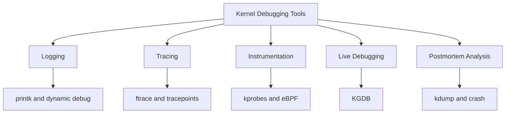

# Kernel Debugging Tools

This guide covers printk, ftrace, kprobes, KGDB, and other kernel debugging foundations.

## 7.1 Overview

Linux kernel debugging spans multiple layers.

Some tools are lightweight and production-safe.

Others are invasive and better suited to labs.

You should choose the minimum tool that answers the question.

## 7.2 Tool categories

| Category | Examples |
|---|---|
| logging | `printk`, `dynamic_debug`, `dmesg` |
| tracing | `ftrace`, tracepoints, perf |
| instrumentation | kprobes, kretprobes, eBPF |
| live debugging | KGDB |
| postmortem | kdump, `crash` |
| scripting | SystemTap, bpftrace |

## 7.3 `printk`

`printk` is the kernel's core logging mechanism.

It prints messages to the kernel log buffer.

Example levels include:

- `KERN_EMERG`
- `KERN_ALERT`
- `KERN_CRIT`
- `KERN_ERR`
- `KERN_WARNING`
- `KERN_NOTICE`
- `KERN_INFO`
- `KERN_DEBUG`

Example code:

```c
printk(KERN_ERR "my_driver: failed to init queue\n");
```

## 7.4 `pr_*` macros

Modern kernel code often uses convenience macros:

```c
pr_info("driver loaded\n");
pr_err("allocation failed\n");
pr_debug("x=%d\n", x);
```

These are cleaner than raw `printk` in many cases.

## 7.5 Dynamic debug

Dynamic debug lets you enable certain debug prints at runtime without rebuilding the kernel.

This is especially useful for selectively verbose driver diagnostics.

Control interface often lives at:

```text
/sys/kernel/debug/dynamic_debug/control
```

Example:

```bash
echo 'file drivers/net/ethernet/intel/* +p' | sudo tee /sys/kernel/debug/dynamic_debug/control
```

## 7.6 When dynamic debug is useful

Use it when:

- issue is intermittent
- full debug kernel is too expensive
- only one subsystem needs extra logging
- you want runtime enable/disable flexibility

## 7.7 ftrace overview

`ftrace` is a built-in kernel tracing framework.

It can trace:

- function calls
- function graph entry/exit
- scheduling events
- interrupts
- wakeups
- latency information

It is one of the most important live kernel tracing tools.

## 7.8 ftrace interface basics

The control files usually live under:

```text
/sys/kernel/debug/tracing/
```

Common files include:

- `current_tracer`
- `trace`
- `trace_pipe`
- `set_ftrace_filter`
- `tracing_on`
- `events/`

## 7.9 Enabling function tracer

Example:

```bash
cd /sys/kernel/debug/tracing
echo function | sudo tee current_tracer
echo 1 | sudo tee tracing_on
cat trace | head
```

## 7.10 Function graph tracer

This shows call nesting and function duration more clearly.

Example:

```bash
echo function_graph | sudo tee /sys/kernel/debug/tracing/current_tracer
```

Use filters to avoid massive output.

## 7.11 Filtering ftrace output

Example:

```bash
echo my_driver_* | sudo tee /sys/kernel/debug/tracing/set_ftrace_filter
```

This limits trace to functions of interest.

## 7.12 Tracepoints

Kernel tracepoints provide stable instrumentation sites for major subsystems.

Examples include:

- scheduler events
- block I/O events
- syscalls
- networking events
- IRQ events

Enable with tracing or eBPF tooling.

## 7.13 Example tracepoint usage

```bash
echo 1 | sudo tee /sys/kernel/debug/tracing/events/sched/sched_switch/enable
cat /sys/kernel/debug/tracing/trace_pipe
```

## 7.14 kprobes

Kprobes let you dynamically place probes on almost any kernel instruction or function entry.

They are powerful and flexible.

They should be used carefully because incorrect use can destabilize the system.

## 7.15 kretprobes

Kretprobes are similar but fire on function return.

They are useful for measuring latency or inspecting return values.

## 7.16 Why kprobes matter

Kprobes help when:

- no built-in tracepoint exists
- you need quick live instrumentation
- you need to inspect function arguments or return values
- you are diagnosing rare code paths

## 7.17 eBPF overview for kernel debugging

eBPF can attach to:

- kprobes
- kretprobes
- tracepoints
- uprobes
- perf events
- networking hooks

It allows safe, programmable, runtime instrumentation with strong ecosystem support.

## 7.18 eBPF benefits

- lower overhead than many older techniques
- flexible live observability
- can aggregate data in kernel space
- excellent for production-safe measurements when designed carefully

## 7.19 eBPF example using bpftrace

Example:

```bash
sudo bpftrace -e 'kprobe:do_sys_open { printf("open by pid %d\n", pid); }'
```

This is simple and powerful for one-off diagnostics.

## 7.20 KGDB overview

KGDB is kernel debugging with GDB.

It allows source-level debugging of a live kernel, typically through serial, network, or virtual machine channels.

It is powerful but intrusive.

It is mostly used in lab, development, or controlled environments.

## 7.21 KGDB use cases

- stepping through kernel code
- breakpoints in drivers
- early boot debugging in some setups
- reproducing deterministic crashes in a lab

## 7.22 KGDB caveats

- can stall the system
- requires careful setup
- unsuitable for most production debugging
- interaction with timing-sensitive bugs can change behavior

## 7.23 printk vs tracing vs kdump

| Tool | Best for |
|---|---|
| `printk` | quick logging and permanent code instrumentation |
| dynamic debug | selective runtime logging |
| ftrace | live call-flow tracing |
| eBPF | programmable observability |
| KGDB | lab-grade live debugging |
| kdump | postmortem crash analysis |

## 7.24 Kernel debugging tools hierarchy diagram



## 7.25 Choosing the right tool

Use this rough decision guide:

- system already crashed: use kdump and `crash`
- issue is live and timing-related: use ftrace or eBPF
- need selective debug prints: dynamic debug
- need instruction-level stepping: KGDB in lab

## 7.26 Practical example: tracing a suspected driver function

```bash
cd /sys/kernel/debug/tracing
echo nop | sudo tee current_tracer
echo my_driver_xmit | sudo tee set_ftrace_filter
echo function | sudo tee current_tracer
echo 1 | sudo tee tracing_on
sleep 5
cat trace
```

## 7.27 Practical example: event tracing for scheduling latency

```bash
echo 1 | sudo tee /sys/kernel/debug/tracing/events/sched/sched_wakeup/enable
echo 1 | sudo tee /sys/kernel/debug/tracing/events/sched/sched_switch/enable
cat /sys/kernel/debug/tracing/trace_pipe
```

## 7.28 Practical example: dynamic debug enablement

```bash
echo 'module my_driver +p' | sudo tee /sys/kernel/debug/dynamic_debug/control
```

## 7.29 Practical example: disable tracing cleanly

```bash
echo 0 | sudo tee /sys/kernel/debug/tracing/tracing_on
echo nop | sudo tee /sys/kernel/debug/tracing/current_tracer
```

## 7.30 Performance and safety note

Tracing can generate enormous output.

Scope narrowly.

Always:

- filter by function or event
- measure overhead
- stop tracing promptly
- avoid leaving verbose tracing enabled in production longer than necessary

---
